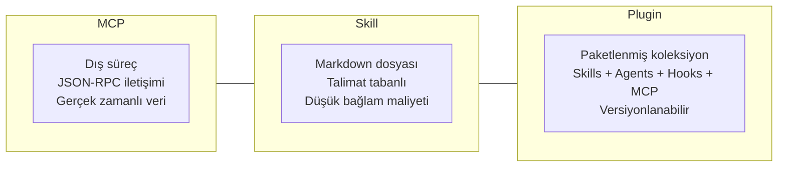
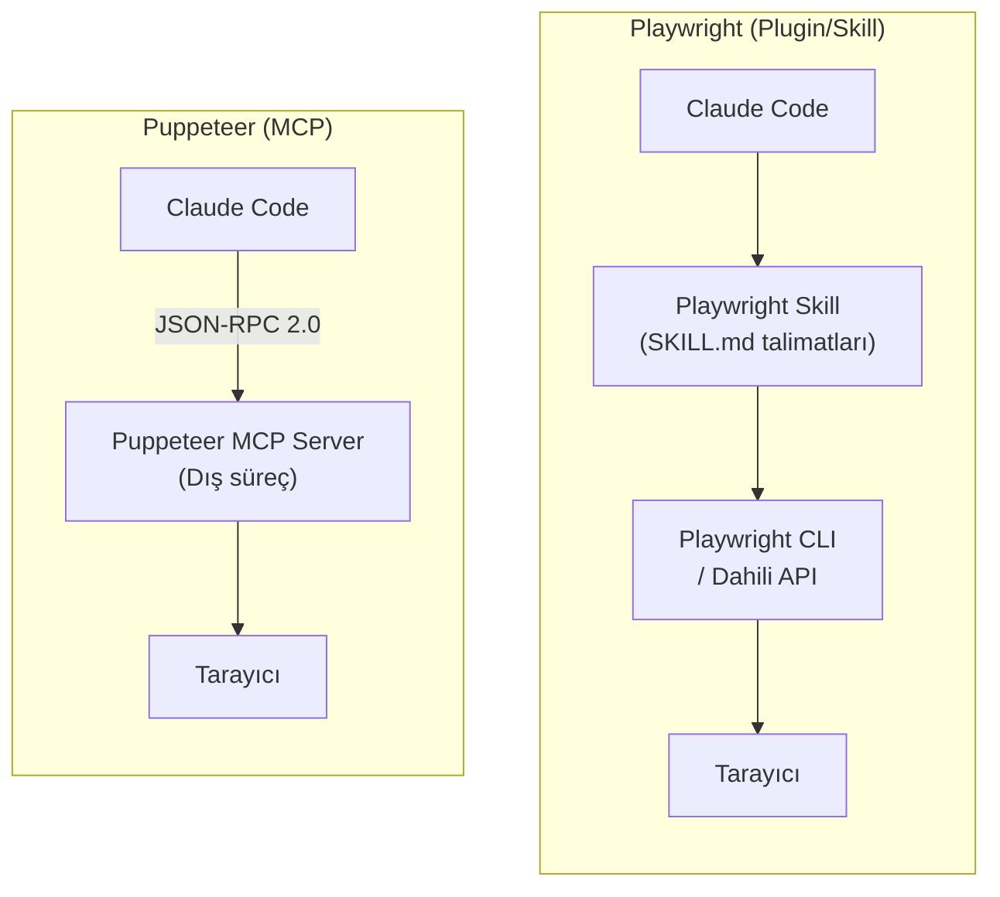
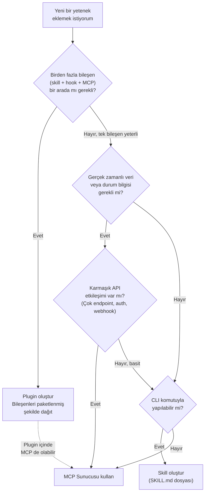

# MCP vs Plugin vs Skill — Karşılaştırma Rehberi

Claude Code'un yeteneklerini genişletmenin üç temel mekanizması vardır: **MCP** (Model Context Protocol), **Plugin** ve **Skill**. Bu rehber, üç yaklaşımın farklarını, ortak noktalarını ve hangi senaryoda hangisinin tercih edilmesi gerektiğini somut örneklerle açıklar.

## Ön Koşullar

| Konu | Bölüm |
|------|-------|
| MCP nedir ve nasıl çalışır | [Bölüm 11 — MCP](../11-mcp/01-mcp-nedir.md) |
| MCP vs Skills karşılaştırması | [MCP vs Skills](../11-mcp/05-mcp-vs-skills-ne-zaman-hangisi.md) |
| Skills nedir ve türleri | [Bölüm 12 — Skills Nedir?](../12-skills-ve-pluginler/01-skills-nedir.md) |
| Plugin sistemi | [Bölüm 12 — Plugin Sistemi](../12-skills-ve-pluginler/03-plugin-sistemi.md) |

---

## 1. MCP vs Plugin vs Skill — Nedir?

### MCP (Model Context Protocol)

MCP, Anthropic tarafından geliştirilen açık bir iletişim standardıdır. Claude Code ile harici veri kaynakları ve araçlar arasında **JSON-RPC 2.0** tabanlı bir köprü kurar. Bir MCP sunucusu bağımsız bir süreç olarak çalışır, oturum boyunca aktif kalır ve gerçek zamanlı veri erişimi sağlar.

### Skill (Beceri)

Skill, Claude Code'a yeni bir davranış veya yetenek kazandıran **SKILL.md** dosyasıdır. Bir MCP sunucusu gibi harici bir süreç çalıştırmak yerine, Markdown dosyasındaki talimatları okuyarak ve uygulayarak çalışır. Bağlamda yalnızca ihtiyaç anında yer kaplar.

### Plugin (Eklenti)

Plugin, birden fazla skill, agent, hook ve MCP sunucusunu bir araya getiren **paketlenmiş bir genişletme birimidir**. `.claude-plugin/plugin.json` manifest dosyası ile tanımlanan plugin'ler, modüler, versiyonlanabilir ve paylaşılabilir yapılar sunar.



---

## 2. Temel Farklar Tablosu

| Özellik | MCP | Plugin | Skill |
|---------|-----|--------|-------|
| **Tanım** | Harici veri kaynaklarına erişim sağlayan protokol sunucusu | Skills, agents, hooks ve MCP sunucularının paketlenmiş koleksiyonu | Claude Code'a yetenek kazandıran Markdown talimat dosyası |
| **Çalışma şekli** | Bağımsız süreç olarak çalışır; oturum boyunca aktif kalır, JSON-RPC 2.0 ile iletişim kurar | İçindeki bileşenleri (skill, hook, MCP vb.) organize eder ve namespace altında sunar | İhtiyaç anında okunur, talimatlar Claude Code tarafından uygulanır |
| **Kurulum** | `.mcp.json` dosyasına sunucu tanımı + harici bağımlılıklar (Node.js, Python vb.) | `/plugin install` komutu veya Git deposundan ekleme; `plugin.json` manifest gerektirir | `.claude/skills/` dizinine `SKILL.md` dosyası oluşturmak yeterli |
| **Kullanım alanı** | Karmaşık API etkileşimleri, gerçek zamanlı veritabanı erişimi, durum bilgisi gerektiren işlemler | Takım araçları dağıtımı, modüler yetenek paketleri, kurumsal standart araç setleri | CLI komut talimatları, proje özel iş akışları, düşük maliyetli yetenek ekleme |
| **Örnekler** | GitHub MCP, PostgreSQL MCP, Puppeteer MCP, Slack MCP | team-tools plugin (lint + format + deploy), aws-toolkit plugin | Docker yönetim skill'i, deploy skill'i, kod inceleme skill'i |
| **Bağlam maliyeti** | Yüksek (~200-3000 token/sunucu, sürekli) | Plugin'in içerdiği bileşenlere bağlı (MCP yüksek, skill düşük) | Düşük (~100-500 token, yalnızca kullanıldığında) |
| **Taşınabilirlik** | Ortama bağlı (Node.js, Python vb. gerektirir) | Git ile dağıtılabilir, versiyonlanabilir | Her yerde çalışır (sadece metin dosyası) |

---

## 3. Somut Örnek: Playwright Plugin vs Puppeteer MCP

Hem Playwright hem Puppeteer tarayıcı otomasyonu araçlarıdır. Ancak Claude Code ekosisteminde biri **plugin/skill**, diğeri **MCP sunucusu** olarak çalışır. Bu fark, mimari yaklaşımı ve kullanım deneyimini doğrudan etkiler.

### Mimari Karşılaştırma



### Playwright Plugin

Playwright plugin, Claude Code oturumunda **doğrudan kullanılan bir beceri/araç seti** olarak çalışır. Skill dosyasındaki talimatlar Claude Code tarafından okunur ve Playwright CLI komutları ya da dahili API'ler aracılığıyla tarayıcı işlemleri gerçekleştirilir.

```bash
# Playwright skill kullanımı
> /playwright test src/login.spec.ts
# Claude Code, SKILL.md talimatlarını okur
# Playwright CLI komutlarını çalıştırır
# Sonuçları doğrudan raporlar
```

**Özellikleri:**

- Claude Code süreci içinde çalışır, ayrı bir sunucu gerektirmez
- Talimat tabanlıdır; SKILL.md dosyasında Playwright komutları tanımlanır
- Bağlam maliyeti düşüktür, yalnızca çağrıldığında token tüketir
- Durum bilgisi (state) oturumlar arasında korunmaz

### Puppeteer MCP

Puppeteer MCP, **dış bir MCP sunucusu** olarak çalışır. Claude Code, MCP protokolü üzerinden bu sunucuyla iletişim kurar. Tarayıcı durumu (state) sunucu süreci boyunca korunur.

```jsonc
// .mcp.json
{
  "mcpServers": {
    "puppeteer": {
      "command": "npx",
      "args": ["-y", "@modelcontextprotocol/server-puppeteer"]
    }
  }
}
```

```bash
# Puppeteer MCP kullanımı
> localhost:3000 adresine git ve login formunu doldur
# Claude Code --> MCP JSON-RPC --> Puppeteer Server --> Tarayıcı
# Her adımda tarayıcı durumu korunur
```

**Özellikleri:**

- Bağımsız süreç olarak çalışır, oturum boyunca aktif kalır
- JSON-RPC 2.0 üzerinden iletişim kurar
- Tarayıcı durumu (oturum, çerezler, sayfa geçmişi) adımlar arasında korunur
- Bağlam maliyeti yüksektir, araç tanımları sürekli context window'da yer kaplar

### Karşılaştırma Tablosu

| Özellik | Playwright (Plugin/Skill) | Puppeteer (MCP) |
|---------|--------------------------|-----------------|
| **Çalışma modeli** | Talimat tabanlı, CLI komutları | Dış süreç, JSON-RPC iletişimi |
| **Durum yönetimi** | Durum korunmaz, her komut bağımsız | Tarayıcı durumu oturum boyunca korunur |
| **Bağlam maliyeti** | Düşük (~200 token, kullanıldığında) | Yüksek (~1500+ token, sürekli) |
| **Kurulum** | SKILL.md + Playwright CLI | `.mcp.json` + npx paketi |
| **İdeal kullanım** | Test koşturma, tek seferlik sayfa işlemleri | Çok adımlı tarayıcı senaryoları, durum gerektiren akışlar |
| **Örnek senaryo** | `npx playwright test` çalıştırma | Login yap, dashboard'a git, veri doğrula |

**Özet:** Tek seferlik test koşturma veya sayfa ekran görüntüsü gibi işlemler için Playwright plugin/skill yeterlidir. Çok adımlı, durumun korunması gereken tarayıcı senaryoları (login akışı, form doldurma zincirleri) için Puppeteer MCP daha uygundur.

---

## 4. Ne Zaman Hangisi?

Aşağıdaki karar ağacı, hangi genişletme mekanizmasını kullanmanız gerektiğini belirlemenize yardımcı olur:



### Karar Kriterleri Özeti

- **Plugin seç:** Birden fazla ilişkili bileşeni (skill, hook, agent, MCP) bir paket halinde dağıtmak istiyorsan.
- **MCP seç:** Gerçek zamanlı veri, karmaşık API etkileşimi veya çok adımlı durum bilgisi gerektiren işlemler için.
- **Skill seç:** CLI komutlarıyla çözülebilen, düşük bağlam maliyeti istenen, hafif ve taşınabilir yetenekler için.

---

## 5. Özet Tablosu

| Kriter | MCP | Plugin | Skill |
|--------|-----|--------|-------|
| **Ne zaman?** | Gerçek zamanlı veri, karmaşık API, durum gerektiren işlemler | Çok bileşenli araç seti dağıtımı, takım standartları | CLI talimatları, hafif yetenekler, düşük maliyet |
| **Karmaşıklık** | Yüksek | Orta-Yüksek | Düşük |
| **Bağlam maliyeti** | Yüksek (sürekli) | Değişken (içeriğe bağlı) | Düşük (ihtiyaç anında) |
| **Taşınabilirlik** | Ortama bağlı | Git ile dağıtılabilir | Her yerde çalışır |
| **Bakım** | Paket/süreç güncellemeleri | Manifest ve bileşen güncellemeleri | Metin düzenlemesi |
| **Takım paylaşımı** | `.mcp.json` ile | Marketplace veya Git ile | `.claude/skills/` dizini ile |
| **Durum yönetimi** | Oturum boyunca korunur | Bileşene bağlı | Korunmaz |

---

## Sonraki Adım

MCP, Plugin ve Skill arasındaki farkları ve kullanım senaryolarını inceledik. Mevcut plugin ekosistemini ve kullanılabilir plugin'leri keşfetmek için:

> [Plugin Katalogu](./03-plugin-katalogu.md)
