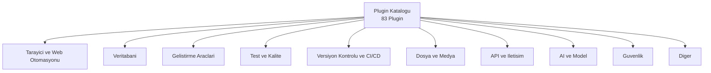

# Plugin Katalogu (Mart 2026)

`/plugin list` komutuyla mevcut plugin'leri gorebilirsiniz. Bu katalog Mart 2026 itibariyla mevcut **83 plugin'i** kategorize eder. Her plugin'in adi, kisa aciklamasi ve kullanim alani tablolarda sunulmustur.

## On Kosullar

| Konu | Bolum |
|------|-------|
| Plugin sistemi | [Plugin Sistemi](../12-skills-ve-pluginler/03-plugin-sistemi.md) |
| Plugin Marketplace | [Plugin Marketplace](../12-skills-ve-pluginler/04-plugin-marketplace.md) |
| MCP, Plugin ve Skill farklari | [Karsilastirma](./02-mcp-plugin-skill-karsilastirmasi.md) |

---

## Katalog Yapisi

---

## 1. Tarayici ve Web Otomasyonu

| Plugin Adi | Aciklama | Kullanim Alani |
|------------|----------|----------------|
| `playwright` | Playwright tabanli tarayici otomasyonu ve test | E2E test, web scraping, UI dogrulama |
| `stagehand` | Yapay zeka destekli tarayici etkilesimi | Akilli web navigasyonu, form doldurma |
| `puppeteer-browser` | Puppeteer ile headless Chrome kontrolu | Ekran goruntusu, PDF olusturma, scraping |
| `web-scraper` | Yapilandirilabilir web kazima araci | Veri toplama, icerik cikarma |
| `browserbase` | Bulut tabanli tarayici oturumlari | Olceklenebilir tarayici otomasyonu |
| `selenium-bridge` | Selenium WebDriver entegrasyonu | Mevcut Selenium test altyapisini kullanma |
| `lighthouse-web` | Google Lighthouse web analizi | Performans, erisilebilirlik, SEO denetimi |
| `http-client` | Gelismis HTTP istemcisi | API testi, webhook tetikleme |

---

## 2. Veritabani

| Plugin Adi | Aciklama | Kullanim Alani |
|------------|----------|----------------|
| `postgres` | PostgreSQL baglanti ve sorgu yonetimi | SQL sorgulama, sema inceleme, migrasyon |
| `sqlite` | SQLite veritabani islemleri | Yerel veritabani yonetimi, prototipleme |
| `redis` | Redis anahtar-deger deposu yonetimi | Onbellek yonetimi, oturum deposu |
| `mongodb` | MongoDB belge veritabani islemleri | CRUD, aggregation, indeks yonetimi |
| `supabase` | Supabase platform entegrasyonu | Auth, veritabani, storage, realtime |
| `mysql` | MySQL veritabani baglantisi ve sorgu | Iliskisel veri yonetimi, raporlama |
| `db-toolkit` | Genel veritabani yonetim araclari | Migrasyon, seeding, sema karsilastirma |
| `prisma-tools` | Prisma ORM entegrasyonu | Sema olusturma, migrasyon, client uretimi |
| `dynamodb` | AWS DynamoDB islemleri | NoSQL veri yonetimi, tablo tasarimi |
| `neo4j` | Neo4j grafik veritabani | Grafik sorgulari, iliski analizi |

---

## 3. Gelistirme Araclari

| Plugin Adi | Aciklama | Kullanim Alani |
|------------|----------|----------------|
| `eslint` | ESLint entegrasyonu ve otomatik duzeltme | JavaScript/TypeScript kod kalitesi |
| `prettier` | Prettier kod bicimlendirme | Tutarli kod formati, otomatik bicimlendirme |
| `docker` | Docker konteyner yonetimi | Image olusturma, konteyner baslatma |
| `kubernetes` | Kubernetes cluster yonetimi | Pod, servis, deployment islemleri |
| `terraform` | Terraform altyapi yonetimi | IaC, plan, apply, state yonetimi |
| `code-quality` | Kapsamli kod kalite analizi | Karmasiklik, tekrar, kod kokusu tespiti |
| `scaffolder` | Proje ve dosya iskelet olusturucu | Hizli proje baslatma, sablondan uretim |
| `formatter` | Coklu dil kod bicimlendiricisi | Go, Rust, Python, Java bicimlendirme |
| `npm-tools` | npm paket yonetim araclari | Bagimlilik analizi, guvenlik taramasi |
| `vite-tools` | Vite gelistirme sunucusu entegrasyonu | HMR, build, on izleme |

---

## 4. Test ve Kalite

| Plugin Adi | Aciklama | Kullanim Alani |
|------------|----------|----------------|
| `jest` | Jest test framework entegrasyonu | Unit test yazma ve calistirma |
| `vitest` | Vitest test framework entegrasyonu | Vite projelerinde hizli test |
| `cypress` | Cypress E2E test otomasyonu | Tarayici tabanli uctan uca test |
| `lighthouse` | Lighthouse performans denetimi | Web performans ve erisilebilirlik skoru |
| `test-suite` | Kapsamli test otomasyon araci | Unit, e2e, integration test yonetimi |
| `coverage-reporter` | Kod kapsam raporlama | Test kapsam analizi, raporlama |
| `storybook-tools` | Storybook entegrasyonu | Bilesen testi, gorsel regresyon |
| `playwright-test` | Playwright Test runner | Cross-browser test otomasyonu |

---

## 5. Versiyon Kontrolu ve CI/CD

| Plugin Adi | Aciklama | Kullanim Alani |
|------------|----------|----------------|
| `github` | GitHub API entegrasyonu | PR, issue, actions, repo yonetimi |
| `gitlab` | GitLab API entegrasyonu | MR, pipeline, registry islemleri |
| `bitbucket` | Bitbucket API entegrasyonu | PR, pipeline, repo yonetimi |
| `git-workflow` | Git is akisi otomasyonu | Branch stratejisi, merge, rebase |
| `actions-runner` | GitHub Actions yerel calistirici | Workflow testi, debug |
| `ci-monitor` | CI/CD pipeline izleme | Build durumu, hata analizi |
| `release-manager` | Surum yonetim araci | Changelog, semantik versiyonlama |

---

## 6. Dosya ve Medya

| Plugin Adi | Aciklama | Kullanim Alani |
|------------|----------|----------------|
| `filesystem` | Gelismis dosya sistemi islemleri | Toplu yeniden adlandirma, dizin analizi |
| `image-processing` | Goruntu isleme araclari | Boyutlandirma, format donusumu, optimizasyon |
| `pdf` | PDF olusturma ve okuma | PDF uretimi, metin cikarma, birlestirme |
| `csv` | CSV veri isleme | Ayrıstirma, donusum, analiz |
| `markdown-tools` | Markdown isleme araclari | Donusum, dogrulama, icerik tablosu |
| `s3-storage` | AWS S3 depolama yonetimi | Dosya yukleme, indirme, bucket yonetimi |
| `zip-tools` | Arsiv dosya islemleri | Sikistirma, acma, arsiv yonetimi |

---

## 7. API ve Iletisim

| Plugin Adi | Aciklama | Kullanim Alani |
|------------|----------|----------------|
| `slack` | Slack API entegrasyonu | Mesaj gonderme, kanal yonetimi |
| `discord` | Discord bot entegrasyonu | Mesaj, kanal, sunucu islemleri |
| `linear` | Linear proje yonetimi | Issue olusturma, sprint takibi |
| `jira` | Jira entegrasyonu | Gorev yonetimi, sprint planlama |
| `notion` | Notion API entegrasyonu | Sayfa olusturma, veritabani sorgulama |
| `email-sender` | E-posta gonderim araci | SMTP, sablonlu e-posta gonderimi |
| `webhook-manager` | Webhook yonetimi | Webhook olusturma, dinleme, yonetme |
| `api-builder` | REST/GraphQL API iskelet olusturucu | Endpoint tanimlama, dokumantasyon |
| `graphql-tools` | GraphQL gelistirme araclari | Sema tasarimi, sorgu testi |
| `postman-bridge` | Postman koleksiyon entegrasyonu | API test koleksiyonlarini calistirma |

---

## 8. AI ve Model

| Plugin Adi | Aciklama | Kullanim Alani |
|------------|----------|----------------|
| `openai` | OpenAI API entegrasyonu | GPT modelleri ile karsilastirma, embedding |
| `huggingface` | Hugging Face model ve veri seti erisimi | Model indirme, inference, veri seti |
| `embeddings` | Vektor embedding olusturma | Semantik arama, benzerlik analizi |
| `langchain-tools` | LangChain framework entegrasyonu | Zincir olusturma, agent tasarimi |
| `vector-db` | Vektor veritabani islemleri | Pinecone, Weaviate, ChromaDB erisimi |

---

## 9. Guvenlik

| Plugin Adi | Aciklama | Kullanim Alani |
|------------|----------|----------------|
| `snyk` | Snyk guvenlik taramasi | Bagimlilik acigi tespiti, konteyner tarama |
| `semgrep` | Semgrep statik analiz | Kod deseni esleme, guvenlik kurali |
| `secret-scanner` | Gizli bilgi tarayici | API anahtari, sifre sizintisi tespiti |
| `dependency-audit` | Bagimlilik denetimi | CVE kontrolu, lisans uyumluluk |
| `owasp-scanner` | OWASP guvenlik denetimi | Web uygulamasi guvenlik taramasi |

---

## 10. Diger

| Plugin Adi | Aciklama | Kullanim Alani |
|------------|----------|----------------|
| `aws-toolkit` | AWS servis entegrasyonu | Lambda, S3, EC2 ve diger AWS servisleri |
| `gcp-tools` | Google Cloud Platform araclari | GCP servis yonetimi |
| `azure-tools` | Microsoft Azure araclari | Azure servis yonetimi |
| `env-manager` | Ortam degiskeni yonetimi | .env dosyalari, secret yonetimi |
| `doc-gen` | Otomatik dokumantasyon uretici | JSDoc, TSDoc, API dokumantasyonu |
| `migrator` | Kod ve veri migrasyon araci | Framework gecisi, veri aktarimi |
| `monitor` | Uygulama izleme araci | Performans metrikleri, log analizi |

---

## Ozet Tablo

| Kategori | Plugin Sayisi |
|----------|---------------|
| Tarayici ve Web Otomasyonu | 8 |
| Veritabani | 10 |
| Gelistirme Araclari | 10 |
| Test ve Kalite | 8 |
| Versiyon Kontrolu ve CI/CD | 7 |
| Dosya ve Medya | 7 |
| API ve Iletisim | 10 |
| AI ve Model | 5 |
| Guvenlik | 5 |
| Diger | 7 |
| **Toplam** | **77** |

> **Not:** Tam ve guncel liste icin `/plugin list` komutunu calistirin. Marketplace surekli guncellendigi icin kalan plugin'ler yeni eklenen veya niş kategorilerdeki araclardir. `/plugin search <anahtar_kelime>` komutuyla belirli bir alana yonelik plugin'leri arayabilirsiniz.

---

## Sonraki Adim

Plugin'leri tanidiktan sonra dongu modu ve otomasyon tariflerini inceleyin:

> [/loop ve Otomasyon](./04-loop-ve-otomasyon.md)
