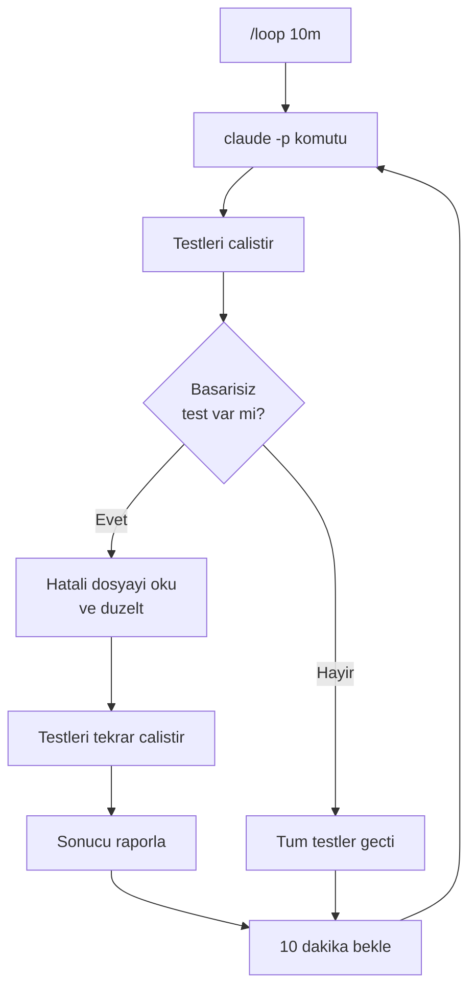
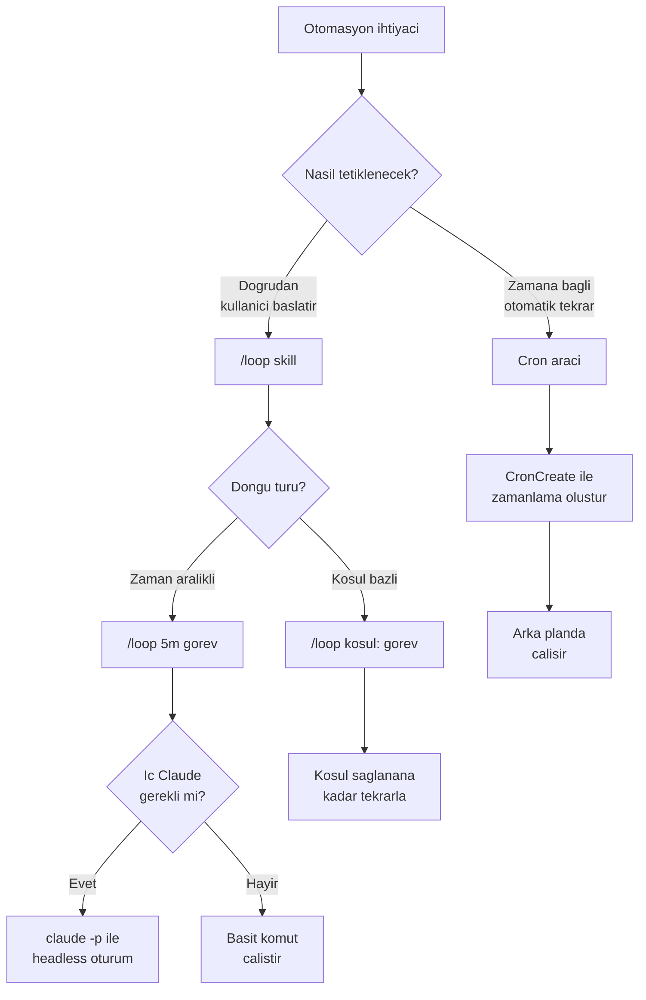

# /loop ve Otomasyon

Claude Code'da tekrarlayan islemleri otomatiklestirmek icin **/loop** skill'i kullanilir. Bu hizli referans, /loop kullanimi, otomasyon senaryolari ve ic ice Claude cagirma yontemlerini ozetler.

## On Kosullar

| Konu | Bolum |
|------|-------|
| Zamanlanmis gorevler | [Zamanlanmis Gorevler](../08-araclar/06-zamanlanmis-gorevler.md) |
| Araclar genel bakis | [Araclara Genel Bakis](../08-araclar/01-araclara-genel-bakis.md) |

---

## /loop Nedir?

**/loop**, Claude Code icinde dogrudan `/loop` yazarak calistirdiginiz bir **skill**'dir (slash command). Belirli araliklarla veya belirli bir kosul saglanana kadar verilen komutu/prompt'u tekrar tekrar yurutur.

**Format:**

```
/loop [sure] [komut/prompt]
```

**Zaman birimleri:**

| Birim | Aciklama | Ornek |
|-------|----------|-------|
| `s` | Saniye | `/loop 10s npm test` |
| `m` | Dakika | `/loop 5m PR durumunu kontrol et` |
| `h` | Saat | `/loop 1h deploy durumunu kontrol et` |

---

## /loop ile Otomasyon Senaryolari

### PR Izleme

```bash
> /loop 5m PR durumunu kontrol et, merge edilmisse haber ver
```

Her 5 dakikada PR durumunu sorgular, merge edildiginde bildirim verir.

### Test Izleme

```bash
> /loop 30s testleri calistir ve basarisiz olanlari raporla
```

Her 30 saniyede test suite'i calistirir, sonuclari ozetler.

### Deploy Izleme

```bash
> /loop 2m deploy durumunu kontrol et, tamamlaninca raporla
```

Her 2 dakikada deploy pipeline'ini kontrol eder.

### Iteratif Hata Duzeltme

```bash
> /loop lint hatalari kalmayincaya kadar: hatalari duzelt ve tekrar kontrol et
```

Kosul bazli: tum lint hatalari giderilene kadar donguyu surdurur.

---

## Loop Icinde Baska Claude Cagirma

Bu, /loop'un en guclu ozelliklerinden biridir. Dongu icinde `claude -p "..."` komutuyla **headless** (basiz) bir Claude oturumu baslatabilirsiniz. Bu ic Claude, bagimsiz bir agent olarak calisir ve verilen gorevi tamamlar.

### Temel Kullanim

```bash
> /loop 10m claude -p "testleri calistir ve basarisiz olanlari duzelt" --allowedTools Bash,Edit,Read
```

### Ic Claude'un Ayarlari

| Parametre | Aciklama | Ornek |
|-----------|----------|-------|
| `-p` | Non-interactive mod (prompt verilir, sonuc doner) | `claude -p "gorevi calistir"` |
| `--model` | Kullanilacak model secimi | `--model sonnet` |
| `--allowedTools` | Izin verilen araclar (guvenlik icin sinirla) | `--allowedTools Bash,Edit,Read` |

### Pratik Ornek

```bash
> /loop 10m claude -p "npm test calistir. Basarisiz test varsa ilgili dosyayi oku, hatanin nedenini bul ve duzelt. Sonra testleri tekrar calistir." --allowedTools Bash,Edit,Read
```



> **Guvenlik notu:** Ic Claude'a `--allowedTools` ile sadece ihtiyac duydugu araclari verin. Gereksiz izinler guvenlik riski olusturabilir.

---

## /loop vs Cron Farki

Bu iki mekanizma karistirilmamalidir:

| Ozellik | /loop (Skill) | Cron (Arac) |
|---------|---------------|-------------|
| **Cagirma** | `/loop` yazarak dogrudan cagirirsiniz | Claude kendi karariyla arka planda cagirir |
| **Tetikleme** | Kullanici baslatir | Dogal dilde istek verilir ("her 10 dk kontrol et") |
| **Calismasi** | On planda, sonuclar gorunur | Arka planda, sessizce calisir |
| **Iptal** | `Ctrl+C` | `CronDelete(cron_id)` |
| **Syntax** | `/loop 5m komut` | Cron ifadesi (`*/5 * * * *`) |

**Kisa ozet:** `/loop` bir skill'dir — dogrudan yazarsiniz. Cron bir aractir — Claude otomatik kullanir, `/cron` diye cagiramzsiniz.

---

## Otomasyon Akisi



---

## Ozet

| Kavram | Aciklama |
|--------|----------|
| **/loop** | Dogrudan calistirilan tekrarlayan yurutme skill'i |
| **Zaman birimleri** | `s` (saniye), `m` (dakika), `h` (saat) |
| **Ic Claude** | `claude -p "..."` ile headless oturum baslatma |
| **--allowedTools** | Ic Claude'un erisebilecegi araclari sinirlandirma |
| **Cron farki** | /loop = skill (sen yazarsin), Cron = arac (Claude kullanir) |

---

## Sonraki Adim

/loop ve otomasyon mekanizmalarini ogrendik. Simdi projenizin kalici hafizasini yoneten CLAUDE.md ve kurallar dosyalarina gecelim:

> [CLAUDE.md ve Kurallar Dosyalari](./05-claude-md-ve-kurallar.md)
