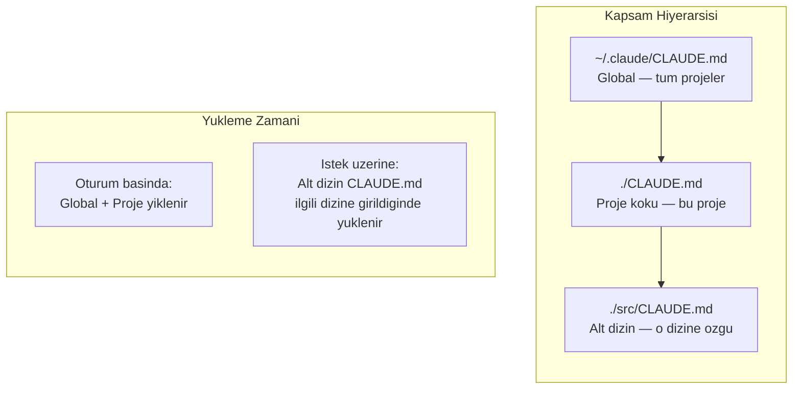
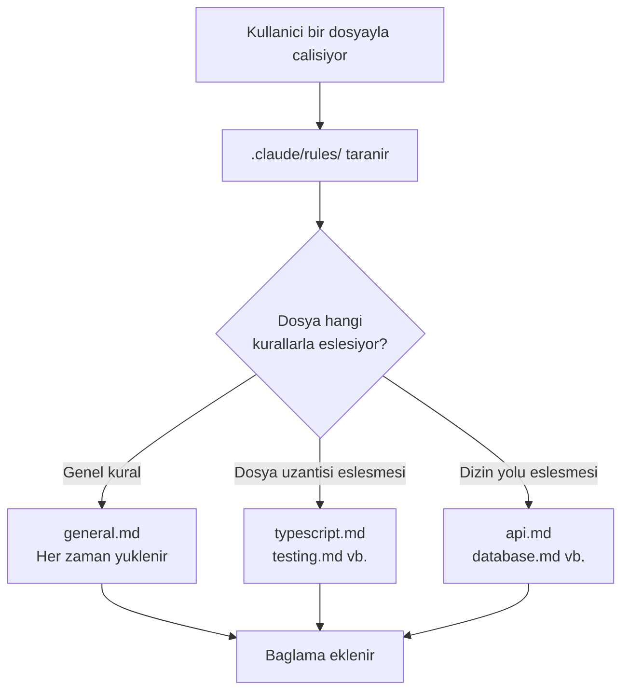

# CLAUDE.md ve Kurallar Dosyalari

CLAUDE.md, Claude Code'un her oturum basinda otomatik olarak okudugu **kalici bellek dosyasidir**. `.claude/rules/` dizini ise kurallari moduler parcalara bolmenizi saglar. Bu hizli referans, her iki mekanizmayi ozetler.

## On Kosullar

| Konu | Bolum |
|------|-------|
| CLAUDE.md detayli anlatim | [CLAUDE.md Dosyasi](../09-bellek-ve-baglam/01-claude-md-dosyasi.md) |
| Kurallar dizini detayli anlatim | [Kurallar Dizini](../09-bellek-ve-baglam/03-kurallar-dizini.md) |

---

## CLAUDE.md Nedir?

CLAUDE.md, projenizin **beyin belgesidir**. Proje yapisini, teknoloji stack'ini, build/test komutlarini ve kod stili kurallarini icerir. `/init` komutuyla otomatik olusturulabilir.

- **Konumu:** Proje kok dizini (`./CLAUDE.md`)
- **Olusturma:** `> /init` komutu projeyi tarar ve temel bir CLAUDE.md uretir
- **Yukleme:** Claude Code her oturum basinda otomatik okur
- **Amac:** Her seferinde ayni talimatlari tekrar etmekten kurtarir

### CLAUDE.md Icerigi

```
# CLAUDE.md

## Proje Hakkinda
Proje adi, amaci, teknoloji stack'i

## Sik Kullanilan Komutlar
- Build: `npm run build`
- Test: `npm test`
- Lint: `npm run lint`

## Kodlama Standartlari
- TypeScript kullan, JavaScript yazma
- Fonksiyon bilesenleri kullan
- Import sirasi: React > 3. parti > Yerel

## Mimari
- src/components/ — UI bilesenleri
- src/api/ — API istemcileri
- src/types/ — TypeScript tipleri
```

---

## CLAUDE.md Hiyerarsisi

CLAUDE.md dosyasi birden fazla konuma yerlestirilebilir. Her konum farkli bir kapsam belirler:



| Konum | Yol | Kapsam | Yukleme |
|-------|-----|--------|---------|
| **Global** | `~/.claude/CLAUDE.md` | Tum projeleriniz | Oturum basinda |
| **Proje** | `./CLAUDE.md` | Bu proje | Oturum basinda |
| **Alt dizin** | `./src/CLAUDE.md` | Sadece o dizin | Ilgili dizine girildiginde |

> **Not:** Enterprise ortamda `~/.claude/organization/CLAUDE.md` ile organizasyon seviyesi kurallar da tanimlanabilir.

---

## Kurallar Dizini (.claude/rules/)

CLAUDE.md'yi sisirmeden, kurallari **moduler dosyalara** bolmenizi saglayan mekanizmadir. Her kural ayri bir `.md` dosyasinda tutulur.

### Dizin Yapisi

```
.claude/
  rules/
    general.md        # Her zaman yuklenir
    typescript.md     # *.ts, *.tsx dosyalarinda
    testing.md        # *.test.*, *.spec.* dosyalarinda
    api.md            # src/api/ dizininde
    database.md       # migrations/ dizininde
```

### Glob Pattern ile Hedefleme

Kural dosyalari, dosya adi veya dizin yoluna gore otomatik eslesir. Hangi dosyalarla calisirken hangi kuralin yuklenecegini pattern'ler belirler:

| Kural Dosyasi | Eslesme | Ne Zaman Yuklenir |
|---------------|---------|-------------------|
| `general.md` | Tum dosyalar | Her zaman |
| `typescript.md` | `*.ts`, `*.tsx` | TypeScript dosyalarinda |
| `testing.md` | `*.test.*`, `*.spec.*` | Test dosyalarinda |
| `api.md` | `src/api/*` | API dizininde |



---

## En Iyi Uygulamalar

| Uygulama | Aciklama |
|----------|----------|
| **CLAUDE.md'yi kisa tut** | 2000 token (yaklasik 150-200 satir) altinda tutun; uzun dosyalar takip oranini dusurur |
| **Build/test komutlarini mutlaka yaz** | Claude'un projeyi derleyip test edebilmesi icin bu komutlar kritiktir |
| **Kod stili kurallarini net belirt** | "Iyi kod yaz" yerine "fonksiyonlar 30 satiri asmasin" gibi spesifik olun |
| **Spesifik kurallari rules/ dizinine tasi** | Dil, dosya tipi veya dizin bazli kurallar icin `.claude/rules/` kullanin |
| **Gizli bilgi yazmayin** | API key, sifre veya credential asla CLAUDE.md'ye eklenmemeli |
| **Duzenli guncelleyin** | Proje evrildiginde CLAUDE.md'yi de guncel tutun |

---

## Ozet Tablosu

| Kavram | CLAUDE.md | .claude/rules/ |
|--------|-----------|----------------|
| **Amac** | Genel proje bilgisi ve komutlar | Dosya/dizin bazli spesifik kurallar |
| **Konum** | Proje koku (`./CLAUDE.md`) | `.claude/rules/*.md` |
| **Yukleme** | Oturum basinda otomatik | Eslesen dosyayla calisildiginda |
| **Olusturma** | `/init` veya manuel | Manuel (her kural ayri dosya) |
| **Boyut onerisi** | 150-200 satir, 2000 token alti | Her dosya 30-50 satir |
| **Icerdigi bilgi** | Stack, komutlar, mimari, genel kurallar | Dil, test, API, veritabani kurallari |

---

## Sonraki Adim

CLAUDE.md ve kurallar mekanizmasini ogrendik. Simdi bellek ve context window yonetimine gecelim:

> [Bellek ve Context Window](./06-bellek-ve-context-window.md)
