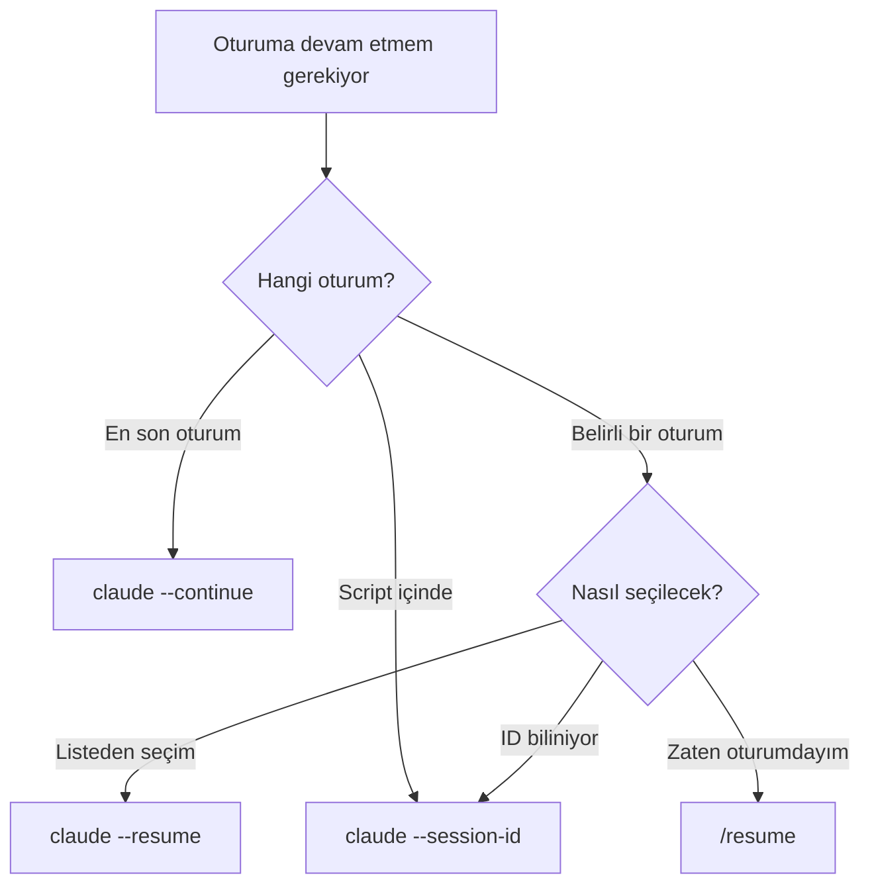
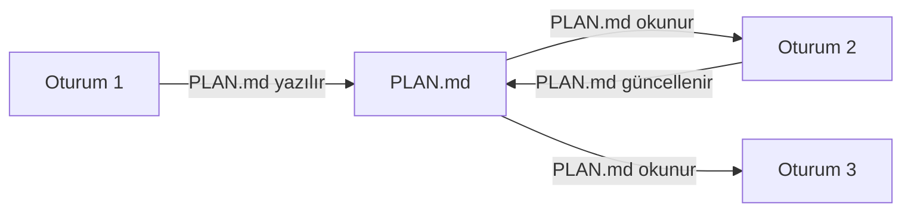

# Oturum Yönetimi

Claude Code oturum başlatma, devam etme ve oturumlar arası bağlam aktarımı yöntemlerinin özet referansıdır. Detaylı anlatım için [Bölüm 09 - Oturum Yönetimi](../09-bellek-ve-baglam/06-oturum-yonetimi.md) dosyasına bakın.

## Ön Koşullar

| Konu | Bölüm |
|------|-------|
| Bellek ve Context Window | [Bellek ve Context Window](./06-bellek-ve-context.md) |
| Context window yönetimi | [Bölüm 09 - Context Window](../09-bellek-ve-baglam/05-context-window-yonetimi.md) |

---

## 1. Oturum Başlatma Yöntemleri

Her yöntemin token maliyeti ve yüklenen bağlam farklıdır:

| Yöntem | Token Maliyeti | Yüklenen Bağlam |
|--------|---------------|-----------------|
| **Yeni oturum** | ~7-13K token | CLAUDE.md, auto memory, proje taraması, git durumu |
| **--continue** | ~2-3K token | Sadece oturum özeti yüklenir |
| **--resume** | ~2-3K token | Belirli oturum bağlamı yüklenir |
| **Aynı oturumda devam** | 0 token | Bağlam zaten mevcut |

---

## 2. Komut Örnekleri

### Yeni Oturum

```bash
# Standart başlangıç
$ claude

# Görev ile başlangıç
$ claude "Auth modülüne rate limiting ekle"
```

### --continue (En Son Oturuma Devam)

```bash
# En son oturuma devam et
$ claude --continue

# Kısa form
$ claude -c

# Devam ederken görev ver
$ claude -c "Dün kaldığım rate limiting'i tamamla"
```

### --resume (Belirli Oturumu Seç)

```bash
# Oturum listesinden seçim yap (interaktif)
$ claude --resume

# Kısa form
$ claude -r
```

Komut çalıştırıldığında oturum listesi gösterilir ve seçim yapılır.

### /resume (Oturum İçinde Geçiş)

```bash
# Aktif oturumdayken başka oturuma geç
> /resume
```

### --session-id (Script ve Otomasyon)

```bash
# Belirli bir oturum ID'si ile devam et
$ claude --session-id "abc123def456"
```

---

## 3. Ne Zaman Hangisi?



| Senaryo | Önerilen Yöntem |
|---------|-----------------|
| Sabah, dünkü işe devam | `claude -c` |
| Birkaç gün önceki oturuma dönmek | `claude -r` |
| CI/CD pipeline içinde | `claude --session-id` |
| Oturum içinde başka oturuma geçiş | `/resume` |
| Context window %80+ doldu | Yeni oturum (`claude`) |
| Farklı bir göreve geçiş | Yeni oturum (`claude`) |

---

## 4. Oturum Arası Bağlam Aktarımı

Oturumlar arasında bağlam aktarmak için **plan dosyası stratejisi** kullanılır:

```bash
# Oturum 1: Plan oluştur
$ claude
> Refactoring planını oluştur ve PLAN.md'ye kaydet
> /exit

# Oturum 2: Planı uygula (temiz context window)
$ claude
> PLAN.md'yi oku ve Adım 1'i uygula
> Tamamladığın adımları PLAN.md'de işaretle
> /exit

# Oturum 3: Devam et
$ claude
> PLAN.md'yi oku ve sonraki tamamlanmamış adımı uygula
```



Bu yaklaşımın avantajı, her oturumun temiz bir context window ile başlamasıdır. Plan dosyası, oturumlar arasında bağlam köprüsünü oluşturur.

---

## Özet

| Kavram | Açıklama |
|--------|----------|
| **Cold start tax** | Yeni oturumda bağlam yeniden oluşturma maliyeti (~7-13K token) |
| **--continue / -c** | En son oturuma devam etmenin en hızlı yolu |
| **--resume / -r** | Belirli bir oturumu seçerek devam etme |
| **--session-id** | Programatik erişim için oturum ID'si belirtme |
| **/resume** | REPL içinde oturum geçişi |
| **Plan dosyası** | Oturumlar arası bağlam köprüsü |

---

## Sonraki Adım

Paralel çalışma için worktree mekanizmasını öğrenin:

> [Worktree ve Paralel Çalışma](./08-worktree-ve-paralel-calisma.md)
