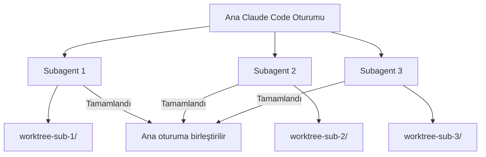
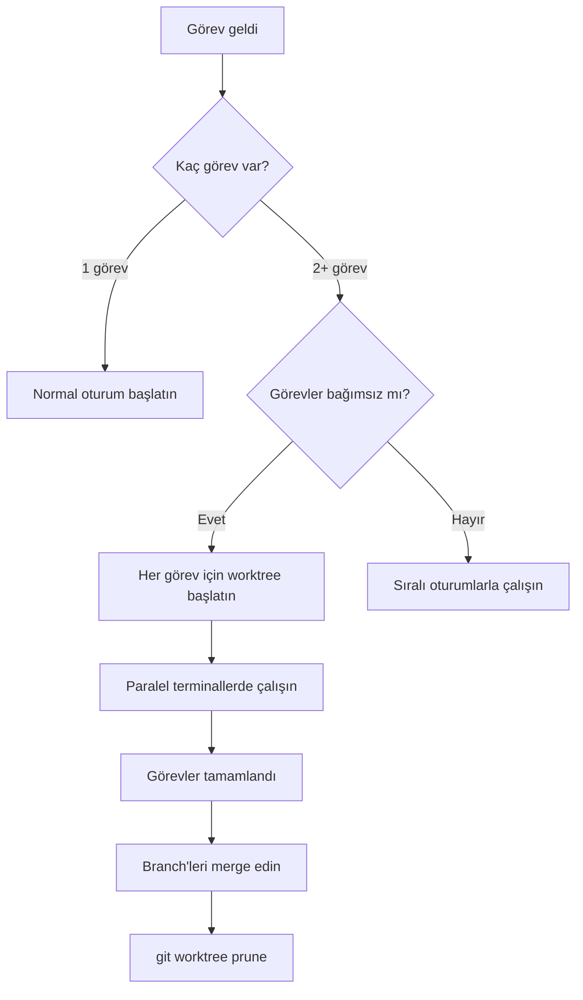

# Worktree ve Paralel Çalışma

Git worktree ile izole paralel görevler çalıştırmanın özet referansıdır. Detaylı anlatım için [Bölüm 09 - Worktree ile Paralel Çalışma](../09-bellek-ve-baglam/08-worktree-ile-paralel-calisma.md) dosyasına bakın.

## Ön Koşullar

| Konu | Bölüm |
|------|-------|
| Oturum Yönetimi | [Oturum Yönetimi](./07-oturum-yonetimi.md) |
| Git temel bilgisi | Harici kaynak |

---

## 1. Nedir?

Git worktree, aynı Git deposunun birden fazla izole çalışma kopyasını oluşturmanızı sağlayan bir Git özelliğidir. Claude Code bu özelliği `--worktree` / `-w` bayrağıyla entegre eder. Her worktree kendi branch'inde bağımsız çalışır, ana çalışma dizini etkilenmez.

---

## 2. Kullanım

```bash
# İsim vererek worktree başlat
$ claude -w auth-feature "Auth modülüne rate limiting ekle"

# Uzun form
$ claude --worktree auth-feature "Auth modülüne rate limiting ekle"

# İsim vermeden (otomatik isim atanır)
$ claude -w "Login sayfasındaki hatayı düzelt"
```

Oluşturulan yapı:

```
proje-dizini/
├── .claude/
│   └── worktrees/
│       └── auth-feature/       # İzole çalışma dizini
│           ├── src/
│           ├── package.json
│           └── ...             # Ana repo'nun kopyası
├── src/                        # Ana çalışma dizini (dokunulmaz)
└── ...
```

---

## 3. Paralel Çalışma

3-5 veya daha fazla terminalde aynı anda farklı görevleri yürütebilirsiniz:

```bash
# Terminal 1
$ claude -w user-profile "Kullanıcı profil sayfası oluştur"

# Terminal 2
$ claude -w notifications "Bildirim sistemi kur"

# Terminal 3
$ claude -w search "Tam metin arama özelliği ekle"
```

Her terminal bağımsız çalışır, birbirini etkilemez.

---

## 4. Subagent İzolasyonu

Claude Code'un subagent (alt ajan) sistemi de worktree ile izole çalışabilir. Agent tool'da izolasyon modu `isolation: "worktree"` olarak belirtilir.

```bash
# Oturum içinde subagent izolasyonu
> Bu 3 görevi paralel subagent'lar ile yap,
> her biri kendi worktree'sinde çalışsın
```



---

## 5. Otomatik Temizlik

Oturum sona erdiğinde:

- **Worktree dizini silinir** (otomatik temizlik)
- **Git branch'i korunur** (commit'lenmiş değişiklikler kaybolmaz)

İşleminiz tamamlandıktan sonra branch'i merge edebilir veya silebilirsiniz:

```bash
# Branch'i ana branch'e merge et
$ git merge worktree-auth-feature

# Veya branch'i sil
$ git branch -d worktree-auth-feature

# Ölü worktree referanslarını temizle
$ git worktree prune
```

---

## 6. Ne Zaman Kullanılmalı?

| Senaryo | Worktree Kullan | Neden |
|---------|:--------------:|-------|
| Tek bir bug fix | Hayır | Tek oturum yeterli |
| 3 bağımsız feature | Evet | Zaman kazandırır |
| Acil hotfix + devam eden feature | Evet | Ana iş akışını bozmaz |
| Sıralı migration adımları | Hayır | Adımlar birbirine bağlı |
| Paralel refactoring | Evet | Farklı modüller izole çalışır |
| Kod inceleme + geliştirme | Evet | Biri okuma, diğeri yazma |

---

## 7. Çalışma Akışı



---

## Özet

| Kavram | Açıklama |
|--------|----------|
| **Git Worktree** | Aynı repo'nun birden fazla izole çalışma kopyası |
| **--worktree / -w** | Claude Code'da worktree ile izole oturum başlatma |
| **Paralel oturumlar** | 3-5+ görevi aynı anda yürütme |
| **Subagent izolasyonu** | Alt ajanların worktree ile bağımsız çalışması |
| **Otomatik temizlik** | Oturum bitince dizin silinir, branch korunur |

---

## Sonraki Adım

MCP sunucuları ve Tool Search referansına geçin:

> [MCP Örnekleri ve Tool Search](./09-mcp-ornekleri-ve-tool-search.md)
