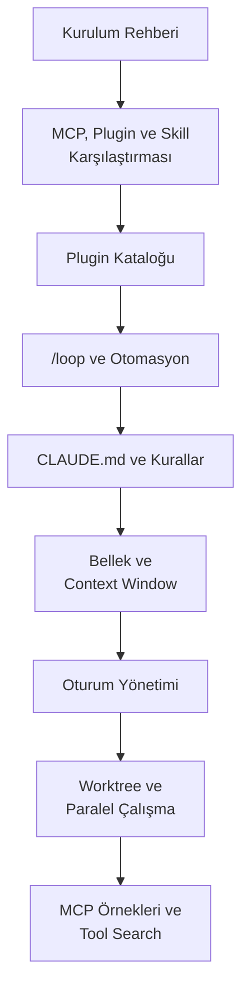

# Bölüm 00: Hızlı Referans

Bu el kitabının tamamını okuduktan sonra, günlük çalışmanızda hızlıca başvurabileceğiniz özet referans bölümüdür. Detaylı açıklamalar için ilgili bölümlere yönlendirmeler içerir.

## Bu Bölümde Neler Bulacaksınız?

## İçerik

| # | Dosya | Konu | Süre |
|---|-------|------|------|
| 01 | [Kurulum Rehberi](./01-kurulum-rehberi.md) | Adım adım kurulum, ilk giriş, tema, plan seçimi | ~5 dk |
| 02 | [MCP, Plugin ve Skill Karşılaştırması](./02-mcp-plugin-skill-karsilastirmasi.md) | Üç genişletme mekanizmasının farkları ve kullanım alanları | ~8 dk |
| 03 | [Plugin Kataloğu](./03-plugin-katalogu.md) | Mevcut 83 plugin'in listesi ve açıklamaları | ~10 dk |
| 04 | [/loop ve Otomasyon](./04-loop-ve-otomasyon.md) | Döngü modu, iç içe Claude çağırma, otomasyon tarifleri | ~8 dk |
| 05 | [CLAUDE.md ve Kurallar](./05-claude-md-ve-kurallar.md) | CLAUDE.md, /init, .claude/rules/ dosyaları | ~5 dk |
| 06 | [Bellek ve Context Window](./06-bellek-ve-context.md) | Otomatik bellek, context window yönetimi, /compact | ~5 dk |
| 07 | [Oturum Yönetimi](./07-oturum-yonetimi.md) | --continue, --resume, yeni oturum, token karşılaştırması | ~5 dk |
| 08 | [Worktree ve Paralel Çalışma](./08-worktree-ve-paralel-calisma.md) | Git worktree ile izole paralel görevler | ~5 dk |
| 09 | [MCP Örnekleri ve Tool Search](./09-mcp-ornekleri-ve-tool-search.md) | Hazır MCP sunucuları, tarayıcı, veritabanı, Tool Search | ~8 dk |

## Ön Koşullar

| Konu | Bölüm |
|------|-------|
| El kitabının tamamını okumak | [Bölüm 01](../01-yapay-zeka-temelleri/README.md) — [Bölüm 21](../21-sorun-giderme/README.md) |

## Sonraki Adım

Herhangi bir konunun detayına inmek için ilgili bölüm numarasına gidin.
