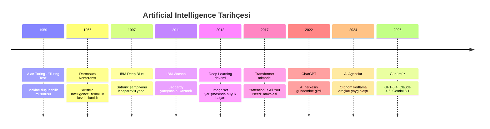
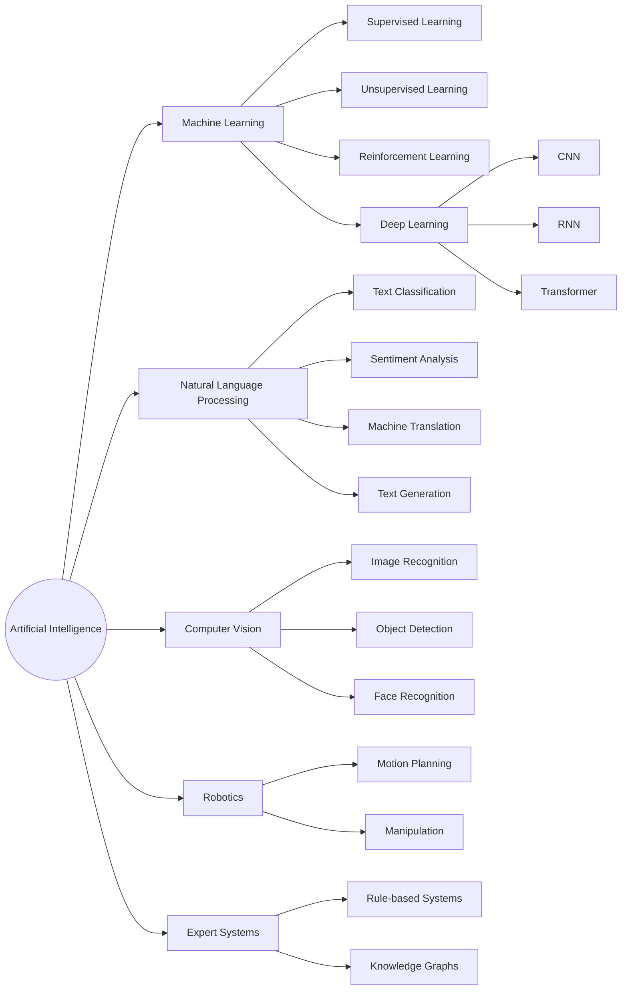
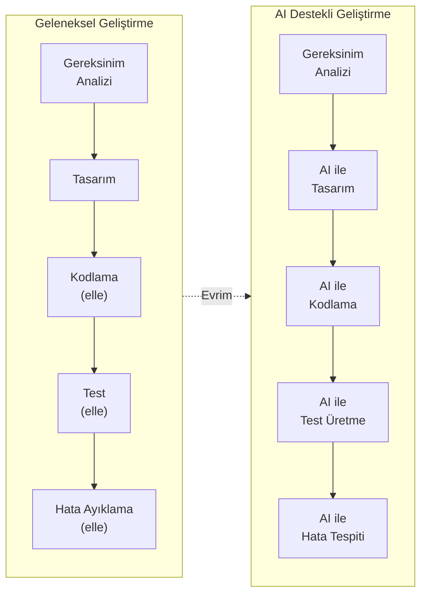
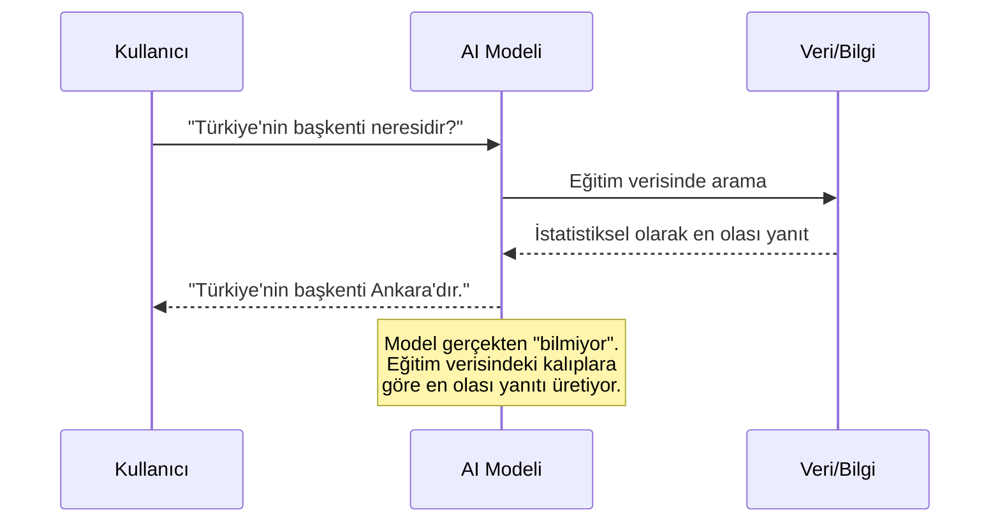

# Yapay Zeka Nedir?

Artificial Intelligence (yapay zeka), makinelerin insan zekasını taklit ederek öğrenme, problem çözme, karar verme ve dil anlama gibi görevleri yerine getirmesini sağlayan bir bilim dalıdır.

## Ön Koşullar

Yok. Bu, rehberin başlangıç noktasıdır.

---

## Yapay Zeka Günlük Hayatta

Yapay zekayı muhtemelen her gün kullanıyorsunuz, farkında olmasanız bile:

| Uygulama | Ne Yapıyor? | Kullandığı AI Türü |
|----------|-------------|---------------------|
| **Google Haritalar** | Trafik tahmini, en hızlı rota | Prediction (tahmin) |
| **Netflix / Spotify** | Size özel içerik önerisi | Recommendation (öneri sistemi) |
| **Siri / Google Asistan** | Sesli komut anlama | Speech Recognition (konuşma tanıma) |
| **Gmail** | Spam filtreleme, otomatik yanıt önerileri | Classification (sınıflandırma) |
| **ChatGPT / Claude** | Metin oluşturma, soru cevaplama | Natural Language Generation (doğal dil üretimi) |
| **Tesla Autopilot** | Otonom sürüş | Computer Vision (bilgisayarlı görü) |

---

## AI'nin Kısa Tarihçesi

---

## AI'nin Alt Dalları

Yapay zeka geniş bir şemsiye kavramdır. Altında birçok alt dal bulunur:

### Önemli alt dallar:

- **Machine Learning (makine öğrenimi):** Makinelerin veriden öğrenmesi
- **Deep Learning (derin öğrenme):** Çok katmanlı sinir ağları ile öğrenme
- **Natural Language Processing / NLP (doğal dil işleme):** İnsan dilini anlama ve üretme
- **Computer Vision (bilgisayarlı görü):** Görüntü ve video analizi
- **Robotics (robotik):** Fiziksel dünyada hareket ve etkileşim

> **Bu rehberin odağı:** NLP ve Deep Learning kesişiminde yer alan **Large Language Model (büyük dil modelleri)** konusu olacaktır. Çünkü Claude Code, bir LLM (Claude) üzerine inşa edilmiş bir araçtır.

---

## AI Ne Yapabilir, Ne Yapamaz?

### Yapabilir

- Büyük veri setlerinde örüntü (pattern) bulma
- Metin, kod, görsel üretme
- Dil çevirisi yapma
- Tahmin ve sınıflandırma
- İnsan dilini anlama ve yanıtlama
- Tekrarlayan görevleri otomatikleştirme

### Yapamaz (Henüz)

- Gerçek anlamda "anlamak" veya "düşünmek"
- Eğitim verisi dışında yeni bilgi "bilmek"
- %100 doğruluk garantisi vermek
- Yaratıcı bilinç veya duygusal zeka göstermek
- Etik kararları bağımsız olarak almak

> **Önemli:** AI modelleri, eğitim verilerindeki kalıpları istatistiksel olarak modeller. "Bilmek" veya "anlamak" yerine "tahmin etmek" daha doğru bir ifadedir.

---

## Neden Yazılımcılar İçin Önemli?

Yapay zeka, yazılım geliştirme sürecini kökten değiştiriyor:

**Somut etkiler:**

- **Kod yazma hızı:** AI destekli araçlarla 2-5x daha hızlı prototipleme
- **Bug tespiti:** Kod inceleme sürecinde AI ile otomatik hata yakalama
- **Dokümantasyon:** Otomatik API dokümantasyonu ve README üretimi
- **Test:** AI ile test senaryosu ve test kodu üretimi
- **Refactoring:** Büyük ölçekli kod yeniden yapılandırma önerileri

---

## Örnek: AI Bir Soruyu Nasıl Yanıtlar?

Basitleştirilmiş bir akış:

Bu basit örnek bile önemli bir gerçeği gösterir: AI modelleri bir veritabanından bilgi çekmez. Eğitim sırasında öğrendiği istatistiksel kalıplara göre en olası devam eden metni üretir.

---

## Özet

| Kavram | Açıklama |
|--------|----------|
| **Artificial Intelligence** | Makinelerin insan zekasını taklit etmesi |
| **Machine Learning** | Veriden öğrenme yeteneği |
| **Deep Learning** | Çok katmanlı sinir ağları |
| **NLP** | İnsan dilini anlama ve üretme |
| **Model** | Veriden öğrenilmiş kalıpları saklayan matematiksel yapı |

---

## Sonraki Adım

Yapay zekanın ne olduğunu anladık. Şimdi Machine Learning ve Deep Learning kavramlarını daha derinlemesine inceleyelim:

→ [Machine Learning ve Deep Learning](./02-makine-ogrenimi-ve-derin-ogrenme.md)
