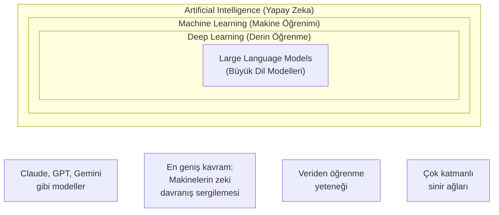
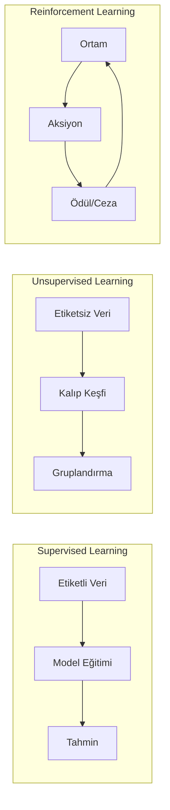
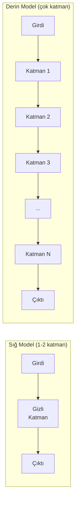
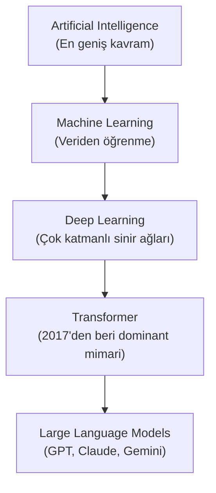

# Machine Learning ve Deep Learning

Machine Learning (makine öğrenimi), yapay zekanın bir alt dalıdır ve makinelerin açıkça programlanmadan veriden öğrenmesini sağlar. Deep Learning (derin öğrenme) ise Machine Learning'in bir alt kümesidir ve çok katmanlı sinir ağları kullanarak çalışır.

## Ön Koşullar

- [Yapay Zeka Nedir?](./01-yapay-zeka-nedir.md)

---

## AI, ML ve DL İlişkisi

Bu üç kavram iç içe geçmiş kümeler gibidir:



> **Önemli:** Tüm Deep Learning, Machine Learning'dir. Tüm Machine Learning, AI'dır. Ama bunun tersi doğru değildir. Örneğin, kural tabanlı bir expert system (uzman sistem) AI'dır ama ML değildir.

---

## Machine Learning Türleri

### 1. Supervised Learning (Denetimli Öğrenme)

Modele hem girdi hem de beklenen çıktı (label / etiket) verilir. Model, girdi-çıktı arasındaki ilişkiyi öğrenir.

```
Girdi: "Bu ürün harika!" → Çıktı: Pozitif
Girdi: "Çok kötü bir deneyim" → Çıktı: Negatif
Girdi: "Fiyatı uygun" → Çıktı: Pozitif
```

**Kullanım alanları:**
- Spam e-posta tespiti
- Hastalık teşhisi
- Fiyat tahmini
- Müşteri segmentasyonu

### 2. Unsupervised Learning (Denetimsiz Öğrenme)

Modele sadece girdi verilir, etiket yoktur. Model, verideki gizli kalıpları kendisi keşfeder.

```
Girdi: [Müşteri verileri] → Çıktı: 3 farklı müşteri grubu keşfedildi
```

**Kullanım alanları:**
- Müşteri gruplandırma (Clustering)
- Anomali tespiti
- Boyut indirgeme

### 3. Reinforcement Learning (Takviyeli Öğrenme)

Model, deneme-yanılma yoluyla öğrenir. Doğru aksiyonlar ödüllendirilir, yanlışlar cezalandırılır.

```
Eylem: Satranç taşını hareket ettir → Sonuç: Kazandı → Ödül: +1
Eylem: Satranç taşını hareket ettir → Sonuç: Kaybetti → Ceza: -1
```

**Kullanım alanları:**
- Oyun oynama (AlphaGo, Atari)
- Robot kontrolü
- LLM eğitiminde RLHF (Reinforcement Learning from Human Feedback)



---

## Deep Learning Nedir?

Deep Learning, Machine Learning'in çok katmanlı Artificial Neural Network (yapay sinir ağı) kullanan özel bir alt dalıdır. "Deep" (derin) kelimesi, sinir ağındaki katman sayısının çokluğunu ifade eder.

### Neden "Deep"?



Her katman, verinin farklı bir soyutlama seviyesini öğrenir:

| Katman | Bir Yüz Tanıma Modelinde Öğrenilen |
|--------|--------------------------------------|
| Katman 1 | Kenarlar ve çizgiler |
| Katman 2 | Basit şekiller (daire, üçgen) |
| Katman 3 | Yüz parçaları (göz, burun, ağız) |
| Katman 4 | Tam yüz yapıları |
| Katman N | Kişi kimliği |

### Deep Learning'in Popüler Mimarileri

| Mimari | Tam Adı | Ne İçin Kullanılır? | Örnek |
|--------|---------|---------------------|-------|
| **CNN** | Convolutional Neural Network | Görüntü işleme | Yüz tanıma, nesne tespiti |
| **RNN** | Recurrent Neural Network | Sıralı veri (zaman serileri) | Konuşma tanıma |
| **LSTM** | Long Short-Term Memory | Uzun sıralı veri | Metin üretimi (eski yöntem) |
| **Transformer** | Transformer | Metin, görüntü, ses | GPT, Claude, Gemini, BERT |
| **GAN** | Generative Adversarial Network | İçerik üretimi | Görsel üretimi, Deepfake |
| **Diffusion** | Diffusion Models | Görsel üretimi | DALL-E, Midjourney, Stable Diffusion |

> **Kilit nokta:** 2017'den bu yana **Transformer** mimarisi, NLP alanını domine ediyor. Günümüzdeki tüm büyük dil modelleri (GPT, Claude, Gemini) Transformer tabanlıdır. Bu mimariyi [Bölüm 04](./04-sinir-aglari-ve-transformer.md)'te detaylı inceleyeceğiz.

---

## ML vs DL Karşılaştırma

| Kriter | Machine Learning | Deep Learning |
|--------|------------------|---------------|
| **Veri ihtiyacı** | Az-orta miktarda veri yeterli | Çok büyük veri setleri gerekli |
| **Donanım** | CPU yeterli olabilir | GPU/TPU gerekli |
| **Feature Engineering** | Manuel özellik çıkarımı gerekli | Otomatik özellik öğrenimi |
| **Yorumlanabilirlik** | Genellikle daha kolay | "Black box" (kara kutu) olabilir |
| **Eğitim süresi** | Dakikalar-saatler | Saatler-haftalar-aylar |
| **Doğruluk** | Basit problemlerde yeterli | Karmaşık problemlerde üstün |

---

## Gerçek Dünya Örneği: E-Posta Spam Filtresi

### ML Yaklaşımı (Supervised Learning)

```python
# Basitleştirilmiş örnek - gerçek kodda scikit-learn kullanılır
egitim_verisi = [
    ("Bedava iPhone kazandınız!", "spam"),
    ("Toplantı yarın saat 10'da", "spam_degil"),
    ("Hemen tıklayın, %90 indirim!", "spam"),
    ("Proje raporu ekte", "spam_degil"),
]

# Model bu örneklerden kalıpları öğrenir:
# - "Bedava", "tıklayın", "indirim" → spam olma olasılığı yüksek
# - "toplantı", "proje", "rapor" → spam olmama olasılığı yüksek
```

### DL Yaklaşımı (Transformer)

```python
# Basitleştirilmiş örnek
# Transformer modeli, kelimelerin bağlamını da anlayabilir:

metin = "Apple hisselerinde büyük düşüş!"
# DL model "Apple"ın bir meyve değil, şirket olduğunu
# bağlamdan (hisse, düşüş) çıkarabilir.
```

---

## Neden Önemli?

Claude Code'un arkasındaki Claude modeli:

1. **Deep Learning** kullanılarak eğitilmiştir
2. **Transformer** mimarisi üzerine inşa edilmiştir
3. **Supervised Learning** + **RLHF** (Reinforcement Learning from Human Feedback) ile ince ayar yapılmıştır
4. Trilyonlarca Token (kelime parçası) üzerinde eğitilmiştir

Bu kavramları anlamak, Claude Code'un neden bazı şeyleri çok iyi yapıp bazılarında hata yaptığını anlamanızı sağlayacaktır.

---

## Özet



---

## Sonraki Adım

Machine Learning ve Deep Learning'in ne olduğunu anladık. Şimdi LLM'lerin temelini oluşturan Natural Language Processing konusuna geçelim:

→ [Natural Language Processing](./03-dogal-dil-isleme.md)
