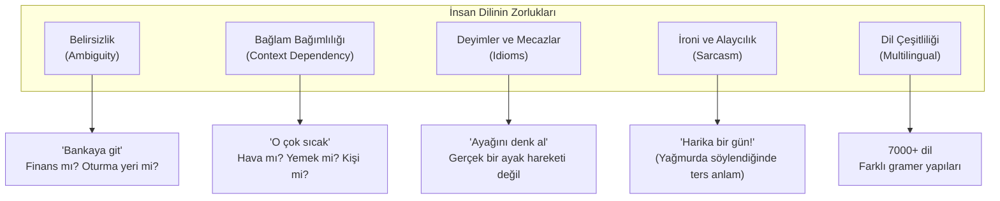
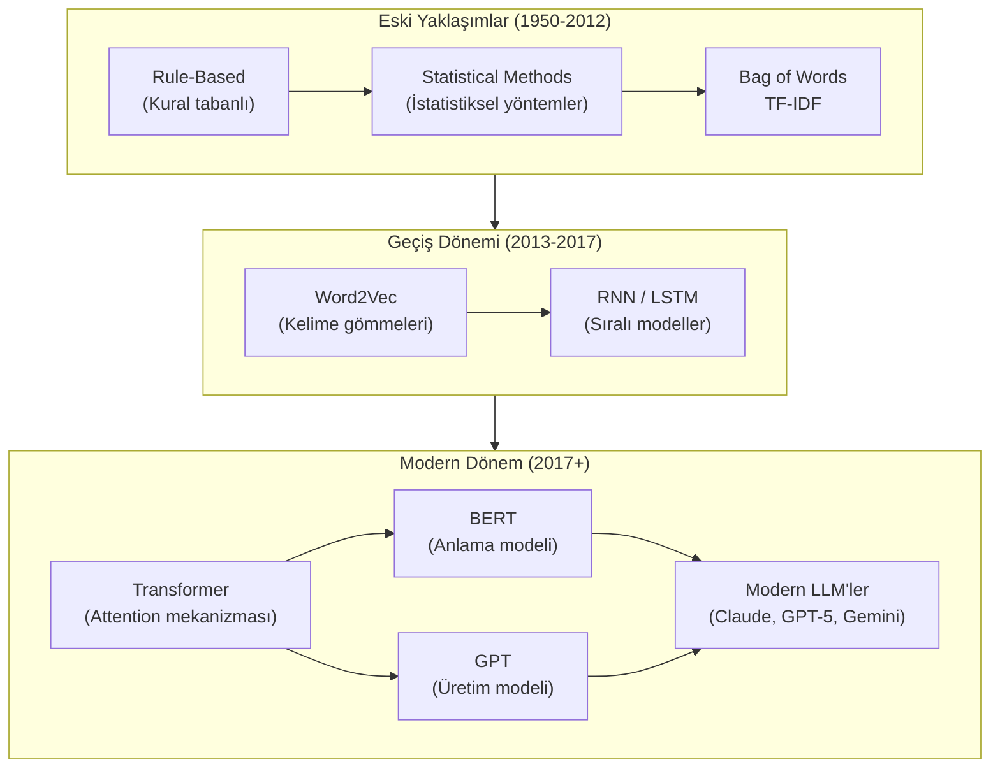
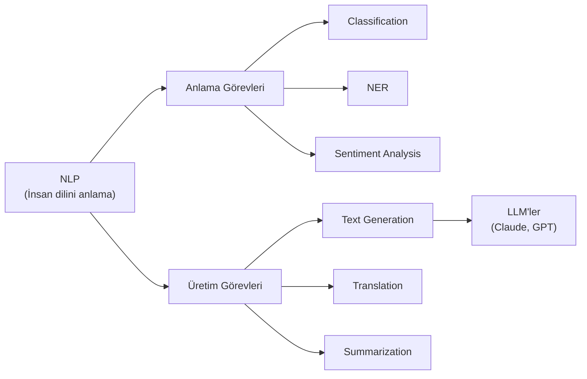

# Natural Language Processing (Doğal Dil İşleme)

Natural Language Processing (NLP), bilgisayarların insan dilini anlamasını, yorumlamasını ve üretmesini sağlayan AI alt dalıdır. ChatGPT, Claude gibi araçların arkasındaki temel teknolojidir.

## Ön Koşullar

- [Yapay Zeka Nedir?](./01-yapay-zeka-nedir.md)
- [Machine Learning ve Deep Learning](./02-makine-ogrenimi-ve-derin-ogrenme.md)

---

## NLP Neden Zor?

İnsan dili, bilgisayarlar için son derece karmaşık bir sistemdir:



---

## NLP'nin Temel Görevleri

### 1. Text Classification (Metin Sınıflandırma)

Metni önceden tanımlı kategorilere ayırma.

```
Girdi: "Bu film muhteşemdi, kesinlikle tavsiye ederim!"
Çıktı: Pozitif (Sentiment Analysis)

Girdi: "Siparişim 3 haftadır gelmedi, çok kızgınım"
Çıktı: Negatif (Sentiment Analysis)

Girdi: "Meeting at 3pm regarding Q4 budget"
Çıktı: İş / Toplantı (Topic Classification)
```

### 2. Named Entity Recognition / NER (Varlık Tanıma)

Metindeki özel isimleri, tarihleri, yerleri tanımlama.

```
Metin: "Ahmet Bey, 15 Mart 2026'da İstanbul'daki Anthropic toplantısına katılacak."

Sonuç:
  - Ahmet Bey → KİŞİ
  - 15 Mart 2026 → TARİH
  - İstanbul → YER
  - Anthropic → ŞİRKET
```

### 3. Machine Translation (Makine Çevirisi)

Bir dilden diğerine otomatik çeviri.

```
Girdi (EN): "The model generates text by predicting the next token."
Çıktı (TR): "Model, bir sonraki token'ı tahmin ederek metin üretir."
```

### 4. Text Generation (Metin Üretimi)

Verilen bir başlangıç metninden devam eden metin üretme. **LLM'lerin temel yeteneği budur.**

```
Girdi: "Yapay zekanın yazılım geliştirmeye etkisi"
Çıktı: "Yapay zeka, yazılım geliştirme süreçlerini kökten değiştirmektedir.
        Kod üretimi, test otomasyonu ve hata tespiti gibi alanlarda..."
```

### 5. Question Answering (Soru Cevaplama)

Verilen bağlamdan soruları yanıtlama.

```
Bağlam: "Claude 4.6 Opus, Anthropic tarafından Şubat 2026'da yayınlandı.
          200K token context window'a sahiptir."

Soru: "Claude 4.6'nın context window boyutu nedir?"
Cevap: "200K token"
```

### 6. Summarization (Özetleme)

Uzun metinleri kısa özetlere dönüştürme.

```
Girdi: [500 satırlık teknik doküman]
Çıktı: "Bu doküman, mikroservis mimarisinden monolit yapıya geçiş sürecini
        anlatmaktadır. 3 aşamalı migrasyon planı önerilmektedir..."
```

---

## NLP'nin Evrimi



### Eski yöntemlerin sorunları:

- **Kural tabanlı:** Her dil kuralını elle yazmak gerekiyordu → ölçeklenemez
- **İstatistiksel:** Kelimelerin bağlamını anlayamıyordu
- **RNN/LSTM:** Uzun metinlerde bağlamı kaybediyordu

### Transformer'ın getirdiği çözüm:

- Tüm kelimeleri aynı anda işleyebilme (paralel hesaplama)
- Uzak kelimelere arasındaki ilişkileri yakalama (Attention)
- Çok büyük veri setleriyle eğitilebilme (ölçeklenebilirlik)

---

## NLP ve Yazılım Geliştirme

NLP, yazılım geliştirmede doğrudan kullanılan bir teknolojidir:

| Kullanım Alanı | NLP Görevi | Örnek Araç |
|----------------|-----------|-------------|
| **Kod üretimi** | Text Generation | Claude Code, GitHub Copilot |
| **Bug tespiti** | Text Classification | Otomatik hata sınıflandırma |
| **Code Review** | Summarization + Classification | AI destekli PR inceleme |
| **Dokümantasyon** | Text Generation + Summarization | Otomatik README üretimi |
| **Gereksinim analizi** | NER + Classification | Kullanıcı hikayelerinden özellik çıkarımı |
| **Arama** | Semantic Search | Kod tabanında anlamsal arama |

### Örnek: Claude Code ile NLP Uygulaması

```bash
# Claude Code'a bir NLP görevi verme
claude "Bu projdeki tüm API endpoint'lerini bul ve her birinin
        ne yaptığını 1 cümleyle özetle"

# Claude Code şunları yapar:
# 1. Kod tabanını tarar (dosya okuma)
# 2. Endpoint kalıplarını tanır (pattern recognition)
# 3. Her endpoint'in işlevini anlar (code understanding)
# 4. Türkçe özet üretir (text generation)
```

---

## Temel NLP Kavramları

| Kavram | İngilizce | Açıklama |
|--------|-----------|----------|
| **Corpus** | Corpus (Derlem) | Model eğitiminde kullanılan büyük metin koleksiyonu |
| **Tokenization** | Tokenization (Belirteçleme) | Metni küçük parçalara (token) ayırma |
| **Embedding** | Embedding (Gömme) | Kelimeleri sayısal vektörlere dönüştürme |
| **Attention** | Attention (Dikkat) | Modelin metnin hangi kısımlarına odaklanacağını belirlemesi |
| **Inference** | Inference (Çıkarım) | Eğitilmiş modelden yanıt alma süreci |
| **Prompt** | Prompt (İstem) | Modele verilen girdi/talimat |
| **Completion** | Completion (Tamamlama) | Modelin ürettiği yanıt |

---

## Özet



NLP, yapay zekanın insan diliyle köprüsüdür. Claude Code gibi araçlar, NLP'nin en gelişmiş uygulamalarından biridir: kodunuzu okur, anlar ve yeni kod üretir.

---

## Sonraki Adım

NLP'nin temellerini anladık. Şimdi bunun arkasındaki teknik altyapıyı - sinir ağları ve Transformer mimarisini - inceleyelim:

→ [Sinir Ağları ve Transformer](./04-sinir-aglari-ve-transformer.md)
