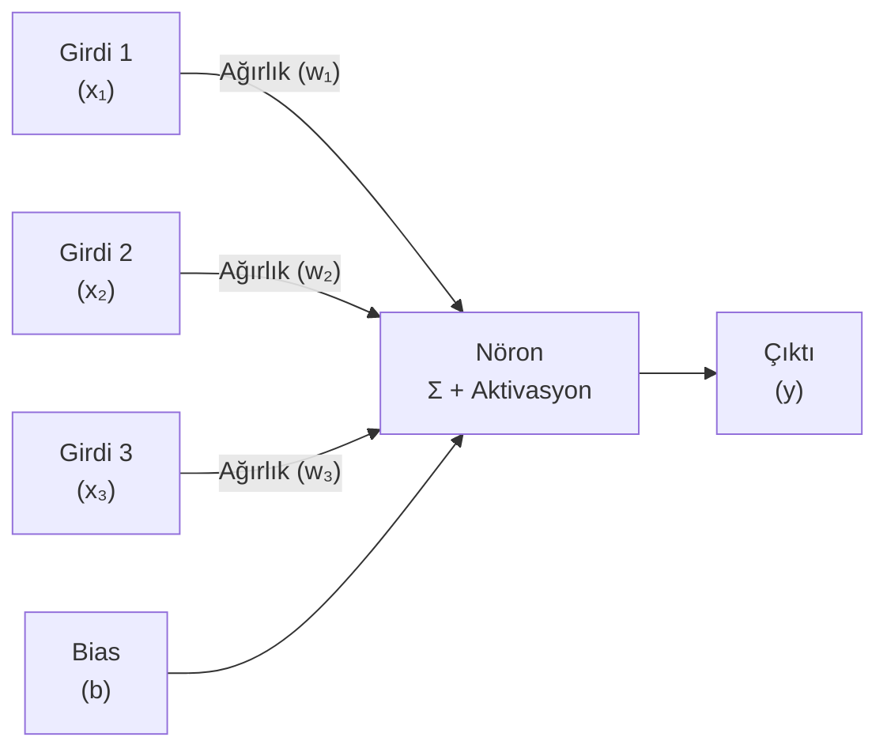
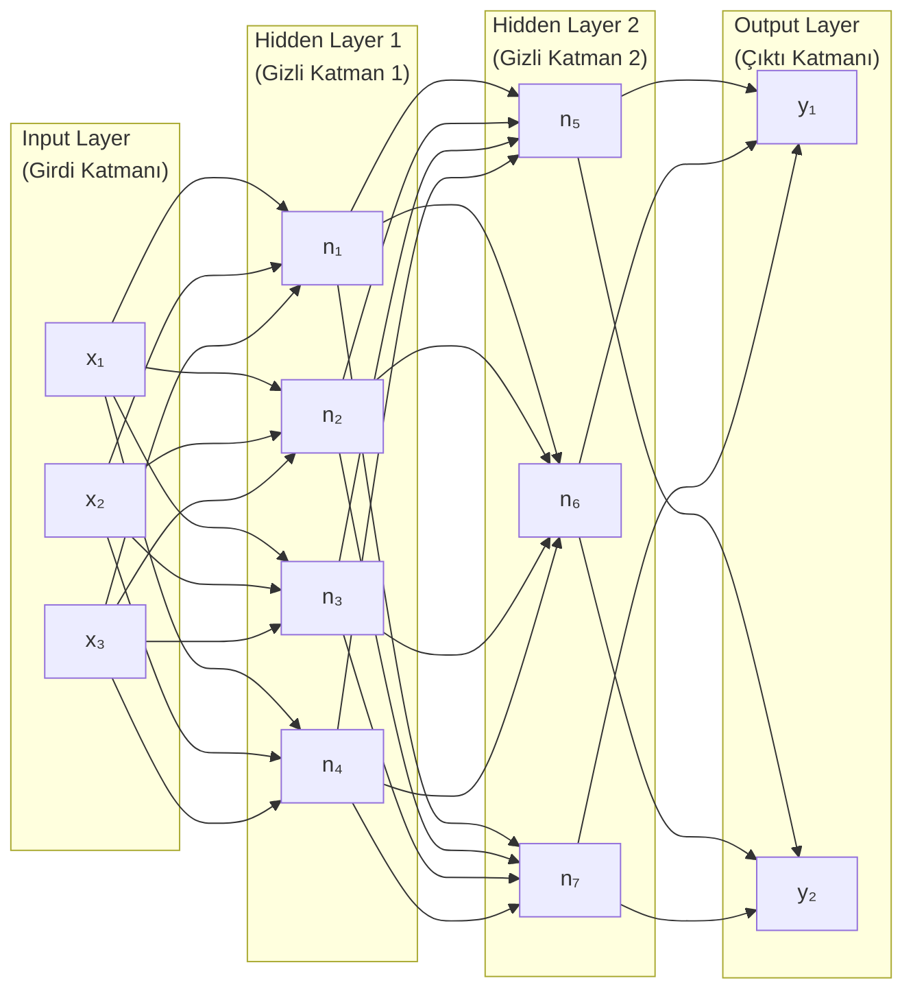
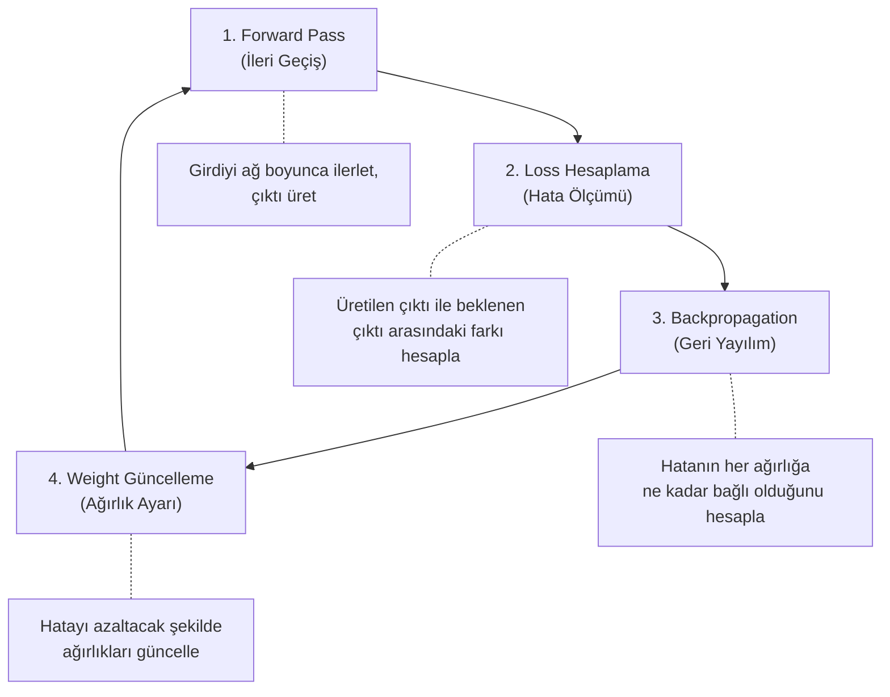
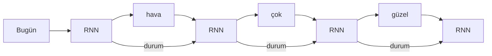
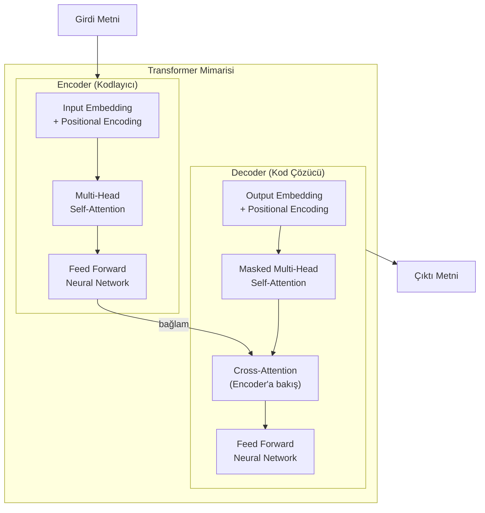
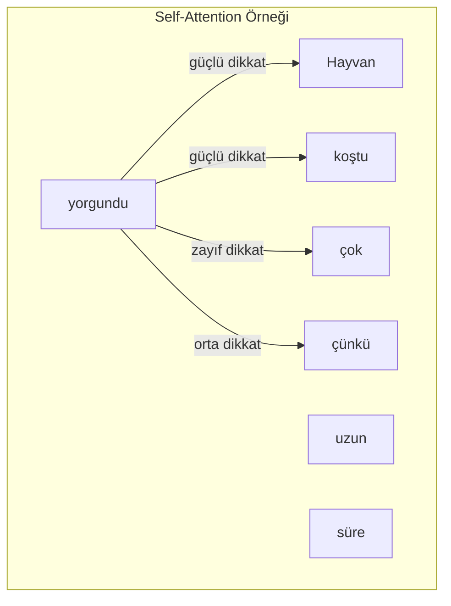
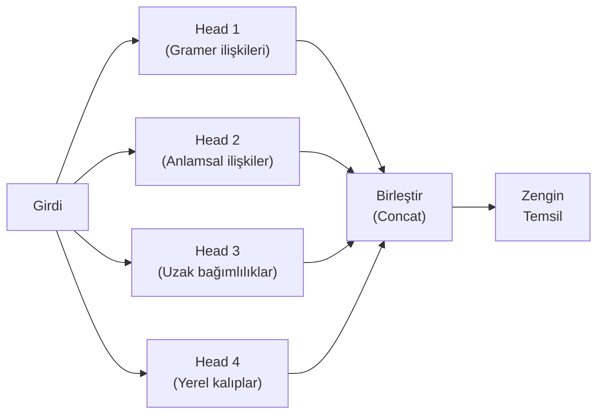
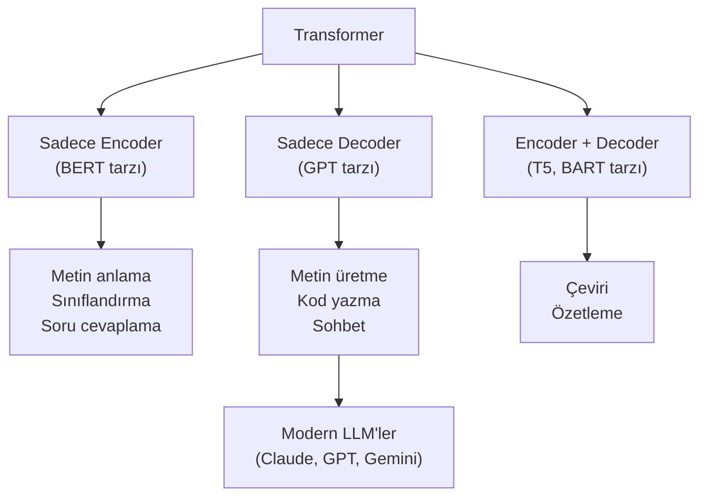
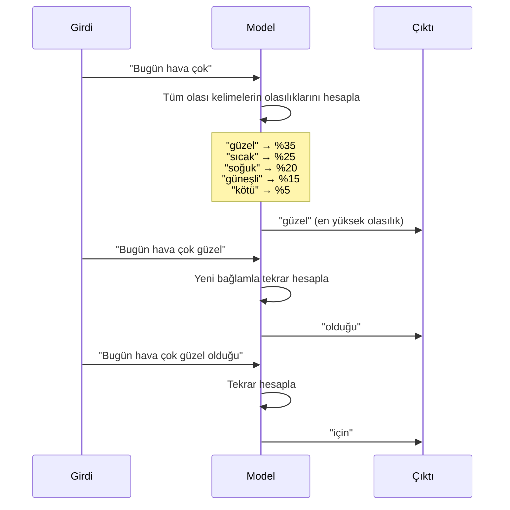
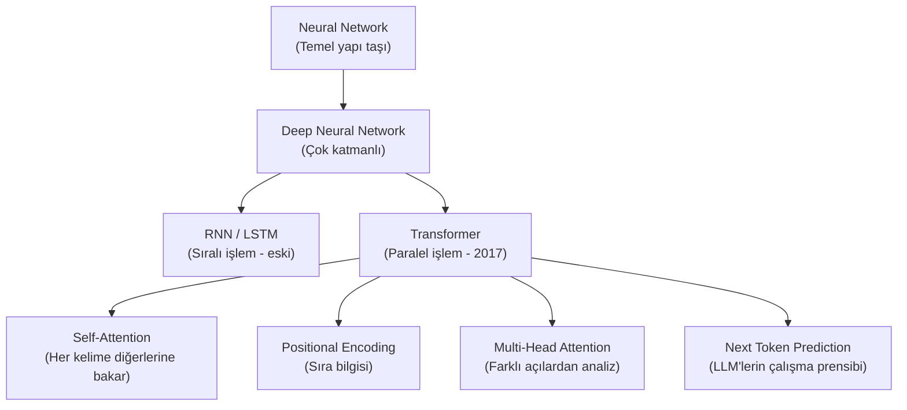

# Sinir Ağları ve Transformer Mimarisi

Artificial Neural Network (yapay sinir ağı), insan beynindeki nöronlardan esinlenerek tasarlanmış matematiksel bir modeldir. Transformer ise 2017'de ortaya çıkan ve günümüz LLM'lerinin temelini oluşturan devrim niteliğinde bir sinir ağı mimarisidir.

## Ön Koşullar

- [Yapay Zeka Nedir?](./01-yapay-zeka-nedir.md)
- [Machine Learning ve Deep Learning](./02-makine-ogrenimi-ve-derin-ogrenme.md)
- [Natural Language Processing](./03-dogal-dil-isleme.md)

---

## Neural Network (Sinir Ağı) Nedir?

Bir sinir ağı, birbirine bağlı "nöron" adı verilen hesaplama birimlerinden oluşur. Her nöron girdileri alır, bir işlem uygular ve çıktı üretir.

### Tek Bir Nöron



**Formül:** `y = aktivasyon(w₁·x₁ + w₂·x₂ + w₃·x₃ + b)`

- **Weight (ağırlık):** Her girdinin ne kadar önemli olduğunu belirler
- **Bias (önyargı):** Modelin esnekliğini artıran sabit değer
- **Activation Function (aktivasyon fonksiyonu):** Çıktıyı belirli bir aralığa sıkıştırır (ReLU, Sigmoid, Tanh)

### Çok Katmanlı Sinir Ağı



### Eğitim Süreci



Bu döngü, model yeterli doğruluğa ulaşana kadar milyonlarca kez tekrarlanır.

---

## Transformer Öncesi: RNN ve LSTM

Transformer'dan önce, metin işleme için RNN (Recurrent Neural Network) ve LSTM (Long Short-Term Memory) kullanılıyordu.

### RNN'in Sorunu



**Sorunlar:**
- **Sıralı işlem:** Kelimeler birer birer işlenir → yavaş
- **Vanishing Gradient (kaybolan gradyan):** Uzun cümlelerde başlangıçtaki kelimelerin etkisi kaybolur
- **Paralelleştirilemez:** GPU'lardan tam verim alınamaz

**Örnek sorun:**
```
"İstanbul'da doğdum, 20 yıl yaşadım, sonra Ankara'ya taşındım,
 orada 5 yıl kaldım, şimdi tekrar ___ dönmek istiyorum."

RNN, "İstanbul" kelimesini bu kadar uzak mesafede hatırlayamayabilir.
```

---

## Transformer Mimarisi

2017'de Google araştırmacıları tarafından yayınlanan **"Attention Is All You Need"** makalesi, NLP alanını kökten değiştirdi.

### Transformer'ın Temel Bileşenleri



### Anahtar Kavramlar

#### 1. Embedding (Gömme)

Kelimeleri sayısal vektörlere dönüştürür. Anlamca yakın kelimeler, vektör uzayında birbirine yakın olur.

```
"kral"   → [0.2, 0.8, 0.1, ...]
"kraliçe" → [0.3, 0.7, 0.2, ...]  ← "kral"a yakın
"araba"  → [0.9, 0.1, 0.6, ...]  ← "kral"dan uzak

Ünlü formül: kral - erkek + kadın ≈ kraliçe
```

#### 2. Positional Encoding (Konum Kodlama)

Transformer kelimeleri aynı anda işlediği için, sıra bilgisini kaybeder. Positional Encoding, her kelimeye konum bilgisi ekler.

```
"Köpek kediye saldırdı"  vs  "Kedi köpeğe saldırdı"
→ Positional Encoding olmazsa ikisi aynı anlama gelir
```

#### 3. Self-Attention (Öz-Dikkat) - En Önemli Kavram

Self-Attention, bir cümledeki her kelimenin diğer tüm kelimelere ne kadar "dikkat etmesi" gerektiğini hesaplar.



**"yorgundu" kelimesi hangi kelimelere dikkat eder?**
- "Hayvan" → güçlü (ne yorgun?)
- "koştu" → güçlü (neden yorgun?)
- "uzun süre" → orta (ne kadar koştu?)
- "çok" → zayıf (sadece pekiştirme)

#### 4. Multi-Head Attention (Çok Başlı Dikkat)

Tek bir Attention yerine, birden fazla Attention hesaplaması paralel olarak yapılır. Her "head" (baş), metnin farklı yönlerine odaklanır.



---

## GPT vs BERT: İki Farklı Kullanım

Transformer mimarisi iki farklı şekilde kullanılır:



| Özellik | BERT (Encoder) | GPT (Decoder) |
|---------|----------------|---------------|
| **Yön** | Çift yönlü (Bidirectional) | Tek yönlü (Left-to-right) |
| **Görev** | Anlama | Üretme |
| **Eğitim** | Maskelenmiş kelime tahmini | Sonraki kelime tahmini |
| **Kullanım** | Arama, sınıflandırma | Chatbot, kod yazma |

> **Günümüz LLM'leri (Claude, GPT, Gemini)** Decoder-only Transformer mimarisini kullanır. Temel görevleri: verilen metnin devamını tahmin etmek.

---

## Next Token Prediction (Sonraki Token Tahmini)

Modern LLM'lerin çalışma prensibi aslında çok basittir: **bir sonraki token'ı tahmin et.**



Bu süreç, model bir bitirme sinyali (end token) üretene kadar devam eder. Her adımda tüm önceki metin bağlam olarak kullanılır.

---

## Parameter (Parametre) ve Model Boyutu

Bir modelin "boyutu", sahip olduğu parametre sayısıyla ölçülür. Parametreler, eğitim sırasında ayarlanan ağırlık (weight) ve bias değerleridir.

| Model | Parametre Sayısı | Yıl |
|-------|-----------------|------|
| GPT-1 | 117 Milyon | 2018 |
| GPT-2 | 1.5 Milyar | 2019 |
| GPT-3 | 175 Milyar | 2020 |
| GPT-4 | ~1.8 Trilyon (tahmin) | 2023 |
| Claude 4.6 Opus | Açıklanmadı | 2026 |
| Llama 4 Maverick | 400 Milyar | 2025 |
| DeepSeek-V3.2 | 671 Milyar (37B aktif - MoE) | 2025 |

> **MoE (Mixture of Experts):** DeepSeek gibi bazı modeller, 671 milyar parametreye sahip olmasına rağmen her sorguda sadece 37 milyarını aktif kullanır. Bu, verimliliği artırır.

---

## Özet



| Kavram | Açıklama |
|--------|----------|
| **Neural Network** | Nöronlardan oluşan hesaplama ağı |
| **Weight** | Bağlantıların gücünü belirleyen değerler |
| **Transformer** | 2017'de çıkan, Attention tabanlı mimari |
| **Self-Attention** | Her kelimenin diğer kelimelere dikkat etmesi |
| **Next Token Prediction** | LLM'lerin temel çalışma prensibi |
| **Parameter** | Modelin öğrendiği ayarlanabilir değerler |

---

## Sonraki Adım

Sinir ağları ve Transformer mimarisini anladık. Şimdi tüm bu kavramları bir araya getiren kapsamlı bir sözlüğe göz atalım:

→ [Temel Kavramlar Sözlüğü](./05-temel-kavramlar-sozlugu.md)
