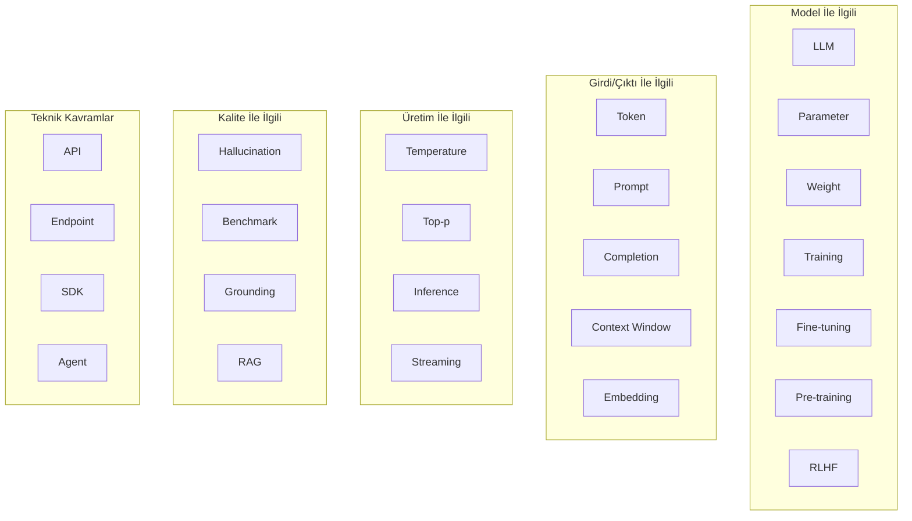
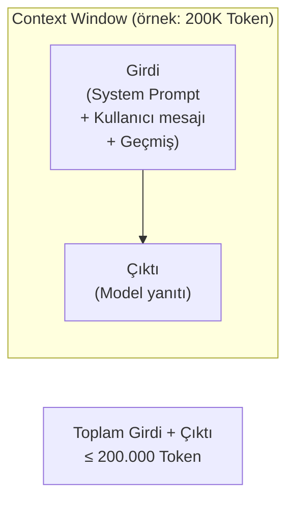
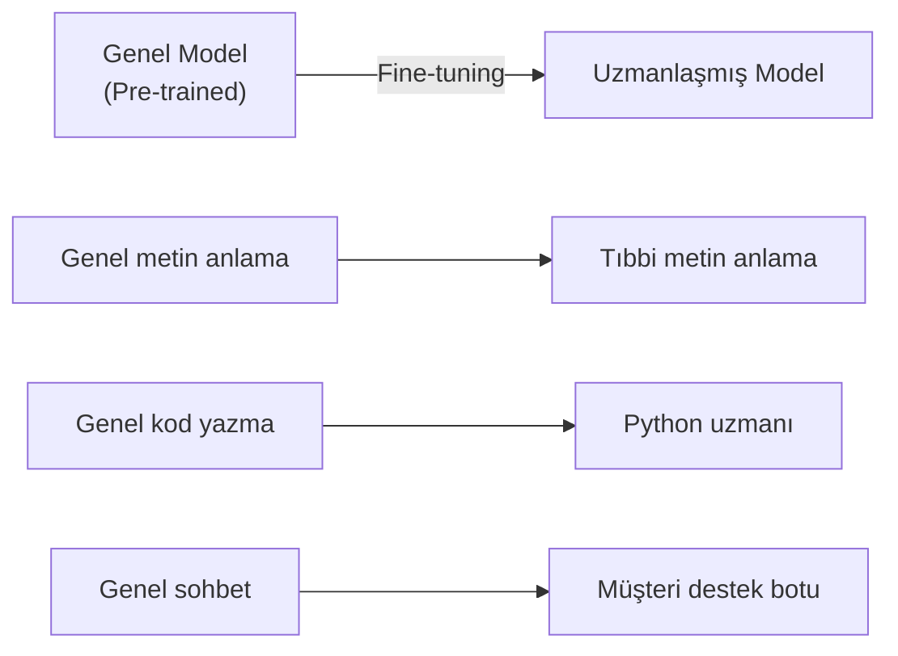
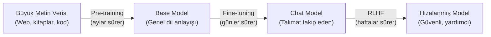
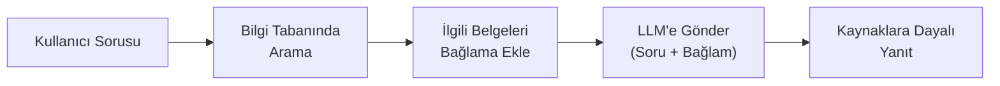
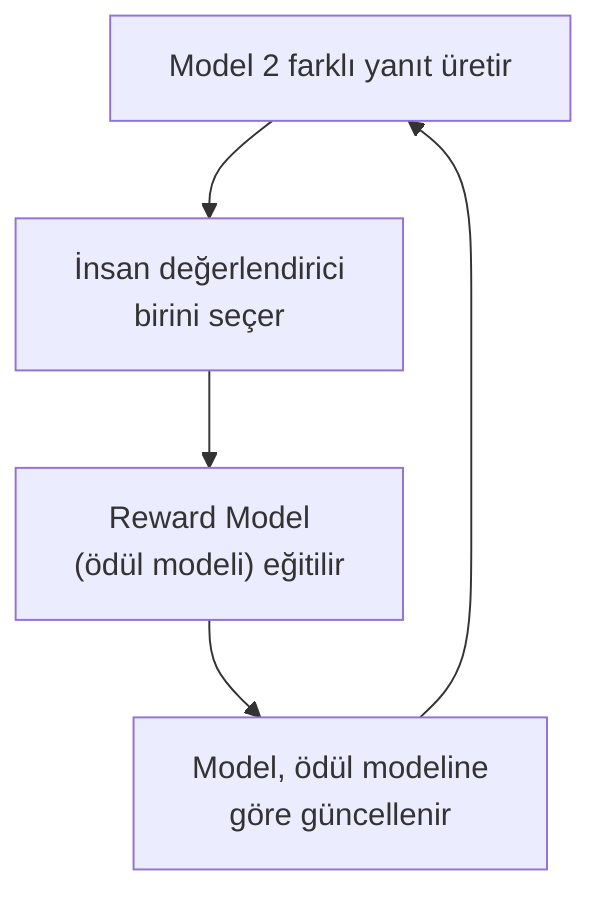

# Temel Kavramlar Sözlüğü

Bu sözlük, yapay zeka ve LLM dünyasında sıkça karşılaşacağınız terimleri alfabetik sırayla açıklar. Her terim İngilizce adıyla listelenmiş, Türkçe karşılığı parantez içinde verilmiştir.

## Ön Koşullar

- [Yapay Zeka Nedir?](./01-yapay-zeka-nedir.md)
- [Machine Learning ve Deep Learning](./02-makine-ogrenimi-ve-derin-ogrenme.md)
- [Natural Language Processing](./03-dogal-dil-isleme.md)
- [Sinir Ağları ve Transformer](./04-sinir-aglari-ve-transformer.md)

---

## Kavramlar Haritası



---

## A

### Agent (Ajan)
Bir görevi bağımsız olarak planlayıp, yürütüp, sonucunu değerlendirerek iteratif şekilde tamamlayabilen AI sistemi. Claude Code bir AI Agent'tır.

```
Geleneksel AI: Kullanıcı sorar → AI yanıtlar (tek adım)
AI Agent: Kullanıcı görev verir → Agent planlar → çalıştırır → sonucu kontrol eder → düzeltir → teslim eder (çok adım)
```

### API (Application Programming Interface)
Bir yazılımın başka yazılımlar tarafından kullanılmasını sağlayan arayüz. Claude API, Claude modellerine programatik erişim sağlar.

```bash
# Örnek: Claude API çağrısı
curl https://api.anthropic.com/v1/messages \
  -H "x-api-key: $API_KEY" \
  -d '{"model": "claude-4.6-opus", "messages": [{"role": "user", "content": "Merhaba"}]}'
```

### Attention (Dikkat Mekanizması)
Transformer mimarisinin temel bileşeni. Bir cümledeki her kelimenin, diğer tüm kelimelere ne kadar "dikkat etmesi" gerektiğini hesaplar.

---

## B

### Backpropagation (Geri Yayılım)
Sinir ağlarının eğitim algoritması. Çıktıdaki hatayı geriye doğru yayarak her ağırlığın güncellenmesi gereken miktarı hesaplar.

### Batch Size (Yığın Boyutu)
Eğitim sırasında aynı anda işlenen veri örneği sayısı. Daha büyük batch → daha hızlı ama daha çok bellek gerektirir.

### Benchmark (Karşılaştırma Ölçütü)
AI modellerinin performansını ölçmek ve karşılaştırmak için kullanılan standart test setleri.

| Benchmark | Ne Ölçer? | Örnek Soru |
|-----------|-----------|------------|
| **MMLU** | Genel bilgi (57 konu) | Fizik, tarih, hukuk soruları |
| **HumanEval** | Kod yazma yeteneği | Python fonksiyon tamamlama |
| **SWE-bench** | Gerçek yazılım mühendisliği | GitHub issue çözme |
| **MATH-500** | Matematik problem çözme | Cebirden ileri matematiğe |
| **GPQA** | Uzman seviyesi bilim soruları | PhD düzeyi fizik, kimya |

---

## C

### Classification (Sınıflandırma)
Veriyi önceden tanımlı kategorilere ayırma görevi.

### Completion (Tamamlama)
Modelin bir Prompt'a verdiği yanıt. "Response" (yanıt) ile eş anlamlıdır.

### Context Window (Bağlam Penceresi)
Modelin tek seferde işleyebildiği maksimum Token sayısı. Giriş ve çıkış birlikte hesaplanır.



| Model | Context Window | Sayfa Karşılığı |
|-------|---------------|-----------------|
| Claude 4.6 Opus | 200K Token | ~500 sayfa |
| GPT-5.4 | 256K Token | ~640 sayfa |
| Gemini 3.1 Pro | 2M Token | ~5.000 sayfa |
| Llama 4 Scout | 10M Token | ~25.000 sayfa |

### Corpus (Derlem)
Model eğitiminde kullanılan büyük metin koleksiyonu. Kitaplar, web sayfaları, akademik makaleler vb.

---

## D

### Dataset (Veri Seti)
Model eğitimi veya değerlendirmesi için hazırlanmış yapılandırılmış veri koleksiyonu.

### Deep Learning (Derin Öğrenme)
Çok katmanlı yapay sinir ağları kullanan Machine Learning alt dalı. Detaylar için → [ML ve DL](./02-makine-ogrenimi-ve-derin-ogrenme.md)

---

## E

### Embedding (Gömme / Vektör Temsili)
Metin, görüntü veya diğer verileri sabit boyutlu sayısal vektörlere dönüştürme işlemi. Semantik benzerliği ölçmeye yarar.

```
"kedi"    → [0.2, 0.8, 0.1, 0.4, ...]
"köpek"   → [0.3, 0.7, 0.2, 0.5, ...]  ← "kedi"ye yakın (her ikisi de hayvan)
"araba"   → [0.9, 0.1, 0.6, 0.2, ...]  ← "kedi"den uzak
```

**Kullanım alanları:**
- Semantik arama (anlamsal arama)
- Benzer belge bulma
- Öneri sistemleri
- RAG (Retrieval-Augmented Generation)

### Epoch (Dönem)
Tüm eğitim verisinin model tarafından bir kez tamamen işlenmesi. Eğitim genellikle birden fazla epoch sürer.

### Extended Thinking (Genişletilmiş Düşünme)
Modelin yanıt vermeden önce "düşünme" adımları gerçekleştirmesi. Claude 4.5+ modellerinde mevcut. Karmaşık problemlerde doğruluğu artırır.

---

## F

### Few-Shot Learning (Az Örnekle Öğrenme)
Modele birkaç örnek vererek görev tanımlama tekniği.

```
Prompt:
"Cümleleri pozitif/negatif olarak sınıfla:
 - 'Bu film harika!' → Pozitif
 - 'Çok sıkıcıydı' → Negatif
 - 'Kesinlikle tavsiye ederim' → ?"

Model Yanıtı: "Pozitif"
```

### Fine-tuning (İnce Ayar)
Önceden eğitilmiş bir modeli, belirli bir görev veya alan için ek veriyle yeniden eğitme süreci.



---

## G

### GPU (Graphics Processing Unit)
Grafik işlem birimi. Deep Learning eğitimi için kritik donanım. Paralel hesaplama yeteneği sayesinde AI eğitimini hızlandırır.

### Grounding (Dayanak/Temel Oluşturma)
Modelin yanıtlarını gerçek verilere, kaynaklara dayandırma süreci. Hallucination'ı azaltmak için kullanılır.

---

## H

### Hallucination (Halüsinasyon)
Modelin gerçekte olmayan bilgileri son derece güvenli bir şekilde "uydurması". AI'nin en büyük sorunlarından biri.

```
Soru: "XYZ-2026 kütüphanesinin son sürümü nedir?"
Hallucination Yanıt: "XYZ-2026 kütüphanesinin son sürümü v3.4.2'dir ve
                       Şubat 2026'da yayınlanmıştır." 
                       ← Böyle bir kütüphane yoksa bile model bunu uydurabilir!
```

**Neden olur?**
- Model, eğitim verisindeki kalıplara göre "olası" metinler üretir
- Bilmediğini "bilmediğini söylemek" yerine, olası bir cevap üretir
- Confidence (güven) seviyesi ile doğruluk arasında korelasyon her zaman yoktur

| Model | Hallucination Oranı (Mart 2026) |
|-------|--------------------------------|
| Claude 4.6 Opus | %2.8 (en düşük) |
| GPT-5.4 | ~%4 |
| Gemini 3.1 Pro | ~%5 |

### Hyperparameter (Hiperparametre)
Eğitim sürecini kontrol eden, model tarafından öğrenilmeyen değerler. Learning rate, batch size, epoch sayısı gibi.

---

## I

### Inference (Çıkarım)
Eğitilmiş bir modelden yanıt alma süreci. "Modeli kullanma" ile eş anlamlıdır.

```
Eğitim: Aylarca sürer, çok pahalı (milyon $ GPU maliyeti)
Inference: Milisaniyeler-saniyeler sürer, nispeten ucuz
```

### Instruction Tuning (Talimat Ayarı)
Modeli, doğal dildeki talimatları takip edecek şekilde eğitme süreci. "Kullanıcı şunu dedi, bunu yap" formatında eğitim.

---

## L

### Latency (Gecikme)
Bir istek gönderilmesi ile ilk yanıtın alınması arasındaki süre.

### LLM (Large Language Model / Büyük Dil Modeli)
Büyük miktarda metin verisi üzerinde eğitilmiş, dil anlama ve üretme yeteneğine sahip derin öğrenme modeli. Detaylar için → [Bölüm 02](../02-buyuk-dil-modelleri/README.md)

---

## M

### MoE (Mixture of Experts / Uzmanlar Karışımı)
Büyük bir modelin içindeki uzmanlaşmış alt ağlardan sadece birkaçını aktif kullanma tekniği. DeepSeek-V3.2 bu tekniği kullanır (671B toplam parametre, 37B aktif).

### Multimodal (Çok Kipli)
Birden fazla veri tipini (metin, görüntü, ses, video) anlayabilen modeller.

```
Metin + Görüntü → Gemini, Claude (vision), GPT-4V
Metin + Ses → GPT-4o
Metin + Video → Gemini
```

---

## P

### Parameter (Parametre)
Modelin eğitim sırasında öğrendiği sayısal değerler (weight ve bias). Parametre sayısı, modelin kapasitesinin kaba bir göstergesidir.

### Pre-training (Ön Eğitim)
Modelin büyük, etiketlenmemiş veri üzerinde genel dil anlayışı kazanması süreci. Next Token Prediction ile yapılır.



### Prompt (İstem)
Modele verilen girdi metni. Soru, talimat veya bağlam olabilir.

```
System Prompt: "Sen bir Python uzmanısın. Kısa ve net yanıtlar ver."
User Prompt: "Bir listeyi sıralayan fonksiyon yaz."
```

### Prompt Engineering (İstem Mühendisliği)
Modelden en iyi sonucu almak için prompt'ları tasarlama ve optimize etme becerisi. Detaylar için → [Bölüm 04](../04-ai-destekli-gelistirme/04-prompt-muhendisligi.md)

---

## R

### RAG (Retrieval-Augmented Generation / Getirme ile Desteklenmiş Üretim)
Modelin yanıt vermeden önce harici kaynaklardan ilgili bilgiyi çekip (retrieve) bağlama eklemesi. Hallucination'ı azaltır, güncel bilgi sunar.



```
Prompt (RAG ile):
"Aşağıdaki belgelere göre soruyu yanıtla:
 [Belge 1: Şirket politikası...]
 [Belge 2: Son toplantı notları...]
 Soru: İzin politikamız nedir?"

→ Model, verilen belgelere dayalı yanıt verir (uydurma riski azalır)
```

### RLHF (Reinforcement Learning from Human Feedback)
İnsan geri bildiriminden takviyeli öğrenme. Modeli insan tercihlerine göre hizalama yöntemi.



---

## S

### SDK (Software Development Kit)
Yazılım geliştirme kiti. Bir API'yi kolayca kullanmak için hazırlanmış kütüphane ve araçlar.

```python
# Anthropic Python SDK örneği
from anthropic import Anthropic

client = Anthropic()
message = client.messages.create(
    model="claude-4.6-opus",
    max_tokens=1024,
    messages=[{"role": "user", "content": "Merhaba!"}]
)
```

### Streaming (Akış)
Model yanıtının tamamı hazır olmadan, Token Token aktarılması. Kullanıcı deneyimini iyileştirir.

### System Prompt (Sistem İstemi)
Modelin davranışını tanımlayan, kullanıcıdan gizli talimatlar. Modelin kişiliğini, sınırlarını ve kurallarını belirler.

---

## T

### Temperature (Sıcaklık)
Modelin yanıtlarındaki rastgelelik seviyesini kontrol eden parametre.

| Temperature | Davranış | Kullanım |
|-------------|----------|----------|
| 0.0 | Tamamen deterministik | Kod üretimi, veri çıkarımı |
| 0.3 | Düşük yaratıcılık | Teknik yazım, analiz |
| 0.7 | Dengeli | Genel sohbet |
| 1.0+ | Yüksek yaratıcılık | Hikaye yazma, beyin fırtınası |

### Token (Belirteç)
Modelin metni işlerken kullandığı en küçük birim. Bir kelime, kelimenin parçası veya noktalama işareti olabilir.

```
"Merhaba dünya!"    → ["Mer", "haba", " dünya", "!"]        = 4 Token
"Hello world!"      → ["Hello", " world", "!"]              = 3 Token
"konsol.log('test')" → ["konsol", ".", "log", "('", "test", "')"] = 6 Token
```

> **Kaba hesap:** İngilizce'de 1 Token ≈ 4 karakter ≈ 0.75 kelime. Türkçe'de token sayısı genellikle daha yüksektir.

### Top-p (Nucleus Sampling)
Üretim sırasında, toplam olasılığı `p` değerine ulaşan en olası token'lar arasından seçim yapılır.

```
Top-p = 0.9 → Toplam olasılığı %90'a ulaşan token'lar arasından seç
  "güzel" (%35) + "sıcak" (%25) + "soğuk" (%20) + "güneşli" (%10) = %90 ✓
  "kötü" (%5) → dışarıda kalır

Top-p = 0.5 → Sadece en olası birkaç token
  "güzel" (%35) + "sıcak" (%25) = %60 ✓
```

### Training (Eğitim)
Modelin veriden kalıpları öğrenme süreci. Pre-training + Fine-tuning + RLHF aşamalarını kapsar.

### Transfer Learning (Aktarmalı Öğrenme)
Bir görevde öğrenilen bilgiyi başka bir göreve aktarma. LLM'lerin temel prensibi: genel dil anlayışı → özel görevlere uyarlama.

---

## Z

### Zero-Shot Learning (Sıfır Örnekle Öğrenme)
Modele hiç örnek vermeden sadece talimatla görev yaptırma.

```
Prompt: "Aşağıdaki cümlenin duygusunu belirle: 'Bu ürünü asla tavsiye etmem'"
Model: "Negatif"
```

**Karşılaştırma:**
- **Zero-Shot:** Hiç örnek yok, sadece talimat
- **One-Shot:** 1 örnek veriliyor
- **Few-Shot:** 2-5 örnek veriliyor

---

## Hızlı Referans Tablosu

| Terim | Kısa Açıklama |
|-------|---------------|
| Agent | Otonom çalışan AI sistemi |
| Attention | Kelimelerin birbirine odaklanması |
| Context Window | Modelin işleyebildiği max Token |
| Embedding | Metin → sayısal vektör dönüşümü |
| Fine-tuning | Modeli özel görev için uyarlama |
| Hallucination | Modelin bilgi uydurması |
| Inference | Eğitilmiş modelden yanıt alma |
| Parameter | Modelin öğrendiği değerler |
| Pre-training | İlk büyük eğitim aşaması |
| Prompt | Modele verilen girdi |
| RAG | Harici bilgiyle desteklenmiş üretim |
| RLHF | İnsan geri bildirimiyle hizalama |
| Temperature | Yanıt rastgeleliği kontrolü |
| Token | Metnin en küçük işlem birimi |

---

## Sonraki Adım

Temel kavramları öğrendiniz! Artık LLM dünyasına girmeye hazırsınız:

→ [Bölüm 02 - Büyük Dil Modelleri (LLM)](../02-buyuk-dil-modelleri/README.md)
