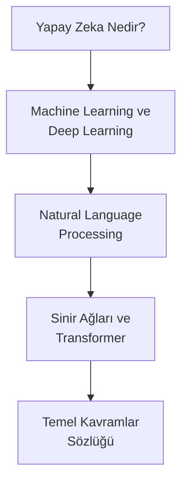

# Bölüm 01: Yapay Zeka Temelleri

Bu bölüm, yapay zeka hakkında hiçbir ön bilgisi olmayan okuyucular için hazırlanmıştır. Teknik kavramları sıfırdan, günlük hayattan örneklerle anlatır.

## Bu Bölümde Neler Öğreneceksiniz?

## İçerik

| # | Dosya | Konu | Süre |
|---|-------|------|------|
| 01 | [Yapay Zeka Nedir?](./01-yapay-zeka-nedir.md) | AI tanımı, tarihçe, günlük hayattan örnekler | ~10 dk |
| 02 | [Machine Learning ve Deep Learning](./02-makine-ogrenimi-ve-derin-ogrenme.md) | ML ve DL kavramları, aralarındaki fark, kullanım alanları | ~12 dk |
| 03 | [Natural Language Processing](./03-dogal-dil-isleme.md) | Doğal dil işleme, metin analizi, chatbot'ların temeli | ~10 dk |
| 04 | [Sinir Ağları ve Transformer](./04-sinir-aglari-ve-transformer.md) | Neural Network yapısı, Transformer mimarisi, Attention | ~15 dk |
| 05 | [Temel Kavramlar Sözlüğü](./05-temel-kavramlar-sozlugu.md) | Token, Embedding, Fine-tuning, RAG, Hallucination ve daha fazlası | ~20 dk |

## Ön Koşullar

Yok. Bu bölüm sıfırdan başlar.

## Sonraki Adım

Bu bölümü tamamladıktan sonra → [02 - Büyük Dil Modelleri](../02-buyuk-dil-modelleri/README.md)
