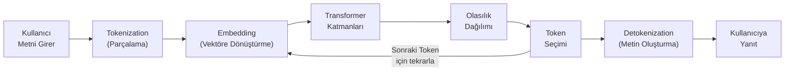
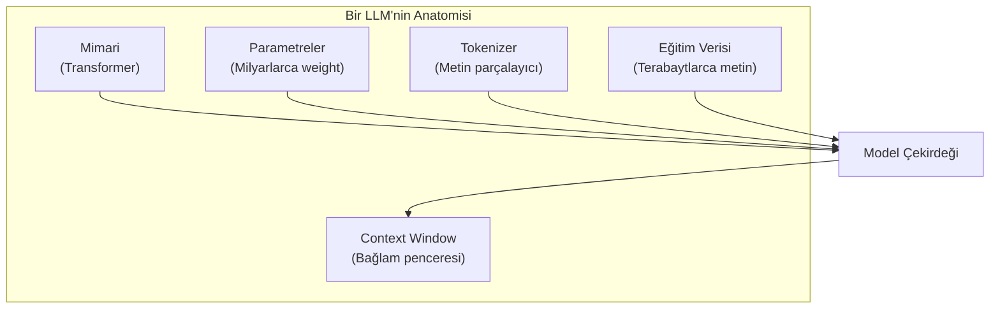
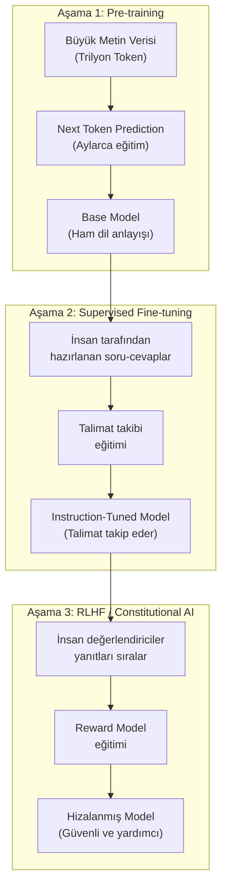
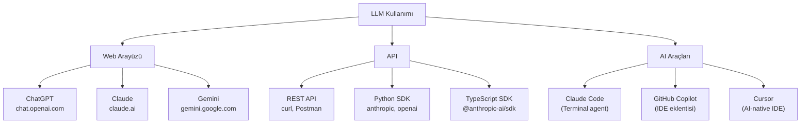

# LLM Nedir?

Large Language Model (büyük dil modeli), milyarlarca parametre ile eğitilmiş, metin anlama ve üretme konusunda uzmanlaşmış Transformer tabanlı bir Deep Learning modelidir. ChatGPT, Claude, Gemini gibi araçların tamamı birer LLM'dir.

## Ön Koşullar

- [Bölüm 01 - Yapay Zeka Temelleri](../01-yapay-zeka-temelleri/README.md)

---

## LLM Nasıl Çalışır?

LLM'lerin çalışma prensibi temelde çok basittir: **bir sonraki Token'ı tahmin et.**



### Adım Adım Örnek

```
Girdi: "Python'da bir liste nasıl sıralanır"

1. Tokenization:
   ["Python", "'", "da", " bir", " liste", " nasıl", " sıra", "lanır"]

2. Embedding: Her Token sayısal vektöre dönüştürülür
   "Python" → [0.82, -0.31, 0.45, ...]

3. Transformer: Attention mekanizması ile bağlamı analiz et
   - "liste" ve "sıralanır" arasındaki ilişki güçlü
   - "Python" programlama bağlamını belirler

4. Olasılık Dağılımı:
   Sonraki Token olarak:
   "?" → %2, "\n" → %15, "\n\n" → %20, ":\n" → %8, "sort" → %3, ...

5. Token Seçimi: "\n\n" seçildi (Temperature ve Top-p'ye göre)

6. Tekrar: "Python'da bir liste nasıl sıralanır\n\n" → sonraki Token tahmin et
   "Python" → %25, "Bir" → %18, "Liste" → %12, ...
```

> **Kritik anlayış:** LLM bir arama motoru değildir. Bir veritabanından bilgi çekmez. Eğitim verisindeki istatistiksel kalıplara göre "en mantıklı devam eden metni" üretir.

---

## LLM'nin Bileşenleri



| Bileşen | Açıklama | Örnek |
|---------|----------|-------|
| **Mimari** | Modelin yapısı | Decoder-only Transformer |
| **Parametreler** | Eğitilmiş ağırlıklar | 175B (GPT-3), 671B (DeepSeek-V3.2) |
| **Tokenizer** | Metni Token'lara ayırma yöntemi | BPE, SentencePiece, Tiktoken |
| **Context Window** | Max işlenebilir Token | 200K (Claude), 2M (Gemini) |
| **Eğitim Verisi** | Öğrenme kaynağı | Web, kitaplar, kod, makale |

---

## LLM Ne Yapabilir?

### 1. Metin Üretimi

```
Prompt: "E-ticaret sitesi için ürün açıklaması yaz"
→ SEO uyumlu, ikna edici ürün açıklamaları üretir
```

### 2. Kod Yazma ve Analiz

```
Prompt: "React ile bir todo uygulaması yaz"
→ Çalışır durumda, bileşen tabanlı React kodu üretir
```

### 3. Çeviri

```
Prompt: "Translate to Turkish: The model predicts the next token"
→ "Model bir sonraki Token'ı tahmin eder"
```

### 4. Özetleme

```
Prompt: "Bu 50 sayfalık raporu 5 maddede özetle"
→ Ana noktaları çıkararak kısa özet üretir
```

### 5. Soru Cevaplama

```
Prompt: "Python'da list comprehension nedir? Örnekle açıkla"
→ Tanım + birden fazla kod örneği üretir
```

### 6. Analiz ve Muhakeme

```
Prompt: "Bu SQL sorgusundaki performans sorunlarını bul"
→ Eksik indeks, N+1 sorgu gibi sorunları tespit eder
```

### 7. Rol Üstlenme

```
Prompt: "Bir kıdemli yazılım mimarı gibi bu tasarımı değerlendir"
→ Mimari açıdan güçlü/zayıf yönleri analiz eder
```

---

## LLM Ne Yapamaz?

| Sınırlama | Açıklama | Örnek |
|-----------|----------|-------|
| **Gerçek zamanlı bilgi** | Eğitim verisinden sonraki olayları bilmez | "Bugünkü dolar kuru nedir?" (RAG/arama olmadan) |
| **Matematiksel kesinlik** | Karmaşık hesaplamalarda hata yapabilir | 7 haneli sayıların çarpımı |
| **Deterministik çıktı** | Aynı girdi her seferinde farklı çıktı üretebilir | Temperature > 0 olduğunda |
| **Kendini bilme** | Kendi sınırlarını her zaman doğru değerlendiremez | Bilmediği konuda uydurma (Hallucination) |
| **Fiziksel dünya** | Gerçek dünyada eylem yapamaz | Dosya indirme, e-posta gönderme (araç olmadan) |
| **Uzun vadeli hafıza** | Context Window dışındaki bilgiyi kaybeder | 200K Token'dan uzun projeler |

> **Önemli:** Bu sınırlamaların birçoğu **araç kullanımı** (Tool Use) ile aşılabilir. Örneğin Claude Code, dosya okuma/yazma araçlarıyla fiziksel dünyayla etkileşir. RAG ile güncel bilgiye erişir. MCP ile harici sistemlere bağlanır.

---

## LLM Eğitim Aşamaları



| Aşama | Ne Öğreniyor? | Süre | Maliyet |
|-------|---------------|------|---------|
| Pre-training | Dil yapısı, dünya bilgisi | Aylar | Milyon $ |
| Fine-tuning | Talimat takibi | Günler | 10K-100K $ |
| RLHF | İnsan tercihleri | Haftalar | 100K-1M $ |

---

## LLM Kullanım Yöntemleri



---

## Özet

| Kavram | Değer |
|--------|-------|
| **Temel prensip** | Next Token Prediction |
| **Mimari** | Decoder-only Transformer |
| **Parametre aralığı** | 7B - 1.8T+ |
| **Context Window** | 4K - 10M Token |
| **Eğitim verisi** | Terabaytlarca metin ve kod |
| **Eğitim maliyeti** | Milyon - yüz milyon $ |
| **Inference** | Milisaniyeler (Token başına) |

---

## Sonraki Adım

→ [LLM Tarihçesi](./02-llm-tarihi.md)
