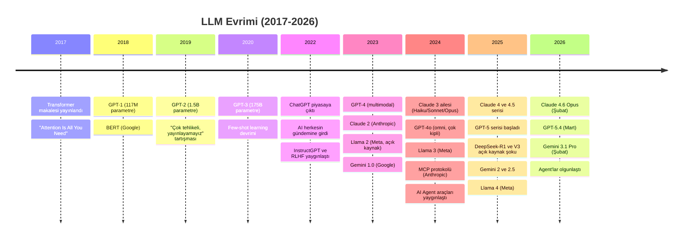
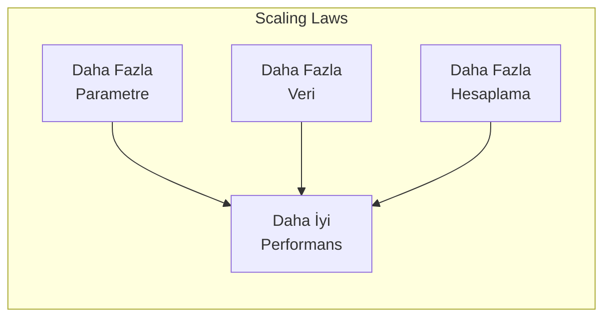
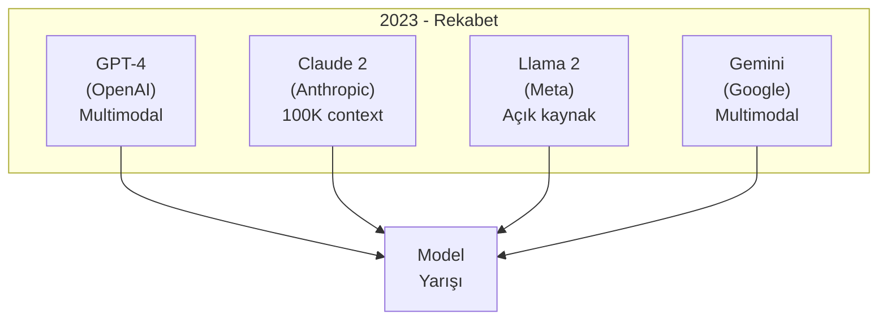
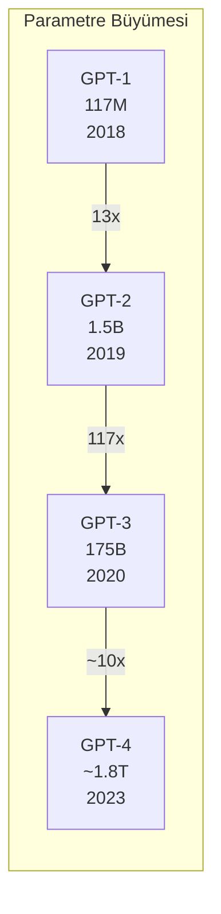

# LLM Tarihçesi: 2017'den 2026'ya

Large Language Model'lerin gelişim hikayesi, 2017'deki Transformer makalesinden başlayarak günümüze kadar uzanan hızlı bir evrim sürecidir.

## Ön Koşullar

- [LLM Nedir?](./01-llm-nedir.md)

---

## Büyük Zaman Çizelgesi

---

## Dönüm Noktaları

### 2017: Her Şeyin Başlangıcı - Transformer

Google'ın yayınladığı **"Attention Is All You Need"** makalesi, NLP alanını kökten değiştirdi.

**Neden devrimci?**
- RNN/LSTM'in sıralı işleme sorununu ortadan kaldırdı
- Paralel hesaplama ile GPU'lardan tam verim alındı
- Self-Attention ile uzak kelimelere arasındaki ilişkiler yakalandı

### 2018-2019: İlk LLM'ler

| Model | Firma | Parametre | Özellik |
|-------|-------|-----------|---------|
| GPT-1 | OpenAI | 117M | İlk generative pre-trained Transformer |
| BERT | Google | 340M | İlk bidirectional Transformer (anlama odaklı) |
| GPT-2 | OpenAI | 1.5B | Metin üretimi o kadar iyiydi ki "tehlikeli" bulundu |

### 2020: GPT-3 ve Scaling Law'lar

GPT-3 (175B parametre), Few-Shot Learning yeteneğiyle şaşırttı: sadece birkaç örnek vererek yeni görevler yapabiliyordu.

**Scaling Law (ölçekleme yasaları)** keşfedildi: model büyüdükçe, veri arttıkça, hesaplama gücü arttıkça performans tahmin edilebilir şekilde artıyordu.

### 2022: ChatGPT - AI'nın iPhone Anı

ChatGPT, AI'yı herkesin gündemine taşıdı:
- 5 günde 1 milyon kullanıcı
- 2 ayda 100 milyon kullanıcı (tarihin en hızlı büyüyen uygulaması)

**Neden bu kadar etkili oldu?**
- RLHF ile insan tercihlerine hizalanmış
- Sohbet formatında kolay kullanım
- Ücretsiz erişim

### 2023: Rekabet Kızıştı

### 2024: Agent'lar ve Araçların Yılı

- **Claude 3 ailesi:** Haiku/Sonnet/Opus segmentasyonu
- **MCP (Model Context Protocol):** Anthropic'in açık standardı
- **AI Coding Agent'ları:** Claude Code, Cursor, Copilot Chat
- **Açık kaynak patlaması:** Llama 3, Mistral, DeepSeek

### 2025: Açık Kaynak Şoku ve Ölçek Savaşları

- **DeepSeek-R1:** Çin'den gelen açık kaynak model, kapalı kaynak modellerle yarıştı
- **Llama 4:** 10M Token Context Window ile devrim
- **Claude 4 ve 4.5:** Extended Thinking ile derin muhakeme
- **GPT-5:** OpenAI'ın yeni nesil modeli

### 2026: Günümüz

| Model | Firma | Tarih | Öne Çıkan |
|-------|-------|-------|-----------|
| Claude 4.6 Opus | Anthropic | Şubat 2026 | Coding lideri, %2.8 hallucination |
| GPT-5.4 | OpenAI | Mart 2026 | Reasoning lideri |
| Gemini 3.1 Pro | Google | Şubat 2026 | 2M context, en ucuz |

---

## Parametre Büyümesi

> **Not:** 2024'ten itibaren sadece parametre sayısını artırmak yerine, mimari iyileştirmeler (MoE, efficient attention), veri kalitesi ve eğitim yöntemleri ön plana çıktı.

---

## Önemli Trendler

### 1. Ölçekleme → Verimlilik

İlk yıllarda "büyük = iyi" anlayışı hakimdi. Şimdi küçük ama verimli modeller de rekabet ediyor:
- Phi-4 (14B) bazı görevlerde GPT-4'e yaklaşıyor
- MoE mimarileri (DeepSeek) parametre verimliliğini artırıyor

### 2. Kapalı Kaynak → Açık Kaynak

Açık kaynak modeller, kapalı kaynak modellerle arayı ciddi şekilde kapattı:
- DeepSeek-V3.2: MMLU'da %94.2 (GPT-4o seviyesinde)
- Llama 4: Geniş ekosistem desteği

### 3. Tek Görev → Agent

Modeller artık sadece soru-cevap yapmıyor, otonom olarak görev tamamlıyor:
- Claude Code: Terminal'den kod yazma, test etme, deploy etme
- Codex CLI: GitHub issue'lardan PR oluşturma

### 4. Metin → Multimodal

Modern modeller metin, görüntü, ses ve video anlayabiliyor:
- Gemini 3.1: Video analizi
- Claude 4.6: Görüntü anlama
- GPT-5: Ses ve görüntü girdi/çıktı

---

## Sonraki Adım

→ [Güncel LLM Modelleri (Mart 2026)](./03-guncel-llm-modelleri-2026.md)
