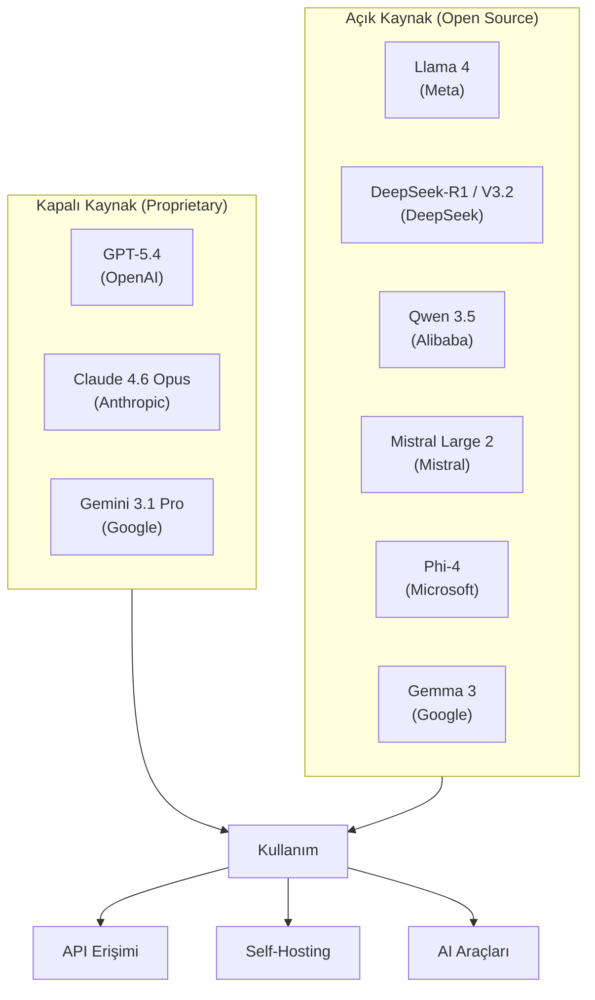
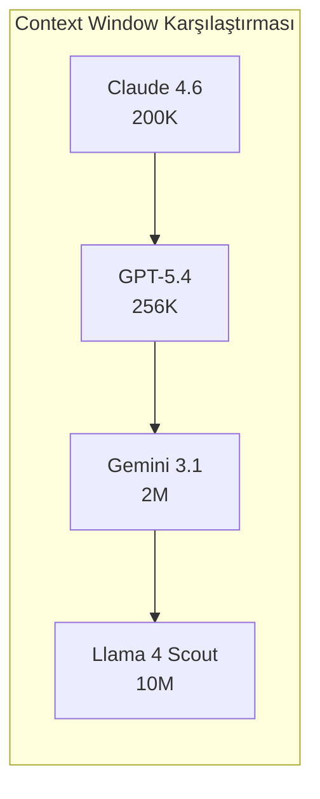
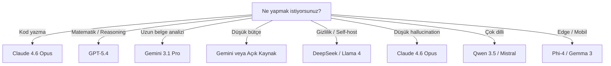

# Güncel LLM Modelleri (Mart 2026)

Bu dosya, Mart 2026 itibariyle piyasadaki en önemli LLM modellerini, özelliklerini ve karşılaştırmalarını içerir.

## Ön Koşullar

- [LLM Nedir?](./01-llm-nedir.md)
- [LLM Tarihçesi](./02-llm-tarihi.md)

---

## Büyük Resim

---

## Kapalı Kaynak Modeller

### GPT-5.4 (OpenAI) - Mart 2026

| Özellik | Değer |
|---------|-------|
| **Firma** | OpenAI |
| **Context Window** | 256K Token |
| **Güçlü yanları** | Reasoning, matematik, genel bilgi |
| **MMLU** | ~%95 |
| **MATH-500** | %96.2 |
| **GPQA Diamond** | En yüksek |
| **Fiyat** | $10-30 / 1M Token |
| **Erişim** | ChatGPT ($20/ay), API |

### Claude 4.6 Opus (Anthropic) - Şubat 2026

| Özellik | Değer |
|---------|-------|
| **Firma** | Anthropic |
| **Context Window** | 200K Token (1M beta) |
| **Güçlü yanları** | Coding, düşük hallucination, güvenilirlik |
| **HumanEval+** | %94.3 |
| **SWE-bench** | %80.9 |
| **Hallucination** | %2.8 (en düşük) |
| **Fiyat** | $15 / $75 per 1M Token (girdi/çıktı) |
| **Erişim** | Claude.ai ($20/ay Pro, $100/ay Max), API |

### Gemini 3.1 Pro (Google) - Şubat 2026

| Özellik | Değer |
|---------|-------|
| **Firma** | Google DeepMind |
| **Context Window** | 2M Token (en geniş) |
| **Güçlü yanları** | Genel bilgi, uzun bağlam, multimodal, fiyat |
| **MMLU-Pro** | %93.8 |
| **Fiyat** | $3.50 / $10.50 per 1M Token |
| **Erişim** | Gemini (ücretsiz tier mevcut), API |

---

## Açık Kaynak Modeller

### DeepSeek-R1 / V3.2

| Özellik | Değer |
|---------|-------|
| **Firma** | DeepSeek (Çin) |
| **Parametreler** | 671B (37B aktif - MoE) |
| **Lisans** | MIT |
| **MMLU** | %94.2 |
| **Güçlü yanları** | GPT-4o seviyesi performans, ücretsiz kullanım |

### Llama 4 (Meta)

| Model | Parametreler | Context | Özellik |
|-------|-------------|---------|---------|
| **Scout** | 109B | 10M Token | En geniş context window |
| **Maverick** | 400B | 1M Token | En kapsamlı açık model |

### Qwen 3.5 (Alibaba)

| Özellik | Değer |
|---------|-------|
| **Model** | Qwen3.5-122B, Qwen3-235B |
| **Dil Desteği** | 29+ dil |
| **Coding** | Qwen2.5-Coder: HumanEval %92 |

### Mistral Large 2

| Özellik | Değer |
|---------|-------|
| **Parametreler** | 123B |
| **Context** | 128K Token |
| **Dil Desteği** | 80+ dil |
| **Özellik** | Avrupa uyumluluğu optimize |

### Phi-4 (Microsoft)

| Özellik | Değer |
|---------|-------|
| **Parametreler** | 14B (küçük ama güçlü) |
| **Özellik** | Düşük donanımda güçlü reasoning |

### Gemma 3 (Google)

| Özellik | Değer |
|---------|-------|
| **Özellik** | Multimodal, on-device çalışabilir |
| **Hedef** | Edge computing, mobil cihazlar |

---

## Karşılaştırma Tablosu

### Benchmark Performansı

| Model | MMLU | HumanEval | SWE-bench | MATH-500 | Hallucination |
|-------|------|-----------|-----------|----------|---------------|
| **GPT-5.4** | ~%95 | ~%90 | ~%75 | **%96.2** | ~%4 |
| **Claude 4.6 Opus** | ~%93 | **%94.3** | **%80.9** | ~%92 | **%2.8** |
| **Gemini 3.1 Pro** | **%93.8** | ~%88 | ~%70 | ~%90 | ~%5 |
| **DeepSeek-V3.2** | %94.2 | ~%85 | ~%65 | ~%88 | ~%6 |
| **Llama 4 Maverick** | ~%90 | ~%82 | ~%55 | ~%85 | ~%7 |

### Fiyatlandırma (1M Token başına)

| Model | Girdi | Çıktı | Aylık Plan |
|-------|-------|-------|------------|
| **Gemini 3.1 Pro** | **$3.50** | **$10.50** | Ücretsiz tier var |
| **GPT-5.4** | $10 | $30 | $20/ay (ChatGPT Plus) |
| **Claude 4.6 Opus** | $15 | $75 | $20/ay Pro, $100/ay Max |
| **DeepSeek-V3.2** | Çok düşük | Çok düşük | Açık kaynak (self-host ücretsiz) |
| **Llama 4** | - | - | Açık kaynak (self-host ücretsiz) |

### Context Window

---

## Hangi Model Ne İçin En İyi?

---

## Sonraki Adım

→ [Açık Kaynak vs Kapalı Kaynak](./04-acik-kaynak-vs-kapali-kaynak.md)
