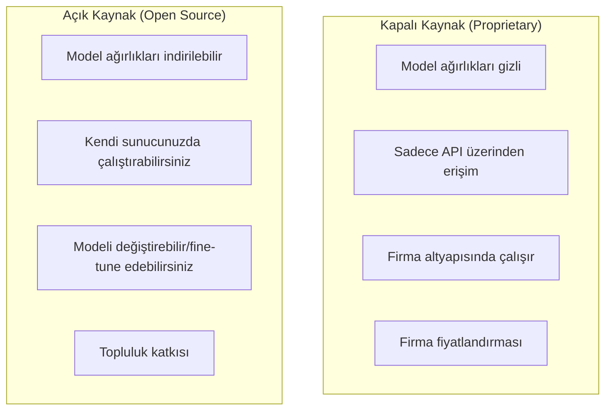
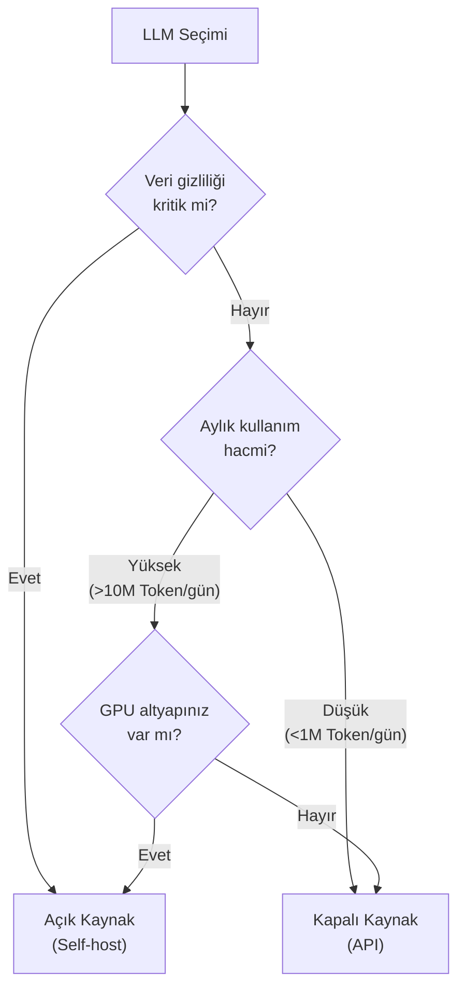

# Açık Kaynak vs Kapalı Kaynak LLM'ler

LLM dünyasında iki temel dağıtım modeli bulunur: Proprietary (kapalı kaynak) ve Open Source (açık kaynak). Her birinin avantaj ve dezavantajları vardır.

## Ön Koşullar

- [Güncel LLM Modelleri](./03-guncel-llm-modelleri-2026.md)

---

## Temel Fark

---

## Karşılaştırma

| Kriter | Kapalı Kaynak | Açık Kaynak |
|--------|---------------|-------------|
| **Performans** | Genellikle üstün (GPT-5, Claude 4.6) | Hızla yaklaşıyor (DeepSeek, Llama 4) |
| **Maliyet** | Token başına ücret (kayan maliyet) | Donanım yatırımı (sabit maliyet) |
| **Gizlilik** | Veriler firma sunucularına gider | Veri kendi sunucunuzda kalır |
| **Özelleştirme** | Sınırlı (System Prompt, bazıları Fine-tuning) | Tam kontrol (Fine-tuning, mimari değişiklik) |
| **Kurulum** | Hemen kullanıma hazır | Altyapı kurulumu gerekli |
| **Destek** | Firma desteği, SLA | Topluluk desteği |
| **Uyumluluk** | Firmanın kullanım şartları | Lisansa bağlı (MIT, Apache, Llama lisansı) |
| **Güncellik** | Firma günceller | Topluluk/firma günceller |

---

## Ne Zaman Hangisini Seçmeli?

### Kapalı Kaynak Tercih Edin:

- En yüksek performans gerektiğinde
- Hızlı başlamak istediğinizde (altyapı kurmadan)
- Küçük-orta ölçekli kullanım (maliyet API ile daha düşük)
- Kurumsal destek ve SLA gerektiğinde

### Açık Kaynak Tercih Edin:

- Veri gizliliği kritik olduğunda (KVKK, GDPR)
- Yüksek hacimli kullanımda (sabit GPU maliyeti < kayan API maliyeti)
- Model özelleştirme gerektiğinde
- İnternet bağlantısı olmayan ortamlarda (air-gapped)
- Belirli bir alan için Fine-tuning yapacağınızda

---

## Lisans Türleri

| Lisans | Örnekler | Ticari Kullanım | Değiştirme |
|--------|----------|-----------------|------------|
| **MIT** | DeepSeek-R1/V3 | Serbest | Serbest |
| **Apache 2.0** | Mistral, Qwen, Gemma | Serbest | Serbest |
| **Llama License** | Llama 4 | 700M MAU altında serbest | Sınırlı |
| **Proprietary** | GPT-5, Claude, Gemini | API kullanım şartlarına tabi | Yok |

---

## Self-Hosting Gereksinimleri

Açık kaynak bir LLM'i kendi sunucunuzda çalıştırmak için:

| Model Boyutu | Minimum GPU RAM | Örnek GPU | Örnek Model |
|-------------|-----------------|-----------|-------------|
| 7B | 16 GB | RTX 4090 | Mistral 7B, Qwen2.5-7B |
| 14B | 24 GB | RTX 4090 | Phi-4 |
| 70B | 140 GB | 2x A100 80GB | Llama 4 (quantized) |
| 400B+ | 800 GB+ | 8x H100 | Llama 4 Maverick |

> **Quantization (niceleme):** Model ağırlıklarının hassasiyetini düşürerek (FP16 → INT8 → INT4) bellek gereksinimini azaltma tekniği. Performansta küçük kayıpla bellek kullanımını 2-4x azaltır.

---

## Sonraki Adım

→ [LLM Değerlendirme Kriterleri](./05-llm-degerlendirme-kriterleri.md)
