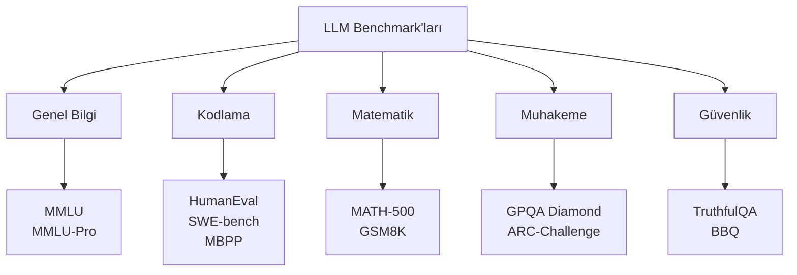
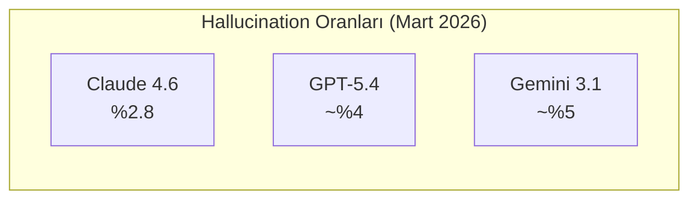
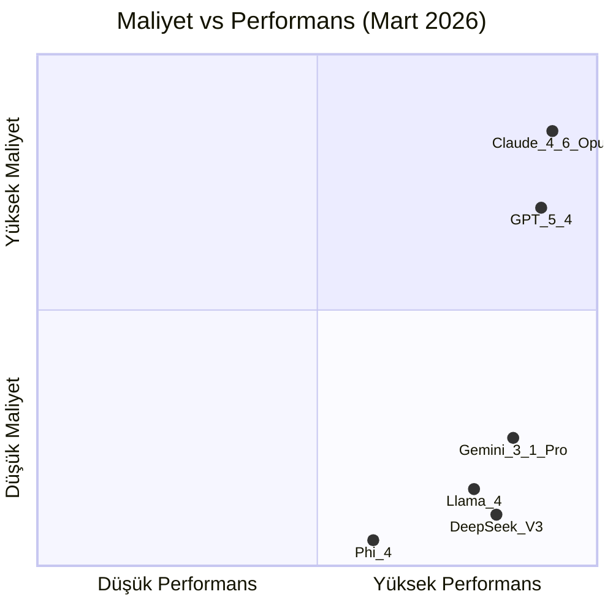

# LLM Değerlendirme Kriterleri

Bir LLM'in ne kadar "iyi" olduğunu ölçmek için kullanılan Benchmark'lar (karşılaştırma ölçütleri), metrikler ve değerlendirme yöntemleri.

## Ön Koşullar

- [LLM Nedir?](./01-llm-nedir.md)
- [Güncel LLM Modelleri](./03-guncel-llm-modelleri-2026.md)

---

## Benchmark'lar Nedir?

Benchmark, modellerin belirli görevlerdeki performansını ölçen standart test setleridir. Tıpkı öğrencilerin sınav sonuçları gibi, modelleri karşılaştırmaya yarar.



---

## Önemli Benchmark'lar

### Genel Bilgi ve Anlama

#### MMLU (Massive Multitask Language Understanding)

57 farklı konuda (fizik, tarih, hukuk, tıp vb.) çoktan seçmeli sorular.

```
Örnek Soru (Fizik):
Bir cisim 10 m/s hızla yukarı fırlatılıyor. Maksimum yükseklik nedir?
(a) 5.1 m  (b) 10.2 m  (c) 15.3 m  (d) 20.4 m

Örnek Soru (Hukuk):
Aşağıdakilerden hangisi bir sözleşmenin geçersiz olmasına neden olur?
(a) Tarafların rızası  (b) Ehliyet eksikliği  (c) ...
```

| Model | MMLU Skoru |
|-------|-----------|
| GPT-5.4 | ~%95 |
| DeepSeek-V3.2 | %94.2 |
| Gemini 3.1 Pro | %93.8 |
| Claude 4.6 Opus | ~%93 |

### Kodlama

#### HumanEval / HumanEval+

Python fonksiyonlarını doğru şekilde tamamlama testi. 164 problem.

```python
# Örnek HumanEval problemi:
def has_close_elements(numbers: List[float], threshold: float) -> bool:
    """Check if in given list of numbers, are any two numbers 
    closer to each other than given threshold.
    >>> has_close_elements([1.0, 2.0, 3.0], 0.5)
    False
    >>> has_close_elements([1.0, 2.8, 3.0, 4.0], 0.3)
    True
    """
    # Model bu fonksiyonun gövdesini tamamlamalı
```

#### SWE-bench (Software Engineering Benchmark)

Gerçek GitHub repository'lerinden alınan bug fix görevleri. Gerçek dünya yazılım mühendisliğini ölçer.

```
Görev: Django framework'teki #12345 issue'yu düzelt
- Repository'yi analiz et
- Hatayı bul
- Doğru dosyaları değiştir
- Test'lerden geç
```

| Model | HumanEval+ | SWE-bench Verified |
|-------|-----------|-------------------|
| **Claude 4.6 Opus** | **%94.3** | **%80.9** |
| GPT-5.4 | ~%90 | ~%75 |
| Gemini 3.1 Pro | ~%88 | ~%70 |

> **Claude 4.6 Opus**, kodlama benchmark'larında açık ara lider konumdadır. Bu, Claude Code'un tercih edilme nedenlerinden biridir.

### Matematik

#### MATH-500

Lise ve üniversite seviyesi matematik problemleri.

```
Örnek: 
f(x) = x³ - 3x² + 2x olduğuna göre, f'(x) = 0 denkleminin 
köklerini bulunuz.
```

### Muhakeme

#### GPQA Diamond (Graduate-Level Google-Proof Q&A)

PhD seviyesi bilim soruları. İnsan uzmanlar bile sadece ~%65 doğruluk sağlayabiliyor.

---

## Benchmark Dışı Metrikler

Benchmark'lar tek başına yeterli değildir. Pratik kullanımda önemli diğer kriterler:

### 1. Hallucination Rate (Halüsinasyon Oranı)

Modelin ne sıklıkla yanlış bilgi "uydurduğu".



### 2. Latency (Gecikme)

İlk Token'ın ne kadar hızlı geldiği. Time to First Token (TTFT).

### 3. Throughput (İşlem Hacmi)

Saniyede üretilen Token sayısı (Tokens Per Second / TPS).

### 4. Context Window Kullanımı

Büyük context window'un gerçekte ne kadar etkili kullanıldığı. "Needle in a Haystack" testi.

```
Test: 200K Token'lık metin içine gizlenen küçük bir bilgiyi bulma
Sonuç: Bazı modeller uzun context'te bilgiyi kaybedebiliyor
```

### 5. Instruction Following (Talimat Takibi)

Modelin verilen talimatları ne kadar sadakatle uyguladığı.

### 6. Maliyet-Performans Oranı

En iyi model her zaman en pahalı olandan ibaret değildir:



---

## Model Seçim Rehberi

| İhtiyaç | Birincil Metrik | Önerilen Model |
|---------|----------------|----------------|
| **Kod üretimi** | HumanEval, SWE-bench | Claude 4.6 Opus |
| **Genel sohbet** | MMLU, Instruction Following | GPT-5.4 |
| **Belge analizi** | Context Window, MMLU-Pro | Gemini 3.1 Pro |
| **Matematiksel problem** | MATH-500, GPQA | GPT-5.4 |
| **Düşük maliyet** | Maliyet-Performans oranı | DeepSeek-V3.2, Gemini |
| **Gizlilik** | Self-host imkanı | Llama 4, DeepSeek |
| **Güvenilirlik** | Hallucination oranı | Claude 4.6 Opus |

---

## Benchmark'ların Sınırlamaları

> **Uyarı:** Benchmark sonuçlarına körü körüne güvenmeyin.

- **Contamination (kirlenme):** Model, eğitim verisinde benchmark sorularını görmüş olabilir
- **Gerçek dünya farkı:** Benchmark performansı ≠ gerçek kullanım performansı
- **Optimize etme:** Firmalar benchmark'lara özel optimize yapabilir
- **Tek boyutluluk:** Bir benchmark tüm kullanım senaryolarını kapsamaz

**En iyi değerlendirme yöntemi:** Kendi kullanım senaryonuzla test etmek.

---

## Sonraki Adım

→ [Bölüm 03 - LLM Sağlayıcıları ve Karşılaştırma](../03-llm-saglayicilari/README.md)
