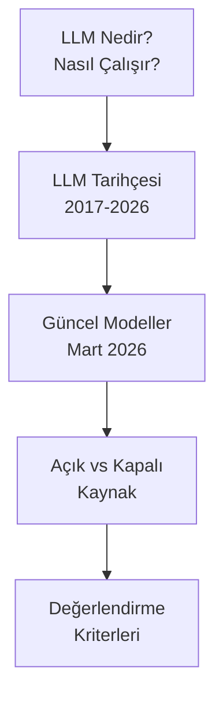

# Bölüm 02: Büyük Dil Modelleri (LLM)

Large Language Model (büyük dil modeli), milyarlarca parametre ile eğitilmiş, insan dilini anlama ve üretme yeteneğine sahip Transformer tabanlı Deep Learning modelleridir.

## Bu Bölümde Neler Öğreneceksiniz?

## İçerik

| # | Dosya | Konu |
|---|-------|------|
| 01 | [LLM Nedir?](./01-llm-nedir.md) | Tanım, çalışma prensibi, yetenekler ve sınırlar |
| 02 | [LLM Tarihçesi](./02-llm-tarihi.md) | 2017 Transformer'dan 2026'ya kronolojik gelişim |
| 03 | [Güncel LLM Modelleri (Mart 2026)](./03-guncel-llm-modelleri-2026.md) | GPT-5.4, Claude 4.6, Gemini 3.1, Llama 4 ve diğerleri |
| 04 | [Açık Kaynak vs Kapalı Kaynak](./04-acik-kaynak-vs-kapali-kaynak.md) | Lisans, maliyet, gizlilik ve esneklik karşılaştırması |
| 05 | [LLM Değerlendirme Kriterleri](./05-llm-degerlendirme-kriterleri.md) | Benchmark'lar, metrikler ve model seçim rehberi |

## Ön Koşullar

- [Bölüm 01 - Yapay Zeka Temelleri](../01-yapay-zeka-temelleri/README.md)

## Sonraki Adım

→ [Bölüm 03 - LLM Sağlayıcıları ve Karşılaştırma](../03-llm-saglayicilari/README.md)
