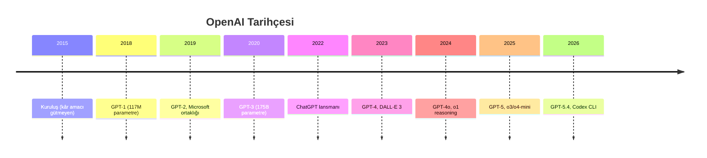
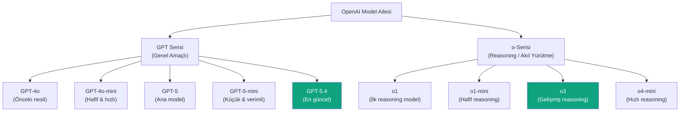
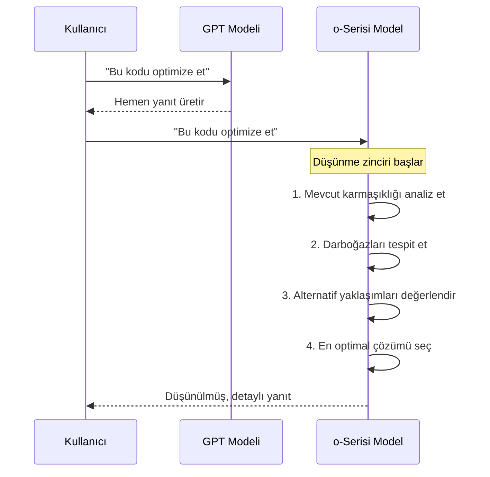
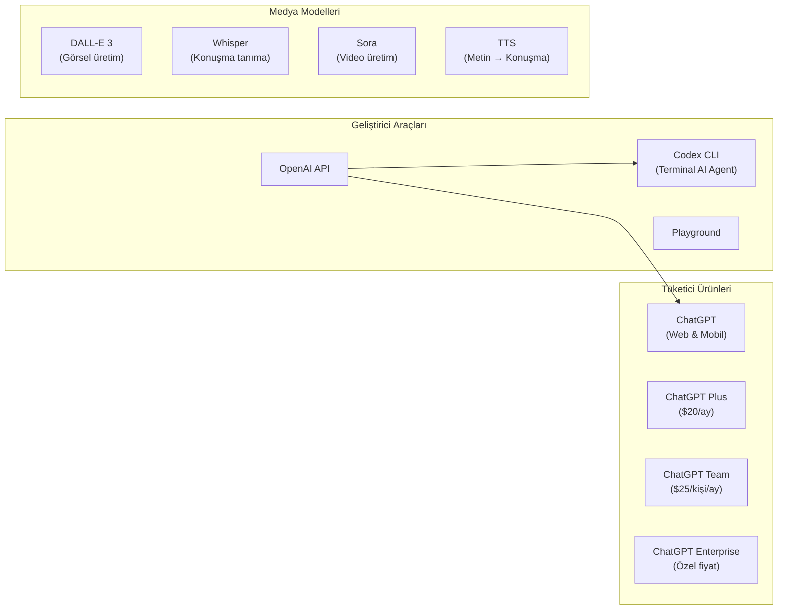

# OpenAI

OpenAI, büyük dil modelleri devriminin öncüsü olan ve ChatGPT ile yapay zekayı tüm dünyaya tanıtan şirkettir. GPT serisi ve o-serisi reasoning (akıl yürütme) modelleriyle sektörü şekillendirmeye devam etmektedir.

## Ön Koşullar

- [LLM Nedir?](../02-buyuk-dil-modelleri/01-llm-nedir.md)
- [Güncel LLM Modelleri](../02-buyuk-dil-modelleri/03-guncel-llm-modelleri-2026.md)

---

## Şirket Tarihçesi

| Yıl | Olay |
|-----|------|
| 2015 | Sam Altman, Elon Musk ve diğerleri tarafından **kâr amacı gütmeyen** bir araştırma kuruluşu olarak kuruldu |
| 2019 | "Capped-profit" (sınırlı kâr) modeline geçiş; Microsoft'tan 1 milyar dolar yatırım |
| 2020 | GPT-3 yayınlandı — 175 milyar parametre ile çığır açtı |
| 2022 | ChatGPT piyasaya sürüldü — 2 ayda 100 milyon kullanıcıya ulaştı |
| 2023 | GPT-4 yayınlandı; Microsoft ile ortaklık derinleşti (toplam ~13 milyar dolar yatırım) |
| 2024 | o1 reasoning modeli ve GPT-4o tanıtıldı |
| 2025 | GPT-5 serisi ve o3/o4-mini reasoning modelleri yayınlandı |
| 2026 | GPT-5.4 ve Codex CLI ile geliştirici ekosistemi genişledi |



---

## Model Ailesi

OpenAI'nin Mart 2026 itibarıyla iki ana model ailesi bulunmaktadır:



### GPT Serisi — Genel Amaçlı Modeller

| Model | Parametre | Context Window | Öne Çıkan Özellik |
|-------|-----------|----------------|---------------------|
| GPT-4o | ~200B (tahmin) | 128K token | Multimodal (metin, görsel, ses) |
| GPT-4o-mini | ~8B (tahmin) | 128K token | Düşük maliyet, yüksek hız |
| GPT-5 | Açıklanmadı | 256K token | İyileştirilmiş akıl yürütme |
| GPT-5-mini | Açıklanmadı | 256K token | GPT-5'in hafif versiyonu |
| GPT-5.4 | Açıklanmadı | 256K token | En güncel, en yetenekli GPT |

### o-Serisi — Reasoning (Akıl Yürütme) Modelleri

Reasoning modelleri, yanıt vermeden önce "düşünme" adımları gerçekleştirir. Bu, karmaşık matematik, kodlama ve mantık problemlerinde önemli avantaj sağlar.



| Model | Güçlü Yanı | Kullanım Alanı |
|-------|------------|----------------|
| o1 | Derin akıl yürütme | Araştırma, karmaşık analiz |
| o1-mini | Hız/yetenek dengesi | Kodlama, matematik |
| o3 | En güçlü reasoning | Bilimsel araştırma, kompleks mühendislik |
| o4-mini | Hızlı reasoning | Günlük kodlama, hızlı problem çözme |

---

## Ürün Ekosistemi



### ChatGPT

ChatGPT, OpenAI'nin tüketici odaklı sohbet arayüzüdür. Yapay zekayı milyonlarca kişiye tanıtan ürün olmuştur:

- **ChatGPT Free:** GPT-4o-mini ile sınırlı erişim
- **ChatGPT Plus ($20/ay):** GPT-5, o3, DALL-E 3, Advanced Data Analysis
- **ChatGPT Team ($25/kişi/ay):** Takım yönetimi, yüksek kullanım limitleri
- **ChatGPT Enterprise:** SSO, admin paneli, veri gizliliği garantisi

### Codex CLI

OpenAI'nin terminal tabanlı AI coding agent'ıdır (yapay zeka kodlama aracısı). Claude Code'a rakip olarak geliştirilmiştir:

```bash
# Kurulum
npm install -g @openai/codex

# Kullanım
codex "bu projeye birim testleri ekle"
```

> **Not:** Codex CLI, Claude Code ile doğrudan rekabet eden bir üründür. Detaylı karşılaştırma için → [Bölüm 04](../04-ai-destekli-gelistirme/README.md)

### DALL-E 3

Metin açıklamalarından yüksek kaliteli görsel üreten modeldir. ChatGPT Plus içinde entegre olarak kullanılabilir.

### Whisper

Açık kaynaklı Speech-to-Text (konuşmadan metne) modelidir. 99 dili destekler ve lokal olarak çalıştırılabilir.

---

## API Fiyatlandırması (Mart 2026)

| Model | Input (Giriş) | Output (Çıkış) | Not |
|-------|----------------|-----------------|-----|
| GPT-4o | $2.50 / 1M token | $10.00 / 1M token | Multimodal |
| GPT-4o-mini | $0.15 / 1M token | $0.60 / 1M token | En uygun fiyatlı |
| GPT-5 | $10.00 / 1M token | $30.00 / 1M token | En yetenekli GPT |
| GPT-5-mini | $1.50 / 1M token | $6.00 / 1M token | Dengeli fiyat/performans |
| o3 | $10.00 / 1M token | $40.00 / 1M token | Reasoning dahil |
| o4-mini | $1.10 / 1M token | $4.40 / 1M token | Uygun fiyatlı reasoning |

> **Maliyet hesabı:** 1 milyon token yaklaşık 750.000 kelimeye denk gelir. Ortalama bir sohbet oturumu 2.000-5.000 token tüketir.

---

## Güçlü ve Zayıf Yanlar

| Güçlü Yanlar | Zayıf Yanlar |
|-------------|-------------|
| En geniş ürün ekosistemi | Kapalı kaynak — model ağırlıkları paylaşılmıyor |
| Reasoning modellerde öncü (o-serisi) | En yüksek fiyat segmentinde |
| Güçlü multimodal yetenekler | Kurumsal veri gizliliği endişeleri |
| Büyük geliştirici topluluğu | API rate limit'leri (hız sınırlamaları) kısıtlayıcı |
| Sürekli model güncellemeleri | Şirket içi yönetim krizleri (2023) güven zedeledi |

---

## Pratik Örnek: OpenAI API Kullanımı

```python
from openai import OpenAI

client = OpenAI(api_key="YOUR_API_KEY_HERE")

# GPT-5 ile kod üretme
response = client.chat.completions.create(
    model="gpt-5",
    messages=[
        {"role": "system", "content": "Sen deneyimli bir Python geliştiricisisin."},
        {"role": "user", "content": "FastAPI ile basit bir CRUD API oluştur."}
    ],
    temperature=0.3,
    max_tokens=2000
)

print(response.choices[0].message.content)
```

```python
# o3 ile karmaşık bir problemi çözme
response = client.chat.completions.create(
    model="o3",
    messages=[
        {"role": "user", "content": """
        Bu SQL sorgusunun zaman karmaşıklığını analiz et ve optimize et:
        SELECT * FROM orders o
        JOIN customers c ON o.customer_id = c.id
        WHERE c.country IN (SELECT country FROM blacklist)
        ORDER BY o.created_at DESC
        """}
    ]
)
```

---

## Özet

| Özellik | Detay |
|---------|-------|
| **Kuruluş** | 2015, San Francisco |
| **Strateji** | Kapalı kaynak, ürün odaklı ekosistem |
| **Amiral gemisi modeli** | GPT-5.4 (genel), o3 (reasoning) |
| **Fiyat aralığı** | $0.15 — $40 / 1M token |
| **Öne çıkan ürünler** | ChatGPT, Codex CLI, API, DALL-E, Whisper |

---

## Sonraki Adım

OpenAI'yi tanıdık. Şimdi yapay zeka güvenliğine odaklanan ve Claude modellerini geliştiren Anthropic'i inceleyelim:

→ [Anthropic](./02-anthropic.md)
