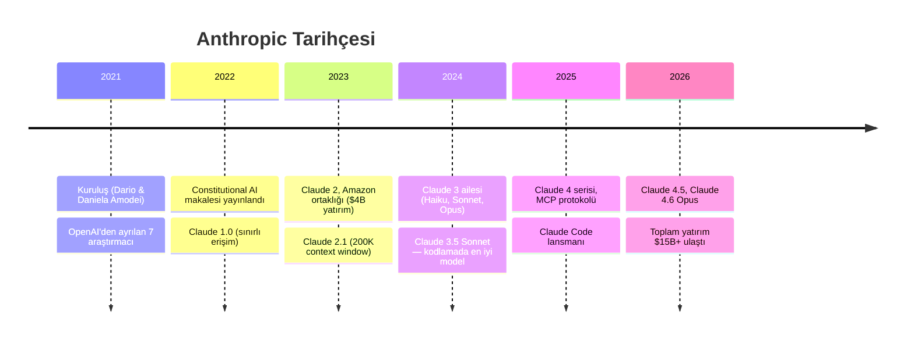
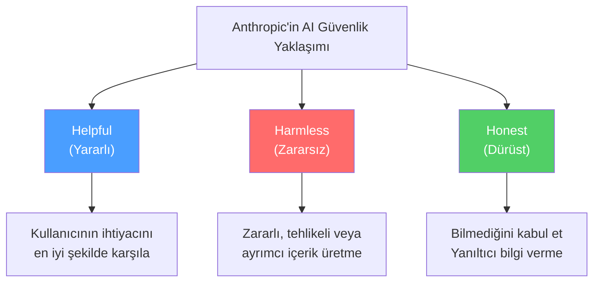
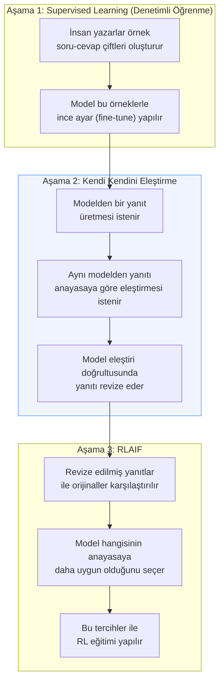
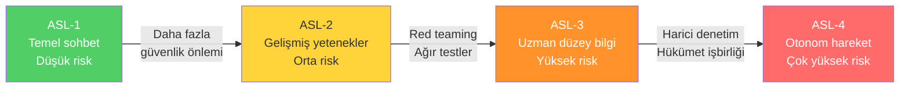
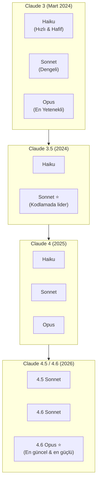
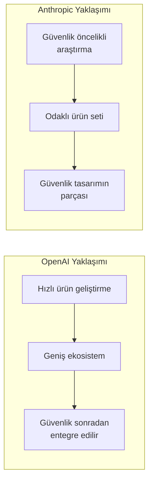

# Anthropic

Anthropic, AI Safety (yapay zeka güvenliği) odaklı bir araştırma şirketidir. OpenAI'nin eski araştırmacıları tarafından kurulan şirket, Constitutional AI (anayasal yapay zeka) yaklaşımıyla güvenli ve yararlı AI sistemleri geliştirmeyi hedefler. Bu rehberin odak noktası olan **Claude** model ailesi Anthropic tarafından geliştirilmektedir.

## Ön Koşullar

- [LLM Nedir?](../02-buyuk-dil-modelleri/01-llm-nedir.md)
- [OpenAI](./01-openai.md) (karşılaştırma için önerilir)

---

## Şirket Tarihi ve Felsefesi

### Kuruluş Hikayesi

Anthropic, 2021 yılında **Dario Amodei** (CEO) ve **Daniela Amodei** (Başkan) kardeşler tarafından kuruldu. Her ikisi de OpenAI'nin üst düzey yöneticileriydi:

- **Dario Amodei:** OpenAI'de Araştırma Başkan Yardımcısı olarak GPT-2 ve GPT-3 projelerini yönetti
- **Daniela Amodei:** OpenAI'de Operasyon Başkan Yardımcısıydı

OpenAI'den ayrılma nedeni, yapay zeka güvenliği konusundaki **felsefe farklılığıydı**. Amodei kardeşler, AI geliştirmede güvenliğin hız ve kârdan önce gelmesi gerektiğine inanıyorlardı.



---

## AI Safety (Yapay Zeka Güvenliği) Yaklaşımı

Anthropic'in diğer şirketlerden en büyük farkı, güvenliği bir "ek özellik" değil **temel tasarım ilkesi** olarak görmesidir.

### Üç Temel İlke



Bu üç ilke birbiriyle bazen çelişebilir. Örneğin, "yararlı" olmak bazen "zararsız" olmakla çatışabilir. Constitutional AI, bu dengeyi sağlamak için geliştirilmiştir.

---

## Constitutional AI (Anayasal Yapay Zeka)

Constitutional AI (CAI), Anthropic'in geliştirdiği özgün bir eğitim metodolojisidir. Modelin kendi çıktılarını bir "anayasa" (kurallar seti) temelinde değerlendirmesine dayanır.

### CAI Süreci



> **RLAIF** = Reinforcement Learning from AI Feedback (yapay zeka geri bildiriminden pekiştirmeli öğrenme). Geleneksel RLHF'den (insan geri bildirimi) farklı olarak, modelin kendisi geri bildirim verir.

### Anayasa Örneği

CAI'deki "anayasa" şu tür kurallardan oluşur:

1. Yanıtın zararlı, etik dışı veya yasadışı faaliyetleri teşvik edip etmediğini kontrol et
2. Yanıtın doğru ve kanıta dayalı olup olmadığını değerlendir
3. Yanıtın ayrımcı, önyargılı veya kırıcı olup olmadığını kontrol et
4. Yanıtın kullanıcının sorusuna gerçekten yardımcı olup olmadığını değerlendir
5. Yanıtın belirsizlik durumunda bunu açıkça ifade edip etmediğini kontrol et

---

## Responsible Scaling Policy (Sorumlu Ölçekleme Politikası)

Anthropic, modellerin yetenekleri arttıkça güvenlik önlemlerinin de artması gerektiğini savunur. Bu yaklaşım **AI Safety Level (ASL)** sistemiyle tanımlanır:



| Seviye | Yetenek | Güvenlik Gereksinimi |
|--------|---------|----------------------|
| ASL-1 | Basit sohbet, sınırlı bilgi | Standart test |
| ASL-2 | Geniş bilgi, kod üretme | Kırmızı takım testleri, kullanım politikaları |
| ASL-3 | Uzman düzey biyoloji/siber bilgi | Bağımsız güvenlik denetimi, erişim kontrolü |
| ASL-4 | Otonom görev yürütme | Hükümet düzeyinde denetim |

> **Mart 2026:** Claude 4.6 modelleri ASL-3 kategorisinde değerlendirilmektedir.

---

## Claude Model Ailesi

Claude, Anthropic'in amiral gemisi model ailesidir. Her nesil üç katmanda sunulur:



### Katman Yapısı

| Katman | Özellik | Kullanım Alanı |
|--------|---------|----------------|
| **Haiku** | En hızlı, en düşük maliyet | Sınıflandırma, basit sorular, yüksek hacim |
| **Sonnet** | Hız ve yetenek dengesi | Kodlama, analiz, günlük kullanım |
| **Opus** | En yetenekli, en derin akıl yürütme | Karmaşık araştırma, yaratıcı yazım, uzman görevler |

### Mart 2026 Güncel Claude Modelleri

| Model | Context Window | Öne Çıkan Özellik |
|-------|----------------|---------------------|
| Claude 4.6 Opus | 200K token | En güçlü model, derin reasoning |
| Claude 4.6 Sonnet | 200K token | En iyi fiyat/performans oranı |
| Claude 4.5 Sonnet | 200K token | Güvenilir ve stabil |
| Claude 4 Haiku | 200K token | Ultra hızlı yanıtlar |

---

## Claude'un Öne Çıkan Özellikleri

### 1. Extended Thinking (Genişletilmiş Düşünme)

Claude, karmaşık problemlerde "düşünme süreci"ni kullanıcıya gösterebilir. Bu, OpenAI'nin o-serisine benzer bir yaklaşımdır ancak kullanıcıya şeffaf biçimde sunulur.

### 2. Tool Use (Araç Kullanımı)

Claude, API üzerinden harici araçlara (fonksiyonlara) erişebilir. Bu, Claude Code'un temelini oluşturan mekanizmadır.

### 3. Vision (Görsel Anlama)

Tüm Claude 3+ modelleri görselleri anlayabilir: diyagramlar, ekran görüntüleri, el yazıları, grafikler.

### 4. Model Context Protocol (MCP)

Anthropic tarafından geliştirilen açık standart protokol. AI modellerinin harici veri kaynaklarına ve araçlara standart bir şekilde bağlanmasını sağlar. Detaylar için → [Bölüm 11](../11-mcp/README.md)

---

## API Fiyatlandırması (Mart 2026)

| Model | Input (Giriş) | Output (Çıkış) |
|-------|----------------|-----------------|
| Claude 4.6 Opus | $15.00 / 1M token | $75.00 / 1M token |
| Claude 4.6 Sonnet | $3.00 / 1M token | $15.00 / 1M token |
| Claude 4.5 Sonnet | $3.00 / 1M token | $15.00 / 1M token |
| Claude 4 Haiku | $0.80 / 1M token | $4.00 / 1M token |

---

## Güçlü ve Zayıf Yanlar

| Güçlü Yanlar | Zayıf Yanlar |
|-------------|-------------|
| AI Safety konusunda sektör lideri | Model çeşitliliği sınırlı (sadece Claude) |
| Kodlama benchmark'larında en üst sıralarda | Multimodal yetenekler OpenAI'nin gerisinde (video, ses) |
| 200K token context window | Görsel üretim yeteneği yok |
| MCP açık standart protokolü | Tüketici ürünü (ChatGPT benzeri) görece geç geldi |
| Claude Code ile güçlü geliştirici deneyimi | Fiyatlandırma GPT-5'e kıyasla daha yüksek (Opus) |
| Uzun, tutarlı metin üretiminde çok başarılı | Bazı ülkelerde erişim kısıtlı |

---

## Pratik Örnek: Claude API Kullanımı

```python
import anthropic

client = anthropic.Anthropic(api_key="YOUR_API_KEY_HERE")

# Claude 4.6 Sonnet ile kod analizi
message = client.messages.create(
    model="claude-sonnet-4-6-20260301",
    max_tokens=2000,
    messages=[
        {
            "role": "user",
            "content": """Bu Python kodundaki güvenlik açıklarını bul ve düzelt:

import sqlite3

def get_user(username):
    conn = sqlite3.connect('db.sqlite')
    cursor = conn.cursor()
    cursor.execute(f"SELECT * FROM users WHERE name = '{username}'")
    return cursor.fetchone()
"""
        }
    ]
)

print(message.content[0].text)
```

```python
# Extended Thinking ile karmaşık problem çözme
message = client.messages.create(
    model="claude-sonnet-4-6-20260301",
    max_tokens=16000,
    thinking={
        "type": "enabled",
        "budget_tokens": 10000
    },
    messages=[
        {
            "role": "user",
            "content": "Dağıtık bir e-ticaret sistemi için event-driven mimari tasarla."
        }
    ]
)

for block in message.content:
    if block.type == "thinking":
        print("Düşünce süreci:", block.thinking)
    elif block.type == "text":
        print("Yanıt:", block.text)
```

---

## Anthropic vs OpenAI: Felsefe Farkı



---

## Özet

| Özellik | Detay |
|---------|-------|
| **Kuruluş** | 2021, San Francisco (Dario & Daniela Amodei) |
| **Felsefe** | AI Safety öncelikli, Constitutional AI |
| **Amiral gemisi** | Claude 4.6 Opus / Sonnet |
| **Öne çıkan** | Kodlama, güvenlik, MCP protokolü, Claude Code |
| **Fiyat aralığı** | $0.80 — $75 / 1M token |

---

## Sonraki Adım

Anthropic ve Claude'u tanıdık. Şimdi en büyük context window ve multimodal yetenekleriyle öne çıkan Google DeepMind'ı inceleyelim:

→ [Google DeepMind](./03-google-deepmind.md)
