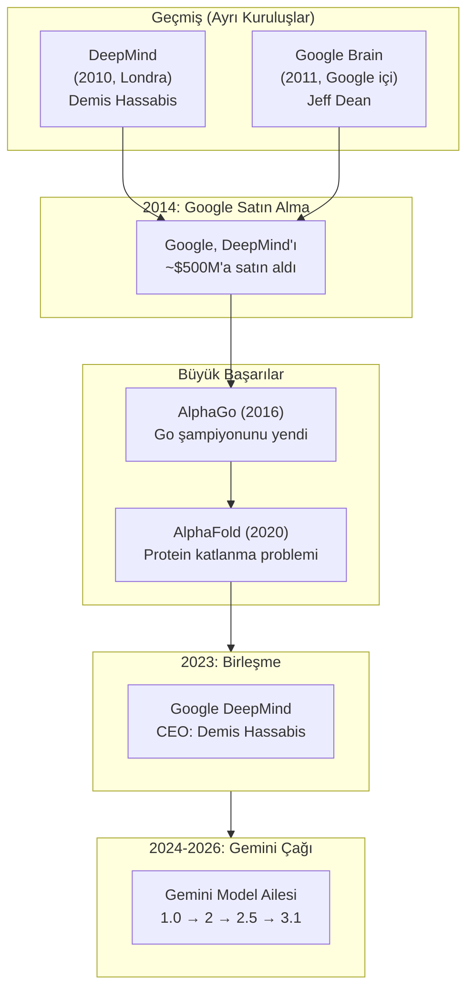
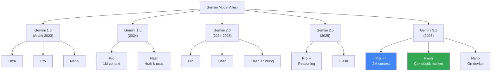
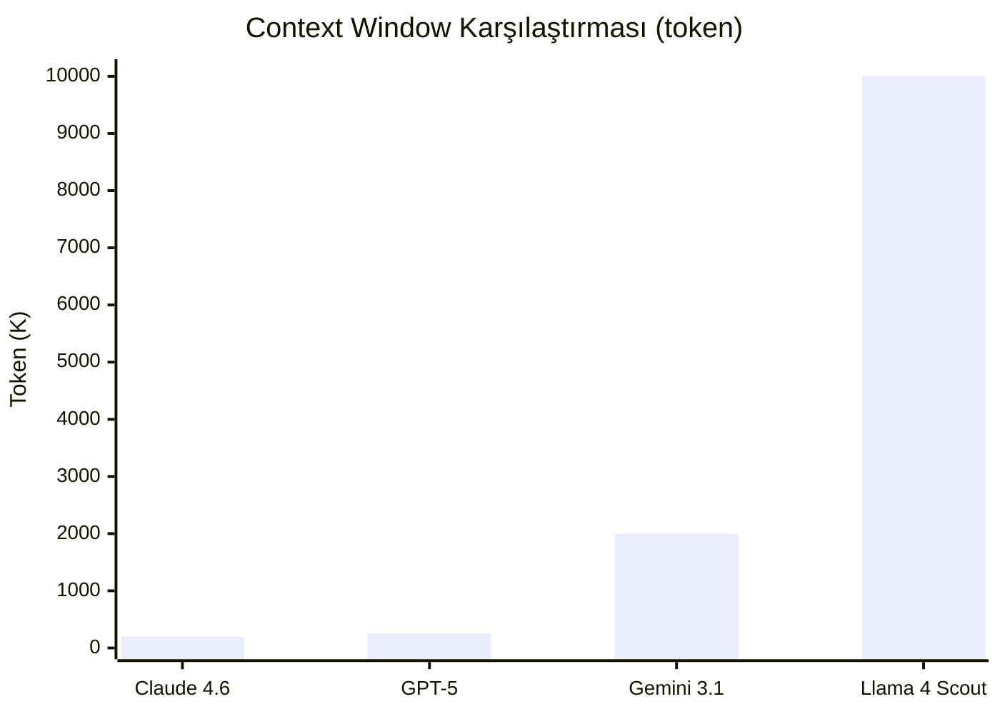
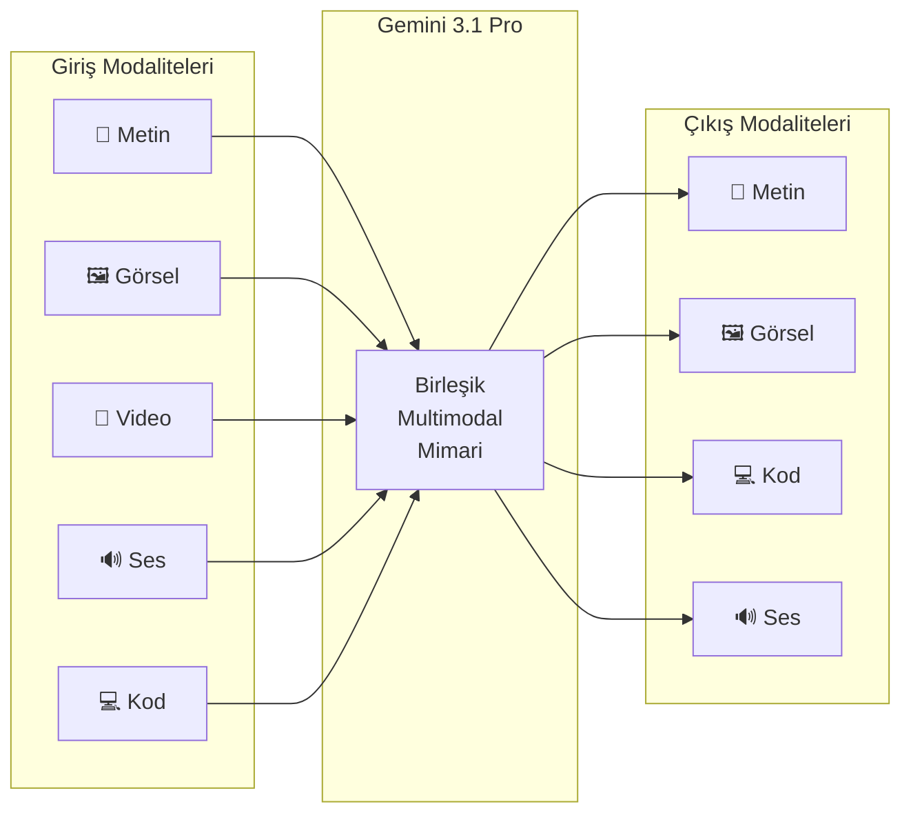
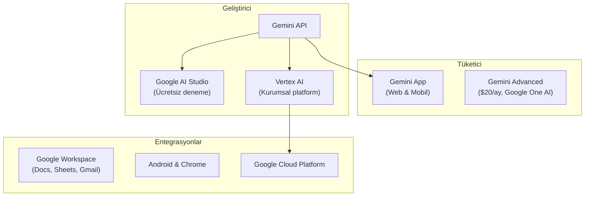

# Google DeepMind

Google DeepMind, Google'ın yapay zeka araştırma bölümü olan Google Brain ile İngiltere merkezli DeepMind'ın birleşmesiyle oluşan, dünyanın en büyük AI araştırma kuruluşlarından biridir. Gemini model ailesi ile **en büyük context window (bağlam penceresi)** ve **en güçlü multimodal (çok modlu)** yetenekleri sunmaktadır.

## Ön Koşullar

- [LLM Nedir?](../02-buyuk-dil-modelleri/01-llm-nedir.md)
- [OpenAI](./01-openai.md) (karşılaştırma için önerilir)

---

## Birleşme Hikayesi



### Önemli Kilometre Taşları

| Yıl | Olay | Önemi |
|-----|------|-------|
| 2010 | DeepMind kuruldu (Londra) | Demis Hassabis, Shane Legg, Mustafa Suleyman |
| 2011 | Google Brain projesi başladı | Google'ın dahili AI ekibi |
| 2014 | Google, DeepMind'ı satın aldı | ~$500 milyon |
| 2016 | AlphaGo, Go şampiyonunu yendi | AI tarihinde dönüm noktası |
| 2020 | AlphaFold, protein katlanma problemini çözdü | Bilim dünyasında devrim |
| 2023 | Google Brain + DeepMind = Google DeepMind | İki dev ekip birleşti |
| 2023 | Gemini 1.0 yayınlandı | Google'ın GPT-4'e cevabı |
| 2024 | Gemini 1.5 Pro — 1M token context window | Rekor context window |
| 2025 | Gemini 2.5 Pro / Flash | Gelişmiş reasoning yetenekleri |
| 2026 | Gemini 3.1 — 2M token context window | Sektörün en büyük context window'u |

---

## Gemini Model Ailesi



### Gemini Katmanları

| Katman | Özellik | Karşılığı |
|--------|---------|-----------|
| **Pro** | En yetenekli, derin reasoning | GPT-5 / Claude Opus |
| **Flash** | Hızlı, düşük maliyetli | GPT-4o-mini / Claude Haiku |
| **Nano** | On-device (cihaz üzerinde), çevrimdışı | Telefon ve IoT cihazları için |

### Gemini 3.1 Pro — Amiral Gemisi (Mart 2026)

| Özellik | Değer |
|---------|-------|
| **Context Window** | **2.000.000 token** (sektörün en büyüğü) |
| **Modaliteler** | Metin, görsel, video, ses, kod |
| **Reasoning** | Gelişmiş düşünme zinciri |
| **Kod üretme** | HumanEval: %93+ |
| **Çok dil desteği** | 100+ dil |

> **2M Token Context Window ne anlama gelir?** Yaklaşık 1.500.000 kelime veya 3.000 sayfalık bir kitap tek seferde modelin bağlamına sığabilir. Bu, rakiplerin 4-10 katıdır.

---

## Context Window Karşılaştırması



> **Not:** Llama 4 Scout 10M token context window'a sahiptir ancak bu deneysel bir özelliktir. Gemini 3.1'in 2M context window'u günlük kullanımda en geniş **stabil** penceredir.

---

## Multimodal Yetenekler

Gemini, doğuştan multimodal (çok modlu) olarak tasarlanmıştır. Diğer modellerin aksine metin ve diğer modaliteler ayrı modüller değil, tek bir birleşik mimari içinde işlenir:



### Desteklenen Giriş Türleri

| Tür | Kapasite | Kullanım Örneği |
|-----|----------|-----------------|
| **Metin** | 2M token | Kitap analizi, uzun doküman işleme |
| **Görsel** | 3.600 görsel/istek | Diyagram analizi, OCR, sınıflandırma |
| **Video** | ~2 saatlik video | Video özetleme, içerik analizi |
| **Ses** | ~22 saatlik ses | Transkripsiyon, duygu analizi |
| **Kod** | Tüm yaygın diller | Kod analizi, debug, üretim |

---

## Google AI Ekosistemi



### Ücretsiz Kullanım (Free Tier)

Google, Gemini API için sektördeki **en cömert ücretsiz katmanı** sunar:

| Özellik | Ücretsiz Limit |
|---------|----------------|
| Gemini 3.1 Flash | 1.500 istek/gün |
| Gemini 3.1 Pro | 50 istek/gün |
| Rate limit | 15 istek/dakika (Flash) |
| Depolama | 50GB (AI Studio üzerinden) |

### Vertex AI

Google Cloud'un kurumsal AI platformudur. Gemini'ye ek olarak:

- **Model Garden:** 100+ açık kaynak model barındırma
- **Fine-tuning:** Özel veriyle model eğitme
- **Grounding:** Google Search ile gerçek zamanlı bilgi erişimi
- **Enterprise güvenlik:** VPC, CMEK, IAM entegrasyonu

---

## API Fiyatlandırması (Mart 2026)

| Model | Input | Output | Not |
|-------|-------|--------|-----|
| Gemini 3.1 Pro | $3.50 / 1M token | $10.50 / 1M token | 2M context |
| Gemini 3.1 Flash | $0.075 / 1M token | $0.30 / 1M token | Çok düşük maliyet |
| Gemini 3.1 Nano | Cihaz üzerinde | Cihaz üzerinde | API yok, SDK ile |

> **Fiyat karşılaştırması:** Gemini 3.1 Flash, sektörün en uygun fiyatlı modellerinden biridir — GPT-4o-mini'den bile ucuzdur.

---

## Güçlü ve Zayıf Yanlar

| Güçlü Yanlar | Zayıf Yanlar |
|-------------|-------------|
| **2M token** — sektörün en büyük context window'u | Kodlama benchmark'larında Claude'un biraz gerisinde |
| Doğuştan multimodal mimari | Geliştirici araçları (Codex CLI/Claude Code benzeri) yok |
| Çok cömert ücretsiz katman | Kurumsal güven konusunda Google'ın veri politikaları sorgulanıyor |
| Google ekosistemiyle derin entegrasyon | API stabilitesi zaman zaman sorunlu |
| On-device (Nano) modeli | Bazı ülkelerde erişim kısıtlı |
| Vertex AI kurumsal platform | Creative writing'de Claude ve GPT'nin gerisinde |

---

## Pratik Örnek: Gemini API Kullanımı

```python
import google.generativeai as genai

genai.configure(api_key="AIza...")

model = genai.GenerativeModel("gemini-3.1-pro")

# Büyük doküman analizi (2M context window avantajı)
with open("1500_sayfa_rapor.txt", "r") as f:
    uzun_metin = f.read()

response = model.generate_content(
    f"""Bu raporun ana bulgularını özetle ve kritik riskleri listele:

    {uzun_metin}
    """
)

print(response.text)
```

```python
# Multimodal: Görsel + Metin
import PIL.Image

image = PIL.Image.open("mimari_diyagram.png")

response = model.generate_content([
    "Bu mimari diyagramdaki güvenlik açıklarını analiz et.",
    image
])

print(response.text)
```

```python
# Video analizi
video_file = genai.upload_file("demo_video.mp4")

response = model.generate_content([
    "Bu demo videosundaki kullanıcı deneyimi sorunlarını listele.",
    video_file
])
```

---

## Özet

| Özellik | Detay |
|---------|-------|
| **Kuruluş** | 2023 (birleşme), Google Brain (2011) + DeepMind (2010) |
| **CEO** | Demis Hassabis |
| **Amiral gemisi** | Gemini 3.1 Pro (2M context) |
| **Öne çıkan** | En büyük context window, multimodal, ücretsiz katman |
| **Fiyat aralığı** | $0.075 — $10.50 / 1M token |

---

## Sonraki Adım

Google DeepMind'ı tanıdık. Şimdi açık kaynak stratejisiyle devrim yaratan Meta ve Llama model ailesini inceleyelim:

→ [Meta ve Llama](./04-meta-ve-llama.md)
