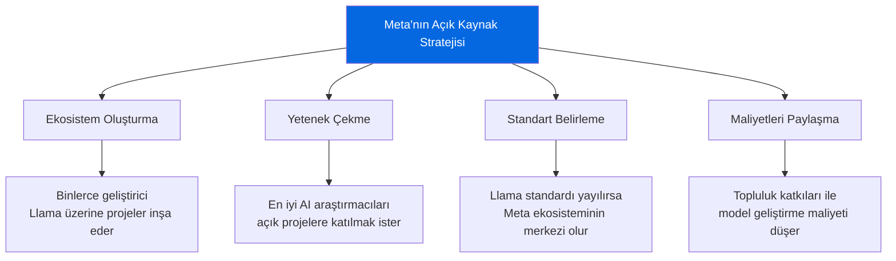
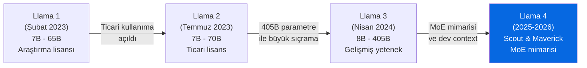
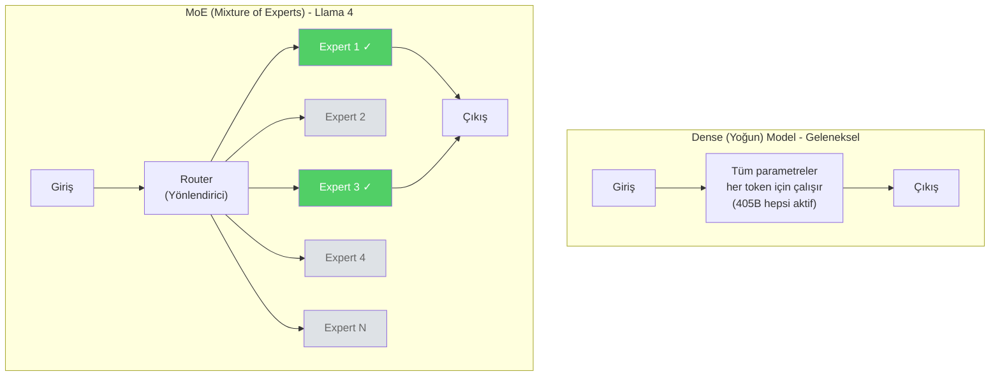
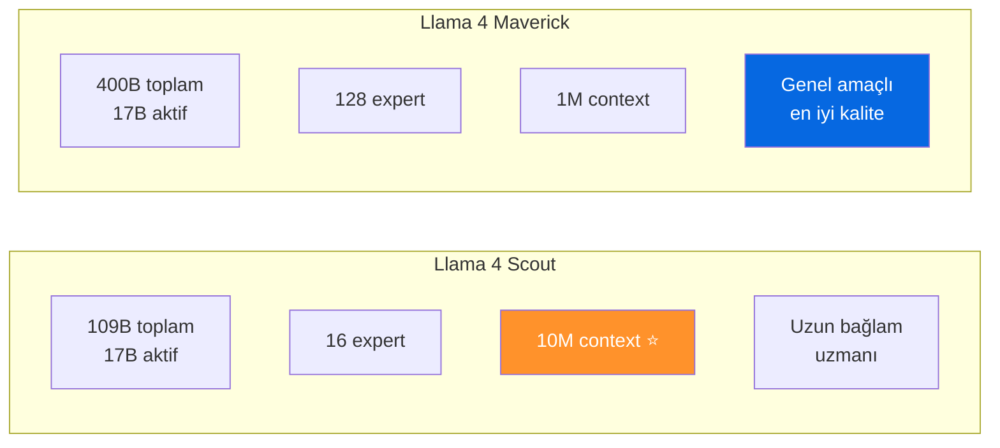
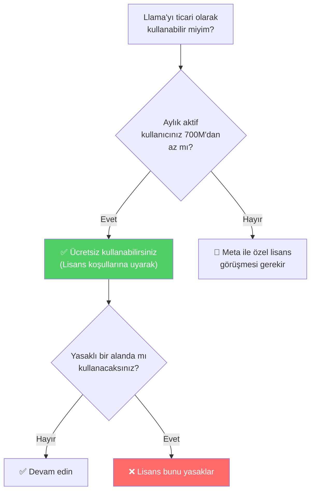
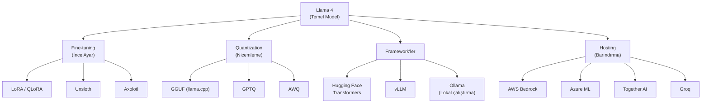

# Meta ve Llama

Meta (eski adıyla Facebook), yapay zeka model geliştirmede **açık kaynak stratejisini** benimseyen en büyük teknoloji şirketidir. Llama (Large Language Model Meta AI) serisi, açık kaynak dünyasının en yaygın kullanılan büyük dil modeli ailesine dönüşmüştür.

## Ön Koşullar

- [LLM Nedir?](../02-buyuk-dil-modelleri/01-llm-nedir.md)
- [Açık Kaynak vs Kapalı Kaynak](../02-buyuk-dil-modelleri/04-acik-kaynak-vs-kapali-kaynak.md)

---

## Meta'nın AI Stratejisi

Meta, diğer büyük şirketlerden farklı olarak modellerini açık kaynak olarak yayınlamayı tercih eder. Bu stratejinin arkasındaki mantık:



### Meta AI Araştırma — FAIR

Meta'nın AI araştırma bölümü **FAIR** (Fundamental AI Research), 2013'ten beri faaliyet göstermektedir. Yann LeCun (Turing Ödülü sahibi, Deep Learning öncülerinden) FAIR'in baş bilim insanıdır.

---

## Llama Evrimi



### Nesil Karşılaştırması

| Özellik | Llama 1 | Llama 2 | Llama 3/3.1 | Llama 4 |
|---------|---------|---------|-------------|---------|
| **Tarih** | Şubat 2023 | Temmuz 2023 | Nisan 2024 | 2025-2026 |
| **Boyutlar** | 7B, 13B, 33B, 65B | 7B, 13B, 70B | 8B, 70B, 405B | Scout (109B), Maverick (400B) |
| **Context** | 2K token | 4K token | 128K token | 10M (Scout), 1M (Maverick) |
| **Mimari** | Dense (yoğun) | Dense | Dense | **MoE** (Mixture of Experts) |
| **Lisans** | Araştırma | Ticari | Ticari | Ticari |
| **Eğitim verisi** | 1.4T token | 2T token | 15T+ token | Açıklanmadı |

---

## Llama 4: Scout ve Maverick

Llama 4, Meta'nın **Mixture of Experts (MoE)** mimarisine geçiş yaptığı ilk nesildir.

### MoE Nedir?



MoE'de her token yalnızca birkaç "uzman" (expert) tarafından işlenir. Toplam parametre sayısı çok yüksek olsa da, aktif parametre sayısı düşük kalır → **daha az hesaplama maliyeti**.

### Llama 4 Scout

| Özellik | Değer |
|---------|-------|
| **Toplam parametre** | 109 milyar (109B) |
| **Aktif parametre** | ~17B (her token için) |
| **Expert sayısı** | 16 expert |
| **Context window** | **10.000.000 token** (10M) |
| **Hedef** | Uzun bağlam, doküman analizi, kod tabanı analizi |

> **10M Token Context Window:** Bu, yaklaşık 7.5 milyon kelime veya 15.000 sayfalık bir kitap demektir. Tam bir kod tabanını tek seferde analiz edebilir.

### Llama 4 Maverick

| Özellik | Değer |
|---------|-------|
| **Toplam parametre** | 400 milyar (400B) |
| **Aktif parametre** | ~17B (her token için) |
| **Expert sayısı** | 128 expert |
| **Context window** | **1.000.000 token** (1M) |
| **Hedef** | Genel amaçlı, yüksek kaliteli metin ve kod üretimi |



---

## Lisans ve Ticari Kullanım

Llama modelleri, Meta'nın **özel açık kaynak lisansı** altında yayınlanır. Bu lisans, Apache 2.0 veya MIT kadar serbest değildir:

### Temel Lisans Koşulları

| Kural | Detay |
|-------|-------|
| **Ücretsiz kullanım** | Evet, ticari dahil |
| **MAU limiti** | Aylık aktif kullanıcı sayısı **700 milyon**'u aşarsa Meta'dan özel lisans gerekir |
| **Atıf zorunluluğu** | "Built with Llama" ifadesi kullanılmalı |
| **Model adı kullanımı** | Türetilmiş modellerde "Llama" adı referans verilmeli |
| **Yasaklar** | Yüz tanıma, gözetleme, silah geliştirme gibi alanlarda kullanım yasak |



> **700M MAU limiti kimler için geçerli?** Pratikte bu limit yalnızca Google, Meta, Amazon gibi devleri etkiler. Küçük ve orta ölçekli tüm şirketler için Llama tamamen ücretsizdir.

---

## Llama Ekosistemi

Llama'nın açık kaynak olması, etrafında büyük bir ekosistem oluşmasını sağlamıştır:



### Lokal Çalıştırma

Llama modellerinin en büyük avantajlarından biri, kendi donanımınızda çalıştırılabilmeleridir:

```bash
# Ollama ile lokal Llama çalıştırma
ollama pull llama4-scout
ollama run llama4-scout "Bu Python kodunu optimize et..."
```

| Araç | Özellik | Gerekli Donanım |
|------|---------|-----------------|
| **Ollama** | Kolay kurulum, GUI desteği | 8GB+ RAM (küçük modeller) |
| **llama.cpp** | C++ ile optimize, GGUF format | CPU veya GPU |
| **vLLM** | Yüksek performanslı sunucu | GPU (A100/H100 önerilir) |
| **Hugging Face** | Python entegrasyonu | GPU önerilir |

---

## Güçlü ve Zayıf Yanlar

| Güçlü Yanlar | Zayıf Yanlar |
|-------------|-------------|
| Tamamen açık ağırlıklar (open weights) | Eğitim kodu ve verisi kapalı |
| 10M token context window (Scout) | Sıfırdan eğitmek devasa hesaplama gerektirir |
| Güçlü topluluk ve ekosistem | Kapalı kaynak modellerin gerisinde (benchmark'larda) |
| Lokal çalıştırma imkânı — veri gizliliği | Fine-tuning uzmanlık gerektirir |
| MoE mimarisi ile verimli çıkarım | 700M MAU lisans limiti (büyük şirketler için) |
| Ticari kullanım ücretsiz | Resmi destek/SLA yok |

---

## Pratik Örnek: Llama Kullanım Senaryoları

```python
# Hugging Face Transformers ile Llama kullanımı
from transformers import AutoModelForCausalLM, AutoTokenizer

model_name = "meta-llama/Llama-4-Scout"
tokenizer = AutoTokenizer.from_pretrained(model_name)
model = AutoModelForCausalLM.from_pretrained(
    model_name,
    device_map="auto",
    torch_dtype="auto"
)

messages = [
    {"role": "system", "content": "Sen yardımcı bir yazılım asistanısın."},
    {"role": "user", "content": "Python'da async/await ile rate limiter yaz."}
]

inputs = tokenizer.apply_chat_template(messages, return_tensors="pt")
outputs = model.generate(inputs, max_new_tokens=1000)
print(tokenizer.decode(outputs[0], skip_special_tokens=True))
```

```python
# Together AI API üzerinden Llama kullanımı (bulut)
from together import Together

client = Together(api_key="...")

response = client.chat.completions.create(
    model="meta-llama/Llama-4-Maverick",
    messages=[
        {"role": "user", "content": "Kubernetes pod affinity kurallarını açıkla."}
    ]
)

print(response.choices[0].message.content)
```

---

## Özet

| Özellik | Detay |
|---------|-------|
| **Şirket** | Meta (FAIR araştırma bölümü) |
| **Strateji** | Açık kaynak (open weights), topluluk odaklı |
| **Güncel modeller** | Llama 4 Scout (109B), Llama 4 Maverick (400B) |
| **Mimari** | Mixture of Experts (MoE) |
| **Context window** | 10M (Scout), 1M (Maverick) |
| **Lisans** | Meta Llama lisansı (700M MAU limiti) |

---

## Sonraki Adım

Meta ve Llama'yı tanıdık. Şimdi DeepSeek, Mistral, Qwen ve diğer önemli sağlayıcıları inceleyelim:

→ [Diğer Sağlayıcılar](./05-diger-saglayicilar.md)
