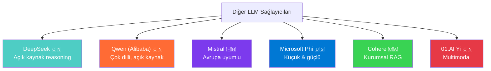
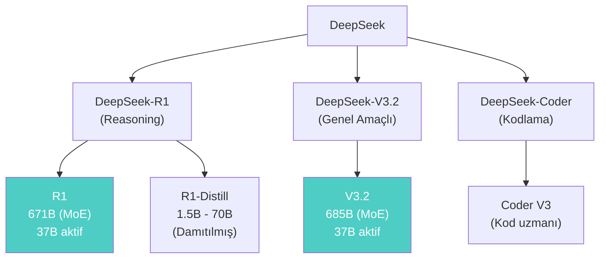
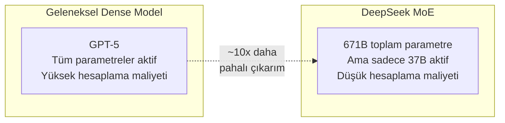
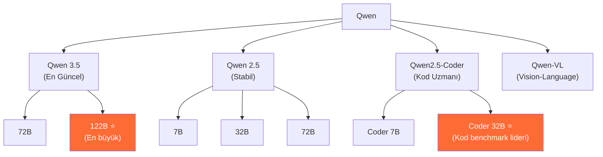
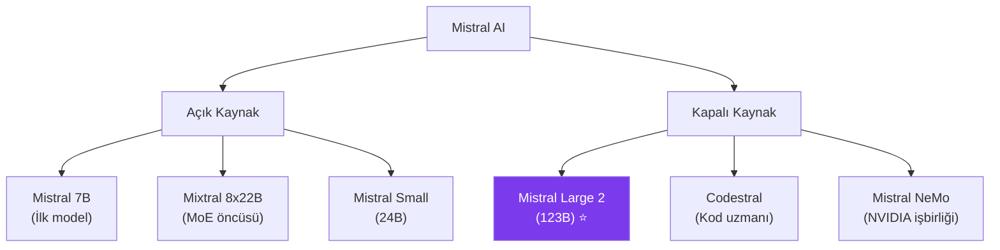
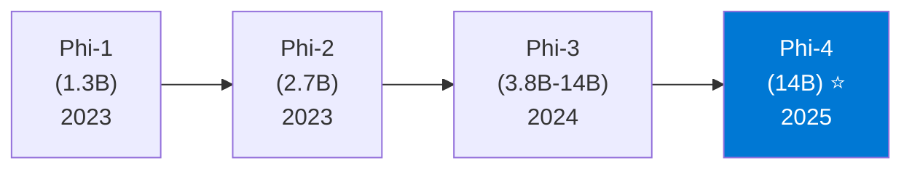
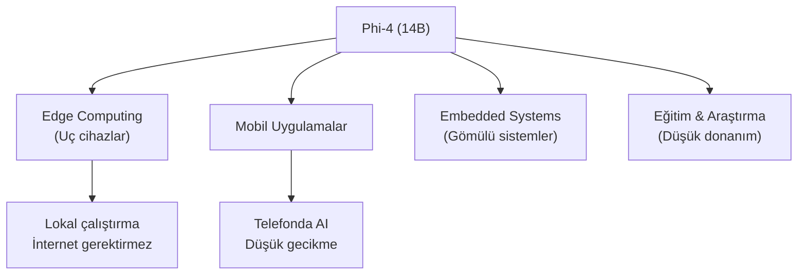
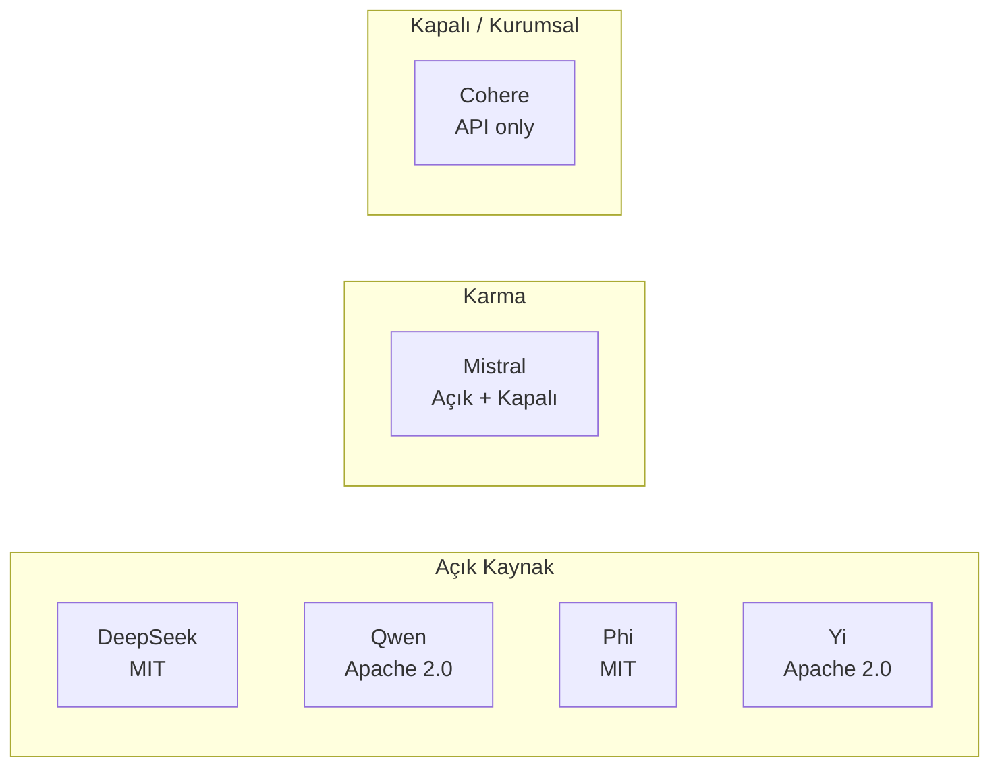

# Diğer Önemli LLM Sağlayıcıları

OpenAI, Anthropic, Google ve Meta dışında, büyük dil modelleri alanında güçlü rakipler bulunmaktadır. Bu bölümde DeepSeek, Alibaba Qwen, Mistral, Microsoft Phi, Cohere ve 01.AI Yi modellerini inceliyoruz.

## Ön Koşullar

- [LLM Nedir?](../02-buyuk-dil-modelleri/01-llm-nedir.md)
- [Açık Kaynak vs Kapalı Kaynak](../02-buyuk-dil-modelleri/04-acik-kaynak-vs-kapali-kaynak.md)

---

## Sağlayıcı Haritası



---

## DeepSeek

### Genel Bakış

DeepSeek, Çin merkezli bir AI laboratuvarıdır. 2024 yılında DeepSeek-R1 modeli ile açık kaynak reasoning (akıl yürütme) alanında büyük ses getirmiştir. Modellerin **MIT lisansı** ile yayınlanması, sektörde geniş yankı uyandırmıştır.

| Özellik | Detay |
|---------|-------|
| **Merkez** | Hangzhou, Çin |
| **Kuruluş** | 2023 (High-Flyer hedge fund tarafından finanse ediliyor) |
| **Strateji** | Açık kaynak (MIT lisansı) |
| **Öne çıkan** | Düşük maliyetli eğitim, MoE mimarisi |

### Model Ailesi



### DeepSeek-R1: Reasoning Devrimi

DeepSeek-R1, o1 ve o3 modelleriyle rekabet eden açık kaynak bir reasoning modelidir:

| Özellik | Değer |
|---------|-------|
| **Toplam parametre** | 671 milyar (MoE) |
| **Aktif parametre** | ~37B (her token için) |
| **Expert sayısı** | 256 expert, 8 aktif |
| **Context window** | 128K token |
| **Lisans** | **MIT** (en serbest açık kaynak lisanslarından) |
| **Eğitim maliyeti** | ~$5.6M (GPT-4'ün tahmini maliyetinin onda biri) |

### DeepSeek-V3.2

| Özellik | Değer |
|---------|-------|
| **Toplam parametre** | 685B (MoE) |
| **Aktif parametre** | ~37B |
| **Context window** | 128K token |
| **Öne çıkan** | Genel amaçlı, çok dilli, kodlama |

### MoE Verimliliği

DeepSeek'in MoE yaklaşımının dikkat çekici yanı, **devasa modelleri çok düşük maliyetle** çıkarım (inference) yapabilmesidir:



### API Fiyatlandırması

| Model | Input | Output |
|-------|-------|--------|
| DeepSeek-R1 | $0.55 / 1M token | $2.19 / 1M token |
| DeepSeek-V3.2 | $0.27 / 1M token | $1.10 / 1M token |

> **Fiyat avantajı:** DeepSeek, GPT-5'ten yaklaşık **40x daha ucuzdur** ve Claude 4.6 Sonnet'ten yaklaşık **10x daha ucuzdur**.

---

## Alibaba Qwen (通义千问)

### Genel Bakış

Qwen (Tongyi Qianwen), Alibaba Cloud'un geliştirdiği açık kaynaklı büyük dil modeli ailesidir. Çok dilli yetenekleri ve kod üretme kapasitesiyle öne çıkar.

| Özellik | Detay |
|---------|-------|
| **Merkez** | Hangzhou, Çin (Alibaba Group) |
| **Strateji** | Açık kaynak (Apache 2.0) |
| **Öne çıkan** | 29+ dil desteği, güçlü kodlama, Alibaba Cloud entegrasyonu |

### Model Ailesi



### Qwen 3.5-122B

| Özellik | Değer |
|---------|-------|
| **Parametre** | 122 milyar |
| **Context window** | 128K token |
| **Dil desteği** | **29+ dil** (Çince, İngilizce, Türkçe dahil) |
| **Lisans** | Apache 2.0 (tam özgür) |

### Qwen2.5-Coder

Qwen2.5-Coder, özellikle kodlama için optimize edilmiş bir modeldir:

- **92+ programlama dili** desteği
- HumanEval benchmark'ında GPT-4o seviyesinde performans
- 32B versiyonu ile lokal çalıştırılabilir

### Pratik Kullanım

```python
# Ollama ile lokal Qwen kullanımı
# Terminal: ollama pull qwen2.5-coder:32b

from openai import OpenAI

client = OpenAI(
    base_url="http://localhost:11434/v1",
    api_key="ollama"
)

response = client.chat.completions.create(
    model="qwen2.5-coder:32b",
    messages=[
        {"role": "user", "content": "React ile drag-and-drop kanban board oluştur."}
    ]
)
```

---

## Mistral

### Genel Bakış

Mistral AI, Fransa merkezli bir AI şirketidir. **Avrupa veri düzenlemelerine uyumluluk** (GDPR) konusunda öncü konumdadır ve Avrupa'nın en değerli AI girişimidir.

| Özellik | Detay |
|---------|-------|
| **Merkez** | Paris, Fransa |
| **Kuruluş** | 2023 (DeepMind ve Meta alumni tarafından) |
| **Strateji** | Karma (açık kaynak + kapalı kaynak modeller) |
| **Öne çıkan** | GDPR uyumluluk, Avrupa barındırma, MoE öncüsü |

### Model Ailesi



### Mistral Large 2

| Özellik | Değer |
|---------|-------|
| **Parametre** | 123 milyar |
| **Context window** | 128K token |
| **Dil desteği** | İngilizce, Fransızca, Almanca, İspanyolca, İtalyanca + daha fazlası |
| **Öne çıkan** | GDPR uyumlu, Avrupa'da barındırma seçeneği |
| **Function calling** | Gelişmiş araç kullanımı |

### Codestral

Mistral'in kodlamaya özel modeli:

- 32K context window, 80+ programlama dili
- Fill-in-the-middle (FIM) desteği — IDE'ler için optimize
- VS Code ve JetBrains entegrasyonu

### Avrupa Uyumluluğu

Mistral'in en büyük farklılaştırıcısı, **Avrupa düzenlemelerine tam uyumluluk**tur:

| Düzenleme | Mistral Uyumluluğu |
|-----------|---------------------|
| **GDPR** | Veri Avrupa'da işlenir ve saklanır |
| **EU AI Act** | Uyumluluk çalışmaları devam ediyor |
| **Data residency** | Avrupa sınırları içinde kalma garantisi |
| **Veri gizliliği** | API verileri eğitim için kullanılmaz |

### API Fiyatlandırması

| Model | Input | Output |
|-------|-------|--------|
| Mistral Large 2 | $2.00 / 1M token | $6.00 / 1M token |
| Mistral Small | $0.20 / 1M token | $0.60 / 1M token |
| Codestral | $0.30 / 1M token | $0.90 / 1M token |

---

## Microsoft Phi

### Genel Bakış

Microsoft Research'ün geliştirdiği Phi serisi, **küçük ama güçlü** (Small Language Model / SLM) modelleriyle tanınır. "Büyük her zaman daha iyi değildir" felsefesiyle hareket eder.

| Özellik | Detay |
|---------|-------|
| **Merkez** | Redmond, ABD (Microsoft Research) |
| **Strateji** | Açık kaynak (MIT lisansı) |
| **Öne çıkan** | Küçük boyut, yüksek performans, reasoning |

### Model Ailesi



### Phi-4

| Özellik | Değer |
|---------|-------|
| **Parametre** | 14 milyar |
| **Context window** | 16K token |
| **Lisans** | MIT |
| **Öne çıkan** | Reasoning, matematik, bilim |
| **Boyut** | ~8GB (quantized) |

Phi-4'ün dikkat çekici yanı, **14B parametre** ile bazı 70B+ modellere yakın matematik ve reasoning performansı göstermesidir.

### Kullanım Alanları



---

## Cohere

### Genel Bakış

Cohere, Kanada merkezli bir AI şirketidir. **Kurumsal RAG (Retrieval-Augmented Generation)** ve metin analizi konusunda uzmanlaşmıştır.

| Özellik | Detay |
|---------|-------|
| **Merkez** | Toronto, Kanada |
| **Kuruluş** | 2019 (Google Brain alumni tarafından) |
| **Strateji** | Kurumsal odaklı, API tabanlı |
| **Öne çıkan** | RAG, Embedding, çok dilli arama |

### Ürünler

| Ürün | Açıklama |
|------|----------|
| **Command R+** | Ana dil modeli, 128K context, RAG optimize |
| **Embed v4** | Metin embedding modeli, 100+ dil |
| **Rerank** | Arama sonuçlarını sıralama modeli |

### Command R+ Özellikleri

- **128K token** context window
- **Grounded generation:** Yanıtlar kaynak belgelere referans verir
- **RAG native:** Harici belgeleri doğrudan işleyebilir
- **Çok dilli:** 10+ dilde güçlü performans

---

## 01.AI Yi

### Genel Bakış

01.AI, eski Google China başkanı **Kai-Fu Lee** tarafından kurulan Çin merkezli AI şirketidir.

| Özellik | Detay |
|---------|-------|
| **Merkez** | Pekin, Çin |
| **Kuruluş** | 2023 |
| **Strateji** | Açık kaynak (Apache 2.0) |
| **Öne çıkan** | Multimodal, çok dilli |

### Yi Modelleri

| Model | Parametre | Özellik |
|-------|-----------|---------|
| Yi-1.5-34B | 34B | Çok dilli, uzun bağlam |
| Yi-Lightning | Açıklanmadı | Hızlı çıkarım |
| Yi-Vision | 34B+ | Görsel anlama |

---

## Karşılaştırma Tablosu



| Sağlayıcı | En Güçlü Model | Parametre | Context | Lisans | Fiyat (Output/1M) |
|-----------|----------------|-----------|---------|--------|---------------------|
| **DeepSeek** | R1 | 671B (MoE) | 128K | MIT | $2.19 |
| **Qwen** | 3.5-122B | 122B | 128K | Apache 2.0 | $1.50 |
| **Mistral** | Large 2 | 123B | 128K | Kapalı | $6.00 |
| **Microsoft** | Phi-4 | 14B | 16K | MIT | Ücretsiz (lokal) |
| **Cohere** | Command R+ | Açıklanmadı | 128K | Kapalı | $15.00 |
| **01.AI** | Yi-1.5-34B | 34B | 200K | Apache 2.0 | $0.80 |

---

## Hangi Durumda Hangisi?

| Senaryo | Önerilen Model | Neden? |
|---------|---------------|--------|
| **Bütçe kısıtlı reasoning** | DeepSeek-R1 | MIT lisans, çok düşük maliyet |
| **Çok dilli uygulama** | Qwen 3.5-122B | 29+ dil desteği |
| **Avrupa GDPR uyumluluğu** | Mistral Large 2 | Avrupa'da veri barındırma |
| **Mobil / edge cihaz** | Microsoft Phi-4 | 14B parametre, küçük boyut |
| **Kurumsal RAG** | Cohere Command R+ | RAG optimize, grounding |
| **Lokal kodlama asistanı** | Qwen2.5-Coder 32B | Açık kaynak, güçlü kodlama |
| **Araştırma & deneysel** | DeepSeek-V3.2 | Düşük maliyet, geniş yetenek |

---

## Özet

Bu bölümde incelediğimiz sağlayıcılar, büyük dil modelleri ekosisteminin çeşitliliğini göstermektedir:

- **DeepSeek:** Açık kaynak reasoning'de devrim — MIT lisansı ile en serbest model
- **Qwen:** Çok dilli yeteneklerde lider — 29+ dil, güçlü kodlama
- **Mistral:** Avrupa'nın AI şampiyonu — GDPR uyumlu, kurumsal odaklı
- **Microsoft Phi:** "Küçük ama güçlü" felsefesi — edge ve mobil uygulamalar için
- **Cohere:** Kurumsal RAG uzmanı — belge tabanlı AI uygulamaları için
- **01.AI Yi:** Çin'den çok dilli ve multimodal açık kaynak seçenek

---

## Sonraki Adım

Tüm sağlayıcıları tanıdık. Şimdi hepsini bir arada karşılaştıran detaylı benchmark tabloları ve kullanım senaryolarını inceleyelim:

→ [Büyük Karşılaştırma](./06-buyuk-karsilastirma.md)
