# Büyük Karşılaştırma: Tüm LLM Modelleri

Bu bölüm, önceki dosyalarda incelediğimiz tüm büyük dil modellerini benchmark (kıyaslama) sonuçları, fiyatlandırma, context window ve kullanım senaryoları açısından kapsamlı şekilde karşılaştırmaktadır. Mart 2026 verileri baz alınmıştır.

## Ön Koşullar

- [LLM Değerlendirme Kriterleri](../02-buyuk-dil-modelleri/05-llm-degerlendirme-kriterleri.md)
- Bu bölümdeki önceki dosyalar (01-05)

---

## Amiral Gemisi Modeller — Genel Bakış

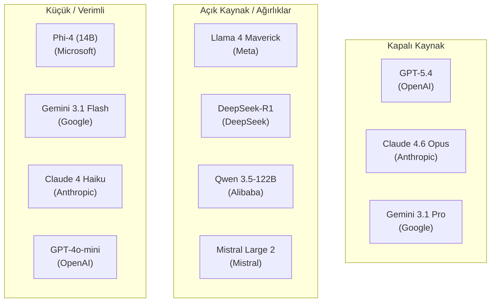

---

## Benchmark Karşılaştırmaları

### MMLU (Massive Multitask Language Understanding)

MMLU, 57 farklı akademik alanda (matematik, tarih, hukuk, tıp vb.) genel bilgiyi ölçen bir benchmark'tır.

| Model | MMLU Skoru | Kategori |
|-------|-----------|----------|
| GPT-5.4 | %91.2 | Kapalı kaynak |
| Claude 4.6 Opus | %90.8 | Kapalı kaynak |
| Gemini 3.1 Pro | %90.5 | Kapalı kaynak |
| DeepSeek-R1 | %90.2 | Açık kaynak |
| Qwen 3.5-122B | %88.5 | Açık kaynak |
| Llama 4 Maverick | %88.1 | Açık kaynak |
| Mistral Large 2 | %86.3 | Kapalı kaynak |
| Claude 4.6 Sonnet | %88.7 | Kapalı kaynak |
| Phi-4 (14B) | %82.5 | Açık kaynak (küçük) |

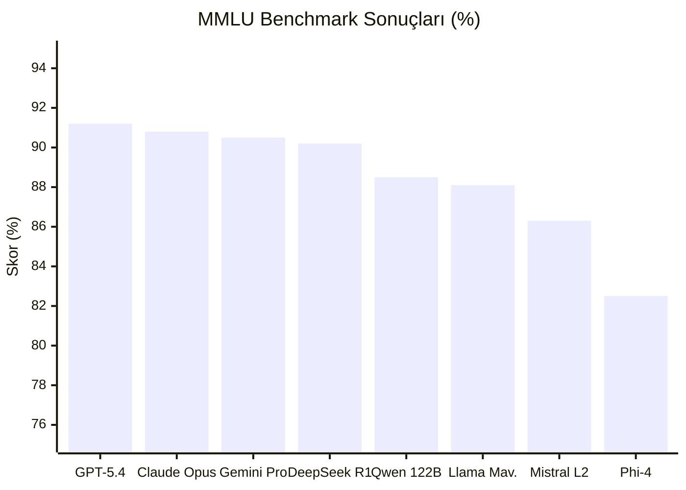

### HumanEval (Kod Üretme)

HumanEval, modelin Python programlama problemlerini çözme yeteneğini ölçer. Yazılım geliştiriciler için en kritik benchmark'tır.

| Model | HumanEval (pass@1) | Not |
|-------|---------------------|-----|
| Claude 4.6 Opus | %95.2 | Kodlama lideri |
| Claude 4.6 Sonnet | %94.1 | Fiyat/performans şampiyonu |
| GPT-5.4 | %93.8 | Güçlü rakip |
| DeepSeek-R1 | %92.5 | Açık kaynak lideri |
| Gemini 3.1 Pro | %93.1 | Yakın takip |
| o3 (reasoning) | %96.2 | Reasoning ile en yüksek |
| Qwen2.5-Coder 32B | %91.8 | Açık kaynak kod uzmanı |
| Llama 4 Maverick | %89.5 | Açık kaynak |
| Mistral Large 2 | %87.2 | Orta segment |
| Phi-4 (14B) | %80.3 | Boyutuna göre etkileyici |

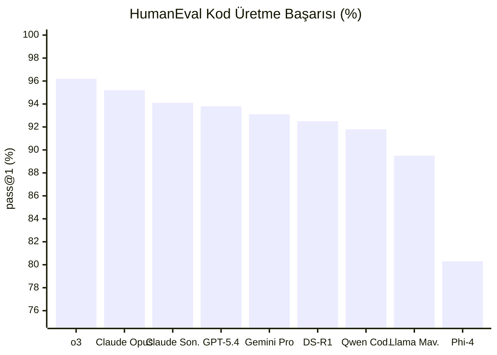

### SWE-bench (Gerçek Dünya Yazılım Mühendisliği)

SWE-bench, gerçek GitHub issue'larını çözme yeteneğini ölçer. En pratik kodlama benchmark'ıdır.

| Model | SWE-bench Verified | Not |
|-------|---------------------|-----|
| Claude 4.6 Sonnet | %72.5 | Claude Code'un motoru |
| Claude 4.6 Opus | %70.8 | Derin analiz |
| o3 | %69.3 | Reasoning avantajı |
| GPT-5.4 | %67.1 | Güçlü genel yetenek |
| DeepSeek-R1 | %65.8 | Açık kaynak en iyi |
| Gemini 3.1 Pro | %64.2 | Gelişen performans |
| Llama 4 Maverick | %58.5 | Açık kaynak |

> **Neden Claude Sonnet, Opus'tan yüksek?** SWE-bench'te Sonnet'in daha iyi performans göstermesi, bu modelin özellikle kodlama görevleri için optimize edilmesiyle açıklanır. Opus daha geniş bir yetenek yelpazesine sahiptir.

### MATH-500 (Matematik)

MATH-500, çok adımlı matematik problemlerini çözme yeteneğini ölçer.

| Model | MATH-500 (%) | Not |
|-------|-------------|-----|
| o3 | %97.8 | Reasoning modeli |
| DeepSeek-R1 | %96.3 | Reasoning modeli |
| o4-mini | %94.5 | Hızlı reasoning |
| GPT-5.4 | %92.1 | Genel model |
| Claude 4.6 Opus | %91.5 | Genel model |
| Gemini 3.1 Pro | %91.2 | Genel model |
| Qwen 3.5-122B | %88.7 | Açık kaynak |
| Phi-4 (14B) | %86.2 | Boyutuna göre çok iyi |

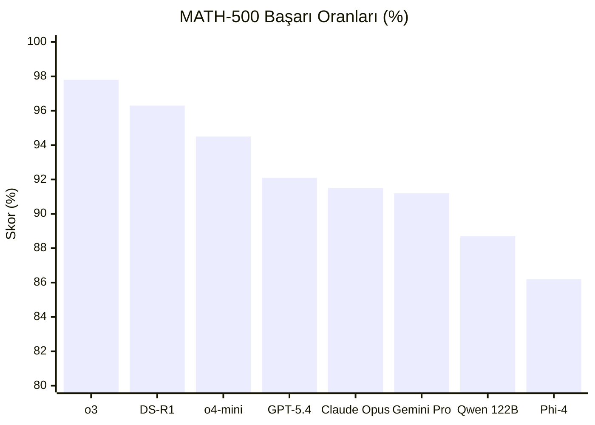

---

## Fiyatlandırma Karşılaştırması

### Amiral Gemisi Modeller (Output Fiyatı / 1M Token)

| Model | Input | Output | Output/Input Oranı |
|-------|-------|--------|---------------------|
| Claude 4.6 Opus | $15.00 | $75.00 | 5x |
| o3 | $10.00 | $40.00 | 4x |
| GPT-5 | $10.00 | $30.00 | 3x |
| Claude 4.6 Sonnet | $3.00 | $15.00 | 5x |
| Gemini 3.1 Pro | $3.50 | $10.50 | 3x |
| Mistral Large 2 | $2.00 | $6.00 | 3x |
| DeepSeek-R1 | $0.55 | $2.19 | 4x |
| Qwen 3.5-122B | $0.50 | $1.50 | 3x |

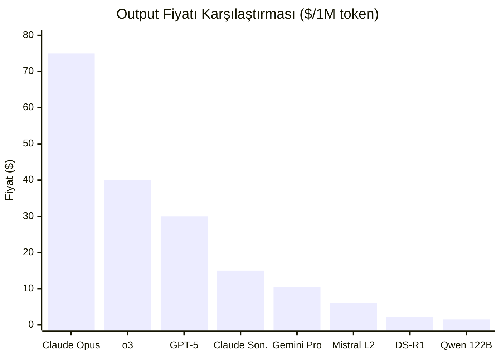

### Hızlı / Hafif Modeller (Output Fiyatı / 1M Token)

| Model | Input | Output |
|-------|-------|--------|
| Claude 4 Haiku | $0.80 | $4.00 |
| GPT-4o-mini | $0.15 | $0.60 |
| Gemini 3.1 Flash | $0.075 | $0.30 |
| DeepSeek-V3.2 | $0.27 | $1.10 |
| o4-mini | $1.10 | $4.40 |
| Mistral Small | $0.20 | $0.60 |

### Fiyat/Performans Analizi

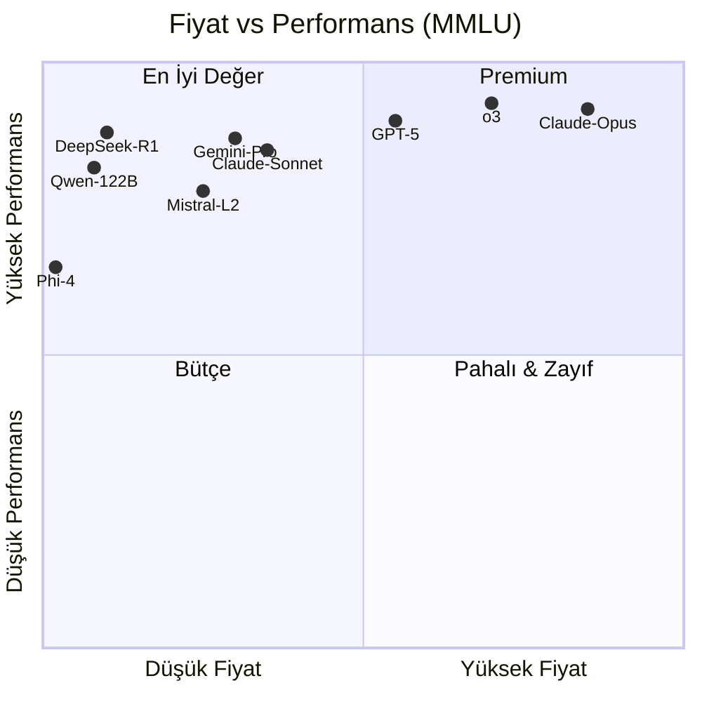

> **En iyi fiyat/performans:** DeepSeek-R1 ve Claude 4.6 Sonnet, farklı bütçe segmentlerinde en iyi fiyat/performans oranını sunar.

---

## Context Window Karşılaştırması

| Model | Context Window | Yaklaşık Sayfa | Pratik Kullanım |
|-------|----------------|----------------|-----------------|
| Llama 4 Scout | **10.000.000** | ~15.000 sayfa | Tüm kod tabanı analizi (deneysel) |
| Gemini 3.1 Pro | **2.000.000** | ~3.000 sayfa | Kitap boyutunda doküman işleme |
| Llama 4 Maverick | **1.000.000** | ~1.500 sayfa | Büyük proje analizi |
| GPT-5 / GPT-5.4 | 256.000 | ~385 sayfa | Geniş bağlam, çoklu dosya |
| Claude 4.6 Opus | 200.000 | ~300 sayfa | Proje bazlı analiz |
| Claude 4.6 Sonnet | 200.000 | ~300 sayfa | Kodlama ve analiz |
| DeepSeek-R1 | 128.000 | ~190 sayfa | Standart kullanım |
| Qwen 3.5-122B | 128.000 | ~190 sayfa | Standart kullanım |
| Mistral Large 2 | 128.000 | ~190 sayfa | Standart kullanım |
| Phi-4 | 16.000 | ~24 sayfa | Kısa bağlam görevleri |

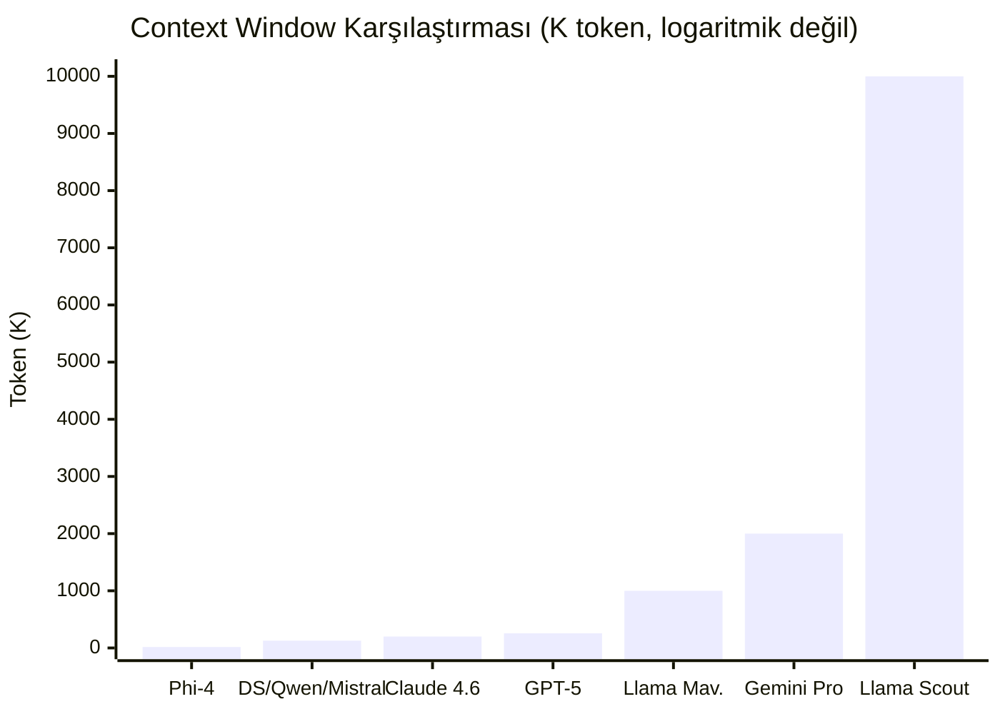

---

## Kullanım Senaryosuna Göre Model Önerileri

### Yazılım Geliştirme

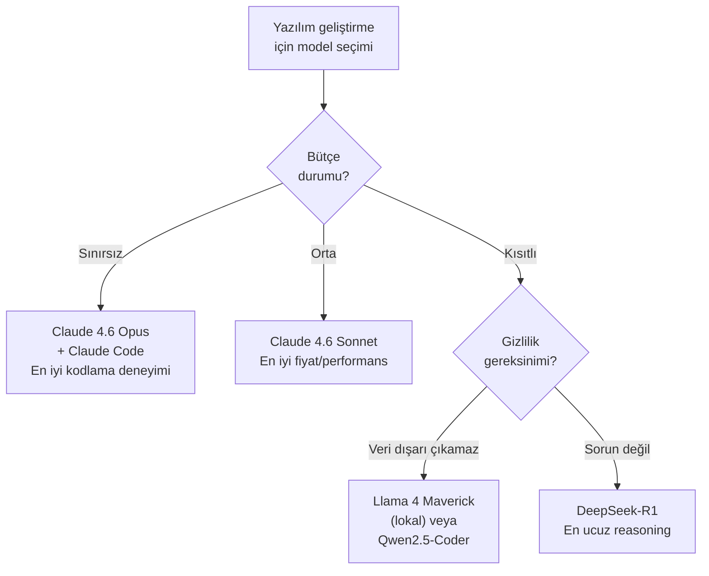

### Genel Amaçlı Kullanım

| Senaryo | Birincil Öneri | Alternatif | Neden? |
|---------|---------------|------------|--------|
| **Günlük soru-cevap** | ChatGPT (GPT-5) | Claude.ai | Geniş bilgi, hızlı yanıt |
| **Akademik araştırma** | Claude 4.6 Opus | o3 | Derin analiz, uzun yanıtlar |
| **Kod yazma (profesyonel)** | Claude 4.6 Sonnet + Claude Code | Codex CLI | SWE-bench lideri |
| **Kod yazma (hobi/öğrenme)** | DeepSeek-R1 | Qwen2.5-Coder | Ücretsiz/çok ucuz |
| **Matematik / bilim** | o3 | DeepSeek-R1 | Reasoning modelleri üstün |
| **Uzun doküman analizi** | Gemini 3.1 Pro | Llama 4 Scout | 2M context window |
| **Çok dilli içerik** | Qwen 3.5-122B | Gemini 3.1 Pro | 29+ dil desteği |
| **Görsel analiz** | Gemini 3.1 Pro | GPT-5.4 | Doğuştan multimodal |
| **Video analiz** | Gemini 3.1 Pro | — | Tek gerçek seçenek |
| **GDPR uyumlu kurumsal** | Mistral Large 2 | Cohere Command R+ | Avrupa'da veri barındırma |
| **Edge / mobil** | Phi-4 (14B) | Gemini Nano | Küçük boyut, lokal çalışma |
| **RAG uygulamaları** | Cohere Command R+ | Claude Sonnet | RAG optimize |
| **Maliyet optimizasyonu** | DeepSeek-V3.2 | Gemini Flash | En düşük token fiyatı |

### Kurumsal Kullanım

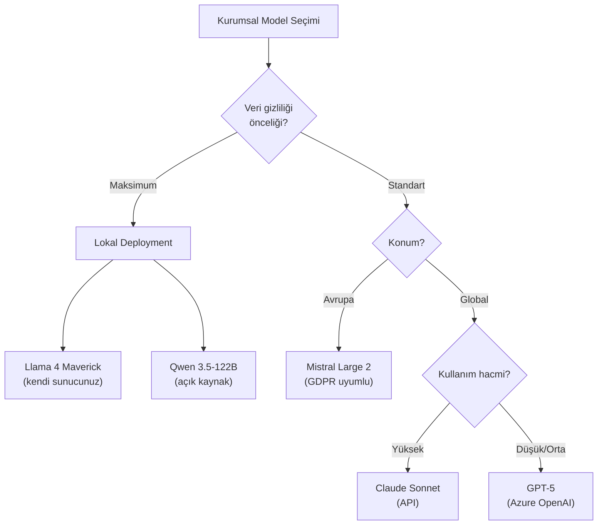

---

## Çok Boyutlu Karşılaştırma

### Yetenek Radar Analizi

Aşağıdaki tablo, her modelin farklı alanlardaki göreceli gücünü 10 üzerinden göstermektedir:

| Yetenek | GPT-5.4 | Claude 4.6 Opus | Gemini 3.1 Pro | DeepSeek-R1 | Llama 4 Mav. |
|---------|---------|-----------------|----------------|-------------|-------------|
| **Kodlama** | 9.3 | **9.7** | 9.0 | 9.1 | 8.5 |
| **Reasoning** | 9.0 | 9.2 | 9.0 | **9.5** | 8.0 |
| **Yaratıcı yazım** | **9.5** | 9.4 | 8.5 | 7.5 | 8.0 |
| **Çok dilli** | 9.0 | 8.5 | **9.5** | 8.0 | 8.5 |
| **Multimodal** | 9.0 | 8.0 | **9.8** | 7.0 | 7.5 |
| **Context uzunluğu** | 7.5 | 7.0 | **9.5** | 6.5 | 8.5 |
| **Fiyat/performans** | 6.0 | 5.5 | 8.0 | **9.5** | 8.5 |
| **Güvenlik** | 8.5 | **9.5** | 8.0 | 7.5 | 7.0 |
| **Ekosistem** | **9.5** | 8.5 | 9.0 | 6.0 | 8.0 |

### Sonuç Yorumları

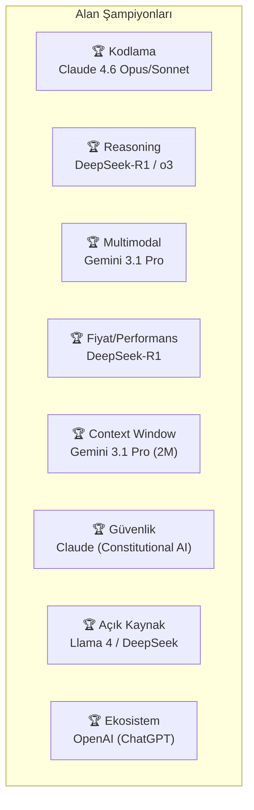

---

## Model Seçim Rehberi — Özet Akış

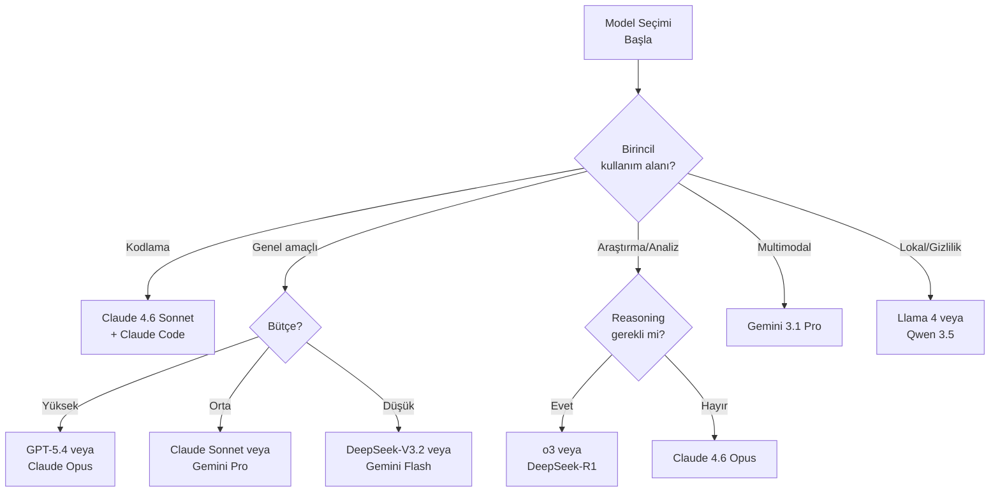

---

## Önemli Uyarılar

1. **Benchmark ≠ Gerçek Dünya:** Benchmark sonuçları kontrollü ortamlarda elde edilir. Gerçek kullanımda performans farklılık gösterebilir.

2. **Fiyatlar değişir:** Token fiyatları sık güncellenir. Güncel fiyatlar için her sağlayıcının resmi sitesini kontrol edin.

3. **Bir model hepsinde en iyi olamaz:** Her model farklı alanlarda öne çıkar. İhtiyacınıza göre seçim yapın.

4. **Açık kaynak ≠ Ücretsiz çalıştırma:** Açık kaynak modeller ücretsiz indirilebilir ancak çalıştırmak için GPU donanımı gerekir. Alternatif olarak, API sağlayıcıları (Together AI, Groq, AWS Bedrock) üzerinden kullanılabilir.

5. **Context window ≠ Kaliteli context kullanımı:** Büyük context window'a sahip olmak, modelin o bağlamdaki tüm bilgiyi eşit kalitede işleyeceği anlamına gelmez.

---

## Özet Tablosu

| Model | Şirket | Parametre | Context | MMLU | HumanEval | Output Fiyat |
|-------|--------|-----------|---------|------|-----------|-------------|
| GPT-5.4 | OpenAI | Gizli | 256K | %91.2 | %93.8 | $30 |
| o3 | OpenAI | Gizli | 200K | — | %96.2 | $40 |
| Claude 4.6 Opus | Anthropic | Gizli | 200K | %90.8 | %95.2 | $75 |
| Claude 4.6 Sonnet | Anthropic | Gizli | 200K | %88.7 | %94.1 | $15 |
| Gemini 3.1 Pro | Google | Gizli | 2M | %90.5 | %93.1 | $10.50 |
| Llama 4 Maverick | Meta | 400B | 1M | %88.1 | %89.5 | Ücretsiz* |
| DeepSeek-R1 | DeepSeek | 671B | 128K | %90.2 | %92.5 | $2.19 |
| Qwen 3.5-122B | Alibaba | 122B | 128K | %88.5 | %91.8 | $1.50 |
| Mistral Large 2 | Mistral | 123B | 128K | %86.3 | %87.2 | $6.00 |
| Phi-4 | Microsoft | 14B | 16K | %82.5 | %80.3 | Ücretsiz* |

*\* Açık kaynak modeller lokal çalıştırıldığında token başına ücret yoktur ancak donanım maliyeti vardır.*

---

## Bu Rehberin Odağı

Bu rehber bir **Claude Code el kitabı** olduğu için, bundan sonraki bölümlerde **Claude 4.6 Sonnet** (Claude Code'un varsayılan motoru) ve **Anthropic ekosistemi** üzerine yoğunlaşılacaktır.

Ancak Claude Code, model seçimini destekler — Gemini, GPT veya diğer modeller de kullanılabilir.

---

## Sonraki Adım

Tüm sağlayıcıları ve modellerini karşılaştırdık. Artık yapay zeka destekli yazılım geliştirme dünyasına adım atabiliriz:

→ [Bölüm 04 - Yapay Zeka Destekli Yazılım Geliştirme](../04-ai-destekli-gelistirme/README.md)

---

**← Önceki Bölüm:** [Bölüm 02 - Büyük Dil Modelleri](../02-buyuk-dil-modelleri/README.md)
