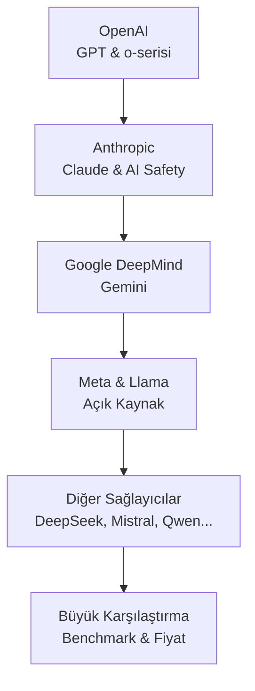
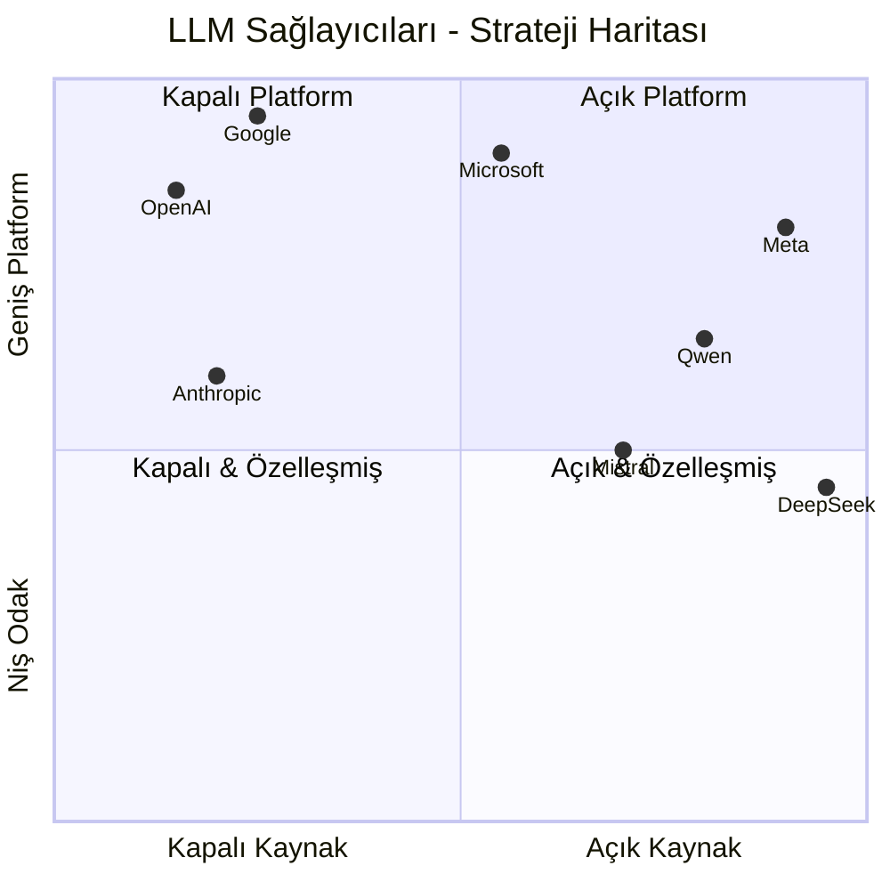

# Bölüm 03: LLM Sağlayıcıları ve Karşılaştırma

Büyük dil modellerini geliştiren şirketleri, stratejilerini, model ailelerini ve birbirleriyle karşılaştırmalarını inceliyoruz. Bu bölüm, doğru model seçiminde bilinçli kararlar vermenizi sağlayacak.

## Bu Bölümde Neler Öğreneceksiniz?

## İçerik

| # | Dosya | Konu | Süre |
|---|-------|------|------|
| 01 | [OpenAI](./01-openai.md) | Şirket tarihi, GPT-5.x serisi, o-serisi reasoning modeller, API, fiyatlandırma | ~15 dk |
| 02 | [Anthropic](./02-anthropic.md) | AI Safety felsefesi, Constitutional AI, Claude model serisi, sorumlu ölçekleme | ~15 dk |
| 03 | [Google DeepMind](./03-google-deepmind.md) | DeepMind birleşmesi, Gemini serisi, 2M context window, multimodal | ~12 dk |
| 04 | [Meta ve Llama](./04-meta-ve-llama.md) | Açık kaynak stratejisi, Llama evrimi, Scout & Maverick, ekosistem | ~12 dk |
| 05 | [Diğer Sağlayıcılar](./05-diger-saglayicilar.md) | DeepSeek, Qwen, Mistral, Microsoft Phi, Cohere, 01.AI Yi | ~15 dk |
| 06 | [Büyük Karşılaştırma](./06-buyuk-karsilastirma.md) | Benchmark tabloları, fiyat karşılaştırma, kullanım senaryoları | ~20 dk |

## Sağlayıcı Haritası

## Ön Koşullar

- [Bölüm 02 - Büyük Dil Modelleri](../02-buyuk-dil-modelleri/README.md)

## Sonraki Adım

→ [Bölüm 04 - Yapay Zeka Destekli Yazılım Geliştirme](../04-ai-destekli-gelistirme/README.md)
