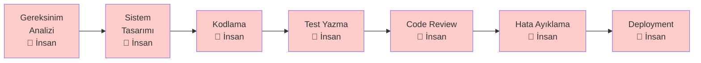
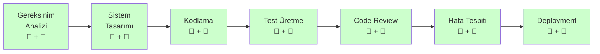
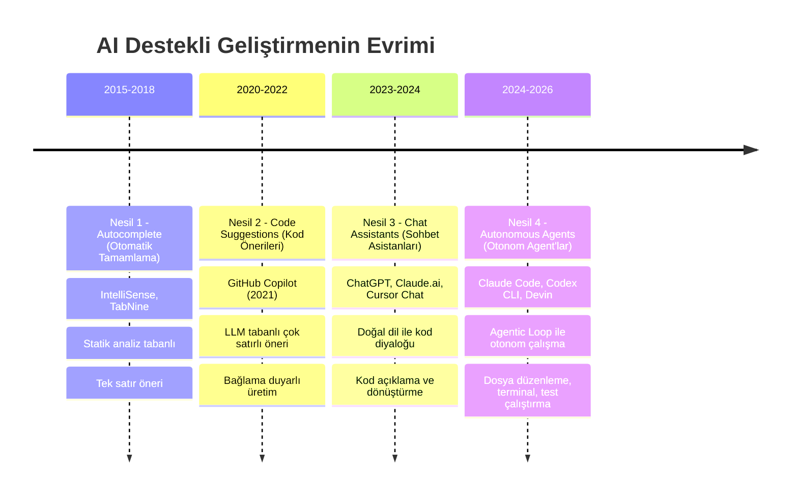
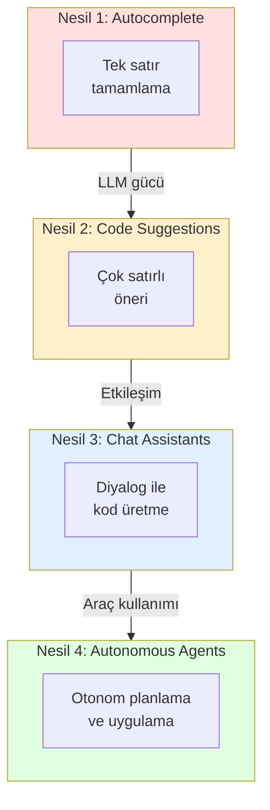
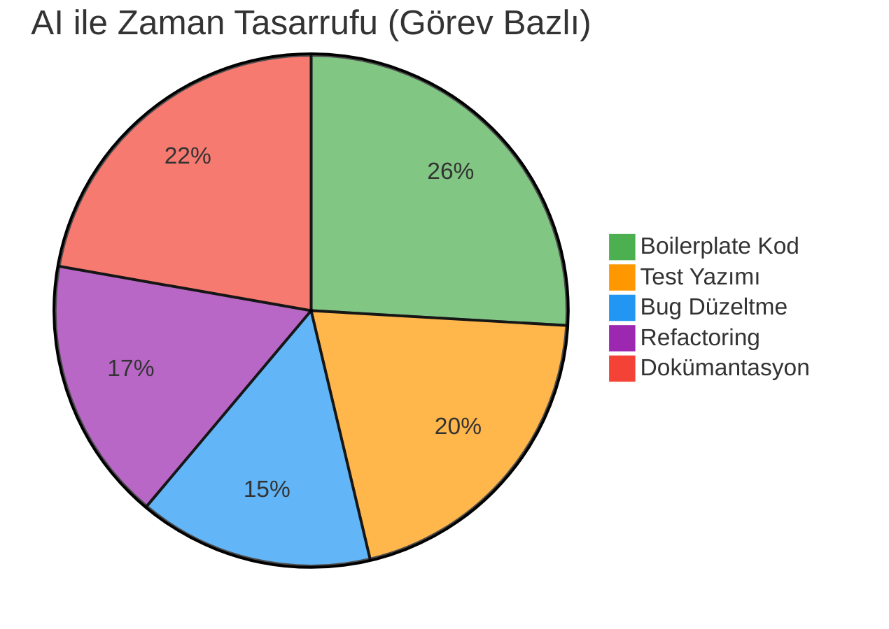
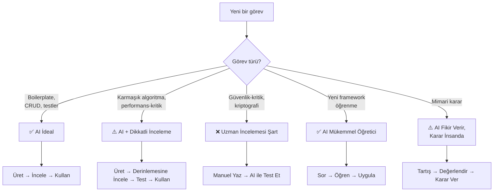

# AI Destekli Geliştirme Nedir?

AI-Assisted Development (yapay zeka destekli geliştirme), yazılım geliştirme sürecinin her aşamasında yapay zeka modellerinin aktif olarak kullanılmasıdır. Basit kod tamamlamadan otonom kodlama agent'larına kadar uzanan bu evrim, yazılımcıların çalışma biçimini kökten değiştirmektedir.

## Ön Koşullar

| Konu | Bölüm |
|------|-------|
| LLM nedir ve nasıl çalışır | [02 - Büyük Dil Modelleri](../02-buyuk-dil-modelleri/README.md) |
| LLM sağlayıcıları | [03 - LLM Sağlayıcıları](../03-llm-saglayicilari/README.md) |

---

## Geleneksel vs AI Destekli Geliştirme

### Geleneksel Yazılım Geliştirme

Geleneksel süreçte her adım insan emeğine bağlıdır:



### AI Destekli Yazılım Geliştirme

AI destekli süreçte birçok adım insan-AI işbirliğiyle yürütülür:



### Detaylı Karşılaştırma

| Boyut | Geleneksel Geliştirme | AI Destekli Geliştirme |
|-------|----------------------|----------------------|
| **Kod yazma** | Satır satır elle yazma | Doğal dille tarif, AI üretir |
| **Hata ayıklama** | Stack trace okuma, print debug | AI hata analizi ve düzeltme önerisi |
| **Test** | Manuel test senaryosu yazma | AI ile otomatik test üretimi |
| **Refactoring** | Manuel analiz ve yeniden yazım | AI ile otomatik yeniden yapılandırma |
| **Dokümantasyon** | Genellikle ihmal edilir | AI ile otomatik üretim |
| **Code Review** | İnsan gözüyle satır satır inceleme | AI ön tarama + insan onayı |
| **Öğrenme eğrisi** | Yeni framework = haftalarca çalışma | AI ile hızlandırılmış öğrenme |
| **Boilerplate** | Tekrarlayan kod elle yazılır | AI saniyeler içinde üretir |

---

## AI Destekli Geliştirmenin Evrimi

Otomatik tamamlamadan otonom agent'lara uzanan süreç dört nesil halinde ilerlemiştir:



### Nesil 1: Autocomplete (Otomatik Tamamlama) — 2015-2018

İlk nesil araçlar, statik kod analizi ve basit istatistiksel modeller kullanıyordu.

```
// Yazıyorsunuz:
document.getElem

// IDE öneriyor:
document.getElementById()
document.getElementsByClassName()
document.getElementsByTagName()
```

**Özellikler:**
- Mevcut API'lerin ve değişken isimlerinin tamamlanması
- Sözdizimi (syntax) tabanlı öneriler
- Proje bağlamından habersiz

### Nesil 2: Code Suggestions (Kod Önerileri) — 2020-2022

GitHub Copilot ile başlayan bu nesil, LLM gücüyle çok satırlı kod üretmeye başladı.

```python
# Yorum yazıyorsunuz:
# Fibonacci sayılarını hesaplayan fonksiyon

# Copilot öneriyor:
def fibonacci(n):
    if n <= 1:
        return n
    return fibonacci(n-1) + fibonacci(n-2)
```

**Özellikler:**
- Doğal dil yorumlarından kod üretme
- Çok satırlı öneriler
- Açık dosyalardan bağlam anlama
- Ancak hâlâ pasif: sadece yazdıkça öneri sunar

### Nesil 3: Chat Assistants (Sohbet Asistanları) — 2023-2024

Sohbet tabanlı araçlar, yazılımcıların doğal dille etkileşim kurmasını sağladı.

```
Kullanıcı: Bu fonksiyonu async/await kullanacak şekilde yeniden yaz 
           ve hata yönetimi ekle.

Asistan:   İşte dönüştürülmüş versiyon:

           async function fetchUserData(userId: string): Promise<User> {
             try {
               const response = await fetch(`/api/users/${userId}`);
               if (!response.ok) {
                 throw new Error(`HTTP ${response.status}`);
               }
               return await response.json();
             } catch (error) {
               console.error('Kullanıcı verisi alınamadı:', error);
               throw error;
             }
           }
```

**Özellikler:**
- Diyalog tabanlı etkileşim
- Kod açıklama, dönüştürme, hata bulma
- Birden fazla dosya hakkında konuşabilme
- Ancak hâlâ reaktif: sadece sorulduğunda yanıt verir, dosya değiştiremez

### Nesil 4: Autonomous Agents (Otonom Agent'lar) — 2024-2026

Agent tabanlı araçlar, proaktif olarak dosya oluşturabilir, düzenleyebilir, terminal komutları çalıştırabilir ve test koşturabilir.

```
Kullanıcı: Bu projeye kullanıcı kimlik doğrulama sistemi ekle. 
           JWT kullan, refresh token desteği olsun.

Agent:     Planımı oluşturuyorum...
           
           1. ✅ auth/ modülü oluşturuldu
           2. ✅ User modeli güncellendi  
           3. ✅ JWT middleware yazıldı
           4. ✅ Login/Register endpoint'leri eklendi
           5. ✅ Refresh token mekanizması implemente edildi
           6. ✅ 12 birim testi yazıldı ve çalıştırıldı (12/12 geçti)
           7. ✅ API dokümantasyonu güncellendi
```

**Özellikler:**
- Otonom planlama ve uygulama
- Dosya sistemi ve terminal erişimi
- Test çalıştırma ve sonuçlardan öğrenme
- Hata tespit ve otomatik düzeltme döngüsü (Agentic Loop)
- İnsan onayı ile kontrollü ilerleme

---

## Nesiller Arası Karşılaştırma



| Özellik | Nesil 1 | Nesil 2 | Nesil 3 | Nesil 4 |
|---------|---------|---------|---------|---------|
| **Tetikleyici** | Yazarken | Yazarken | Soru sorma | Görev verme |
| **Çıktı** | Tek satır | Çok satır | Kod bloğu | Tam özellik |
| **Dosya erişimi** | Yok | Açık dosya | Yapıştırılan kod | Tüm proje |
| **Terminal** | Yok | Yok | Yok | Tam erişim |
| **Öğrenme** | Yok | Sınırlı | Oturum içi | Oturum + bellek |
| **Otonom karar** | Yok | Yok | Yok | Var |
| **Örnek araç** | IntelliSense | Copilot | ChatGPT | Claude Code |

---

## Üretkenlik Kazanımları

AI destekli geliştirmenin somut etkilerini gösteren araştırma ve endüstri verileri:

### Akademik Araştırmalar

| Araştırma | Sonuç |
|-----------|-------|
| GitHub (2022) - Copilot Çalışması | Copilot kullanan geliştiriciler görevleri **%55 daha hızlı** tamamladı |
| McKinsey (2023) | AI araçları ile kod üretim hızında **%35-45 artış** |
| Google (2024) - İç Araştırma | AI destekli kod incelemede **%30 zaman tasarrufu** |
| Stanford HAI (2024) | Junior geliştiricilerde **%43 üretkenlik artışı** |

### Görev Bazlı Kazanımlar



### Pratik Örnek: Aynı Görev, İki Yaklaşım

**Görev:** REST API endpoint'i yazma (CRUD işlemleri, validasyon, hata yönetimi, testler)

| Metrik | Geleneksel | AI Destekli | Kazanım |
|--------|-----------|-------------|---------|
| Süre | ~4 saat | ~45 dakika | **5.3x** hızlı |
| Yazılan test | 3-5 test | 12-15 test | **3x** daha kapsamlı |
| Bug oranı | Orta | Düşük-Orta | Benzer |
| Dokümantasyon | Genellikle atlanır | Otomatik üretilir | **∞** iyileştirme |

---

## AI Destekli Geliştirmenin Sınırları

AI güçlü bir araçtır, ancak sınırsız değildir:

### Dikkat Edilmesi Gerekenler

| Risk | Açıklama | Önlem |
|------|----------|-------|
| **Hallucination (halüsinasyon)** | AI var olmayan API veya kütüphane uydurabilir | Üretilen kodu mutlaka doğrulayın |
| **Güvenlik açıkları** | AI ürettiği kodun %45'inde güvenlik zafiyeti olabilir | Güvenlik taraması şart |
| **Bağlam sınırı** | Context window dolduğunda performans düşer | Büyük görevleri parçalayın |
| **Aşırı güven** | Kodu anlamadan kullanmak teknik borç yaratır | Üretilen kodu mutlaka inceleyin |
| **Lisans riski** | AI, lisanslı kodu yeniden üretebilir | Lisans taraması yapın |

### Ne Zaman AI Kullanmalı, Ne Zaman Kullanmamalı?



---

## Özet

| Kavram | Açıklama |
|--------|----------|
| **AI-Assisted Development** | Yazılım sürecinde AI'nin aktif kullanımı |
| **Autocomplete** | İlk nesil: tek satır tamamlama |
| **Code Suggestions** | İkinci nesil: LLM tabanlı çok satırlı öneriler |
| **Chat Assistants** | Üçüncü nesil: diyalog tabanlı kodlama yardımı |
| **Autonomous Agents** | Dördüncü nesil: otonom planlama ve uygulama |
| **Productivity Gains** | Görev türüne göre %40-70 zaman tasarrufu |

---

## Sonraki Adım

AI destekli geliştirmenin ne olduğunu ve nasıl evrildiğini anladık. Şimdi bu evrimin en ileri noktası olan AI Agent kavramını ve Agentic Workflow yapısını inceleyelim:

→ [AI Agent ve Agentic Workflow](./02-ai-agent-ve-agentic-workflow.md)
