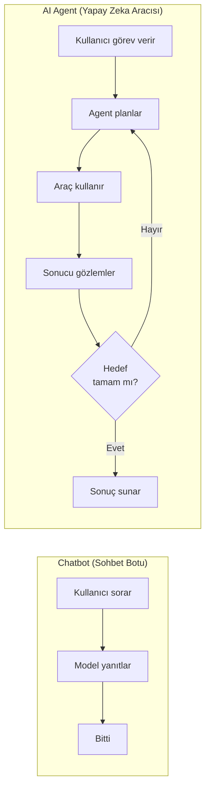
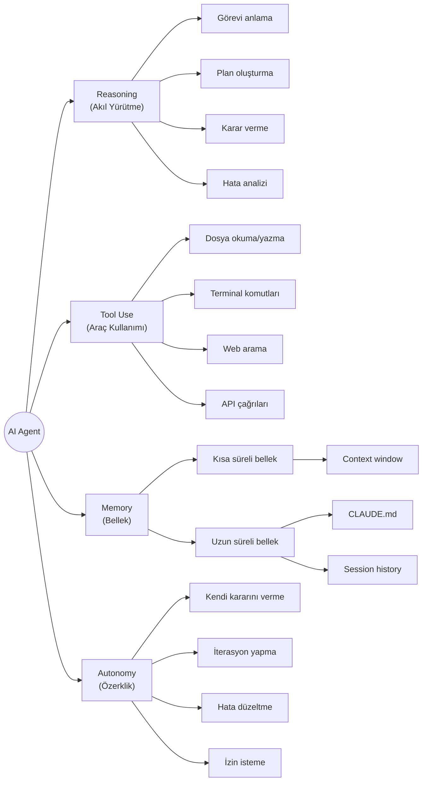
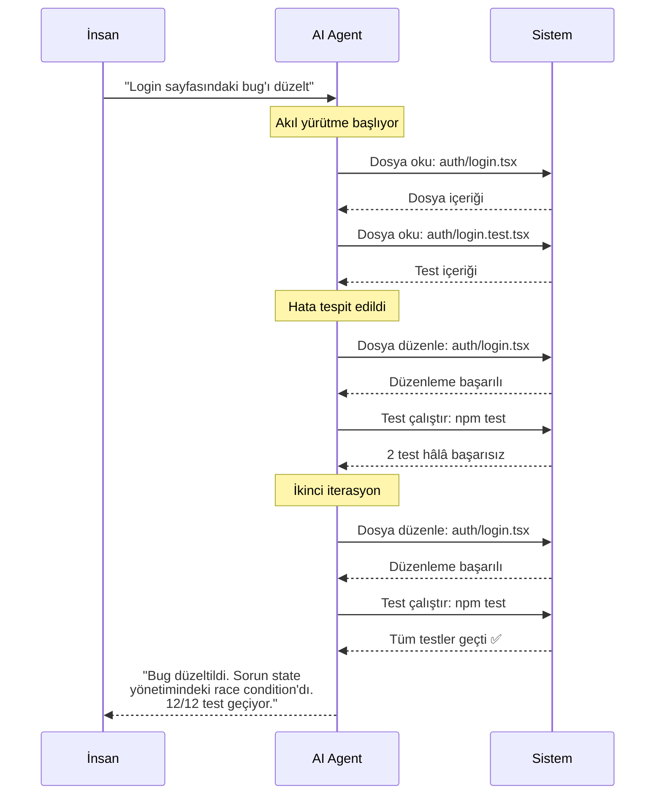
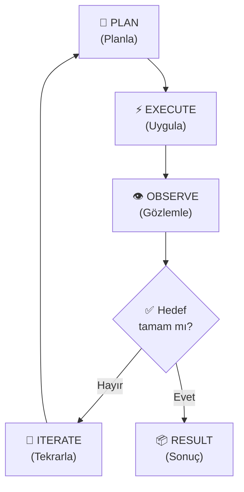
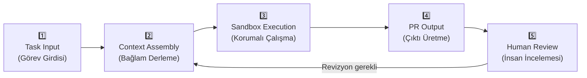
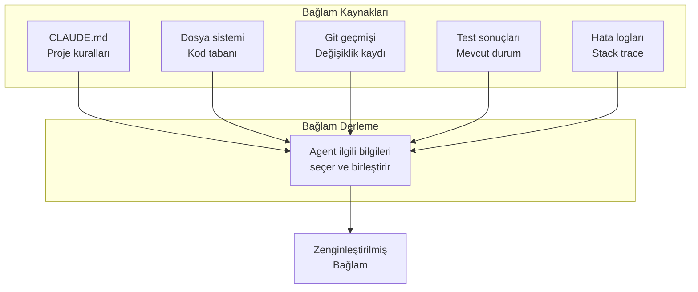
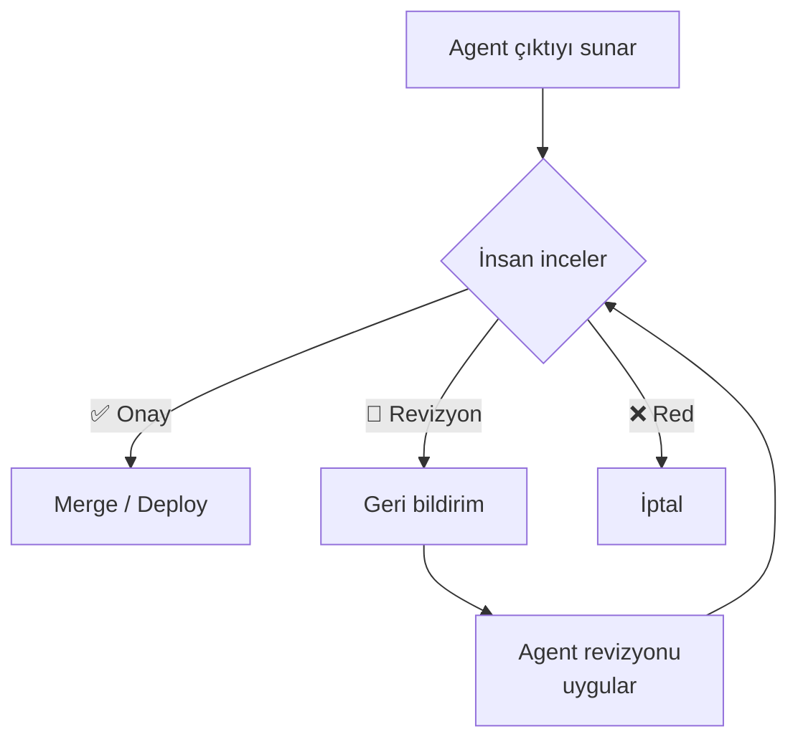
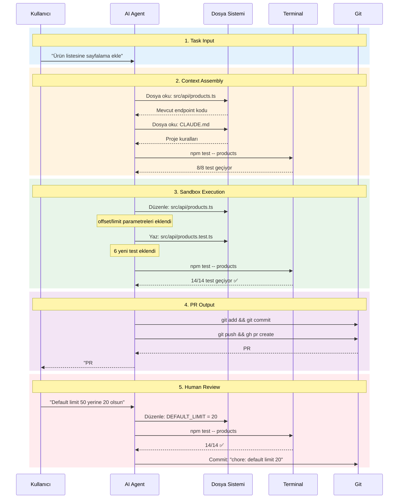
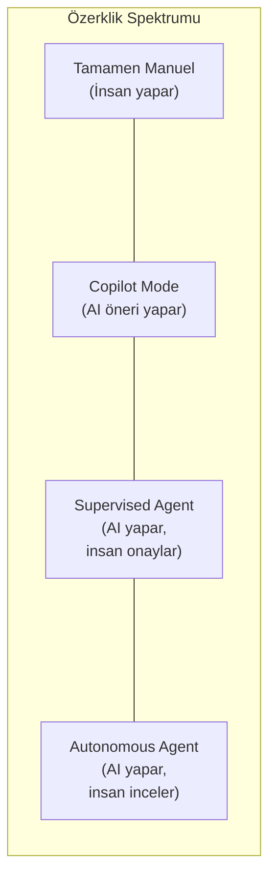

# AI Agent ve Agentic Workflow

AI Agent (yapay zeka aracısı), bir görevi otonom olarak planlayabilen, uygulayabilen, sonuçları gözlemleyebilen ve gerektiğinde tekrar deneyebilen yapay zeka sistemidir. Agentic Workflow (aracı tabanlı iş akışı), bu otonom döngünün yapılandırılmış halidir ve modern AI kodlama araçlarının temelini oluşturur.

## Ön Koşullar

| Konu | Bölüm |
|------|-------|
| AI destekli geliştirme kavramı | [AI Destekli Geliştirme Nedir?](./01-ai-destekli-gelistirme-nedir.md) |
| LLM nasıl çalışır | [02 - Büyük Dil Modelleri](../02-buyuk-dil-modelleri/README.md) |

---

## AI Agent Nedir?

Geleneksel bir LLM'ye soru sorduğunuzda tek bir yanıt alırsınız. Bir AI Agent ise bu yanıtla yetinmez: planlar yapar, araçlar kullanır, sonuçları değerlendirir ve hedefe ulaşana kadar iterasyon yapar.

### Chatbot vs AI Agent



| Özellik | Chatbot | AI Agent |
|---------|---------|----------|
| **Etkileşim** | Soru → Yanıt | Görev → Otonom çalışma |
| **Araç kullanımı** | Yok | Dosya, terminal, web, API |
| **Bellek** | Oturum içi sınırlı | Kalıcı bellek (CLAUDE.md vb.) |
| **Planlama** | Yok | Çok adımlı plan oluşturma |
| **Hata düzeltme** | "Şunu dene" der | Kendisi dener ve düzeltir |
| **İterasyon** | Manuel | Otomatik |
| **Örnek** | ChatGPT web, Claude.ai | Claude Code, Codex CLI |

---

## AI Agent'ın 4 Temel Yeteneği

Bir AI Agent'ı chatbot'tan ayıran dört temel yetenek vardır:



### 1. Reasoning (Akıl Yürütme)

Agent, görevi anlamak ve plan oluşturmak için akıl yürütme yeteneğine sahiptir:

```
Görev: "Kullanıcı profil sayfasına avatar yükleme özelliği ekle"

Agent'ın düşünce süreci:
├── 1. Mevcut User modelini incele (avatar alanı var mı?)
├── 2. Dosya yükleme altyapısını kontrol et (multer, S3 vb.)
├── 3. Gerekli değişiklikleri planla:
│   ├── User modeline avatar alanı ekle
│   ├── Upload endpoint'i oluştur
│   ├── Frontend'de yükleme bileşeni ekle
│   └── Testleri yaz
└── 4. Uygulama sırasını belirle
```

### 2. Tool Use (Araç Kullanımı)

Agent, çeşitli araçları kullanarak gerçek dünyada değişiklik yapabilir:

```
Agent'ın kullanabildiği araçlar:
├── 📁 Dosya İşlemleri
│   ├── Dosya okuma (Read)
│   ├── Dosya yazma (Write)
│   ├── Dosya arama (Glob, Grep)
│   └── Dosya düzenleme (Edit)
├── 💻 Terminal
│   ├── Komut çalıştırma (Bash)
│   ├── Test koşturma (npm test, pytest)
│   └── Build işlemleri
├── 🌐 Web
│   ├── Dokümantasyon okuma
│   └── API referansı arama
└── 🔧 Diğer
    ├── LSP (dil sunucusu)
    ├── Git işlemleri
    └── MCP sunucuları
```

### 3. Memory (Bellek)

Agent, farklı bellek katmanları sayesinde bağlamı korur:

| Bellek Türü | Kapsam | Süre | Örnek |
|-------------|--------|------|-------|
| **Context Window** | Mevcut oturum | Oturum boyunca | Son konuşma, dosya içerikleri |
| **CLAUDE.md** | Proje düzeyinde | Kalıcı | Proje kuralları, mimari kararlar |
| **Session Memory** | Oturum geçmişi | Oturumlar arası | Önceki oturumların özeti |
| **Auto Memory** | Öğrenilmiş bilgi | Kalıcı | Kullanıcı tercihleri |

### 4. Autonomy (Özerklik)

Agent, insan müdahalesi olmadan kararlar alıp uygulayabilir:



---

## Agentic Loop (Aracı Döngüsü)

AI Agent'ların çalışma prensibi, sürekli tekrarlanan bir döngüye dayanır. Bu döngüye Agentic Loop denir.

### Temel Döngü: Plan → Execute → Observe → Iterate



### Döngünün Her Adımı

**1. Plan (Planla)**
- Görevi alt görevlere böl
- Hangi araçlara ihtiyaç olduğunu belirle
- Uygulama sırasını oluştur

**2. Execute (Uygula)**
- Plana göre araçları çalıştır
- Dosya oku, düzenle, oluştur
- Terminal komutları çalıştır

**3. Observe (Gözlemle)**
- Araç çıktılarını oku
- Hata mesajlarını analiz et
- Test sonuçlarını değerlendir

**4. Iterate (Tekrarla)**
- Başarısız adımları yeniden planla
- Hataları düzelt
- Yaklaşımı değiştir

### Pratik Örnek: Agentic Loop Uygulamada

```
Görev: "users tablosuna email validasyonu ekle"

─── İterasyon 1 ────────────────────────────
PLAN:   User modelini bul ve incele
EXEC:   grep -r "class User" src/
OBSERVE: src/models/user.ts bulundu

─── İterasyon 2 ────────────────────────────
PLAN:   Mevcut validasyonu incele
EXEC:   read src/models/user.ts
OBSERVE: Email alanı var, validasyon yok

─── İterasyon 3 ────────────────────────────
PLAN:   Email validasyonu ekle
EXEC:   edit src/models/user.ts → regex validasyon eklendi
OBSERVE: Dosya güncellendi

─── İterasyon 4 ────────────────────────────
PLAN:   Test yaz ve çalıştır
EXEC:   write src/models/user.test.ts → 5 test senaryosu
        run npm test
OBSERVE: 4/5 test geçti, 1 test başarısız
         (uluslararası domain uzantıları)

─── İterasyon 5 ────────────────────────────
PLAN:   Regex'i düzelt (uluslararası domain)
EXEC:   edit src/models/user.ts → regex güncellendi
        run npm test
OBSERVE: 5/5 test geçti ✅

RESULT: Email validasyonu eklendi, 5 test yazıldı ve geçiyor.
```

---

## Agentic Workflow'un 5 Bileşeni

Tam bir Agentic Workflow, aşağıdaki beş bileşenden oluşur:



### 1. Task Input (Görev Girdisi)

Kullanıcının agent'a verdiği görev tanımıdır. Ne kadar spesifik olursa, sonuç o kadar iyi olur.

| Girdi Kalitesi | Örnek | Sonuç |
|----------------|-------|-------|
| **Kötü** | "Bir şeyleri düzelt" | Agent ne yapacağını bilemez |
| **Orta** | "Login'deki bug'ı düzelt" | Agent arar, birden fazla sorun bulabilir |
| **İyi** | "Login sayfasında email validasyonu eksik, kullanıcı @ işareti olmadan giriş yapabiliyor" | Agent tam olarak sorunu anlar |
| **Mükemmel** | "src/auth/login.tsx dosyasında email input'unda validasyon yok. RFC 5322 standardına uygun regex ekle ve 5 edge-case testi yaz" | Agent spesifik talimatla çalışır |

### 2. Context Assembly (Bağlam Derleme)

Agent, görevi anlamak için gerekli bağlamı derler:



**Bağlam derleme süreci:**
1. CLAUDE.md dosyasını oku → Proje kurallarını öğren
2. İlgili dosyaları bul → Kod tabanını tara
3. Git geçmişine bak → Son değişiklikleri incele
4. Mevcut testleri çalıştır → Başlangıç durumunu belirle
5. Hata loglarını oku → Sorunun kaynağını anla

### 3. Sandbox Execution (Korumalı Çalışma)

Agent, değişikliklerini güvenli bir ortamda yapar:

```
Güvenlik Katmanları:
├── 🔒 İzin Sistemi
│   ├── Dosya yazma izni gerekli
│   ├── Terminal komutu izni gerekli
│   └── Ağ erişimi izni gerekli
├── 🏖️ Sandbox
│   ├── İzole çalışma ortamı
│   ├── Git branch üzerinde çalışma
│   └── Geri alınabilir değişiklikler
└── ✅ Doğrulama
    ├── Lint kontrolü
    ├── Type checking
    └── Test çalıştırma
```

### 4. PR Output (Çıktı Üretme)

Agent, çalışmasının sonucunu yapılandırılmış bir çıktı olarak sunar:

```
Çıktı Türleri:
├── 📝 Kod Değişiklikleri
│   ├── Yeni dosyalar
│   ├── Düzenlenmiş dosyalar
│   └── Silinen dosyalar
├── 🧪 Test Sonuçları
│   ├── Kaç test yazıldı
│   ├── Kaçı geçti/kaldı
│   └── Coverage raporu
├── 📋 Özet
│   ├── Yapılan değişiklikler listesi
│   ├── Tasarım kararları açıklaması
│   └── Bilinen sınırlamalar
└── 🔀 PR / Commit
    ├── Anlamlı commit mesajı
    ├── PR açıklaması
    └── Reviewer ataması
```

### 5. Human Review (İnsan İncelemesi)

Son karar her zaman insandadır:



**İnceleme kontrol listesi:**
- [ ] Kod değişiklikleri mantıklı mı?
- [ ] Güvenlik açığı var mı?
- [ ] Performans sorunları olabilir mi?
- [ ] Testler yeterli mi?
- [ ] Mimari kararlara uygun mu?
- [ ] Edge case'ler düşünülmüş mü?

---

## Agentic Workflow Tam Akış Örneği

Gerçek bir görevin tüm aşamalarından geçişi:



---

## Otonom Kodlama: Fırsatlar ve Sınırlar

### Agent Ne Kadar Otonom Olmalı?



| Seviye | Açıklama | Risk | Kullanım Alanı |
|--------|----------|------|----------------|
| **Manuel** | İnsan her şeyi yapar | Yavaş ama güvenli | Kritik sistemler |
| **Copilot** | AI öneri sunar, insan karar verir | Düşük risk | Günlük geliştirme |
| **Supervised** | AI yapar, her adımda onay ister | Orta risk | Çoğu görev için ideal |
| **Autonomous** | AI yapar, sonunda insan inceler | Yüksek risk | Rutin görevler |

> **Tavsiye:** Claude Code varsayılan olarak "Supervised Agent" modunda çalışır. Dosya yazma ve terminal komutları için izin ister. Bu denge, çoğu senaryo için idealdir.

---

## Özet

| Kavram | Açıklama |
|--------|----------|
| **AI Agent** | Otonom planlama, uygulama ve iterasyon yapabilen AI sistemi |
| **Agentic Loop** | Plan → Execute → Observe → Iterate döngüsü |
| **Tool Use** | Agent'ın dosya, terminal, web gibi araçları kullanabilmesi |
| **Context Assembly** | Görev için gerekli bağlam bilgisinin derlenmesi |
| **Sandbox Execution** | Korumalı ortamda güvenli çalışma |
| **Human Review** | Son kararın insanda kalması ilkesi |

---

## Sonraki Adım

AI Agent'ların nasıl çalıştığını anladık. Şimdi bu kavramlarla doğrudan bağlantılı olan "Vibe Coding" yaklaşımını inceleyelim:

→ [Vibe Coding](./03-vibe-coding.md)
