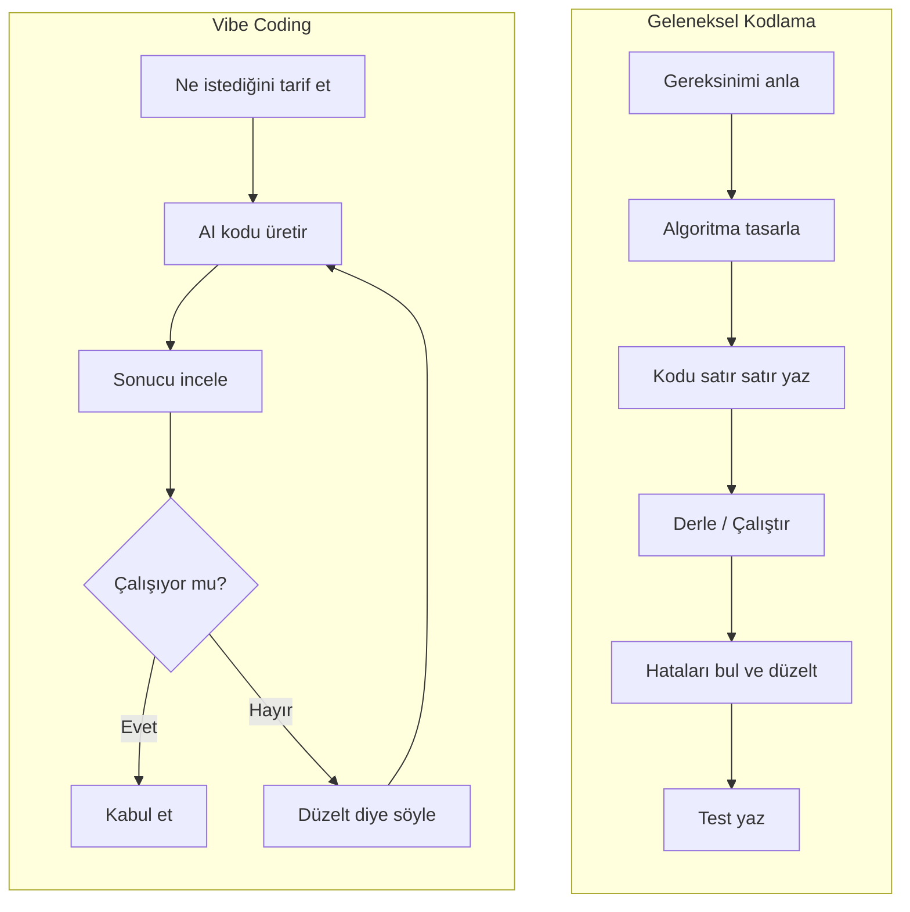
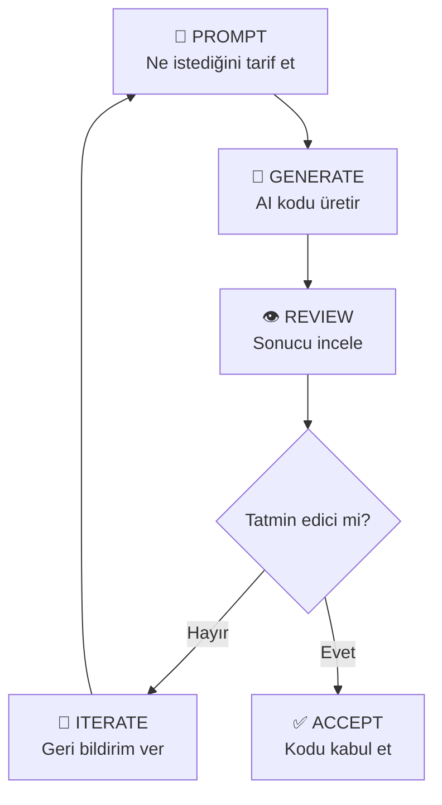
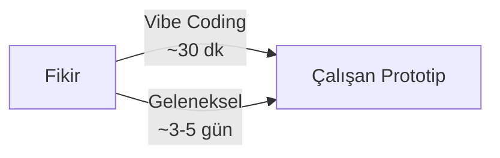
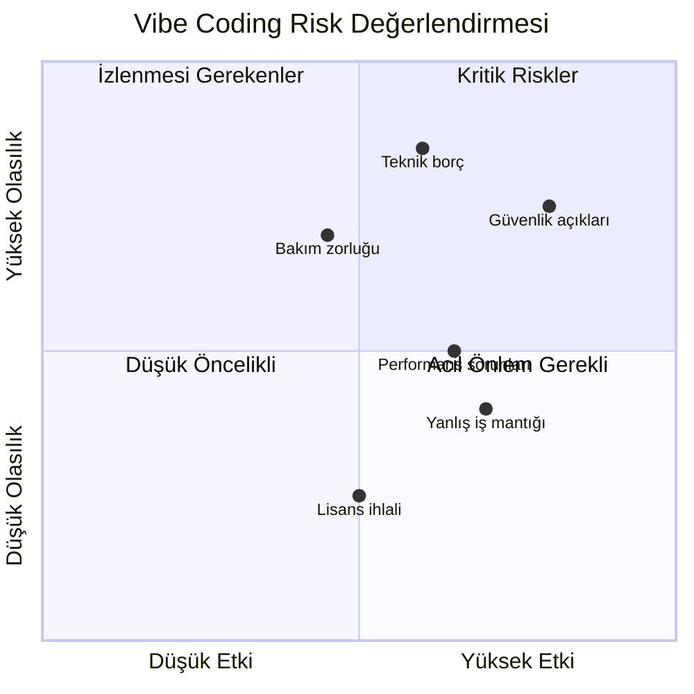
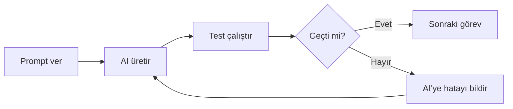
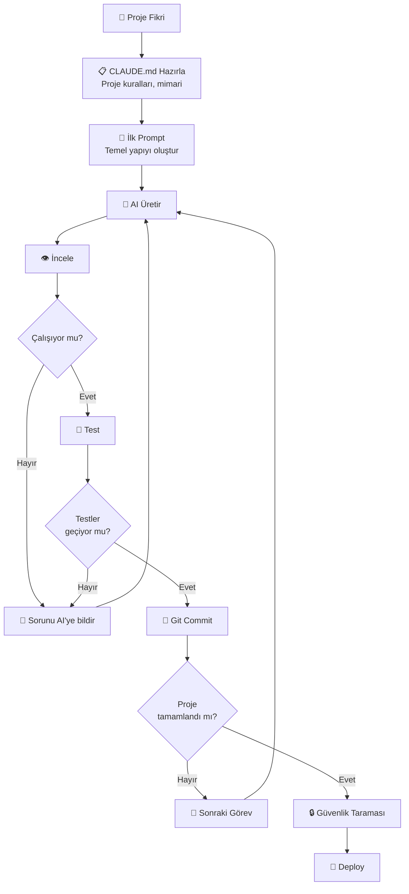

# Vibe Coding

Vibe Coding (havayı hissederek kodlama), Andrej Karpathy tarafından Şubat 2025'te ortaya atılan bir kavramdır. Geleneksel yazılım geliştirmenin aksine, kodun satır satır yazılması yerine doğal dille tarif edilmesi ve AI'nin üretmesi yaklaşımını ifade eder. "Tamamen havaya kapılıyor, üstel gelişmeyi benimsiyor ve kodun ne yaptığını tam olarak unutuyorsunuz" diyen Karpathy, bu yeni kodlama paradigmasını tanımlamıştır.

## Ön Koşullar

| Konu | Bölüm |
|------|-------|
| AI destekli geliştirme kavramı | [AI Destekli Geliştirme Nedir?](./01-ai-destekli-gelistirme-nedir.md) |
| AI Agent ve Agentic Workflow | [AI Agent ve Agentic Workflow](./02-ai-agent-ve-agentic-workflow.md) |

---

## Vibe Coding Nedir?

Vibe Coding, yazılımcının (veya yazılımcı olmayanın) doğal dil ile ne istediğini tarif etmesi ve AI'nin bu tarifi çalışan koda dönüştürmesi yaklaşımıdır.

### Andrej Karpathy'nin Tanımı

> *"There's a new kind of coding I call 'vibe coding', where you fully give in to the vibes, embrace exponentials, and forget that the code even exists."*
>
> — Andrej Karpathy, Şubat 2025

### Geleneksel Kodlama vs Vibe Coding



| Boyut | Geleneksel Kodlama | Vibe Coding |
|-------|-------------------|-------------|
| **Giriş** | Sözdizimi bilgisi gerekli | Doğal dil yeterli |
| **Odak** | Nasıl yapılacağı (HOW) | Ne yapılacağı (WHAT) |
| **Hız** | Satır satır ilerleme | Dakikalar içinde prototip |
| **Kontrol** | Tam kontrol | AI'ye güven |
| **Anlama** | Her satırı bilirsiniz | Genel işlevselliği bilirsiniz |
| **Kim için** | Yazılımcılar | Herkes (potansiyel olarak) |

---

## Vibe Coding Nasıl Çalışır?

### Temel Döngü: Prompt → Generate → Review → Iterate



### Adım Adım Bir Vibe Coding Oturumu

**Senaryo:** Kişisel blog sitesi oluşturma

```
──── Prompt 1 ──────────────────────────────
Kullanıcı: "Next.js ile minimalist bir kişisel blog sitesi oluştur. 
            Ana sayfada son yazılar listesi, her yazının detay sayfası 
            ve hakkımda sayfası olsun. Tailwind CSS kullan."

AI:        [12 dosya oluşturur: layout, sayfalar, bileşenler, stiller]

──── Review ────────────────────────────────
Kullanıcı: (Çalıştırır, bakar) Ana sayfa güzel ama 
           yazı kartlarında tarih formatı yanlış.

──── Prompt 2 ──────────────────────────────
Kullanıcı: "Tarih formatını '15 Mart 2026' şeklinde Türkçe göster"

AI:        [date-fns/locale/tr ekler, format günceller]

──── Review ────────────────────────────────
Kullanıcı: (Bakar) Tamam, şimdi dark mode desteği ekle.

──── Prompt 3 ──────────────────────────────
Kullanıcı: "Dark mode toggle ekle, sistem tercihini varsayılan al"

AI:        [ThemeProvider, toggle bileşeni, CSS değişkenleri ekler]

──── Sonuç ─────────────────────────────────
~15 dakikada çalışan bir blog sitesi hazır.
```

---

## Vibe Coding'in Avantajları

### 1. Hızlı Prototipleme



- Dakikalar içinde MVP (Minimum Viable Product) oluşturma
- Fikri hızla test etme imkânı
- Yatırımcıya/müşteriye gösterebileceğiniz demo

### 2. Erişilebilirlik

- Yazılım bilgisi olmayan kişiler de uygulama oluşturabilir
- Alan uzmanları kendi araçlarını yapabilir (doktor, avukat, öğretmen)
- Girişimciler teknik kurucu olmadan prototip üretebilir

### 3. Yaratıcı Keşif

- "Ya şöyle olsa?" sorularını saniyeler içinde deneme
- Farklı yaklaşımları hızla karşılaştırma
- Teknik sınırlamalar yerine ürün vizyonuna odaklanma

### 4. Öğrenme Aracı

- Yeni framework ve dilleri AI ile keşfetme
- Üretilen kodu inceleyerek öğrenme
- Gerçek projeler üzerinde pratik yapma

---

## Vibe Coding'in Riskleri ve Sınırları

### Kritik İstatistik

> **Uyarı:** GitGuardian'ın 2025 araştırmasına göre AI tarafından üretilen kodun yaklaşık **%45'inde güvenlik zafiyeti** tespit edilmiştir. Vibe Coding yaparken güvenlik incelemesi hayati önem taşır.

### Risk Matrisi



### Detaylı Risk Tablosu

| Risk | Açıklama | Olasılık | Etki | Önlem |
|------|----------|----------|------|-------|
| **Güvenlik açıkları** | SQL injection, XSS, CSRF gibi zafiyetler | Yüksek | Kritik | Güvenlik taraması, manuel inceleme |
| **Teknik borç** | Anlaşılmayan, bakımı zor kod birikimi | Çok yüksek | Yüksek | Kodu anlayarak kabul etme |
| **Hallucination** | Var olmayan API veya kütüphane kullanımı | Orta | Orta | Her çıktıyı doğrulama |
| **Performans** | N+1 sorgu, gereksiz render, bellek sızıntısı | Orta | Yüksek | Performans testi |
| **Ölçeklenebilirlik** | Küçük projede çalışır, büyüyünce çöker | Orta | Yüksek | Mimari inceleme |
| **Bağımlılık** | Gereksiz veya güvensiz paket ekleme | Yüksek | Orta | Bağımlılık denetimi |

---

## Vibe Coding En İyi Pratikleri

### 1. Her Seferinde Tek Görev

```
❌ Kötü Prompt:
"Tüm uygulamayı oluştur: auth, profil, mesajlaşma, bildirimler, 
admin paneli, raporlama ve ödeme sistemi"

✅ İyi Prompt:
"Önce kullanıcı kimlik doğrulama sistemi oluştur. 
Email/şifre ile kayıt ve giriş olsun. JWT kullan."
```

### 2. CLAUDE.md ile Tutarlılık

Proje kurallarını CLAUDE.md dosyasına yazarak AI'nin tutarlı kod üretmesini sağlayın:

```markdown
# CLAUDE.md

## Proje Standartları
- TypeScript strict mode kullan
- Fonksiyonel bileşenler ve hooks tercih et
- Tailwind CSS kullan, inline style kullanma
- Her bileşen kendi dizininde: ComponentName/index.tsx
- API yanıtları için Zod validasyonu kullan
- Hata mesajları Türkçe olsun

## Mimari
- src/components/ → Yeniden kullanılabilir bileşenler
- src/features/ → Özellik bazlı modüller
- src/lib/ → Yardımcı fonksiyonlar
- src/api/ → API istemci katmanı
```

### 3. Her Değişiklikten Sonra Test



```
Her adımda:
1. ✅ Üretilen kodu çalıştır
2. ✅ Mevcut testleri koş (regresyon kontrolü)
3. ✅ Yeni özellik için test yazdır
4. ✅ Edge case'leri test et
5. ✅ Güvenlik taraması yap
```

### 4. Üretilen Kodu Anlayın

```
"Kod sizin sorumluluğunuzdadır"

AI'nin ürettiği kodu kullanmadan önce:
├── Genel akışı anlıyor musunuz?
├── Kritik kısımlar ne yapıyor?
├── Hangi bağımlılıkları ekledi?
├── Güvenlik açısından sorun var mı?
└── Bu kodu 6 ay sonra bakımını yapabilir misiniz?
```

### 5. Git ile Checkpoint'ler Oluşturun

```
Her başarılı adımdan sonra commit:

git add .
git commit -m "feat: kullanıcı kayıt formu eklendi"

# Sorun olursa geri alabilirsiniz:
git revert HEAD
```

---

## Vibe Coding İş Akışı — Tam Görünüm



---

## Vibe Coding Kimin İçin Uygun?

| Profil | Uygunluk | Açıklama |
|--------|----------|----------|
| **Girişimci** | Çok uygun | Hızlı MVP, fikir doğrulama |
| **Junior geliştirici** | Uygun (dikkatli) | Öğrenme aracı, ama kodu anlamalı |
| **Senior geliştirici** | Uygun | Boilerplate hızlandırma, prototip |
| **Alan uzmanı (non-dev)** | Uygun (sınırlı) | İç araçlar, basit uygulamalar |
| **Kritik sistem geliştiricisi** | Uygun değil | Finansal, sağlık, güvenlik-kritik sistemler |

---

## Vibe Coding vs Profesyonel AI Destekli Geliştirme

Vibe Coding ve profesyonel AI kullanımı aynı şey değildir:

| Boyut | Vibe Coding | Profesyonel AI Destekli Geliştirme |
|-------|------------|-----------------------------------|
| **Yaklaşım** | "Çalışsın yeter" | "Doğru, güvenli, bakımı kolay olsun" |
| **Kod inceleme** | Minimal | Kapsamlı |
| **Test** | Bazen atlanır | Her zaman yapılır |
| **Güvenlik** | Genellikle göz ardı | Sistematik tarama |
| **Dokümantasyon** | Nadiren | Her zaman |
| **Hedef kitle** | Prototip, kişisel proje | Üretim ortamı (production) |

> **Sonuç:** Vibe Coding prototip ve kişisel projeler için güçlü bir araçtır, ancak üretim ortamına çıkacak kod için profesyonel AI destekli geliştirme pratiklerine uyulmalıdır.

---

## Özet

| Kavram | Açıklama |
|--------|----------|
| **Vibe Coding** | Doğal dille tarif ederek AI'ye kod ürettirme yaklaşımı |
| **Andrej Karpathy** | Kavramı ilk tanımlayan kişi (Şubat 2025) |
| **Prompt → Generate → Review → Iterate** | Temel Vibe Coding döngüsü |
| **%45 güvenlik zafiyeti** | AI ürettiği kodda tespit edilen ortalama güvenlik açığı oranı |
| **CLAUDE.md** | Tutarlılık için proje kuralları dosyası |
| **Her değişiklikte test** | Vibe Coding'in en kritik en iyi pratiği |

---

## Sonraki Adım

Vibe Coding'de veya profesyonel AI destekli geliştirmede en kritik beceri, AI'ye doğru talimatları verebilmektir. Şimdi Prompt Engineering tekniklerini öğrenelim:

→ [Prompt Mühendisliği](./04-prompt-muhendisligi.md)
