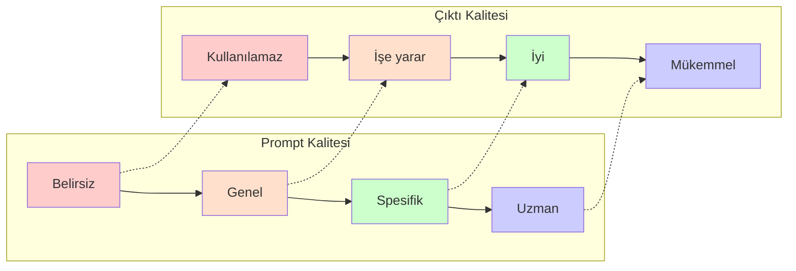
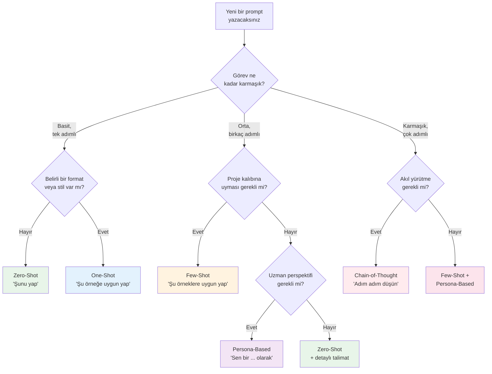

# Prompt Mühendisliği

Prompt Engineering (prompt mühendisliği), AI modellerinden istenen çıktıyı elde etmek için girdi metinlerini (prompt) sistematik olarak tasarlama disiplinidir. Kodlama bağlamında doğru prompt yazmak, AI'dan alacağınız kodun kalitesini, doğruluğunu ve güvenliğini doğrudan belirler.

## Ön Koşullar

| Konu | Bölüm |
|------|-------|
| AI destekli geliştirme kavramı | [AI Destekli Geliştirme Nedir?](./01-ai-destekli-gelistirme-nedir.md) |
| Vibe Coding ve AI ile kod üretme | [Vibe Coding](./03-vibe-coding.md) |

---

## Neden Prompt Mühendisliği Önemli?

Aynı AI modeline aynı görevi iki farklı şekilde verdiğinizde, kalite farkı dramatik olabilir:

```
❌ Kötü Prompt:
"Bir login yap"

✅ İyi Prompt:
"TypeScript ve Express.js ile bir login endpoint'i oluştur.
 - POST /api/auth/login
 - Email ve şifre validasyonu (Zod)
 - bcrypt ile şifre karşılaştırma
 - JWT token üretimi (access + refresh)
 - Rate limiting (5 deneme / 15 dakika)
 - Hata durumlarında uygun HTTP status code'lar
 - Birim testleri dahil"
```

### Prompt Kalitesi ve Çıktı İlişkisi



---

## Temel Prompting Teknikleri

### 1. Zero-Shot Prompting (Sıfır Örnekli)

Modele hiçbir örnek vermeden doğrudan görev tanımı yapılır. Basit ve net görevler için uygundur.

**Teknik:** Sadece talimat verilir, örnek gösterilmez.

#### Pratik Örnekler

**Örnek 1: Fonksiyon oluşturma**
```
Prompt:
"Python'da bir fonksiyon yaz: verilen listedeki tekrarlanan 
elemanları kaldır ve sıralı bir liste döndür."
```

**Örnek 2: Hata düzeltme**
```
Prompt:
"Bu JavaScript kodundaki hatayı bul ve düzelt:

function calculateDiscount(price, discount) {
  return price - price * discount / 100
}

console.log(calculateDiscount(100))  // NaN döndürüyor"
```

**Örnek 3: Kod açıklama**
```
Prompt:
"Bu SQL sorgusunun ne yaptığını açıkla:

SELECT d.name, COUNT(e.id) as emp_count
FROM departments d
LEFT JOIN employees e ON d.id = e.dept_id
WHERE e.hire_date > '2024-01-01'
GROUP BY d.name
HAVING COUNT(e.id) > 5
ORDER BY emp_count DESC;"
```

**Ne zaman kullanılmalı:**
- Basit, tek adımlı görevler
- Standar kodlama kalıpları
- Hızlı sorular ve açıklamalar

---

### 2. One-Shot Prompting (Tek Örnekli)

Modele bir örnek gösterilerek beklenen format ve stil açıkça belirtilir.

**Teknik:** Bir girdi-çıktı örneği verilir, ardından asıl görev sorulur.

#### Pratik Örnekler

**Örnek 1: API endpoint kalıbı**
```
Prompt:
"Aşağıdaki kalıba uygun şekilde 'products' için CRUD endpoint'leri yaz.

Örnek (users):
router.get('/users', authenticate, async (req, res) => {
  const users = await User.findAll({ 
    where: { organizationId: req.user.orgId },
    attributes: ['id', 'name', 'email'],
    order: [['createdAt', 'DESC']]
  });
  res.json({ success: true, data: users });
});

Şimdi aynı kalıpta products için yaz."
```

**Örnek 2: Test kalıbı**
```
Prompt:
"Aşağıdaki test stiline uygun şekilde 'calculateTax' fonksiyonu 
için testler yaz.

Örnek:
describe('calculateDiscount', () => {
  it('should apply percentage discount correctly', () => {
    expect(calculateDiscount(100, 20)).toBe(80);
  });

  it('should handle zero discount', () => {
    expect(calculateDiscount(100, 0)).toBe(100);
  });

  it('should throw for negative discount', () => {
    expect(() => calculateDiscount(100, -5)).toThrow('Invalid discount');
  });
});

Şimdi calculateTax(amount, taxRate) için aynı stilde testler yaz."
```

**Örnek 3: Dokümantasyon kalıbı**
```
Prompt:
"Aşağıdaki JSDoc stiline uygun olarak 'mergeArrays' fonksiyonunu 
dokümante et.

Örnek:
/**
 * İki sayıyı toplayarak sonucu döndürür.
 * 
 * @param {number} a - İlk sayı
 * @param {number} b - İkinci sayı
 * @returns {number} İki sayının toplamı
 * @throws {TypeError} Parametreler sayı değilse
 * 
 * @example
 * add(2, 3) // 5
 * add(-1, 1) // 0
 */
function add(a, b) { ... }

Şimdi mergeArrays(arr1, arr2, options?) için aynı formatta yaz."
```

**Ne zaman kullanılmalı:**
- Belirli bir stil veya formata uyum gerektiğinde
- Mevcut kod kalıplarına tutarlılık sağlamak için
- Ekip standartlarını AI'ya öğretmek için

---

### 3. Few-Shot Prompting (Az Örnekli)

Modele birden fazla örnek (genellikle 2-5) verilerek kalıbı daha güçlü şekilde öğretme tekniğidir.

**Teknik:** Birden fazla girdi-çıktı çifti verilir, model kalıbı çıkarır.

#### Pratik Örnekler

**Örnek 1: Hata mesajı standardizasyonu**
```
Prompt:
"Aşağıdaki kalıba uygun hata sınıfları oluştur.

Örnek 1:
Girdi: "Kullanıcı bulunamadı"
Çıktı:
class UserNotFoundError extends AppError {
  constructor(userId: string) {
    super(`User with id '${userId}' not found`, 404, 'USER_NOT_FOUND');
  }
}

Örnek 2:
Girdi: "Yetkisiz erişim"
Çıktı:
class UnauthorizedError extends AppError {
  constructor(resource: string) {
    super(`Unauthorized access to '${resource}'`, 403, 'UNAUTHORIZED');
  }
}

Örnek 3:
Girdi: "Validasyon hatası"
Çıktı:
class ValidationError extends AppError {
  constructor(field: string, reason: string) {
    super(`Validation failed for '${field}': ${reason}`, 400, 'VALIDATION_ERROR');
  }
}

Şimdi şunlar için aynı kalıpta oluştur:
- Ödeme başarısız
- Rate limit aşıldı
- Dosya çok büyük"
```

**Örnek 2: Veritabanı migration kalıbı**
```
Prompt:
"Aşağıdaki migration stiline uygun yeni migration'lar yaz.

Örnek 1 - Tablo oluşturma:
export async function up(knex) {
  return knex.schema.createTable('users', (table) => {
    table.uuid('id').primary().defaultTo(knex.raw('gen_random_uuid()'));
    table.string('email').unique().notNullable();
    table.string('name').notNullable();
    table.timestamps(true, true);
  });
}

Örnek 2 - Kolon ekleme:
export async function up(knex) {
  return knex.schema.alterTable('users', (table) => {
    table.string('avatar_url').nullable();
    table.enum('role', ['user', 'admin', 'moderator']).defaultTo('user');
  });
}

Örnek 3 - İndeks ekleme:
export async function up(knex) {
  return knex.schema.alterTable('users', (table) => {
    table.index(['email', 'role'], 'idx_users_email_role');
  });
}

Şimdi 'orders' tablosu için migration yaz:
- id, user_id (FK), total, status, items (JSONB), created_at
- user_id ve status üzerinde indeks"
```

**Ne zaman kullanılmalı:**
- Karmaşık veya proje-spesifik kalıplar için
- Tutarlı kod üretimi gereken durumlarda
- AI'nin bağlamı tam anlamadığı durumlarda

---

### 4. Chain-of-Thought Prompting (Düşünce Zinciri)

Modele adım adım düşünmesini söyleyerek karmaşık problemleri daha iyi çözmesini sağlama tekniğidir.

**Teknik:** "Adım adım düşün" talimatı verilir veya düşünce süreci örneği gösterilir.

#### Pratik Örnekler

**Örnek 1: Performans optimizasyonu**
```
Prompt:
"Bu React bileşenini performans açısından analiz et ve optimize et.
Adım adım düşün:

1. Önce gereksiz render'ları tespit et
2. Sonra state yönetimini değerlendir
3. Ardından memoization fırsatlarını belirle
4. Son olarak optimizasyon uygula

function UserDashboard({ userId }) {
  const [user, setUser] = useState(null);
  const [posts, setPosts] = useState([]);
  const [stats, setStats] = useState({});

  useEffect(() => {
    fetchUser(userId).then(setUser);
    fetchPosts(userId).then(setPosts);
    fetchStats(userId).then(setStats);
  }, [userId]);

  const sortedPosts = posts.sort((a, b) => b.date - a.date);
  const totalLikes = posts.reduce((sum, p) => sum + p.likes, 0);

  return (
    <div>
      <UserHeader user={user} totalLikes={totalLikes} />
      <PostList posts={sortedPosts} />
      <StatsPanel stats={stats} />
    </div>
  );
}"
```

**Örnek 2: Bug analizi**
```
Prompt:
"Aşağıdaki kodda bir bug var. Adım adım analiz et:

1. Kodun ne yapmaya çalıştığını açıkla
2. Her bir adımı izle ve potansiyel sorunları işaretle
3. Hatanın kök nedenini bul
4. Düzeltmeyi öner ve neden işe yarayacağını açıkla

async function processPayment(orderId) {
  const order = await db.orders.findById(orderId);
  const user = await db.users.findById(order.userId);
  
  if (user.balance >= order.total) {
    user.balance -= order.total;
    order.status = 'paid';
    
    await db.users.save(user);
    await db.orders.save(order);
    
    await sendConfirmationEmail(user.email, order);
    return { success: true };
  }
  
  return { success: false, error: 'Insufficient balance' };
}"
```

**Örnek 3: Mimari karar**
```
Prompt:
"E-ticaret uygulamamız için bildirim sistemi tasarlamamız gerekiyor.
Adım adım düşünerek en uygun mimariyi öner:

1. Gereksinimleri listele (email, SMS, push, in-app)
2. Her yaklaşımın artı/eksilerini değerlendir
   (polling vs WebSocket vs SSE vs message queue)
3. Ölçeklenebilirlik açısından karşılaştır
4. Somut bir mimari önerisi sun
5. Basit bir implementasyon planı oluştur

Bağlam: Node.js backend, PostgreSQL, ~10K günlük aktif kullanıcı"
```

**Ne zaman kullanılmalı:**
- Karmaşık algoritmalar ve mimari kararlar
- Hata ayıklama ve performans optimizasyonu
- Birden fazla alternatifin değerlendirilmesi gerektiğinde
- AI'nin "düşünme" sürecini görmek istediğinizde

---

### 5. Persona-Based Prompting (Kişilik Tabanlı)

Modele belirli bir rol veya uzmanlık atayarak o perspektiften yanıt vermesini sağlama tekniğidir.

**Teknik:** "Sen bir ... olarak davran" talimatı verilir.

#### Pratik Örnekler

**Örnek 1: Güvenlik uzmanı**
```
Prompt:
"Sen deneyimli bir Application Security (uygulama güvenliği) 
uzmanısın. OWASP Top 10 konusunda derin bilgin var.

Aşağıdaki Express.js API kodunu güvenlik açısından incele.
Her bulduğun zafiyeti şu formatta raporla:
- Zafiyet türü (OWASP kategorisi)
- Etki seviyesi (Kritik/Yüksek/Orta/Düşük)
- Sömürü senaryosu
- Düzeltme önerisi

[kod buraya]"
```

**Örnek 2: Performans mühendisi**
```
Prompt:
"Sen 10 yıl deneyimli bir performans mühendisisin. Büyük ölçekli
Node.js uygulamalarında uzmanlaşmışsın.

Aşağıdaki veritabanı sorgularını ve API endpoint'ini analiz et.
Günlük 1 milyon istek altında performans sorunlarını tespit et
ve somut iyileştirmeler öner.

Analizinde şunlara dikkat et:
- Sorgu planı (index kullanımı)
- N+1 sorgu problemi
- Bağlantı havuzu (connection pool) yönetimi
- Önbellek (cache) fırsatları
- Bellek kullanımı

[kod buraya]"
```

**Örnek 3: Code reviewer**
```
Prompt:
"Sen titiz bir senior yazılımcısın ve code review yapıyorsun.
Aşağıdaki pull request'i incele.

İnceleme kriterlerin:
- SOLID prensipleri uyumu
- Error handling yeterliliği
- Test coverage'ı
- Naming convention'lar
- Potansiyel edge case'ler

Her bulgu için önem derecesi (blocker/major/minor/suggestion) 
ve düzeltme önerisi belirt.

[kod buraya]"
```

**Örnek 4: Mentorluk**
```
Prompt:
"Sen sabırlı bir yazılım mentorüsün. Junior bir geliştirici sana
bu kodu gösterdi ve nasıl iyileştirebileceğini sordu.

Kodu doğrudan yeniden yazma. Bunun yerine:
1. Neyi iyi yaptığını belirt (motivasyon)
2. İyileştirme alanlarını nazikçe açıkla
3. Her iyileştirme için NEDEN önemli olduğunu anlat
4. Adım adım nasıl refactor edeceğini göster

[kod buraya]"
```

**Ne zaman kullanılmalı:**
- Belirli bir uzmanlık perspektifi gerektiğinde
- Daha derinlemesine ve odaklanmış analiz istediğinizde
- Farklı bakış açıları karşılaştırmak istediğinizde
- Eğitim ve mentorluk senaryolarında

---

## Tekniklerin Karşılaştırması

| Teknik | Karmaşıklık | Prompt Uzunluğu | En İyi Kullanım | Çıktı Kalitesi |
|--------|-------------|-----------------|-----------------|----------------|
| **Zero-Shot** | Düşük | Kısa | Basit görevler, hızlı sorular | Orta |
| **One-Shot** | Düşük-Orta | Orta | Format/stil tutarlılığı | İyi |
| **Few-Shot** | Orta | Uzun | Karmaşık kalıplar, proje standartları | Çok iyi |
| **Chain-of-Thought** | Yüksek | Orta-Uzun | Karmaşık problemler, analiz | Çok iyi |
| **Persona-Based** | Orta | Orta | Uzman perspektifi, derinlemesine inceleme | Çok iyi |

---

## Karar Ağacı: Hangi Tekniği Kullanmalı?



---

## İleri Seviye Teknikler

### Teknikleri Birleştirme

En etkili prompt'lar genellikle birden fazla tekniği birleştirir:

```
Prompt (Persona + Chain-of-Thought + Few-Shot):

"Sen deneyimli bir TypeScript geliştiricisisin ve bir bankacılık 
uygulamasında çalışıyorsun.

Aşağıdaki para transferi fonksiyonunu inceleyeceksin.
Adım adım şunu yap:

1. Mevcut kodu analiz et
2. Potansiyel race condition'ları tespit et
3. Aşağıdaki örneğe uygun şekilde düzelt

Örnek düzeltme:
// Önce:
async function withdraw(accountId, amount) {
  const account = await db.find(accountId);
  account.balance -= amount;
  await db.save(account);
}

// Sonra:
async function withdraw(accountId, amount) {
  return db.transaction(async (trx) => {
    const account = await trx('accounts')
      .where('id', accountId)
      .forUpdate()
      .first();
    
    if (account.balance < amount) {
      throw new InsufficientFundsError(accountId, amount);
    }
    
    await trx('accounts')
      .where('id', accountId)
      .update({ balance: account.balance - amount });
    
    return { newBalance: account.balance - amount };
  });
}

Şimdi aşağıdaki transfer fonksiyonunu aynı şekilde düzelt:
[kod buraya]"
```

### Meta-Prompting

AI'ya prompt yazması için prompt vermek:

```
Prompt:
"Bu projedeki veritabanı migration'larını standartlaştırmak 
istiyorum. Mevcut 5 migration dosyasını incele ve ekibimin 
bundan sonra tutarlı migration yazabilmesi için:

1. Migration kurallarını belirle
2. Bir template oluştur  
3. CLAUDE.md'ye eklenecek kuralları yaz"
```

---

## Sık Yapılan Hatalar

| Hata | Örnek | Düzeltme |
|------|-------|----------|
| **Çok belirsiz** | "Kodu düzelt" | "X dosyasındaki Y hatası için Z çözümünü uygula" |
| **Çok uzun** | 3 sayfalık prompt | Görevleri parçala, her biri için ayrı prompt |
| **Çelişkili talimatlar** | "Kısa ama kapsamlı yaz" | Önceliği belirle: "Kısa tut, en fazla 20 satır" |
| **Bağlam eksik** | "Bu fonksiyonu optimize et" | Hangi metrik? Hız mı, bellek mi, okunabilirlik mi? |
| **Varsayım** | "Biliyorsun zaten" | Gerekli tüm bilgiyi prompt'a ekle |
| **Olumsuz talimat** | "X yapma" | "X yerine Y yap" şeklinde pozitif yaz |

---

## Pratik İpuçları

### Etkili Prompt Kontrol Listesi

```
Her prompt yazmadan önce kontrol edin:
✅ Görev açıkça tanımlanmış mı?
✅ Bağlam bilgisi yeterli mi? (dil, framework, ortam)
✅ Beklenen çıktı formatı belirtilmiş mi?
✅ Kısıtlamalar (constraints) var mı? (performans, güvenlik)
✅ Başarı kriteri net mi?
✅ Gerekli örnekler verilmiş mi?
```

### Claude Code İçin Özel İpuçları

```
Claude Code ile çalışırken:

1. CLAUDE.md dosyasına proje kurallarını yazın
   → Her prompt'ta tekrar etmenize gerek kalmaz

2. Plan Mode kullanın
   → Büyük görevlerde önce plan oluşturun

3. Dosya yollarını belirtin
   → "src/auth/login.tsx dosyasını düzenle"

4. Test beklentisi ekleyin
   → "Değişiklik sonrası testleri çalıştır"

5. İteratif çalışın
   → Küçük adımlarla ilerleyin
```

---

## Özet

| Kavram | Açıklama |
|--------|----------|
| **Prompt Engineering** | AI'dan istenen çıktıyı almak için girdi tasarlama disiplini |
| **Zero-Shot** | Örnek vermeden doğrudan talimat |
| **One-Shot** | Tek örnek ile format/stil belirleme |
| **Few-Shot** | Birden fazla örnek ile kalıp öğretme |
| **Chain-of-Thought** | Adım adım düşünme talimatı |
| **Persona-Based** | Belirli bir uzmanlık rolü atama |

---

## Pozisyona Göre Prompt Stratejileri

Claude Code'u farklı pozisyonlar farklı şekilde kullanır. Her birimin detaylı rehberi için [Bölüm 19: Birim ve Pozisyon Bazlı Rehberler](../19-rol-bazli-rehberler/README.md) bölümüne bakınız.

| Birim | Örnek Prompt Yaklaşımı |
|-------|----------------------|
| **Teknik** | "Bu fonksiyonu SOLID prensiplerine uygun refactor et" |
| **Ürün & Analiz** | "Bu toplantı notlarından yapılandırılmış gereksinimler çıkar" |
| **Ticari** | "Bu müşteri verilerinden satış trend analizi oluştur" |
| **Operasyon** | "Bu çeyrek için yönetim kurulu raporu şablonu hazırla" |

---

## Sonraki Adım

Prompt mühendisliği tekniklerini öğrendiniz. Şimdi bu teknikleri kullanabileceğiniz farklı AI kodlama araçlarını karşılaştıralım:

→ [AI Kodlama Araçları Karşılaştırması](./05-ai-kodlama-araclari-karsilastirma.md)
