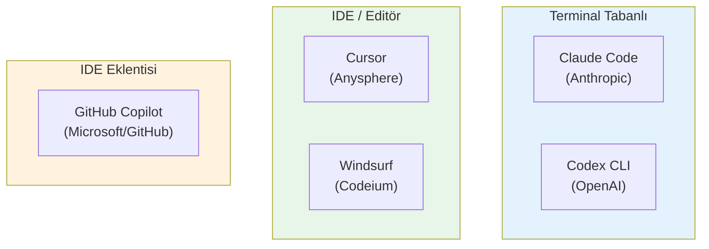
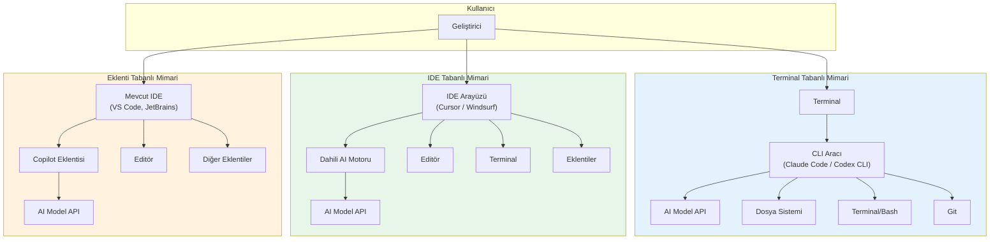
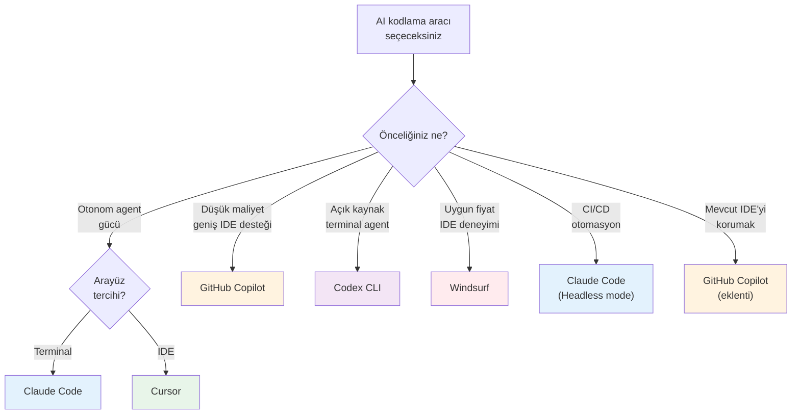

# AI Kodlama Araçları Karşılaştırması

Mart 2026 itibarıyla AI destekli kodlama araçları pazarı hızla büyümekte ve çeşitlenmektedir. Bu bölümde, en yaygın kullanılan beş aracı mimari, fiyatlandırma, model, özellikler ve güçlü/zayıf yönleri açısından detaylı olarak karşılaştırıyoruz.

## Ön Koşullar

| Konu | Bölüm |
|------|-------|
| AI destekli geliştirme kavramı | [AI Destekli Geliştirme Nedir?](./01-ai-destekli-gelistirme-nedir.md) |
| AI Agent ve otonom kodlama | [AI Agent ve Agentic Workflow](./02-ai-agent-ve-agentic-workflow.md) |
| Prompt mühendisliği | [Prompt Mühendisliği](./04-prompt-muhendisligi.md) |

---

## Karşılaştırılan Araçlar



---

## 1. Claude Code

### Genel Bakış

Claude Code, Anthropic tarafından geliştirilen terminal tabanlı bir AI kodlama agent'ıdır. Doğrudan terminal üzerinden çalışır ve projenizi anlayarak otonom olarak kodlama yapabilir.

| Özellik | Detay |
|---------|-------|
| **Geliştirici** | Anthropic |
| **Mimari** | Terminal tabanlı CLI aracı |
| **Model** | Claude 4.6 Opus / Sonnet (varsayılan: Sonnet) |
| **Çıkış** | Mart 2025 (GA) |
| **Fiyat** | Kullanım bazlı (API token fiyatlandırması) |
| **Platform** | macOS, Linux, Windows (WSL) |

### Güçlü Yönler
- Derin proje anlama yeteneği (tüm kod tabanını tarar)
- Güçlü Agentic Loop (Plan → Execute → Observe → Iterate)
- CLAUDE.md ile kalıcı proje belleği
- MCP (Model Context Protocol) ile genişletilebilirlik
- Subagent desteği (paralel görev çalıştırma)
- Git entegrasyonu ve PR oluşturma
- Headless mode ile CI/CD entegrasyonu
- IDE bağımsız: her terminalde çalışır

### Zayıf Yönler
- Görsel IDE arayüzü yok (terminal tabanlı)
- Öğrenme eğrisi (terminal konforuna bağlı)
- Maliyet kontrolü kullanıcıya ait
- Windows'ta WSL gerektirir

---

## 2. Cursor

### Genel Bakış

Cursor, VS Code fork'u olarak geliştirilmiş AI-first (yapay zeka öncelikli) bir kod editörüdür. IDE deneyimiyle AI yeteneklerini doğal şekilde birleştirir.

| Özellik | Detay |
|---------|-------|
| **Geliştirici** | Anysphere |
| **Mimari** | VS Code tabanlı bağımsız IDE |
| **Model** | Claude, GPT-4o, Gemini (çoklu model) |
| **Çıkış** | 2023 |
| **Fiyat** | Ücretsiz (sınırlı) / Pro $20/ay / Business $40/ay |
| **Platform** | macOS, Linux, Windows |

### Güçlü Yönler
- VS Code uyumluluğu (eklentiler, ayarlar, temalar)
- Görsel diff ve kod düzenleme deneyimi
- Çoklu model desteği (Claude, GPT, Gemini)
- Tab ile inline kod tamamlama
- Agent mode ile otonom çalışma
- Cursor Rules ile proje kuralları
- Düşük öğrenme eğrisi (VS Code kullanıcıları için)

### Zayıf Yönler
- VS Code'dan bağımsız olamaz (fork bağımlılığı)
- Aylık istek limitleri (Pro planında)
- Terminal bazlı agent yetenekleri daha sınırlı
- Büyük projelerde bağlam yönetimi zorlaşabilir

---

## 3. GitHub Copilot

### Genel Bakış

GitHub Copilot, Microsoft ve OpenAI ortaklığında geliştirilen, IDE eklentisi olarak çalışan en yaygın AI kodlama asistanıdır.

| Özellik | Detay |
|---------|-------|
| **Geliştirici** | GitHub (Microsoft) |
| **Mimari** | IDE eklentisi (VS Code, JetBrains, Neovim) |
| **Model** | GPT-4o, Claude 3.5 Sonnet (Copilot Chat) |
| **Çıkış** | Haziran 2022 |
| **Fiyat** | Ücretsiz (sınırlı) / Individual $10/ay / Business $19/ay |
| **Platform** | VS Code, JetBrains, Neovim, Visual Studio |

### Güçlü Yönler
- En geniş IDE desteği
- Düşük fiyat / ücretsiz başlangıç
- GitHub ekosistemi entegrasyonu (Issues, PRs, Actions)
- Copilot Workspace ile tam proje yönetimi
- Geniş kullanıcı tabanı ve topluluk
- Kurumsal düzeyde güvenlik ve uyumluluk

### Zayıf Yönler
- Otonom agent yetenekleri sınırlı (gelişiyor)
- Derin proje anlama kapasitesi düşük
- İnline tamamlama bazen agresif
- Copilot Chat bağlam yönetimi sınırlı

---

## 4. OpenAI Codex CLI

### Genel Bakış

Codex CLI, OpenAI tarafından geliştirilen terminal tabanlı AI kodlama agent'ıdır. Claude Code'a benzer şekilde terminal üzerinden çalışır.

| Özellik | Detay |
|---------|-------|
| **Geliştirici** | OpenAI |
| **Mimari** | Terminal tabanlı CLI aracı |
| **Model** | o4-mini (varsayılan), GPT-4o, o3 |
| **Çıkış** | Nisan 2025 |
| **Fiyat** | Kullanım bazlı (API token fiyatlandırması) |
| **Platform** | macOS, Linux, Windows |

### Güçlü Yönler
- Açık kaynak (GitHub'da mevcut)
- Sandbox güvenlik modeli (network-off varsayılan)
- OpenAI model ekosistemi erişimi
- Hafif ve hızlı kurulum
- Üç güvenlik seviyesi (suggest/auto-edit/full-auto)
- Multimodal girdi desteği (ekran görüntüsü gönderme)

### Zayıf Yönler
- Claude Code'a göre daha yeni, daha az olgun
- Ekosistem ve eklenti desteği sınırlı
- MCP benzeri genişletilebilirlik protokolü yok
- Subagent / paralel görev desteği sınırlı

---

## 5. Windsurf

### Genel Bakış

Windsurf (eski adıyla Codeium), AI-first olarak tasarlanmış bağımsız bir IDE'dir. "Flows" adını verdiği agentic yaklaşımıyla öne çıkar.

| Özellik | Detay |
|---------|-------|
| **Geliştirici** | Codeium |
| **Mimari** | VS Code tabanlı bağımsız IDE |
| **Model** | Claude, GPT-4o (çoklu model) |
| **Çıkış** | 2024 |
| **Fiyat** | Ücretsiz (sınırlı) / Pro $15/ay / Teams $30/ay |
| **Platform** | macOS, Linux, Windows |

### Güçlü Yönler
- "Cascade" akışı ile derin bağlam anlama
- Rekabetçi fiyatlandırma
- Flows: agentic kodlama iş akışı
- Otomatik bağlam toplama
- VS Code eklenti uyumluluğu
- Hızlı inline tamamlama

### Zayıf Yönler
- Daha küçük topluluk ve ekosistem
- Kurumsal düzeyde kanıtlanmışlık az
- Terminal agent yetenekleri sınırlı
- Belgelendirme gelişiyor

---

## Büyük Karşılaştırma Tablosu

| Özellik | Claude Code | Cursor | GitHub Copilot | Codex CLI | Windsurf |
|---------|------------|--------|---------------|-----------|----------|
| **Mimari** | Terminal CLI | IDE (VS Code fork) | IDE Eklentisi | Terminal CLI | IDE (VS Code fork) |
| **Varsayılan Model** | Claude 4.6 Sonnet | Çoklu (Claude, GPT) | GPT-4o | o4-mini | Çoklu (Claude, GPT) |
| **Model Değişimi** | Evet (Opus/Sonnet/Haiku) | Evet | Sınırlı | Evet | Evet |
| **Agentic Loop** | Tam | Tam (Agent mode) | Kısmi | Tam | Tam (Cascade) |
| **Dosya Düzenleme** | Evet (otonom) | Evet (görsel diff) | Sınırlı | Evet (otonom) | Evet (görsel diff) |
| **Terminal Erişimi** | Evet (doğal) | Evet | Sınırlı | Evet (doğal) | Evet |
| **Proje Belleği** | CLAUDE.md | Cursor Rules | Copilot Instructions | Sınırlı | Rules |
| **MCP Desteği** | Evet (kapsamlı) | Evet | Evet | Hayır | Hayır |
| **Subagent** | Evet | Hayır | Hayır | Hayır | Hayır |
| **CI/CD Entegrasyonu** | Headless mode | Hayır | GitHub Actions | Sınırlı | Hayır |
| **Açık Kaynak** | Hayır | Hayır | Hayır | Evet | Hayır |
| **Inline Tamamlama** | Hayır | Evet (Tab) | Evet (Tab) | Hayır | Evet (Tab) |
| **Çoklu IDE Desteği** | N/A (terminal) | Hayır (kendi IDE'si) | Evet (VS Code, JetBrains) | N/A (terminal) | Hayır (kendi IDE'si) |

---

## Mimari Karşılaştırma



### Mimari Yaklaşımların Artı ve Eksileri

| Mimari | Artılar | Eksiler |
|--------|---------|---------|
| **Terminal Tabanlı** | IDE bağımsız, CI/CD uyumlu, hafif, scriptlenebilir | Görsel arayüz yok, terminal bilgisi gerekli |
| **IDE Tabanlı** | Görsel deneyim, entegre araçlar, düşük öğrenme eğrisi | Tek IDE'ye bağlı, daha ağır |
| **Eklenti Tabanlı** | Mevcut IDE'de çalışır, esnek, hafif | IDE'ye bağımlı, sınırlı entegrasyon |

---

## Fiyatlandırma Karşılaştırması (Mart 2026)

| Plan | Claude Code | Cursor | GitHub Copilot | Codex CLI | Windsurf |
|------|------------|--------|---------------|-----------|----------|
| **Ücretsiz** | — | Sınırlı | Sınırlı | — | Sınırlı |
| **Bireysel** | ~$50-150/ay* | $20/ay | $10/ay | ~$50-100/ay* | $15/ay |
| **Takım** | ~$100-300/ay* | $40/ay/kişi | $19/ay/kişi | ~$100-200/ay* | $30/ay/kişi |
| **Kurumsal** | Özel fiyat | Özel fiyat | $39/ay/kişi | Özel fiyat | Özel fiyat |

> *\* Claude Code ve Codex CLI kullanım bazlı fiyatlandırma kullanır. Belirtilen miktarlar ortalama aylık kullanım tahminleridir ve kullanım yoğunluğuna göre değişir.*

### Fiyat-Performans Değerlendirmesi

| Profil | En Uygun Seçenek | Neden? |
|--------|-----------------|--------|
| **Öğrenci / Hobi** | GitHub Copilot (ücretsiz) | Ücretsiz plan mevcut |
| **Freelancer** | Windsurf veya Cursor | Sabit maliyet, IDE deneyimi |
| **Startup geliştirici** | Claude Code veya Cursor | Agent yetenekleri, verimlilik |
| **Kurumsal ekip** | GitHub Copilot veya Claude Code | Uyumluluk, güvenlik, ölçek |
| **Yoğun kullanıcı** | Claude Code | En güçlü agent, MCP ekosistemi |

---

## Kullanım Senaryolarına Göre Seçim



---

## Birlikte Kullanım

Bu araçlar birbirini dışlamaz. Birçok geliştirici bunları birlikte kullanır:

```
Yaygın kombinasyonlar:

1. Claude Code + Cursor
   ├── Cursor: IDE deneyimi, inline tamamlama, görsel diff
   └── Claude Code: Otonom görevler, CI/CD, büyük refactoring

2. Claude Code + GitHub Copilot
   ├── Copilot: Günlük inline tamamlama (düşük maliyet)
   └── Claude Code: Karmaşık görevler, otonom agent

3. Cursor + GitHub Copilot
   ├── Copilot: Tab tamamlama
   └── Cursor Agent: Büyük görevler
```

---

## Özet

| Araç | En İyi Yönü | Hedef Kitle |
|------|-------------|-------------|
| **Claude Code** | Otonom agent, MCP, derin proje anlama | Power user, otomasyon odaklı |
| **Cursor** | IDE deneyimi + agent gücü | VS Code kullanan geliştiriciler |
| **GitHub Copilot** | Fiyat, yaygınlık, ekosistem | Genel geliştirici kitlesi |
| **Codex CLI** | Açık kaynak, sandbox güvenlik | OpenAI ekosistemi kullanıcıları |
| **Windsurf** | Fiyat-performans, Cascade akışı | Bütçe-duyarlı geliştiriciler |

---

## Sonraki Adım

AI kodlama araçlarını karşılaştırdık. Bu rehberin odağı olan Claude'un ekosistemini ve model ailesini derinlemesine inceleyelim:

→ [05 - Claude Ekosistemi](../05-claude-ekosistemi/README.md)
