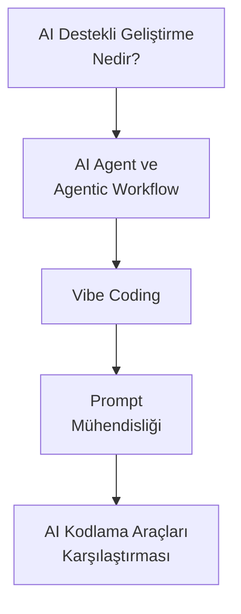
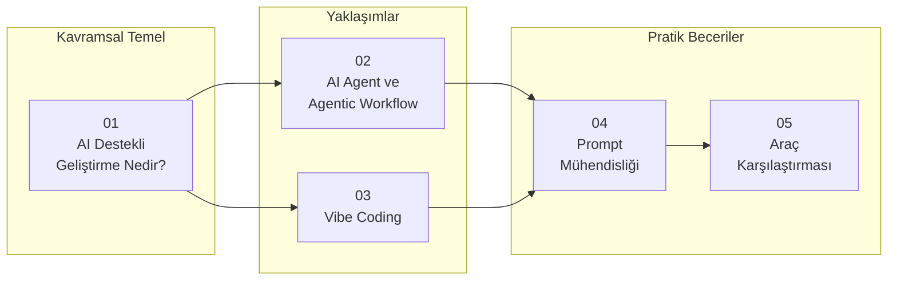

# Bölüm 04: Yapay Zeka Destekli Yazılım Geliştirme

Bu bölüm, yapay zekanın yazılım geliştirme sürecini nasıl dönüştürdüğünü, AI Agent kavramını, Vibe Coding yaklaşımını ve modern AI kodlama araçlarını kapsamlı şekilde ele alır.

## Bu Bölümde Neler Öğreneceksiniz?

## İçerik

| # | Dosya | Konu | Süre |
|---|-------|------|------|
| 01 | [AI Destekli Geliştirme Nedir?](./01-ai-destekli-gelistirme-nedir.md) | Geleneksel vs AI destekli geliştirme, evrim süreci, üretkenlik kazanımları | ~12 dk |
| 02 | [AI Agent ve Agentic Workflow](./02-ai-agent-ve-agentic-workflow.md) | AI Agent kavramı, Agentic Loop, otonom kodlama, araç kullanımı | ~15 dk |
| 03 | [Vibe Coding](./03-vibe-coding.md) | Vibe Coding nedir, nasıl çalışır, avantajlar/riskler, en iyi pratikler | ~12 dk |
| 04 | [Prompt Mühendisliği](./04-prompt-muhendisligi.md) | Zero-shot, few-shot, chain-of-thought, persona tabanlı prompting teknikleri | ~20 dk |
| 05 | [AI Kodlama Araçları Karşılaştırması](./05-ai-kodlama-araclari-karsilastirma.md) | Claude Code, Cursor, GitHub Copilot, Codex CLI, Windsurf karşılaştırması | ~15 dk |

## Ön Koşullar

Bu bölümü okumadan önce aşağıdaki konulara aşina olmanız önerilir:

| Konu | Bölüm |
|------|-------|
| LLM nedir ve nasıl çalışır | [02 - Büyük Dil Modelleri](../02-buyuk-dil-modelleri/README.md) |
| LLM sağlayıcıları ve farkları | [03 - LLM Sağlayıcıları](../03-llm-saglayicilari/README.md) |

## Bölüm Haritası

## Sonraki Adım

Bu bölümü tamamladıktan sonra → [05 - Claude Ekosistemi](../05-claude-ekosistemi/README.md)
