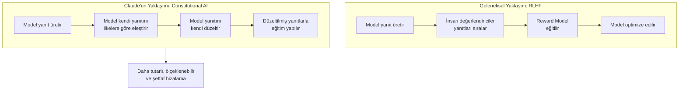
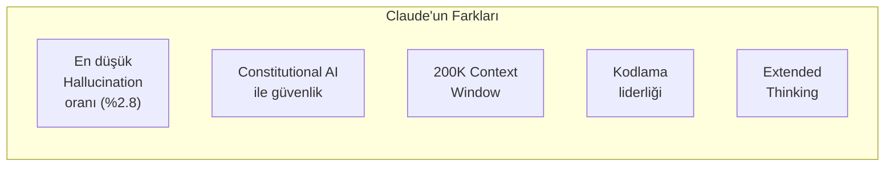
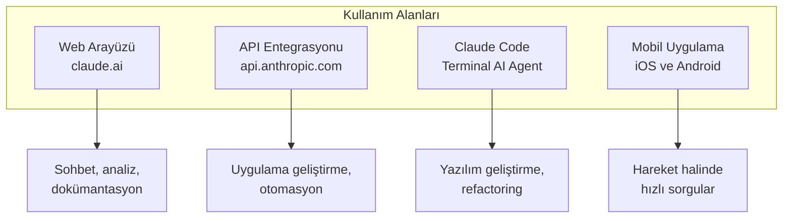

# Claude Nedir?

Claude, Anthropic tarafından geliştirilen bir Large Language Model (büyük dil modeli) ailesidir. Kodlama, analiz, yazım, matematik ve görsel anlama gibi geniş bir yetenek yelpazesine sahip olan Claude, "güvenlik öncelikli" (safety-first) felsefesiyle tasarlanmıştır. Rakiplerinden farklı olarak Constitutional AI (anayasal yapay zeka) yaklaşımıyla eğitilmiştir.

## Ön Koşullar

- [Bölüm 02 - Büyük Dil Modelleri](../02-buyuk-dil-modelleri/README.md)
- [Bölüm 04 - AI Destekli Yazılım Geliştirme](../04-ai-destekli-gelistirme/README.md)

---

## Anthropic ve Claude'un Hikayesi

Anthropic, 2021 yılında eski OpenAI araştırmacıları **Dario Amodei** ve **Daniela Amodei** tarafından kurulmuştur. Şirketin temel misyonu, güvenli ve yararlı yapay zeka sistemleri geliştirmektir.

| Tarih | Gelişme |
|-------|---------|
| 2021 | Anthropic kuruluşu |
| 2023 Mart | Claude 1.0 çıkışı |
| 2023 Temmuz | Claude 2 — 100K context window |
| 2024 Mart | Claude 3 ailesi (Haiku, Sonnet, Opus) |
| 2024 Ekim | Claude 3.5 Sonnet — kodlama liderliği |
| 2025 Şubat | Claude 3.7 Sonnet — Extended Thinking |
| 2025 Nisan | Claude 4 ailesi — yeni nesil |
| 2025 Eylül | Claude 4.5 Sonnet — en yetenekli model |
| 2026 Şubat | Claude 4.6 Opus — en güçlü reasoning |

---

## Claude'un Temel Yetenekleri

```mermaid
flowchart TD
    CLAUDE["Claude AI"]

    CLAUDE --> CODE["Kodlama\n(Coding)"]
    CLAUDE --> ANALYSIS["Analiz\n(Analysis)"]
    CLAUDE --> WRITING["Yazım\n(Writing)"]
    CLAUDE --> MATH["Matematik\n(Math)"]
    CLAUDE --> VISION["Görsel Anlama\n(Vision)"]

    CODE --> CODE1["Kod üretme ve düzenleme"]
    CODE --> CODE2["Bug tespiti ve düzeltme"]
    CODE --> CODE3["Code review"]
    CODE --> CODE4["40+ programlama dili"]

    ANALYSIS --> ANAL1["Veri analizi"]
    ANALYSIS --> ANAL2["Belge inceleme"]
    ANALYSIS --> ANAL3["Karşılaştırmalı değerlendirme"]

    WRITING --> WRIT1["Teknik dokümantasyon"]
    WRITING --> WRIT2["Yaratıcı içerik"]
    WRITING --> WRIT3["Çeviri ve özetleme"]

    MATH --> MATH1["Karmaşık hesaplamalar"]
    MATH --> MATH2["İstatistiksel analiz"]
    MATH --> MATH3["Mantıksal muhakeme"]

    VISION --> VIS1["Resim ve grafik analizi"]
    VISION --> VIS2["UI/UX değerlendirme"]
    VISION --> VIS3["Diyagram yorumlama"]
```



### 1. Kodlama (Coding)

Claude, kodlama konusunda sektör lideri konumundadır. SWE-bench'te %80.9 ve HumanEval+'da %94.3 başarı oranıyla rakiplerini geride bırakır.

```
Kullanıcı: "Python'da bir binary search tree implementasyonu yaz"

Claude: Binary search tree implementasyonunu oluşturuyorum:
- Node sınıfı ile temel yapı
- insert, search, delete işlemleri
- in-order traversal
- Tip güvenliği için type hint'ler
- Edge case'ler için hata yönetimi
→ Çalışır, test edilebilir, okunabilir kod üretir
```

### 2. Analiz (Analysis)

Uzun belgeleri, veri setlerini ve kod tabanlarını derinlemesine analiz edebilir.

```
Kullanıcı: "Bu 200 sayfalık teknik spesifikasyonu analiz et ve tutarsızlıkları bul"

Claude:
→ 200K Token context window ile belgenin tamamını okur
→ Bölümler arası çelişkileri tespit eder
→ Eksik gereksinimleri listeler
→ Yapılandırılmış rapor üretir
```

### 3. Yazım (Writing)

Teknik dokümantasyondan yaratıcı içeriğe kadar geniş bir yelpazede kaliteli metin üretir.

```
Kullanıcı: "Bu API için Türkçe dokümantasyon yaz"

Claude:
→ Endpoint açıklamaları
→ Parametre tabloları
→ Kullanım örnekleri (curl, Python, TypeScript)
→ Hata kodları ve çözümleri
```

### 4. Matematik ve Muhakeme (Math & Reasoning)

Extended Thinking (genişletilmiş düşünme) özelliği ile karmaşık mantıksal ve matematiksel problemleri adım adım çözer.

```
Kullanıcı: "Bu algoritmanın zaman karmaşıklığını analiz et"

Claude:
→ Her döngüyü ayrı ayrı inceler
→ Asimptotik analiz yapar
→ Best/worst/average case hesaplar
→ Adım adım kanıtlar
```

### 5. Görsel Anlama (Vision)

Resim, ekran görüntüsü, diyagram ve grafikleri anlayıp yorumlayabilir.

```
Kullanıcı: [ekran görüntüsü] "Bu UI'daki erişilebilirlik sorunlarını bul"

Claude:
→ Renk kontrastı yetersizliği
→ Eksik alt text'ler
→ Küçük tıklanabilir alanlar
→ Klavye navigasyonu sorunları
→ WCAG uyumluluk önerileri
```

---

## Güvenlik Felsefesi: Constitutional AI

Claude'un en temel farkı, **Constitutional AI** (Anayasal AI) yaklaşımıyla eğitilmiş olmasıdır. Bu yöntem, geleneksel RLHF'den (Reinforcement Learning from Human Feedback) farklı bir hizalama stratejisi kullanır.



### Constitutional AI İlkeleri

Claude'un "anayasası" şu temel ilkelere dayanır:

| İlke | Açıklama |
|------|----------|
| **Zararsızlık** (Harmlessness) | Zararlı, yanıltıcı veya ayrımcı içerik üretmekten kaçınma |
| **Yardımseverlik** (Helpfulness) | Kullanıcının isteğini en iyi şekilde karşılama |
| **Dürüstlük** (Honesty) | Bilmediği konularda bunu açıkça belirtme |
| **Etik tutarlılık** | Farklı konularda tutarlı etik standartlar uygulama |

### RLHF vs Constitutional AI Karşılaştırması

| Özellik | RLHF | Constitutional AI |
|---------|------|-------------------|
| **Değerlendirici** | İnsan | AI (ilkelere göre) |
| **Ölçeklenebilirlik** | Sınırlı (insan gücü) | Yüksek |
| **Tutarlılık** | Değerlendiriciye bağlı | İlke bazlı, tutarlı |
| **Şeffaflık** | Düşük | İlkeler yayınlanabilir |
| **Maliyet** | Yüksek | Düşük |
| **Kullanıcı** | OpenAI (GPT) | Anthropic (Claude) |

---

## Claude'u Rakiplerinden Ayıran Özellikler



### 1. En Düşük Hallucination (Halüsinasyon) Oranı

Hallucination, modelin gerçek olmayan bilgiyi gerçekmiş gibi sunmasıdır. Claude bu konuda sektörün en düşük oranına sahiptir:

| Model | Hallucination Oranı |
|-------|-------------------|
| **Claude 4.5 Sonnet** | **%2.8** |
| GPT-4o | %5.4 |
| Gemini 2.5 Pro | %4.1 |
| Llama 3.3 | %8.2 |

### 2. Güvenlik Öncelikli Yaklaşım

Claude, zararlı içerik üretmeyi reddeder ancak bunu aşırı kısıtlayıcı olmadan yapar. Tehlikeli talimatları nazikçe reddederken, meşru kullanım senaryolarında tam yardım sağlar.

```
Kullanıcı: "SQL injection saldırısı nasıl yapılır?"

GPT-4o: "Bu konuda yardımcı olamam."

Claude: "SQL injection'ı anlamak güvenlik açısından önemlidir. 
İşte savunma perspektifinden çalışma prensibi ve korunma yöntemleri:
1. Parametreli sorgular kullanın...
2. Input validation uygulayın...
3. ORM kullanımı..."

→ Claude, güvenlik bağlamında eğitici bilgi sağlar, saldırı kodu üretmez.
```

### 3. Doğal ve Dürüst İletişim

Claude, bilmediği konularda bunu açıkça belirtir. Tahmin yürütüyorsa bunu ifade eder.

```
Kullanıcı: "XYZ şirketinin 2025 Q4 geliri ne kadardı?"

Claude: "Bu konuda güncel verim yok. Son eğitim verilerime göre 
XYZ şirketinin 2025 Q3 geliri yaklaşık $X milyardı, ancak Q4 
verisi için şirketin resmi raporlarını kontrol etmenizi öneririm."

→ Uydurma yerine belirsizliği açıkça belirtir.
```

### 4. Uzun Bağlam Penceresi

200K Token context window, yaklaşık 150.000 kelime veya 500 sayfalık bir kitap anlamına gelir. 1M Token beta erişimi de mevcuttur.

### 5. Extended Thinking (Genişletilmiş Düşünme)

Karmaşık problemlerde Claude, yanıt vermeden önce "düşünme" süreci geçirir. Bu süreç kullanıcıya gösterilir ve muhakeme kalitesini dramatik şekilde artırır.

---

## Claude'un Kullanım Alanları



| Platform | Kullanım Senaryosu | Hedef Kitle |
|----------|-------------------|-------------|
| **claude.ai** | Sohbet, belge analizi, içerik üretimi | Herkes |
| **API** | Uygulama entegrasyonu, otomasyon | Geliştiriciler |
| **Claude Code** | Kodlama, refactoring, test yazma | Yazılımcılar |
| **Mobil** | Hızlı sorular, fotoğraf analizi | Herkes |
| **Slack/Teams** | Takım içi AI asistan | Kurumsal |

---

## Claude vs Rakipler: Genel Karşılaştırma

| Özellik | Claude (Anthropic) | GPT (OpenAI) | Gemini (Google) |
|---------|-------------------|--------------|-----------------|
| **Güvenlik yaklaşımı** | Constitutional AI | RLHF | RLHF + kural tabanlı |
| **Kodlama** | Sektör lideri | Çok güçlü | Güçlü |
| **Context window** | 200K (1M beta) | 128K | 2M |
| **Hallucination** | En düşük (%2.8) | Orta (%5.4) | Düşük (%4.1) |
| **Multimodal** | Metin + görsel giriş | Metin + görsel + ses | Metin + görsel + ses + video |
| **Açık kaynak** | Hayır | Hayır | Kısmen |
| **Extended Thinking** | Var | Var (o-serisi) | Var (Thinking mode) |
| **AI Agent aracı** | Claude Code | Codex CLI | Jules |

---

## Pratik Örnek: Claude ile İlk Etkileşim

### claude.ai Üzerinden

```
Kullanıcı: "Python'da bir REST API projesi için 
dosya yapısı öner ve her dosyanın amacını açıkla"

Claude:
Önerilen proje yapısı:

project/
├── app/
│   ├── __init__.py          # Flask/FastAPI uygulaması
│   ├── models/
│   │   ├── __init__.py
│   │   └── user.py          # Kullanıcı modeli
│   ├── routes/
│   │   ├── __init__.py
│   │   └── auth.py          # Kimlik doğrulama endpoint'leri
│   ├── services/
│   │   └── user_service.py  # İş mantığı katmanı
│   └── schemas/
│       └── user_schema.py   # Pydantic doğrulama şemaları
├── tests/
│   └── test_auth.py         # Test dosyaları
├── requirements.txt         # Bağımlılıklar
├── .env                     # Ortam değişkenleri
└── main.py                  # Giriş noktası

Her katmanın sorumluluğu:
- models: Veritabanı yapısı
- routes: HTTP endpoint tanımları
- services: İş mantığı (business logic)
- schemas: Giriş/çıkış veri doğrulama
```

---

## Özet

| Kavram | Değer |
|--------|-------|
| **Geliştirici** | Anthropic |
| **Kuruluş** | 2021 |
| **Güvenlik yaklaşımı** | Constitutional AI |
| **Temel yetenekler** | Kodlama, analiz, yazım, matematik, vision |
| **Hallucination oranı** | %2.8 (sektör en düşüğü) |
| **Context window** | 200K Token (1M beta) |
| **Fark yaratan özellik** | Extended Thinking |
| **Kullanım platformları** | Web, API, Claude Code, mobil, Slack |

---

## Sonraki Adım

→ [Claude Model Ailesi](./02-claude-model-ailesi.md)
