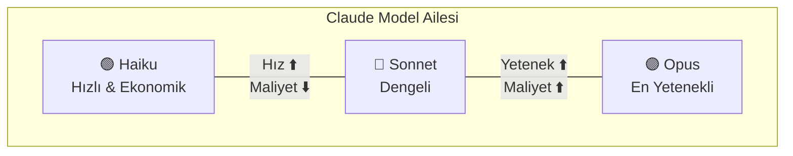
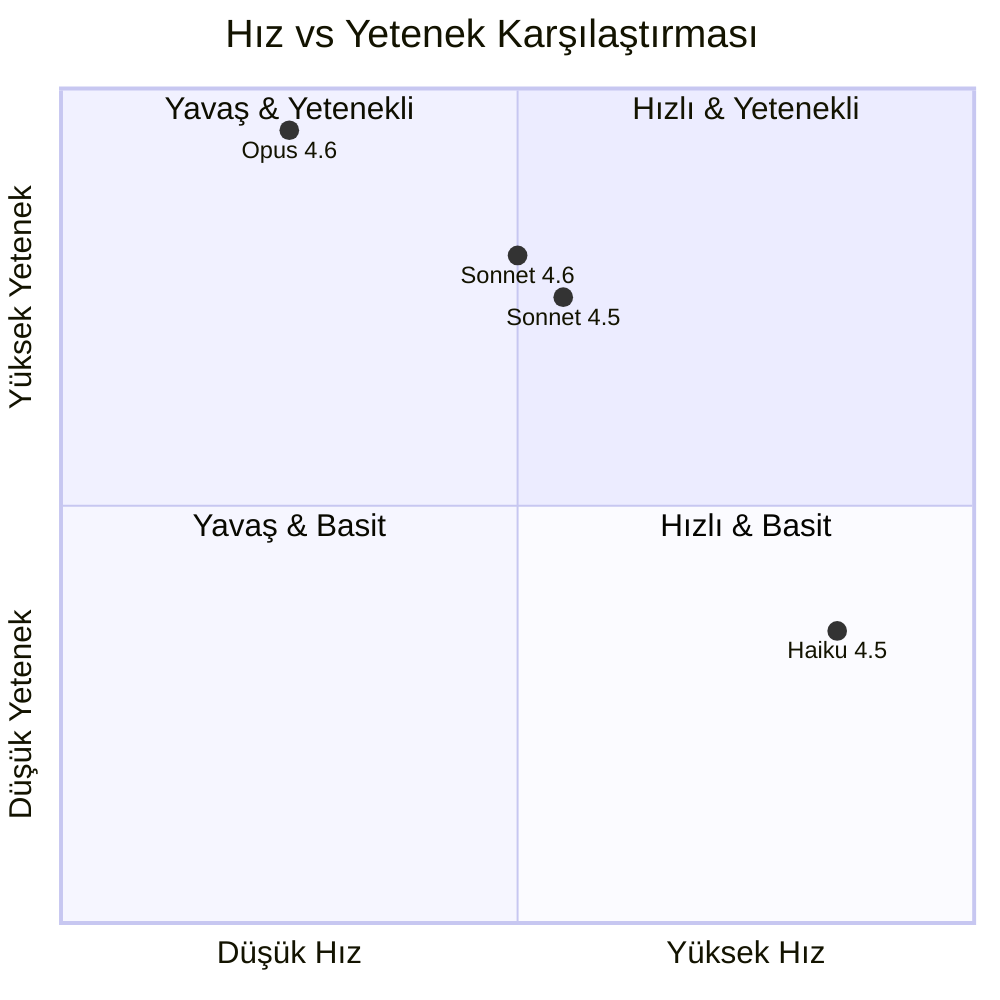
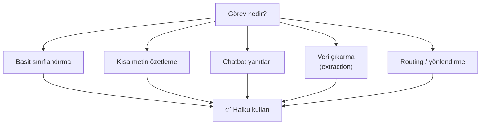
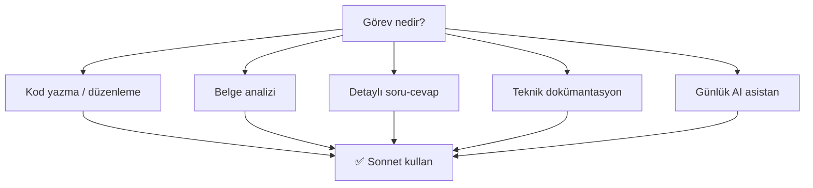
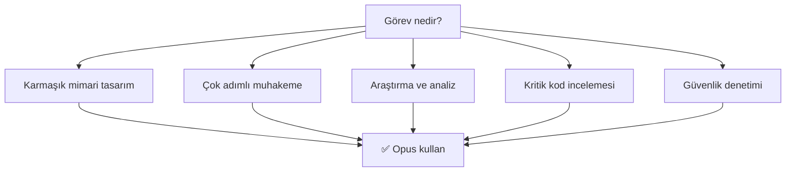
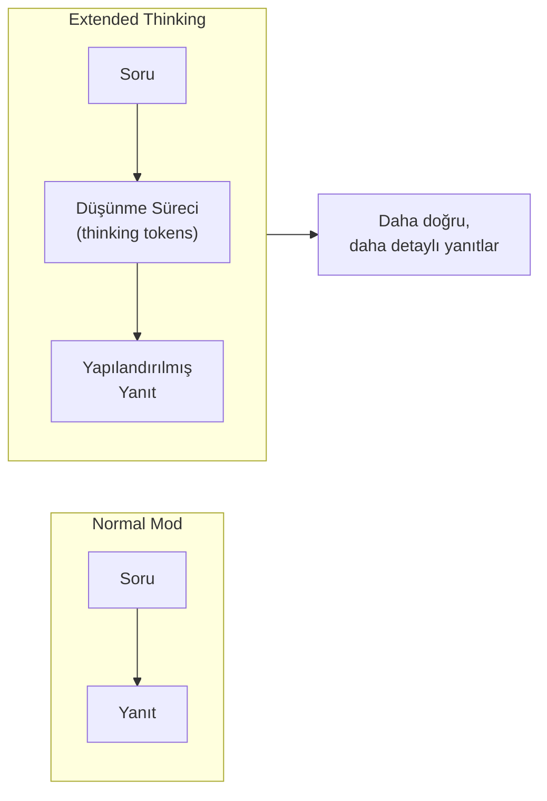
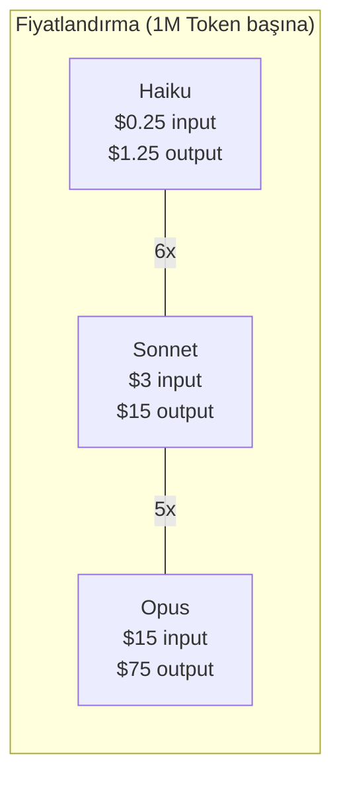
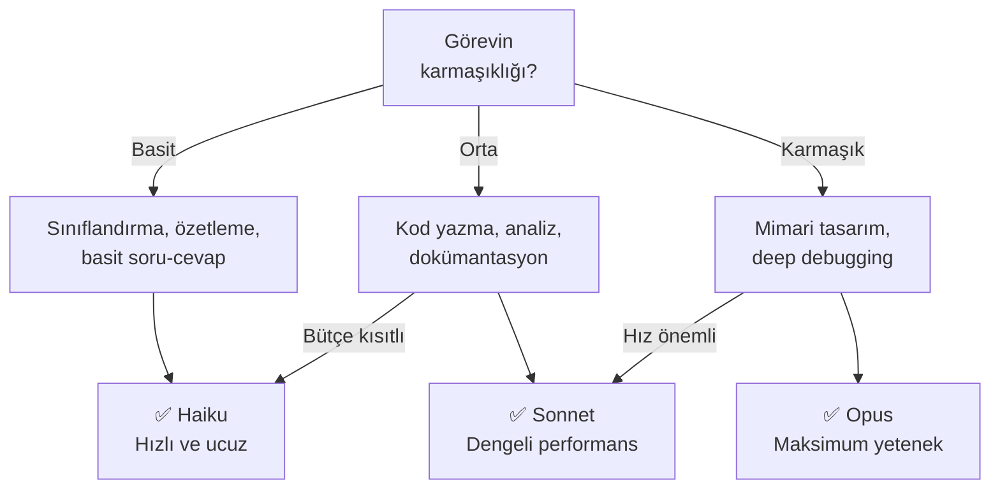

# Claude Model Ailesi

Anthropic, farklı kullanım senaryolarına yönelik üç model katmanı sunar: **Haiku** (hızlı ve ekonomik), **Sonnet** (dengeli) ve **Opus** (en yetenekli). Her katman, hız ile yetenek arasındaki dengeyi farklı bir noktada optimize eder.

## Ön Koşullar

- [Claude Nedir?](./01-claude-nedir.md)

---

## Model Katmanları



### Hız vs Yetenek Dengesi



---

## Haiku: Hızlı ve Ekonomik

Haiku, basit ve yüksek hacimli görevler için optimize edilmiş en hafif Claude modelidir.

| Özellik | Değer |
|---------|-------|
| **En son sürüm** | Claude 4.5 Haiku |
| **Yanıt hızı** | Çok hızlı (~20ms/token) |
| **Context window** | 200K Token |
| **Max output** | 8.192 Token |
| **Güçlü olduğu alan** | Sınıflandırma, özetleme, basit soru-cevap |

### Haiku Ne Zaman Kullanılır?



### Örnek Kullanım

```
Görev: Müşteri yorumlarını pozitif/negatif/nötr olarak sınıfla

Girdi: "Ürün kalitesi harika ama kargo çok geç geldi"
Çıktı: { "sentiment": "mixed", "positive": ["kalite"], "negative": ["kargo süresi"] }

→ Haiku bu görevi milisaniyeler içinde, çok düşük maliyetle yapar.
```

---

## Sonnet: Dengeli Performans

Sonnet, günlük kullanım için ideal dengeli modeldir. Çoğu yazılım geliştirme görevi için yeterli yeteneğe sahiptir ve makul bir maliyet/hız dengesi sunar.

| Özellik | Değer |
|---------|-------|
| **En son sürümler** | Claude 4.5 Sonnet, Claude 4.6 Sonnet |
| **Yanıt hızı** | Orta-hızlı (~40ms/token) |
| **Context window** | 200K Token |
| **Max output** | 16.384 Token |
| **Güçlü olduğu alan** | Kodlama, analiz, genel amaçlı kullanım |

### Sonnet Ne Zaman Kullanılır?



### Örnek Kullanım

```
Görev: React bileşeni için unit test yaz

Girdi: "UserProfile bileşeni için Jest + React Testing Library testleri"
Çıktı:
- Render testleri
- Props değişikliği testleri
- Event handler testleri
- Edge case testleri
- Mock data örnekleri

→ Sonnet, günlük kodlama görevleri için ideal denge noktasıdır.
```

---

## Opus: En Yetenekli Model

Opus, Claude ailesinin en güçlü modelidir. Karmaşık muhakeme, çok adımlı problemler ve üst düzey kodlama görevleri için tasarlanmıştır.

| Özellik | Değer |
|---------|-------|
| **En son sürüm** | Claude 4.6 Opus |
| **Yanıt hızı** | Yavaş (~80ms/token) |
| **Context window** | 200K Token |
| **Max output** | 32.768 Token |
| **Güçlü olduğu alan** | Karmaşık muhakeme, mimari tasarım, araştırma |

### Opus Ne Zaman Kullanılır?



### Örnek Kullanım

```
Görev: Mikroservis mimarisindeki darboğazı analiz et

Girdi: "Bu 15 servisli sistemde latency neden artıyor? 
İşte servis grafı, metrikler ve son deployment logları."

Opus:
→ Servis bağımlılık grafını analiz eder
→ Darboğaz noktalarını tespit eder
→ Cascading failure senaryolarını değerlendirir
→ Circuit breaker ve retry pattern önerileri sunar
→ Adım adım düzeltme planı oluşturur

→ Bu derinlikte analiz için Opus gereklidir.
```

---

## Sürüm Karşılaştırması

### Claude 4.5 Serisi

| Model | Çıkış | Öne Çıkan Özellik |
|-------|--------|-------------------|
| Claude 4.5 Haiku | 2025 Q3 | En hızlı Claude, düşük maliyet |
| Claude 4.5 Sonnet | 2025 Q3 | Kodlama benchmark'larında lider |

### Claude 4.6 Serisi

| Model | Çıkış | Öne Çıkan Özellik |
|-------|--------|-------------------|
| Claude 4.6 Sonnet | 2026 Q1 | Gelişmiş Extended Thinking |
| Claude 4.6 Opus | 2026 Q1 | En güçlü reasoning, en düşük hallucination |

---

## Extended Thinking (Genişletilmiş Düşünme)

Extended Thinking, Claude'un karmaşık problemlerde yanıt vermeden önce adım adım düşünmesini sağlayan bir özelliktir. Claude 3.7 Sonnet ile tanıtılmış, sonraki sürümlerde geliştirilmiştir.



### Effort Levels (Çaba Seviyeleri)

Extended Thinking, üç farklı çaba seviyesinde kullanılabilir:

| Seviye | Düşünme Süresi | Kullanım Senaryosu | Token Maliyeti |
|--------|---------------|---------------------|---------------|
| **Low** (düşük) | Kısa (~500 thinking token) | Basit mantık soruları, hızlı doğrulama | Düşük |
| **Medium** (orta) | Orta (~2K thinking token) | Kod analizi, orta karmaşıklıkta problemler | Orta |
| **High** (yüksek) | Uzun (~10K+ thinking token) | Mimari tasarım, karmaşık debugging, araştırma | Yüksek |

### Extended Thinking Örneği

```
Kullanıcı: "Bu recursive fonksiyonun zaman karmaşıklığını analiz et"

[Extended Thinking - High]
Düşünme süreci:
- Fonksiyonun çağrı ağacını çizeyim
- Her seviyede kaç çağrı yapılıyor: T(n) = 2T(n/2) + O(n)
- Bu Master Theorem'in 2. durumuna karşılık gelir
- Ağacın derinliği: log₂(n)
- Her seviyedeki toplam iş: O(n)
- Toplam: O(n log n)
- Doğrulama: n=8 için elle hesaplayayım...

Yanıt:
"Bu fonksiyonun zaman karmaşıklığı O(n log n)'dir.
İşte adım adım analiz:..."

→ Düşünme süreci şeffaf bir şekilde gösterilir.
```

---

## Fiyatlandırma (Mart 2026)



### Detaylı Fiyat Tablosu

| Model | Input (1M Token) | Output (1M Token) | Cache Write | Cache Read |
|-------|------------------|--------------------|-------------|------------|
| **Haiku 4.5** | $0.25 | $1.25 | $0.30 | $0.025 |
| **Sonnet 4.5** | $3 | $15 | $3.75 | $0.30 |
| **Sonnet 4.6** | $3 | $15 | $3.75 | $0.30 |
| **Opus 4.6** | $15 | $75 | $18.75 | $1.50 |

> **Not:** Extended Thinking token'ları output fiyatıyla ücretlendirilir. High effort seviyesinde maliyet önemli ölçüde artabilir.

### Maliyet Karşılaştırma Örneği

Tipik bir kod inceleme görevi (2K input + 1K output token):

| Model | Maliyet | Hız | Kalite |
|-------|---------|-----|--------|
| Haiku | ~$0.002 | ~2 sn | Temel düzeltmeler |
| Sonnet | ~$0.021 | ~5 sn | Detaylı inceleme |
| Opus | ~$0.105 | ~12 sn | Derinlemesine analiz |

---

## Hangi Modeli Ne Zaman Kullanmalı?



### Pratik Karar Tablosu

| Senaryo | Önerilen Model | Neden? |
|---------|---------------|--------|
| Müşteri chatbot | Haiku | Hızlı yanıt, düşük maliyet |
| Günlük kod yazma | Sonnet | İyi denge |
| Pull request inceleme | Sonnet | Yeterli analiz derinliği |
| Güvenlik denetimi | Opus | Maksimum dikkat gerekli |
| Mimari karar | Opus + Extended Thinking | Derin muhakeme |
| Toplu veri işleme | Haiku | Maliyet optimizasyonu |
| Claude Code kullanımı | Sonnet (varsayılan) | Kodlama için optimize |

---

## Özet

| Model | Hız | Maliyet | Yetenek | Kullanım |
|-------|-----|---------|---------|----------|
| **Haiku** | ⚡⚡⚡ | 💰 | ⭐⭐ | Basit görevler, yüksek hacim |
| **Sonnet** | ⚡⚡ | 💰💰 | ⭐⭐⭐⭐ | Günlük geliştirme, genel amaç |
| **Opus** | ⚡ | 💰💰💰 | ⭐⭐⭐⭐⭐ | Karmaşık problemler, kritik görevler |

---

## Sonraki Adım

→ [Claude API ve SDK Kullanımı](./03-claude-api-ve-sdk.md)
