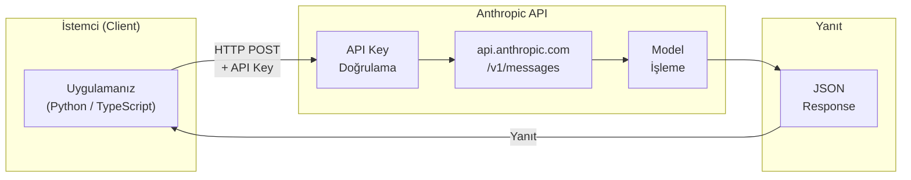
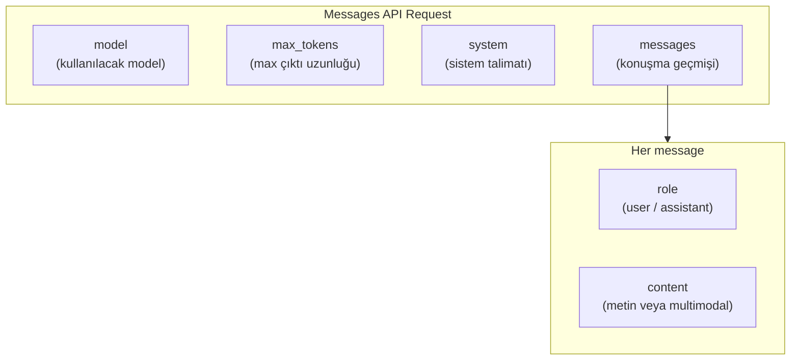
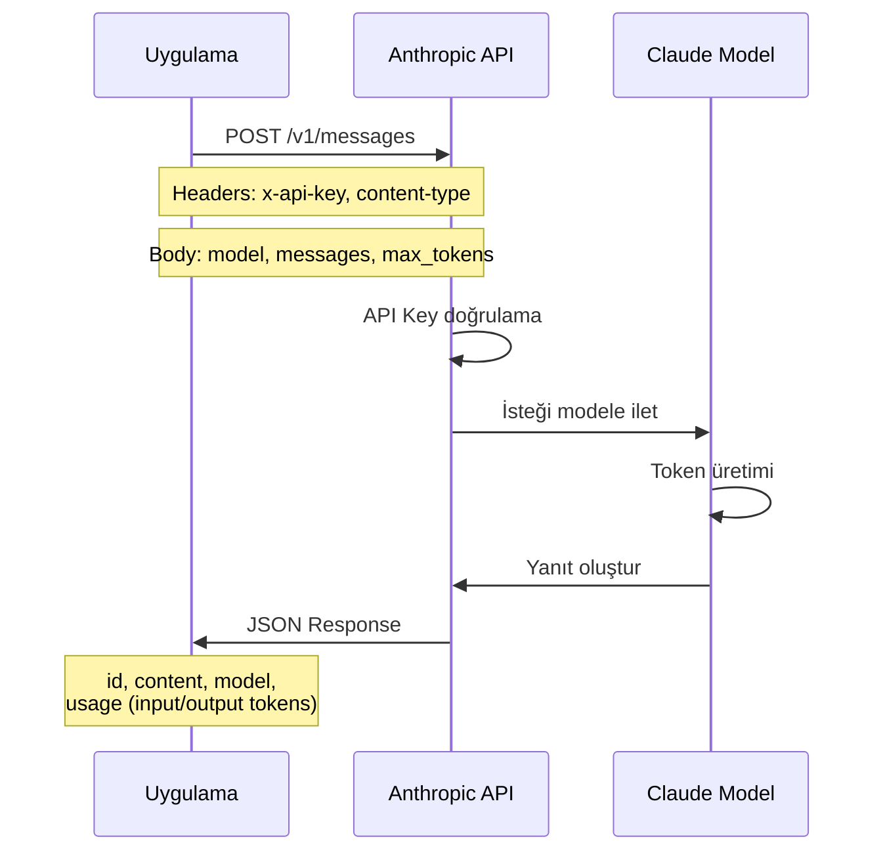
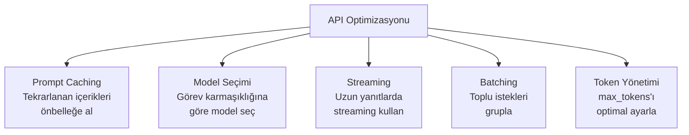

# Claude API ve SDK Kullanımı

Claude'u kendi uygulamalarınıza entegre etmek için Anthropic'in Messages API'sini kullanabilirsiniz. Bu bölümde API yapısını, Python ve TypeScript SDK'larını, streaming kullanımını ve system prompt stratejilerini öğreneceksiniz.

## Ön Koşullar

- [Claude Nedir?](./01-claude-nedir.md)
- [Claude Model Ailesi](./02-claude-model-ailesi.md)
- Temel Python veya TypeScript bilgisi

---

## API Genel Bakış



### API Erişimi İçin Gerekenler

| Gereksinim | Açıklama | Nereden? |
|------------|----------|----------|
| **API Key** | Kimlik doğrulama anahtarı | console.anthropic.com |
| **Kredi** | Kullanım için bakiye | Anthropic Console |
| **SDK** | İstemci kütüphanesi | pip / npm |

---

## Messages API Yapısı

Messages API, Claude ile etkileşim kurmanın temel yoludur. RESTful bir yapıya sahiptir.

### İstek Yapısı (Request)



### İstek/Yanıt Akışı



---

## Python SDK

### Kurulum

```bash
pip install anthropic
```

### Temel Kullanım

```python
import anthropic

client = anthropic.Anthropic(
    api_key="YOUR_API_KEY_HERE"  # veya ANTHROPIC_API_KEY env variable
)

message = client.messages.create(
    model="claude-sonnet-4-5-20250514",
    max_tokens=1024,
    messages=[
        {"role": "user", "content": "Python'da decorator nedir? Örnekle açıkla."}
    ]
)

print(message.content[0].text)
```

### System Prompt Kullanımı

System prompt (sistem talimatı), Claude'a rol ve davranış kuralları tanımlamanızı sağlar.

```python
import anthropic

client = anthropic.Anthropic()

message = client.messages.create(
    model="claude-sonnet-4-5-20250514",
    max_tokens=2048,
    system="Sen kıdemli bir Python geliştiricisisin. "
           "Yanıtlarını Türkçe ver. "
           "Her kod örneğinde type hint kullan. "
           "PEP 8 standartlarına uy.",
    messages=[
        {"role": "user", "content": "Bir caching decorator yaz"}
    ]
)

print(message.content[0].text)
```

### Çoklu Mesaj (Konuşma Geçmişi)

```python
import anthropic

client = anthropic.Anthropic()

conversation = [
    {
        "role": "user",
        "content": "FastAPI ile basit bir todo API'si tasarla"
    },
    {
        "role": "assistant",
        "content": "İşte temel yapı: ..."
    },
    {
        "role": "user",
        "content": "Şimdi buna SQLAlchemy ile veritabanı desteği ekle"
    }
]

message = client.messages.create(
    model="claude-sonnet-4-5-20250514",
    max_tokens=4096,
    system="Sen bir backend geliştiricisin. Production-ready kod yaz.",
    messages=conversation
)

print(message.content[0].text)
```

### Streaming (Akışlı Yanıt)

Streaming, yanıtı Token Token alarak kullanıcıya gerçek zamanlı gösterim sağlar.

```python
import anthropic

client = anthropic.Anthropic()

with client.messages.stream(
    model="claude-sonnet-4-5-20250514",
    max_tokens=2048,
    messages=[
        {"role": "user", "content": "Merge sort algoritmasını Python'da implement et"}
    ]
) as stream:
    for text in stream.text_stream:
        print(text, end="", flush=True)
```

### Extended Thinking ile Kullanım

```python
import anthropic

client = anthropic.Anthropic()

message = client.messages.create(
    model="claude-opus-4-6-20260210",
    max_tokens=16384,
    thinking={
        "type": "enabled",
        "budget_tokens": 10000  # düşünme için ayrılan token bütçesi
    },
    messages=[
        {
            "role": "user",
            "content": "Bu mikroservis mimarisindeki tek hata noktalarını analiz et"
        }
    ]
)

for block in message.content:
    if block.type == "thinking":
        print(f"Düşünme süreci:\n{block.thinking}\n")
    elif block.type == "text":
        print(f"Yanıt:\n{block.text}")
```

### Görsel (Vision) Kullanımı

```python
import anthropic
import base64
from pathlib import Path

client = anthropic.Anthropic()

image_data = base64.standard_b64encode(
    Path("screenshot.png").read_bytes()
).decode("utf-8")

message = client.messages.create(
    model="claude-sonnet-4-5-20250514",
    max_tokens=2048,
    messages=[
        {
            "role": "user",
            "content": [
                {
                    "type": "image",
                    "source": {
                        "type": "base64",
                        "media_type": "image/png",
                        "data": image_data
                    }
                },
                {
                    "type": "text",
                    "text": "Bu UI tasarımındaki erişilebilirlik sorunlarını listele"
                }
            ]
        }
    ]
)

print(message.content[0].text)
```

---

## TypeScript SDK

### Kurulum

```bash
npm install @anthropic-ai/sdk
```

### Temel Kullanım

```typescript
import Anthropic from "@anthropic-ai/sdk";

const client = new Anthropic({
  apiKey: "YOUR_API_KEY_HERE", // veya ANTHROPIC_API_KEY env variable
});

async function main() {
  const message = await client.messages.create({
    model: "claude-sonnet-4-5-20250514",
    max_tokens: 1024,
    messages: [
      {
        role: "user",
        content: "TypeScript'te generic bir Repository pattern implement et",
      },
    ],
  });

  if (message.content[0].type === "text") {
    console.log(message.content[0].text);
  }
}

main();
```

### System Prompt ile Kullanım

```typescript
import Anthropic from "@anthropic-ai/sdk";

const client = new Anthropic();

async function codeReview(code: string) {
  const message = await client.messages.create({
    model: "claude-sonnet-4-5-20250514",
    max_tokens: 2048,
    system:
      "Sen kıdemli bir TypeScript geliştiricisisin. " +
      "Kod incelemelerinde güvenlik, performans ve " +
      "okunabilirlik konularına odaklan. " +
      "Yanıtlarını Türkçe ver.",
    messages: [
      {
        role: "user",
        content: `Bu kodu incele:\n\n${code}`,
      },
    ],
  });

  if (message.content[0].type === "text") {
    return message.content[0].text;
  }
}
```

### Streaming

```typescript
import Anthropic from "@anthropic-ai/sdk";

const client = new Anthropic();

async function streamResponse() {
  const stream = await client.messages.stream({
    model: "claude-sonnet-4-5-20250514",
    max_tokens: 2048,
    messages: [
      {
        role: "user",
        content: "Express.js ile JWT authentication middleware yaz",
      },
    ],
  });

  for await (const event of stream) {
    if (
      event.type === "content_block_delta" &&
      event.delta.type === "text_delta"
    ) {
      process.stdout.write(event.delta.text);
    }
  }
}

streamResponse();
```

### Extended Thinking (TypeScript)

```typescript
import Anthropic from "@anthropic-ai/sdk";

const client = new Anthropic();

async function analyzeArchitecture() {
  const message = await client.messages.create({
    model: "claude-opus-4-6-20260210",
    max_tokens: 16384,
    thinking: {
      type: "enabled",
      budget_tokens: 10000,
    },
    messages: [
      {
        role: "user",
        content: "Bu event-driven mimarideki race condition risklerini analiz et",
      },
    ],
  });

  for (const block of message.content) {
    if (block.type === "thinking") {
      console.log("Düşünme süreci:", block.thinking);
    } else if (block.type === "text") {
      console.log("Yanıt:", block.text);
    }
  }
}
```

---

## API Yanıt Yapısı

Başarılı bir API yanıtı şu yapıdadır:

```json
{
  "id": "msg_01XfDUDYJgAACzvnptvVoYEL",
  "type": "message",
  "role": "assistant",
  "model": "claude-sonnet-4-5-20250514",
  "content": [
    {
      "type": "text",
      "text": "İşte Python'da decorator örneği:..."
    }
  ],
  "stop_reason": "end_turn",
  "usage": {
    "input_tokens": 25,
    "output_tokens": 482
  }
}
```

| Alan | Açıklama |
|------|----------|
| `id` | Benzersiz mesaj kimliği |
| `model` | Kullanılan model |
| `content` | Yanıt içeriği (metin ve/veya thinking blokları) |
| `stop_reason` | Durma nedeni: `end_turn`, `max_tokens`, `stop_sequence` |
| `usage` | Token kullanım bilgisi (maliyet hesabı için) |

---

## Fiyatlandırma ve Maliyet Yönetimi

### Token Başına Fiyatlar

| Model | Input (1M Token) | Output (1M Token) |
|-------|------------------|--------------------|
| Haiku 4.5 | $0.25 | $1.25 |
| Sonnet 4.5 / 4.6 | $3 | $15 |
| Opus 4.6 | $15 | $75 |

### Maliyet Hesaplama Örneği

```
Senaryo: Günde 100 kod inceleme isteği
- Her istek: ~2.000 input token + ~1.500 output token

Sonnet ile:
  Input:  100 × 2.000 = 200K token × $3/1M  = $0.60
  Output: 100 × 1.500 = 150K token × $15/1M = $2.25
  Günlük toplam: $2.85
  Aylık toplam: ~$85

Opus ile:
  Input:  200K token × $15/1M = $3.00
  Output: 150K token × $75/1M = $11.25
  Günlük toplam: $14.25
  Aylık toplam: ~$427
```

### Prompt Caching ile Tasarruf

Prompt Caching (istem önbellekleme), tekrarlanan system prompt'lar ve bağlam bilgileri için önemli tasarruf sağlar.

```python
import anthropic

client = anthropic.Anthropic()

long_system_prompt = "..." # uzun sistem talimatı

message = client.messages.create(
    model="claude-sonnet-4-5-20250514",
    max_tokens=1024,
    system=[
        {
            "type": "text",
            "text": long_system_prompt,
            "cache_control": {"type": "ephemeral"}
        }
    ],
    messages=[
        {"role": "user", "content": "Kodu analiz et"}
    ]
)

# İlk istek: cache_creation_input_tokens olarak ücretlendirilir
# Sonraki istekler: cache_read_input_tokens (10x daha ucuz)
```

---

## Hata Yönetimi

```python
import anthropic

client = anthropic.Anthropic()

try:
    message = client.messages.create(
        model="claude-sonnet-4-5-20250514",
        max_tokens=1024,
        messages=[
            {"role": "user", "content": "Merhaba"}
        ]
    )
except anthropic.AuthenticationError:
    print("API anahtarı geçersiz")
except anthropic.RateLimitError:
    print("Rate limit aşıldı, biraz bekleyin")
except anthropic.APIStatusError as e:
    print(f"API hatası: {e.status_code} - {e.message}")
except anthropic.APIConnectionError:
    print("Bağlantı hatası, ağ ayarlarını kontrol edin")
```

| Hata Kodu | Anlamı | Çözüm |
|-----------|--------|-------|
| 401 | Geçersiz API key | Anahtarı kontrol edin |
| 429 | Rate limit | Retry with backoff |
| 400 | Geçersiz istek | İstek yapısını kontrol edin |
| 500 | Sunucu hatası | Tekrar deneyin |
| 529 | API aşırı yüklü | Biraz bekleyip tekrar deneyin |

---

## En İyi Uygulamalar

### System Prompt Stratejileri

| Strateji | Açıklama | Örnek |
|----------|----------|-------|
| **Rol tanımlama** | Claude'a bir uzman rolü verin | "Sen kıdemli bir güvenlik uzmanısın" |
| **Format belirleme** | Çıktı formatını belirtin | "JSON formatında yanıt ver" |
| **Kısıtlama** | Sınırlar koyun | "Sadece TypeScript kullan, any kullanma" |
| **Bağlam** | Proje bilgisi verin | "Bu bir e-ticaret projesi, Next.js 15 kullanıyor" |

### Performans İpuçları



---

## Özet

| Kavram | Değer |
|--------|-------|
| **API endpoint** | `api.anthropic.com/v1/messages` |
| **Kimlik doğrulama** | `x-api-key` header |
| **Python SDK** | `anthropic` (pip) |
| **TypeScript SDK** | `@anthropic-ai/sdk` (npm) |
| **Streaming** | `client.messages.stream()` |
| **Prompt Caching** | `cache_control: {"type": "ephemeral"}` |
| **Extended Thinking** | `thinking: {"type": "enabled", "budget_tokens": N}` |

---

## Sonraki Adım

→ [Claude'un Özel Yetenekleri](./04-claude-ozel-yetenekleri.md)
