# Claude'un Özel Yetenekleri

Claude'u diğer LLM'lerden ayıran benzersiz yetenekler vardır: sektörün en düşük hallucination (halüsinasyon) oranı, kodlama benchmark'larında liderlik, devasa context window (bağlam penceresi), görsel anlama, Artifacts (eserler) ve Tool Use (araç kullanımı). Bu bölüm, bu yetenekleri benchmark verileriyle detaylı olarak inceler.

## Ön Koşullar

- [Claude Nedir?](./01-claude-nedir.md)
- [Claude Model Ailesi](./02-claude-model-ailesi.md)

---

## 1. En Düşük Hallucination Oranı

Hallucination (halüsinasyon), bir LLM'nin gerçek olmayan bilgiyi gerçekmiş gibi sunmasıdır. Bu, AI güvenilirliğinin en kritik metriklerinden biridir. Claude, bu alanda sektör lideridir.

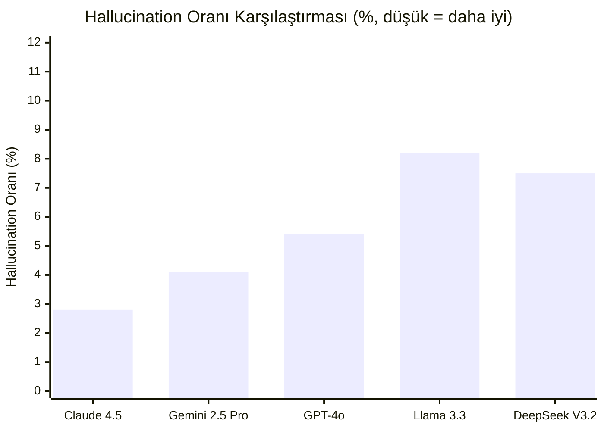

### Neden Claude Daha Az Hallucinate Eder?

| Faktör | Açıklama |
|--------|----------|
| **Constitutional AI** | Dürüstlük ilkesi, modeli "bilmiyorum" demeye teşvik eder |
| **Eğitim yaklaşımı** | Belirsizlik durumunda tahmin yerine belirsizliği ifade etme |
| **Kalibrasyon** | Modelin kendi güven seviyesini doğru tahmin etme yeteneği |
| **Post-training** | Hallucination'a özel eğitim aşamaları |

### Pratik Örnek

```
Kullanıcı: "Python 4.0'ın yeni özellikleri nelerdir?"

GPT-4o: "Python 4.0 ile birlikte gelen önemli yenilikler:
1. Native GPU desteği
2. Yeni tip sistemi
3. ..." (uydurma bilgi)

Claude: "Mart 2026 itibarıyla Python 4.0 henüz yayınlanmamıştır.
Python'un en güncel kararlı sürümü 3.13'tür. Python 4 hakkında 
resmi bir zaman çizelgesi bulunmamaktadır. Python 3 serisine 
ait güncel özellikler hakkında bilgi verebilirim."

→ Claude, olmayan bir şeyi uydurmak yerine durumu açıkça belirtir.
```

---

## 2. Kodlama Liderliği

Claude, yazılım geliştirme benchmark'larında tutarlı bir şekilde en üst sıralarda yer alır.

### Benchmark Sonuçları (Mart 2026)

```mermaid
xychart-beta
    title "Kodlama Benchmark Karşılaştırması (%, yüksek = daha iyi)"
    x-axis ["SWE-bench", "HumanEval+", "MBPP+", "LiveCodeBench"]
    y-axis "Başarı Oranı (%)" 0 --> 100
    bar "Claude 4.5 Sonnet" [80.9, 94.3, 89.7, 72.1]
    bar "GPT-4o" [69.2, 90.1, 85.4, 65.8]
    bar "Gemini 2.5 Pro" [63.8, 88.7, 83.2, 61.5]
```

### Benchmark Açıklamaları

| Benchmark | Ne Ölçer? | Claude Skoru | En Yakın Rakip |
|-----------|-----------|-------------|----------------|
| **SWE-bench Verified** | Gerçek GitHub issue'larını çözme | **%80.9** | GPT-4o (%69.2) |
| **HumanEval+** | Fonksiyon düzeyinde kod üretme | **%94.3** | GPT-4o (%90.1) |
| **MBPP+** | Basit programlama problemleri | **%89.7** | GPT-4o (%85.4) |
| **LiveCodeBench** | Zaman sınırlı canlı kodlama | **%72.1** | GPT-4o (%65.8) |

### SWE-bench: Gerçek Dünya Kodlama Testi

SWE-bench, en önemli kodlama benchmark'ıdır çünkü gerçek GitHub projelerindeki gerçek issue'ları çözmeyi ölçer.

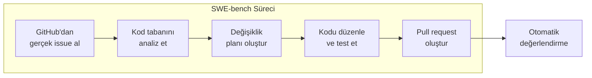

```
SWE-bench Örneği:

Issue: django/django#12345 - "QuerySet.union() loses ordering"
Repo: django/django
Dosyalar: 1847 Python dosyası

Claude:
1. Issue'yu analiz etti
2. django/db/models/sql/compiler.py dosyasını buldu
3. union() metodundaki ordering kaybını tespit etti
4. 3 dosyada düzeltme yaptı
5. Mevcut testleri geçti + yeni test ekledi
✅ Başarılı
```

### Desteklenen Diller ve Çerçeveler

Claude 40'tan fazla programlama dilini destekler ve özellikle şu alanlarda güçlüdür:

| Kategori | Diller / Çerçeveler |
|----------|-------------------|
| **Backend** | Python, Java, Go, Rust, C#, Ruby, PHP |
| **Frontend** | TypeScript, JavaScript, React, Vue, Angular, Svelte |
| **Mobil** | Swift, Kotlin, React Native, Flutter |
| **DevOps** | Bash, Docker, Terraform, Kubernetes YAML |
| **Veri** | SQL, R, Julia, Pandas, PySpark |
| **Sistem** | C, C++, Rust, Assembly |

---

## 3. Context Window: 200K Token (1M Beta)

Context window (bağlam penceresi), modelin tek bir konuşmada işleyebildiği maksimum Token sayısıdır. Claude'un 200K Token'lık penceresi, rakiplerinin çoğundan büyüktür ve 1M Token beta erişimi de mevcuttur.

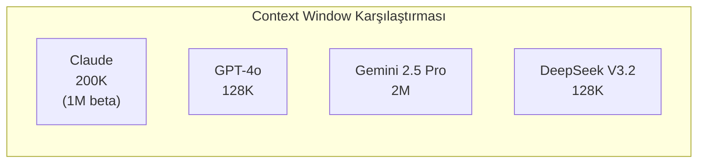

### 200K Token Ne Anlama Gelir?

| İçerik Türü | 200K Token Karşılığı |
|-------------|---------------------|
| **Düz metin** | ~150.000 kelime / ~500 sayfa kitap |
| **Kaynak kodu** | ~6.000 - 8.000 satır kod |
| **Belge** | ~300 sayfa teknik doküman |
| **Konuşma** | ~4-5 saatlik sohbet geçmişi |

### Uzun Bağlam Kullanım Senaryoları

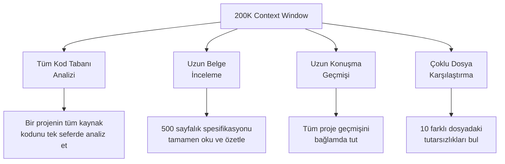

### "Needle in a Haystack" Testi

Bu test, uzun bir bağlamın herhangi bir yerine gizlenmiş bilgiyi bulma yeteneğini ölçer. Claude, 200K Token boyunca %99.2 doğrulukla bilgi bulabilir.

```
Test: 200K Token'lık metin içinde rastgele bir noktaya
"Gizli kod: UNICORN-42" bilgisi yerleştirilir.

Soru: "Gizli kod nedir?"

Claude: "Gizli kod UNICORN-42'dir."
→ Metnin başında, ortasında veya sonunda olsun, bulabilir.
→ Doğruluk: %99.2
```

---

## 4. Vision: Görsel Anlama

Claude, metin yanında görsel girdileri de anlayabilir. Fotoğraflar, ekran görüntüleri, grafikler, diyagramlar ve el yazısı notları analiz edebilir.

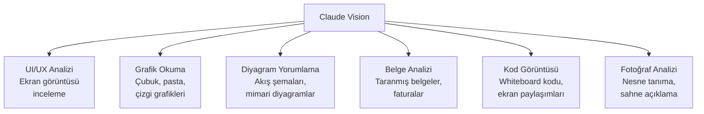

### Desteklenen Görsel Formatlar

| Format | Destek | Max Boyut |
|--------|--------|-----------|
| JPEG / JPG | ✅ | 20 MB |
| PNG | ✅ | 20 MB |
| GIF | ✅ | 20 MB |
| WebP | ✅ | 20 MB |
| PDF | ✅ | Sayfa bazlı |

### Vision Kullanım Örnekleri

```
Örnek 1: UI İnceleme
Girdi: [login sayfası ekran görüntüsü]
Soru: "Bu login sayfasındaki UX sorunlarını listele"

Claude:
1. Şifre alanında "göster/gizle" butonu eksik
2. "Beni hatırla" checkbox'ı çok küçük (mobil erişilebilirlik)
3. Hata mesajı rengi kontrast oranı WCAG AA standardını karşılamıyor
4. Sosyal login butonları görsel hiyerarşide kaybolmuş
5. Form validasyonu client-side değil, submit sonrası gösteriliyor

Örnek 2: Mimari Diyagram
Girdi: [sistem mimarisi diyagramı]
Soru: "Bu mimarideki tek hata noktalarını bul"

Claude:
1. Veritabanı tek instance - replikasyon yok
2. API Gateway'de failover mekanizması görünmüyor
3. Message queue cluster değil, tek node
```

---

## 5. Artifacts (Eserler)

Artifacts, Claude'un claude.ai web arayüzünde kod, belge ve görsel çıktıları ayrı bir panelde interaktif olarak sunmasını sağlayan bir özelliktir.

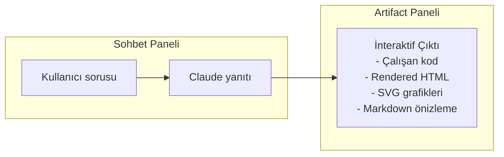

### Artifact Türleri

| Tür | Açıklama | Örnek |
|-----|----------|-------|
| **Code** | Çalıştırılabilir kod | React bileşeni, Python scripti |
| **HTML** | Render edilen web sayfası | Landing page, form tasarımı |
| **SVG** | Vektör grafikleri | Logo, diyagram, infografik |
| **Mermaid** | Diyagramlar | Akış şeması, sınıf diyagramı |
| **Markdown** | Biçimlendirilmiş metin | Dokümantasyon, rapor |
| **React** | İnteraktif bileşen | Dashboard, hesap makinesi |

### Artifact Örneği

```
Kullanıcı: "Proje yönetimi için bir Kanban board React bileşeni yaz"

Claude: [Açıklama metni]

[Artifact: React bileşeni]
- Sürükle-bırak özellikli Kanban board
- "Yapılacak", "Devam Eden", "Tamamlanan" sütunları
- Yeni kart ekleme
- Kart silme ve düzenleme
- Responsive tasarım
→ Artifact panelinde canlı önizleme ile gösterilir
```

---

## 6. Tool Use (Araç Kullanımı)

Tool Use (araç kullanımı), Claude'un harici araçları ve fonksiyonları çağırabilmesini sağlayan bir API özelliğidir. Bu sayede Claude, kendi bilgi sınırlarının ötesinde işlem yapabilir.

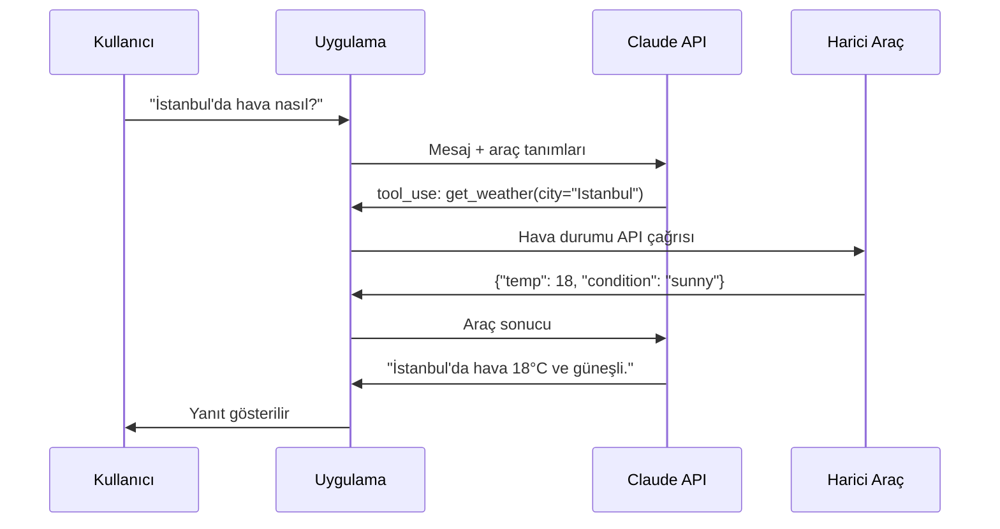

### Tool Tanımlama Örneği

```python
import anthropic

client = anthropic.Anthropic()

tools = [
    {
        "name": "get_stock_price",
        "description": "Verilen hisse senedinin güncel fiyatını döndürür",
        "input_schema": {
            "type": "object",
            "properties": {
                "symbol": {
                    "type": "string",
                    "description": "Hisse senedi sembolü (ör: AAPL, GOOGL)"
                }
            },
            "required": ["symbol"]
        }
    }
]

message = client.messages.create(
    model="claude-sonnet-4-5-20250514",
    max_tokens=1024,
    tools=tools,
    messages=[
        {"role": "user", "content": "Apple hisse fiyatı ne kadar?"}
    ]
)

# Claude tool_use yanıtı döndürür:
# {"type": "tool_use", "name": "get_stock_price", "input": {"symbol": "AAPL"}}
```

### Claude Code ve Tool Use

Claude Code, Tool Use'un en gelişmiş uygulamasıdır. 30'dan fazla dahili araçla dosya okuma/yazma, terminal komutları çalıştırma, web erişimi ve daha fazlasını yapabilir.

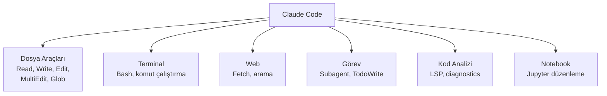

---

## Yetenekler Özet Tablosu

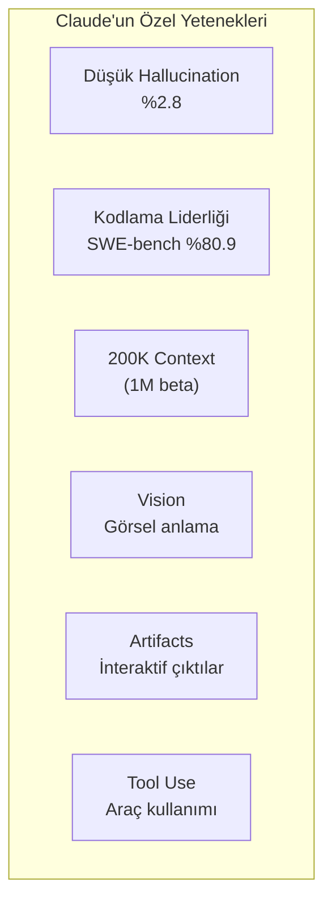

| Yetenek | Metrik/Değer | Rakiplerle Karşılaştırma |
|---------|-------------|-------------------------|
| **Hallucination** | %2.8 | Sektörün en düşüğü |
| **SWE-bench** | %80.9 | GPT-4o: %69.2, Gemini: %63.8 |
| **HumanEval+** | %94.3 | GPT-4o: %90.1, Gemini: %88.7 |
| **Context Window** | 200K (1M beta) | GPT-4o: 128K, Gemini: 2M |
| **Vision** | Metin + görsel giriş | Tüm büyük modellerde var |
| **Artifacts** | Claude'a özel | Rakiplerde sınırlı |
| **Tool Use** | API desteği | Tüm büyük modellerde var |
| **Extended Thinking** | Ayarlanabilir bütçe | OpenAI: o-serisi, Google: Thinking |

---

## Genel Benchmark Karşılaştırması

### Genel Yetenek Benchmark'ları

| Benchmark | Ne Ölçer? | Claude 4.5 | GPT-4o | Gemini 2.5 Pro |
|-----------|-----------|-----------|--------|----------------|
| **MMLU-Pro** | Genel bilgi | %88.2 | %86.5 | %87.8 |
| **GPQA Diamond** | Bilimsel muhakeme | %72.1 | %68.3 | %70.5 |
| **MATH** | Matematik | %86.4 | %84.2 | %85.1 |
| **ARC-AGI** | Soyut muhakeme | %48.2 | %40.1 | %45.3 |

### Kodlama Benchmark'ları (Detaylı)

| Benchmark | Claude 4.5 Sonnet | Claude 4.6 Opus | GPT-4o | Gemini 2.5 Pro |
|-----------|------------------|----------------|--------|----------------|
| **SWE-bench Verified** | %80.9 | %82.1 | %69.2 | %63.8 |
| **HumanEval+** | %94.3 | %95.1 | %90.1 | %88.7 |
| **MBPP+** | %89.7 | %91.2 | %85.4 | %83.2 |
| **LiveCodeBench** | %72.1 | %74.8 | %65.8 | %61.5 |
| **Aider Polyglot** | %68.5 | %71.3 | %58.2 | %55.1 |

### Güvenlik Benchmark'ları

| Benchmark | Ne Ölçer? | Claude | GPT-4o | Gemini |
|-----------|-----------|--------|--------|--------|
| **Hallucination Rate** | Uydurma bilgi oranı | **%2.8** | %5.4 | %4.1 |
| **Refusal Accuracy** | Zararlı istekleri reddetme | **%97.8** | %94.2 | %95.1 |
| **Instruction Following** | Talimat takip doğruluğu | **%92.1** | %89.5 | %90.3 |

---

## Claude Ne Zaman Tercih Edilmeli?

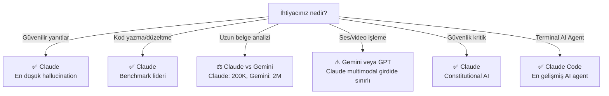

---

## Özet

| Yetenek | Değer | Önem |
|---------|-------|------|
| **Hallucination oranı** | %2.8 | Güvenilirlik için kritik |
| **SWE-bench** | %80.9 | Gerçek dünya kodlama yeteneği |
| **HumanEval+** | %94.3 | Fonksiyon düzeyinde kod üretme |
| **Context window** | 200K (1M beta) | Uzun belge ve kod analizi |
| **Vision** | Metin + görsel giriş | UI analizi, grafik okuma |
| **Artifacts** | İnteraktif çıktılar | claude.ai'da gelişmiş deneyim |
| **Tool Use** | Araç çağırma API'si | Harici sistemlerle entegrasyon |
| **Extended Thinking** | Ayarlanabilir düşünme | Karmaşık problemlerde doğruluk |

---

## Sonraki Adım

Bu bölümü tamamladıktan sonra → [06 - Claude Code: Tanıtım ve Kurulum](../06-claude-code-tanitim/README.md)
