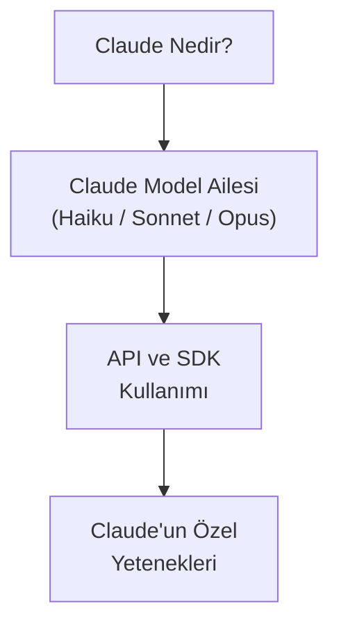
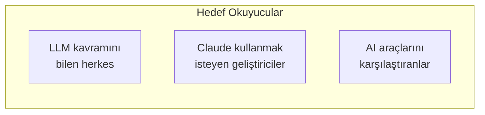

# Bölüm 05: Claude Ekosistemi

Bu bölüm, Anthropic'in geliştirdiği Claude AI'ı tanıtır. Claude'un ne olduğunu, model ailesini, API/SDK kullanımını ve rakiplerinden ayıran özel yeteneklerini detaylı olarak inceler.

## Bu Bölümde Neler Öğreneceksiniz?

## İçerik

| # | Dosya | Konu | Süre |
|---|-------|------|------|
| 01 | [Claude Nedir?](./01-claude-nedir.md) | Claude AI tanımı, temel yetenekler, güvenlik felsefesi, Constitutional AI | ~12 dk |
| 02 | [Claude Model Ailesi](./02-claude-model-ailesi.md) | Haiku, Sonnet, Opus modelleri, sürümler, Extended Thinking, fiyatlandırma | ~15 dk |
| 03 | [API ve SDK Kullanımı](./03-claude-api-ve-sdk.md) | Messages API, Python SDK, TypeScript SDK, streaming, system prompt | ~20 dk |
| 04 | [Claude'un Özel Yetenekleri](./04-claude-ozel-yetenekleri.md) | Düşük hallucination, kodlama liderliği, 200K context, vision, artifacts, tool use | ~15 dk |

## Ön Koşullar

- [Bölüm 02 - Büyük Dil Modelleri](../02-buyuk-dil-modelleri/README.md)
- [Bölüm 04 - AI Destekli Yazılım Geliştirme](../04-ai-destekli-gelistirme/README.md)

## Bu Bölüm Kimler İçin?

| Rol | Bu Bölümden Ne Öğrenir? |
|-----|------------------------|
| **Yazılımcı** | Claude'un kodlama yetenekleri, API entegrasyonu, hangi model ne zaman kullanılır |
| **Yazılım Mimarı** | Model seçimi, maliyet optimizasyonu, mimari kararlarda Claude kullanımı |
| **İş Analisti** | Claude'un analiz ve metin yetenekleri, rakiplerle karşılaştırma |
| **Vibe Coder** | Hangi modeli seçmeli, Claude'un güçlü/zayıf yönleri |

## Sonraki Adım

Bu bölümü tamamladıktan sonra → [06 - Claude Code: Tanıtım ve Kurulum](../06-claude-code-tanitim/README.md)
