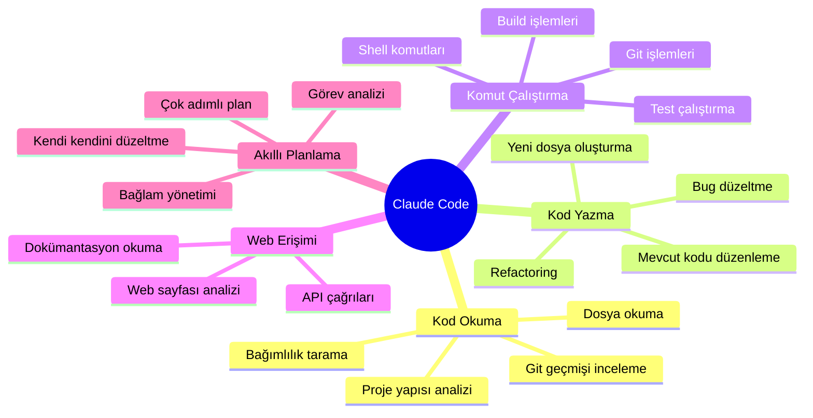
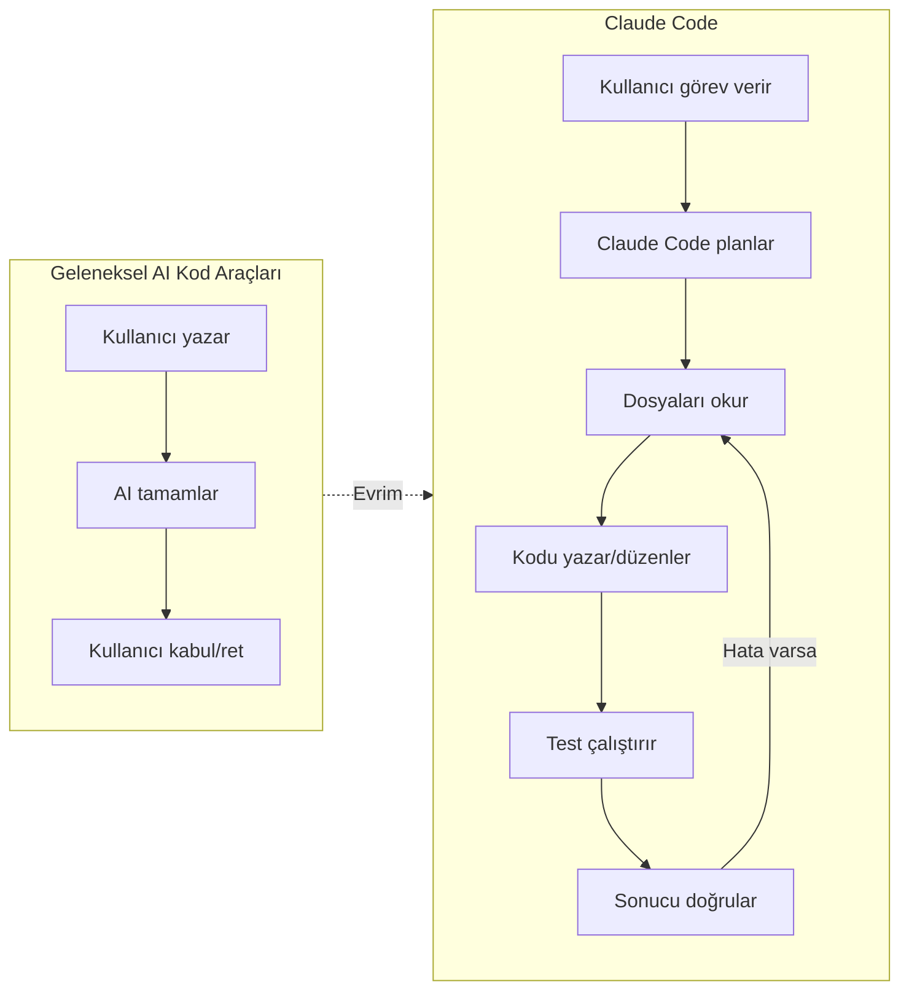
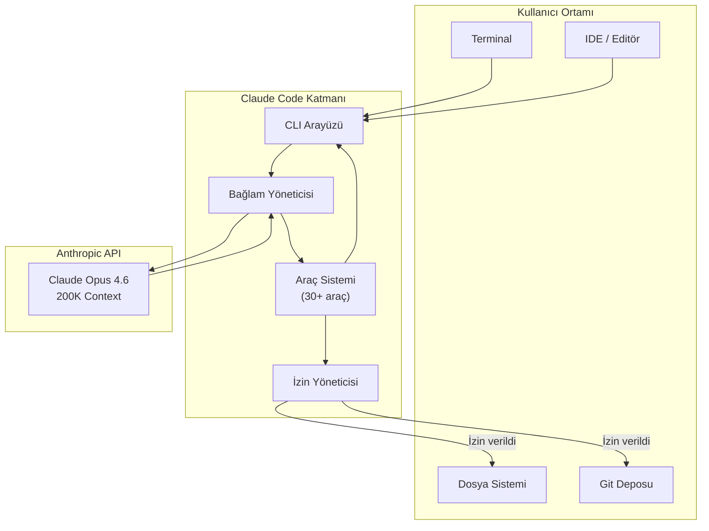
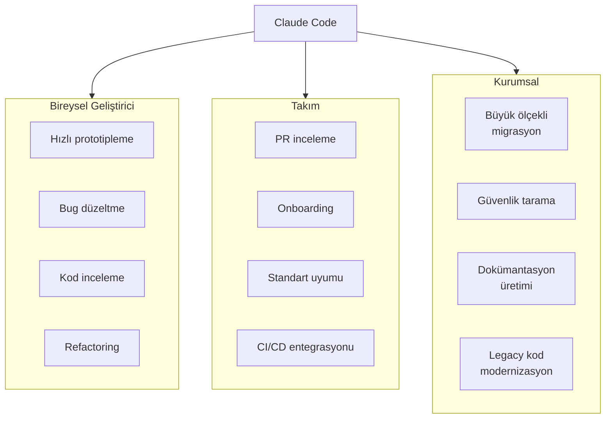

# Claude Code Nedir?

Claude Code, Anthropic tarafından geliştirilen **terminal-native** (terminal tabanlı) bir **autonomous coding agent**'tır (otonom kodlama ajanı). Doğrudan terminalinizde çalışır; kodunuzu okur, komut çalıştırır, web'de gezinir, API çağrıları yapar ve projenizdeki değişiklikleri uygular.

## Ön Koşullar

| Konu | Bölüm |
|------|-------|
| LLM nedir ve nasıl çalışır | [Bölüm 02](../02-buyuk-dil-modelleri/README.md) |
| Claude ekosistemi | [Bölüm 05](../05-claude-ekosistemi/README.md) |

---

## Claude Code Bir Bakışta



---

## Geleneksel Araçlardan Farkı

Claude Code, basit bir kod tamamlama aracı değildir. **Agentic** (ajantik) bir yapıya sahiptir — yani verdiğiniz görevi kendi başına planlayıp, birden fazla adımda yürütebilir.



| Özellik | Kod Tamamlama Araçları | Claude Code |
|---------|----------------------|-------------|
| Çalışma şekli | Satır/blok tamamlama | Otonom görev yürütme |
| Bağlam | Açık dosya | Tüm proje |
| Komut çalıştırma | Hayır | Evet (shell, git, build) |
| Dosya oluşturma/düzenleme | Sınırlı | Tam yetki (izinli) |
| Çok adımlı görev | Hayır | Evet |
| Web erişimi | Hayır | Evet |
| Kendi kendini düzeltme | Hayır | Evet |

---

## Teknik Altyapı

Claude Code, arka planda **Claude Opus 4.6** modelini kullanır:

| Özellik | Değer |
|---------|-------|
| **Model** | Claude Opus 4.6 (claude-sonnet-4-20250514 da desteklenir) |
| **Context Window** (bağlam penceresi) | 200.000 token (~150.000 kelime) |
| **Çalışma ortamı** | Terminal / CLI |
| **Kurulum** | `npm install -g @anthropic-ai/claude-code` |
| **Desteklenen OS** | macOS, Linux, Windows (WSL üzerinden) |
| **Dahili araç sayısı** | 30+ |
| **Dil desteği** | Tüm popüler programlama dilleri |



---

## Neler Yapabilir?

### 1. Proje Anlama ve Keşif

```bash
# Projeyi analiz etmesini isteyin
$ claude
> Bu projenin mimarisini açıkla

# Belirli bir dosyayı anlamasını isteyin
> src/auth/middleware.ts dosyasını açıkla

# Bağımlılıkları listelesin
> Bu projedeki kullanılmayan bağımlılıkları bul
```

### 2. Kod Yazma ve Düzenleme

```bash
# Yeni bir feature ekleyin
> Kullanıcı profil sayfası için bir React componenti oluştur

# Bug düzeltin
> Login sırasında oluşan "undefined is not a function" hatasını düzelt

# Refactoring yapın
> UserService sınıfını SOLID prensiplerine göre yeniden yapılandır
```

### 3. Test ve Kalite

```bash
# Test yazdırın
> auth/login.ts için birim testleri yaz, edge case'leri de kapsasın

# Testleri çalıştırın
> Tüm testleri çalıştır ve başarısız olanları düzelt

# Kod kalitesini kontrol edin
> Bu projede güvenlik açıkları var mı kontrol et
```

### 4. Git ve DevOps

```bash
# Commit oluşturun
> Yaptığım değişiklikler için anlamlı bir commit mesajı yaz ve commit et

# PR hazırlayın
> Bu branch için bir pull request oluştur

# Git geçmişini inceleyin
> Son 1 haftada auth modülünde ne değişmiş?
```

### 5. Dokümantasyon

```bash
# README üretin
> Bu proje için kapsamlı bir README.md oluştur

# API dokümanı yazın
> Tüm API endpoint'lerini belgele

# Inline doküman ekleyin
> Bu dosyadaki karmaşık fonksiyonlara JSDoc yorumları ekle
```

---

## Kullanım Senaryoları



---

## Ne Yapamaz?

Claude Code güçlü bir araç olsa da sınırları vardır:

| Sınırlama | Açıklama |
|-----------|----------|
| **İnternet erişimi sınırlı** | Rastgele web sitelerine tam erişimi yoktur; belirli araçlarla kısıtlıdır |
| **Güvenlik onayı gerektirir** | Dosya yazma ve komut çalıştırma için kullanıcı onayı gerekir |
| **Context window limiti** | 200K token'ı aşan çok büyük projelerde tüm kodu aynı anda göremez |
| **Deterministik değil** | Aynı soruya farklı zamanlarda farklı yanıtlar verebilir |
| **Çalışan süreçlerle etkileşim** | GUI uygulamalarıyla doğrudan etkileşim kuramaz |
| **Gizli bilgi riski** | `.env` ve credential dosyalarının farkında olunmalıdır |

---

## Özet

| Kavram | Açıklama |
|--------|----------|
| **Claude Code** | Anthropic'in terminal tabanlı otonom kodlama ajanı |
| **Agentic** | Görevi planlayıp, birden fazla adımda yürütebilen yapı |
| **Terminal-native** | IDE'ye bağlı değil, doğrudan terminal üzerinden çalışır |
| **30+ araç** | Dosya, shell, git, web ve daha fazlası için dahili araçlar |
| **200K context** | Büyük projelerde geniş bağlam penceresi |

---

## Sonraki Adım

Claude Code'un ne olduğunu öğrendik. Şimdi arka planda nasıl çalıştığını, agentic loop mekanizmasını inceleyelim:

→ [Claude Code Nasıl Çalışır?](./02-claude-code-nasil-calisir.md)
