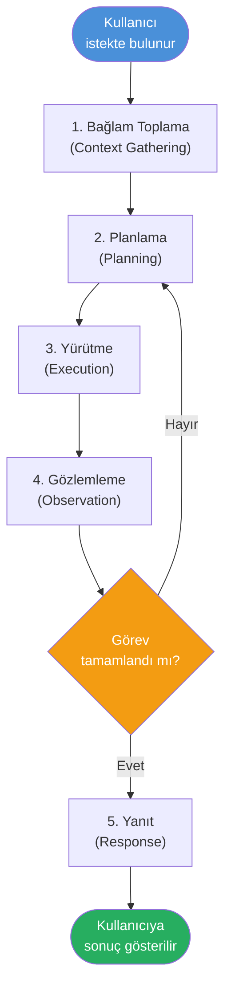
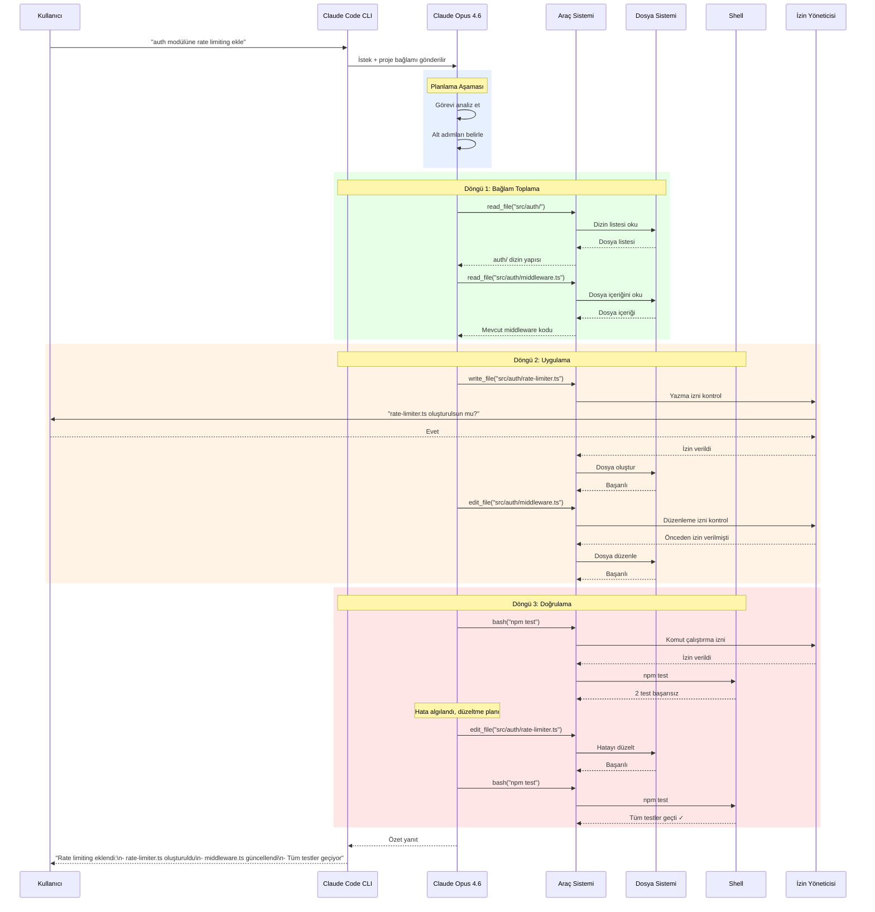
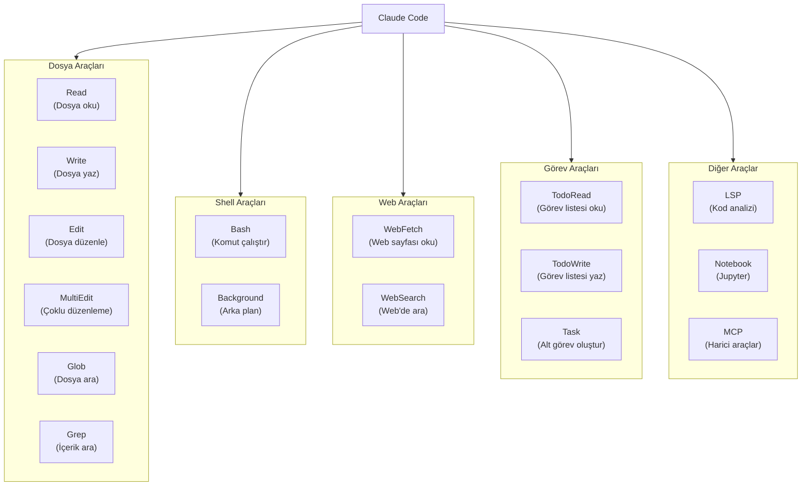
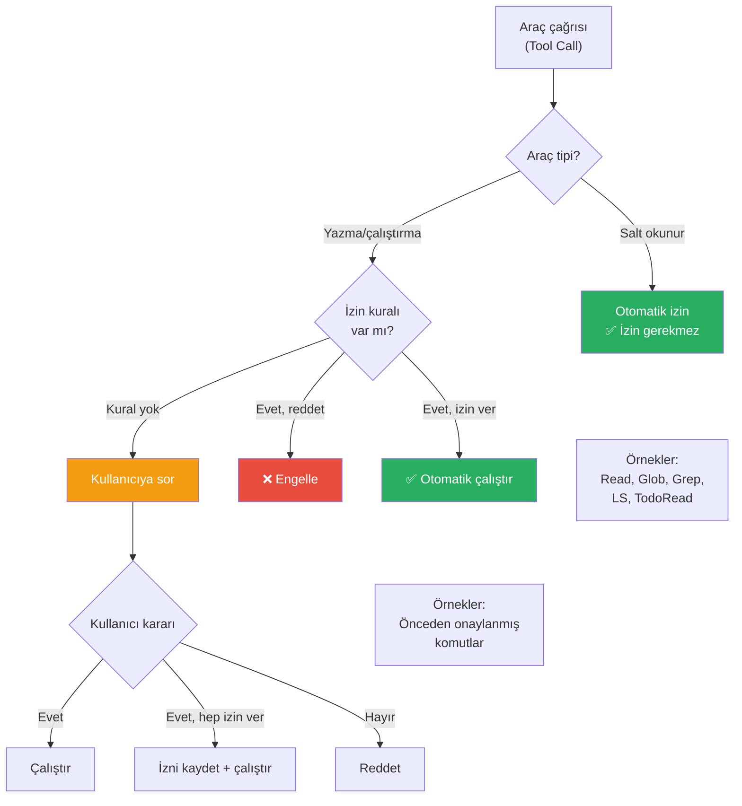
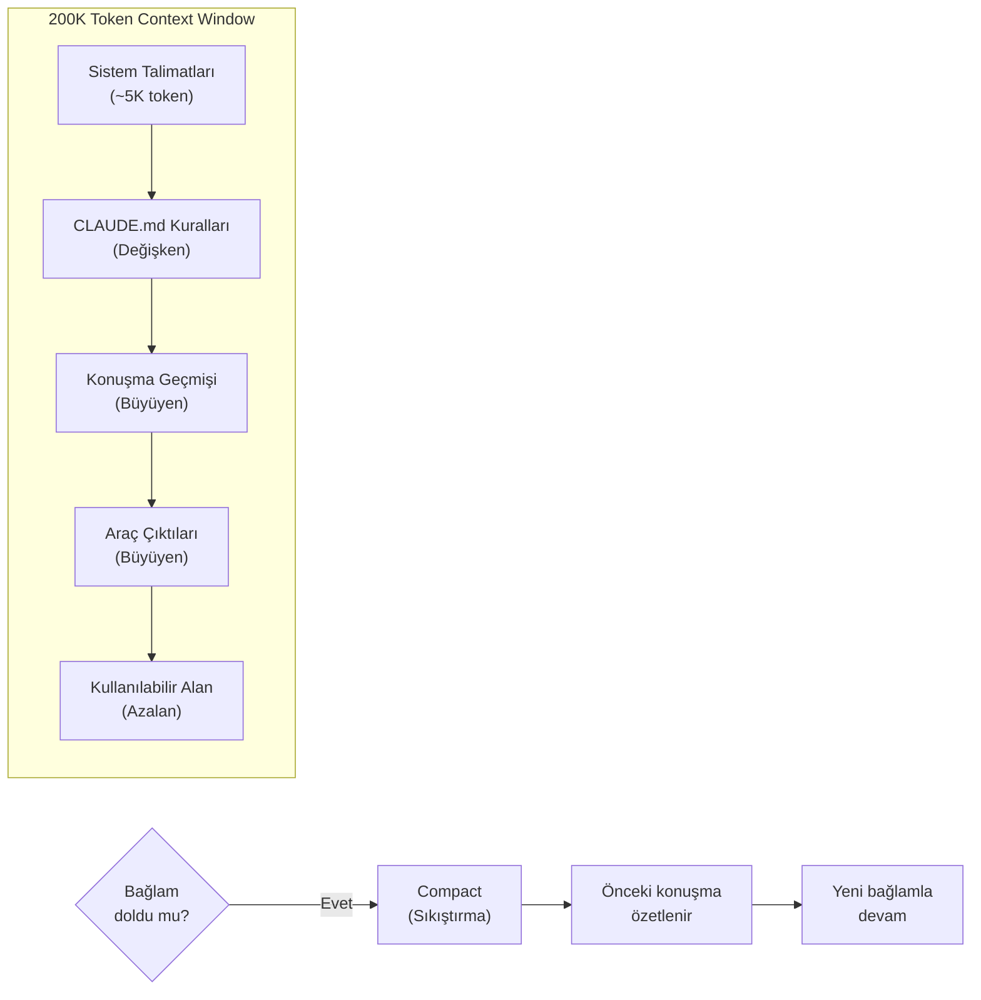
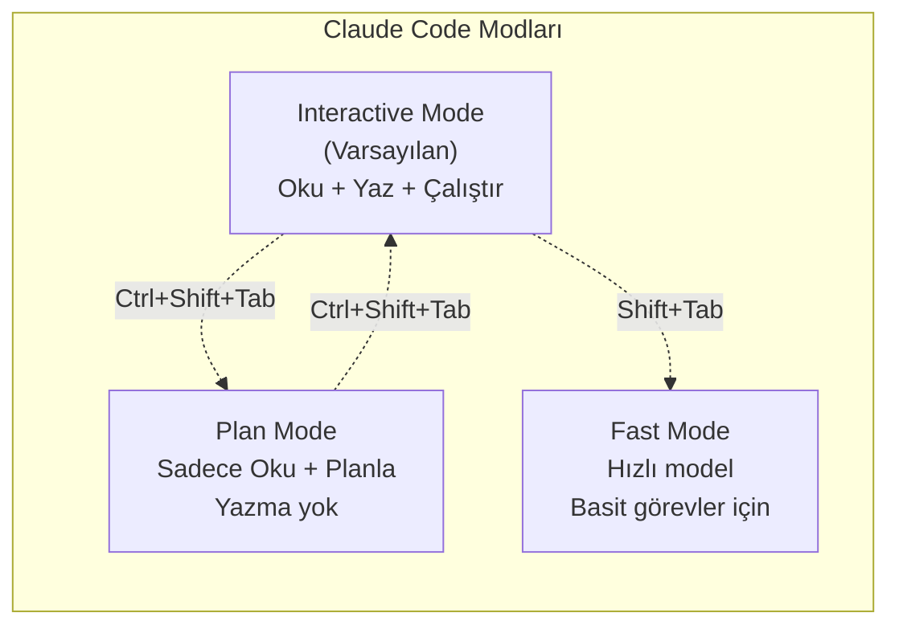

# Claude Code Nasıl Çalışır?

Claude Code, bir **agentic loop** (ajantik döngü) üzerinde çalışır. Kullanıcının verdiği görevi alır, planlar, araçları kullanarak adım adım yürütür ve sonucu doğrular. Bu bölümde bu döngünün detaylarını, araç sistemini ve izin modelini inceleyeceğiz.

## Ön Koşullar

| Konu | Bölüm |
|------|-------|
| Claude Code nedir | [Claude Code Nedir?](./01-claude-code-nedir.md) |
| LLM'lerin çalışma mantığı | [Bölüm 02](../02-buyuk-dil-modelleri/README.md) |

---

## Agentic Loop (Ajantik Döngü)

Claude Code'un çalışma prensibi basit ama güçlüdür: **oku → düşün → yap → gözlemle → tekrarla**.



### Adım Adım Açıklama

| Adım | Açıklama | Örnek |
|------|----------|-------|
| **1. Bağlam Toplama** | Proje yapısını, mevcut dosyaları ve ilgili kodu okur | `CLAUDE.md`, dizin yapısı, git durumu |
| **2. Planlama** | Görevi alt adımlara böler, strateji belirler | "Önce mevcut kodu okuyayım, sonra testi yazayım" |
| **3. Yürütme** | Araçları kullanarak planı uygular | Dosya okuma, kod yazma, komut çalıştırma |
| **4. Gözlemleme** | Sonuçları değerlendirir, hataları yakalar | Test sonuçları, hata mesajları, çıktılar |
| **5. Yanıt** | Tamamlanan işin özetini kullanıcıya sunar | "3 dosya oluşturdum, 12 test yazdım, hepsi geçti" |

---

## Detaylı Sequence Diagram (Sıralama Diyagramı)

Aşağıdaki diyagram, bir kullanıcı isteğinin tüm yaşam döngüsünü gösterir:



---

## Araç Sistemi (Tool System)

Claude Code, 30'dan fazla dahili **tool** (araç) ile donatılmıştır. Her araç belirli bir görevi yerine getirir:



### Araç Kategorileri

| Kategori | Araçlar | Açıklama |
|----------|---------|----------|
| **Dosya İşlemleri** | Read, Write, Edit, MultiEdit, Glob, Grep | Dosya okuma, yazma, arama |
| **Shell** | Bash | Terminal komutları çalıştırma |
| **Web** | WebFetch, WebSearch | İnternet erişimi |
| **Görev Yönetimi** | TodoRead, TodoWrite, Task | İç görev takibi ve subagent'lar |
| **Kod Analizi** | LSP | Sembol analizi, tanım bulma |
| **Notebook** | NotebookRead, NotebookEdit | Jupyter Notebook desteği |
| **MCP** | Dinamik araçlar | Harici entegrasyonlar |

---

## İzin Sistemi (Permission System)

Claude Code, güvenlik için katmanlı bir **permission** (izin) sistemi kullanır:



### İzin Kategorileri

| Kategori | Örnekler | İzin Gerekir mi? |
|----------|----------|-------------------|
| **Salt okunur** | Dosya okuma, arama, dizin listeleme | Hayır |
| **Yazma** | Dosya oluşturma, düzenleme, silme | Evet |
| **Komut çalıştırma** | Shell komutları, build, test | Evet |
| **Web erişimi** | Web sayfası okuma | Genellikle hayır |

### İzin Yanıt Seçenekleri

Bir izin istemi geldiğinde kullanıcıya şu seçenekler sunulur:

```
Claude Code wants to run: npm test

  Allow (Yalnız bu sefer izin ver)
  Allow always (Bu oturum için hep izin ver)
  Deny (Reddet)
```

---

## Bağlam Yönetimi (Context Management)

Claude Code, 200K token'lık **context window** (bağlam penceresi) içinde çalışır. Bağlamı verimli kullanmak için:



### Context Window Dolduğunda Ne Olur?

1. **Auto-compact:** Claude Code konuşma geçmişini otomatik olarak özetler
2. **Önemli bilgiler korunur:** Dosya içerikleri, araç çıktıları önceliklendirilir
3. **Kullanıcı fark etmez:** Süreç otomatik olarak gerçekleşir

---

## Çalışma Modları

Claude Code farklı **mode** (mod) seçenekleri sunar:



| Mod | Açıklama | Kullanım Senaryosu |
|-----|----------|--------------------|
| **Interactive** | Tam yetkili mod; okur, yazar, çalıştırır | Genel geliştirme |
| **Plan** | Salt okunur; plan yapar ama değişiklik yapmaz | Mimari inceleme, strateji |
| **Fast** | Hızlı model kullanır, basit görevler için | Kısa sorular, küçük düzenlemeler |

---

## Pratik Örnek: Bir Görevin Yaşam Döngüsü

Diyelim ki şu komutu verdiniz:

```bash
$ claude
> Bu projedeki tüm TODO yorumlarını bul ve bir rapor oluştur
```

Claude Code şu adımları izler:

| Adım | Araç | Eylem |
|------|------|-------|
| 1 | `Grep` | Tüm dosyalarda `TODO` arar |
| 2 | `Read` | Bulunan dosyaların ilgili bölümlerini okur |
| 3 | *(düşünme)* | Sonuçları kategorize eder |
| 4 | `Write` | `TODO-REPORT.md` dosyası oluşturur |
| 5 | *(yanıt)* | Kullanıcıya özet sunar |

Tüm bu süreçte kullanıcı yalnızca ilk komutu verir ve sonucu görür. Ara adımlarda izin isterse onay verir.

---

## Özet

| Kavram | Açıklama |
|--------|----------|
| **Agentic Loop** | Oku → Düşün → Yap → Gözlemle → Tekrarla döngüsü |
| **Tool System** | 30+ dahili araç (dosya, shell, web, görev) |
| **Permission System** | Yazma/çalıştırma için kullanıcı onayı gerektiren güvenlik katmanı |
| **Context Window** | 200K token kapasiteli bağlam penceresi |
| **Auto-compact** | Bağlam dolduğunda otomatik özetleme |

---

## Sonraki Adım

Claude Code'un nasıl çalıştığını anladık. Şimdi onu bilgisayarınıza kuralım:

→ [Kurulum ve Gereksinimler](./03-kurulum-ve-gereksinimler.md)
