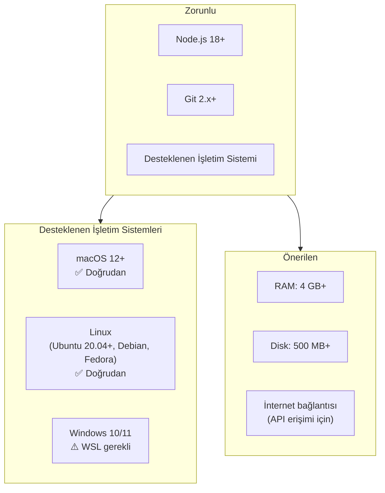
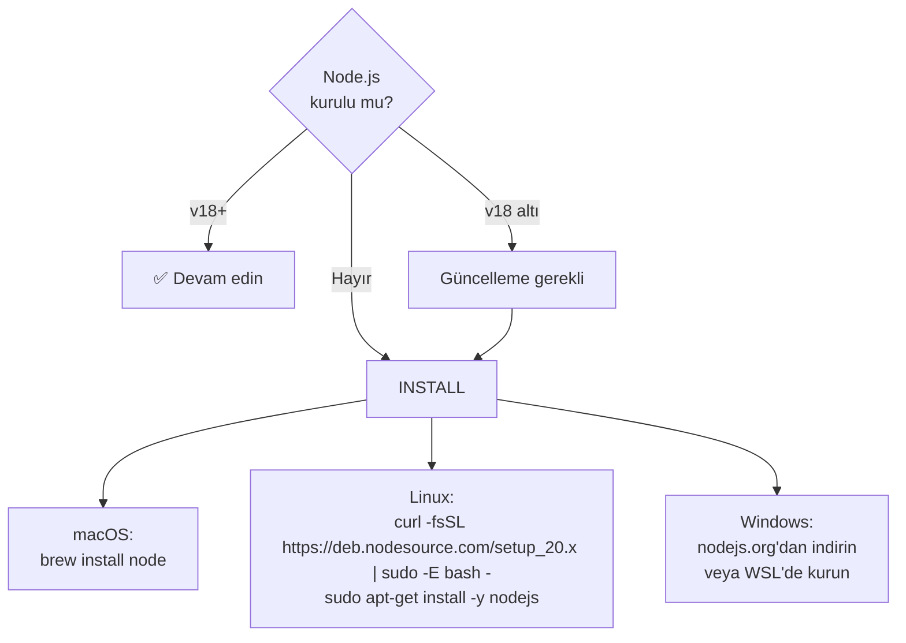
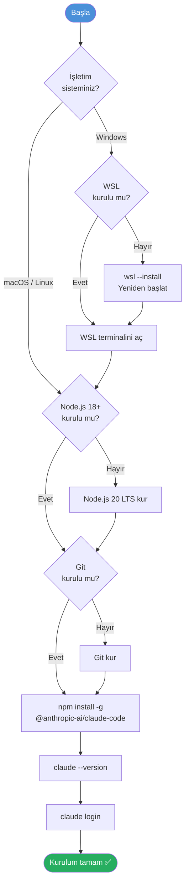
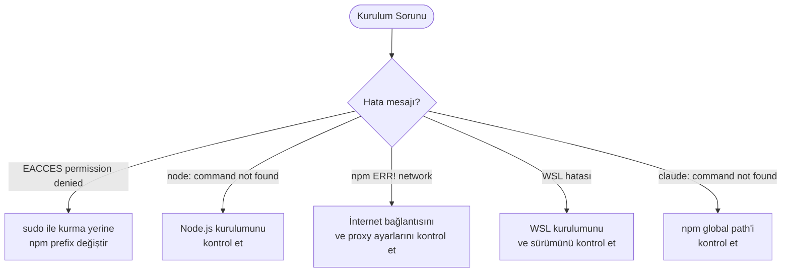

# Kurulum ve Gereksinimler

Bu bölümde Claude Code'u bilgisayarınıza adım adım nasıl kuracağınızı, sistem gereksinimlerini ve çok karşılaşılan kurulum sorunlarının çözümlerini bulacaksınız.

## Ön Koşullar

| Konu | Bölüm |
|------|-------|
| Claude Code nedir | [Claude Code Nedir?](./01-claude-code-nedir.md) |
| Terminal / komut satırı temel kullanımı | Harici kaynak |

---

## Sistem Gereksinimleri



| Gereksinim | Minimum | Önerilen |
|------------|---------|----------|
| **Node.js** | 18.0.0 | 20.x LTS veya üzeri |
| **npm** | Node.js ile birlikte gelir | Güncel sürüm |
| **Git** | 2.x | Güncel sürüm |
| **RAM** | 4 GB | 8 GB+ |
| **Disk alanı** | 500 MB | 1 GB+ |
| **İnternet** | Gerekli (API çağrıları için) | Stabil bağlantı |

---

## Adım Adım Kurulum

### Adım 1: Node.js Kontrolü ve Kurulumu

Önce Node.js'in kurulu olup olmadığını kontrol edin:

```bash
node --version
# Beklenen çıktı: v18.x.x veya üzeri
```

```bash
npm --version
# Beklenen çıktı: 9.x.x veya üzeri
```

**Node.js kurulu değilse:**



**macOS (Homebrew ile):**

```bash
# Homebrew yoksa önce onu kurun
/bin/bash -c "$(curl -fsSL https://raw.githubusercontent.com/Homebrew/install/HEAD/install.sh)"

# Node.js'i kurun
brew install node

# Doğrulayın
node --version
```

**Linux (Ubuntu/Debian):**

```bash
# NodeSource repository ekleyin
curl -fsSL https://deb.nodesource.com/setup_20.x | sudo -E bash -

# Node.js'i kurun
sudo apt-get install -y nodejs

# Doğrulayın
node --version
```

**Windows:**

> **Önemli:** Claude Code, Windows üzerinde doğrudan çalışmaz. **WSL (Windows Subsystem for Linux)** gereklidir.

```powershell
# 1. WSL'i kurun (PowerShell - Yönetici olarak)
wsl --install

# 2. Bilgisayarı yeniden başlatın

# 3. WSL terminalini açın
wsl

# 4. WSL içinde Node.js'i kurun
curl -fsSL https://deb.nodesource.com/setup_20.x | sudo -E bash -
sudo apt-get install -y nodejs
```

### Adım 2: Git Kontrolü

```bash
git --version
# Beklenen çıktı: git version 2.x.x
```

Git kurulu değilse:

```bash
# macOS
brew install git

# Linux (Ubuntu/Debian)
sudo apt-get install git

# Windows (WSL içinde)
sudo apt-get install git
```

### Adım 3: Claude Code Kurulumu

```bash
# Claude Code'u global olarak kurun
npm install -g @anthropic-ai/claude-code
```

Başarılı kurulum çıktısı:

```
added 1 package in 15s

1 package is looking for funding
  run `npm fund` for details
```

### Adım 4: Kurulumu Doğrulama

```bash
# Claude Code'un kurulu olduğunu doğrulayın
claude --version
# Beklenen çıktı: claude-code x.x.x

# Yardım menüsünü görüntüleyin
claude --help
```

---

## Kurulum Akış Şeması



---

## Güncelleme

Claude Code'u güncellemek için:

```bash
# En son sürüme güncelle
npm update -g @anthropic-ai/claude-code

# Veya belirli bir sürüme güncelle
npm install -g @anthropic-ai/claude-code@latest

# Mevcut sürümü kontrol et
claude --version
```

---

## Sorun Giderme

### Çok Karşılaşılan Sorunlar ve Çözümleri



#### 1. EACCES Permission Denied (İzin Hatası)

```bash
# Sorun: npm global kurulumda izin hatası
npm ERR! Error: EACCES: permission denied

# Çözüm 1: npm prefix değiştir (önerilen)
mkdir -p ~/.npm-global
npm config set prefix '~/.npm-global'
echo 'export PATH=~/.npm-global/bin:$PATH' >> ~/.bashrc
source ~/.bashrc

# Sonra tekrar kur
npm install -g @anthropic-ai/claude-code

# Çözüm 2: nvm kullan
curl -o- https://raw.githubusercontent.com/nvm-sh/nvm/v0.39.7/install.sh | bash
source ~/.bashrc
nvm install 20
nvm use 20
npm install -g @anthropic-ai/claude-code
```

#### 2. Node.js Sürüm Uyumsuzluğu

```bash
# Sorun: Node.js sürümü 18'den eski
node --version
# v16.x.x → Güncelleme gerekli

# Çözüm: nvm ile güncel sürüm kur
nvm install 20
nvm use 20
nvm alias default 20

# Doğrula
node --version
# v20.x.x
```

#### 3. `claude: command not found`

```bash
# npm global bin dizinini kontrol edin
npm config get prefix

# PATH'te olduğundan emin olun
echo $PATH

# Gerekirse PATH'e ekleyin
echo 'export PATH=$(npm config get prefix)/bin:$PATH' >> ~/.bashrc
source ~/.bashrc

# Tekrar deneyin
claude --version
```

#### 4. Proxy/Ağ Sorunları

```bash
# Kurumsal proxy arkasındaysanız
npm config set proxy http://proxy.sirket.com:8080
npm config set https-proxy http://proxy.sirket.com:8080

# SSL sertifika sorunu varsa (geçici çözüm)
npm config set strict-ssl false

# Proxy ayarlarını kaldırmak için
npm config delete proxy
npm config delete https-proxy
```

#### 5. Windows WSL Sorunları

```powershell
# WSL sürümünü kontrol edin (PowerShell'de)
wsl --version

# WSL 2'ye güncelle
wsl --set-default-version 2

# WSL dağıtımını yeniden yükle
wsl --install -d Ubuntu-22.04

# WSL içinde Node.js'in çalıştığını doğrula
wsl -e node --version
```

---

## Kurulum Sonrası Kontrol Listesi

Kurulumun başarılı olduğunu doğrulamak için bu kontrolleri yapın:

```bash
# 1. Node.js sürümü (18+ olmalı)
node --version

# 2. npm sürümü
npm --version

# 3. Git sürümü
git --version

# 4. Claude Code sürümü
claude --version

# 5. Claude Code yardım
claude --help
```

Tüm komutlar hatasız çalışıyorsa kurulum tamamdır.

---

## Özet

| Adım | Komut | Açıklama |
|------|-------|----------|
| Node.js kontrol | `node --version` | 18+ olmalı |
| Git kontrol | `git --version` | 2.x+ olmalı |
| Kurulum | `npm install -g @anthropic-ai/claude-code` | Global kurulum |
| Doğrulama | `claude --version` | Kurulum kontrolü |
| Güncelleme | `npm update -g @anthropic-ai/claude-code` | Son sürüme güncelleme |

---

## Sonraki Adım

Claude Code kuruldu. Şimdi kimlik doğrulama yaparak kullanmaya başlayalım:

→ [Kimlik Doğrulama](./04-kimlik-dogrulama.md)
