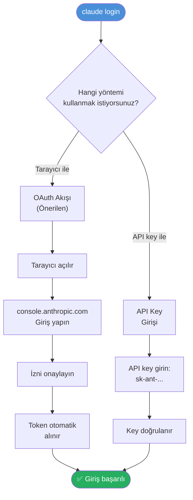
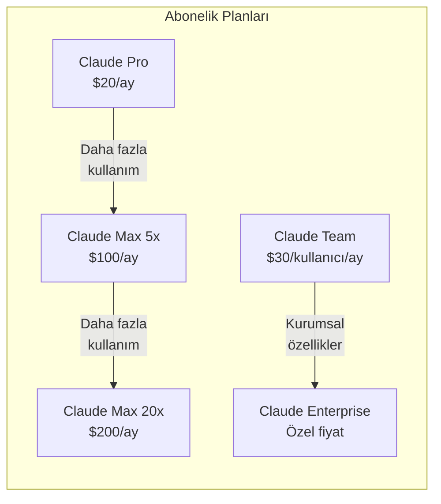
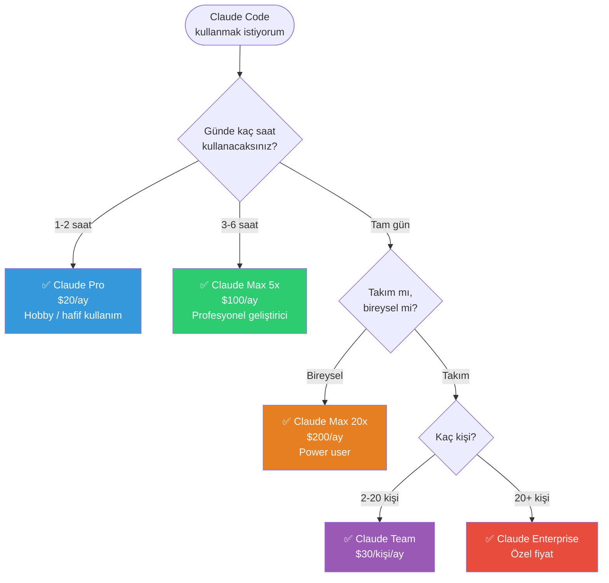
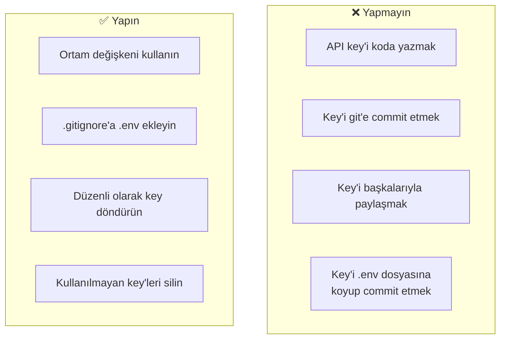

# Kimlik Doğrulama

Claude Code'u kullanmak için Anthropic hesabınızla kimlik doğrulaması yapmanız gerekir. Bu bölümde giriş yöntemlerini, abonelik planlarını ve API key yapılandırmasını öğreneceksiniz.

## Ön Koşullar

| Konu | Bölüm |
|------|-------|
| Claude Code kurulumu | [Kurulum ve Gereksinimler](./03-kurulum-ve-gereksinimler.md) |

---

## Kimlik Doğrulama Yöntemleri

Claude Code iki farklı **authentication** (kimlik doğrulama) yöntemi sunar:



### Yöntem 1: OAuth ile Giriş (Önerilen)

```bash
# Claude Code'u başlatın
claude login

# Çıktı:
# ? How would you like to authenticate?
# > Anthropic Console (OAuth - recommended)
#   API Key
#
# Opening browser to authenticate...
# Waiting for authentication...
# ✓ Successfully authenticated!
```

Bu yöntemde:
1. Terminal sizi varsayılan tarayıcınıza yönlendirir
2. **console.anthropic.com** adresinde giriş yaparsınız
3. Claude Code'a erişim izni verirsiniz
4. Token otomatik olarak alınır ve saklanır

### Yöntem 2: API Key ile Giriş

```bash
# API key ile giriş
claude login

# "API Key" seçeneğini seçin
# ? How would you like to authenticate?
#   Anthropic Console (OAuth - recommended)
# > API Key
#
# ? Enter your API key: sk-ant-api03-xxxxxxxxxxxxx
# ✓ API key validated and saved!
```

API key'inizi **console.anthropic.com → API Keys** bölümünden oluşturabilirsiniz.

> **Güvenlik Uyarısı:** API key'inizi asla kod içinde, commit'lerde veya paylaşılan dosyalarda saklamayın. Claude Code key'i güvenli bir şekilde yerel makinenizde depolar.

---

## Abonelik Planları

Claude Code kullanımı için bir Anthropic aboneliğine ihtiyacınız vardır:



### Detaylı Plan Karşılaştırması

| Özellik | Pro ($20/ay) | Max 5x ($100/ay) | Max 20x ($200/ay) | Team ($30/kişi/ay) | Enterprise |
|---------|-------------|-------------------|--------------------|--------------------|------------|
| **Claude Code erişimi** | ✅ | ✅ | ✅ | ✅ | ✅ |
| **Kullanım limiti** | Temel | 5x Pro | 20x Pro | 5x Pro/kişi | Özel |
| **Model** | Opus 4.6 | Opus 4.6 | Opus 4.6 | Opus 4.6 | Opus 4.6 |
| **Öncelikli erişim** | Hayır | Evet | Evet | Evet | Evet |
| **Yoğun saatlerde** | Sıra bekleyebilir | Öncelikli | En yüksek öncelik | Öncelikli | Garantili |
| **Admin paneli** | Hayır | Hayır | Hayır | Evet | Evet |
| **SSO/SAML** | Hayır | Hayır | Hayır | Hayır | Evet |
| **Kullanım analitiği** | Temel | Temel | Temel | Detaylı | Detaylı |
| **Destek** | Standart | Standart | Öncelikli | Öncelikli | Özel |

### Hangi Plan Size Uygun?



| Kullanım Senaryosu | Önerilen Plan |
|--------------------|---------------|
| Hafta sonu projeleri, öğrenme | Pro ($20/ay) |
| Günlük iş aracı olarak | Max 5x ($100/ay) |
| Tam zamanlı AI destekli geliştirme | Max 20x ($200/ay) |
| Küçük-orta takım | Team ($30/kişi/ay) |
| Büyük organizasyon | Enterprise (özel) |

---

## API Key Yapılandırması

Claude Code'u **API key** ile kullanmak istiyorsanız (abonelik yerine doğrudan API kullanımı):

### API Key Oluşturma

1. **console.anthropic.com** adresine gidin
2. **API Keys** bölümüne tıklayın
3. **Create Key** butonuna tıklayın
4. Key'e bir isim verin (ör: "claude-code-laptop")
5. Oluşturulan key'i kopyalayın (`sk-ant-api03-...`)

### API Key ile Yapılandırma

```bash
# Yöntem 1: claude login komutu ile
claude login
# API Key seçeneğini seçin
# Key'i yapıştırın

# Yöntem 2: Ortam değişkeni ile
export ANTHROPIC_API_KEY="sk-ant-api03-xxxxxxxxxxxxx"

# Windows (WSL içinde)
echo 'export ANTHROPIC_API_KEY="sk-ant-api03-xxxxxxxxxxxxx"' >> ~/.bashrc
source ~/.bashrc
```

> **Not:** API key ile kullanımda, kullanım miktarına göre ücretlendirilirsiniz. Bu, abonelik planlarından farklıdır. Detaylı fiyatlandırma için **console.anthropic.com/pricing** adresini ziyaret edin.

### API Key vs Abonelik Karşılaştırması

| Özellik | Abonelik (Pro/Max) | API Key |
|---------|-------------------|---------|
| **Ücretlendirme** | Sabit aylık | Kullanım başına |
| **Maliyet tahmini** | Kolay (sabit) | Değişken |
| **Limit** | Aylık kullanım kotası | Bakiye kadar |
| **Kurulum** | OAuth ile kolay | Key yönetimi gerekli |
| **Önerilen** | Bireysel kullanıcılar | CI/CD, otomasyon |

---

## Oturum Yönetimi

```bash
# Giriş durumunu kontrol edin
claude status

# Çıkış yapın
claude logout

# Farklı hesapla giriş yapın
claude login

# Aktif hesabı görüntüleyin
claude whoami
```

---

## Güvenlik En İyi Uygulamaları



---

## Özet

| Kavram | Açıklama |
|--------|----------|
| **OAuth** | Tarayıcı üzerinden kimlik doğrulama (önerilen yöntem) |
| **API Key** | Manuel key ile kimlik doğrulama |
| **Pro Plan** | $20/ay, temel kullanım |
| **Max Plan** | $100-200/ay, yoğun kullanım için |
| **Team/Enterprise** | Takım ve kurumsal kullanım |

---

## Sonraki Adım

Kimlik doğrulaması tamamlandı. Şimdi ilk Claude Code oturumunuzu başlatalım:

→ [İlk Oturum](./05-ilk-oturum.md)
