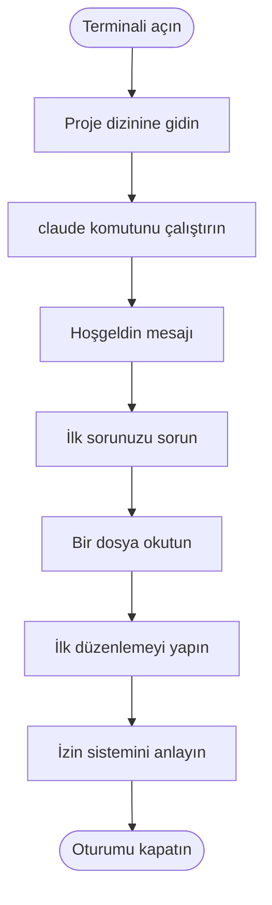
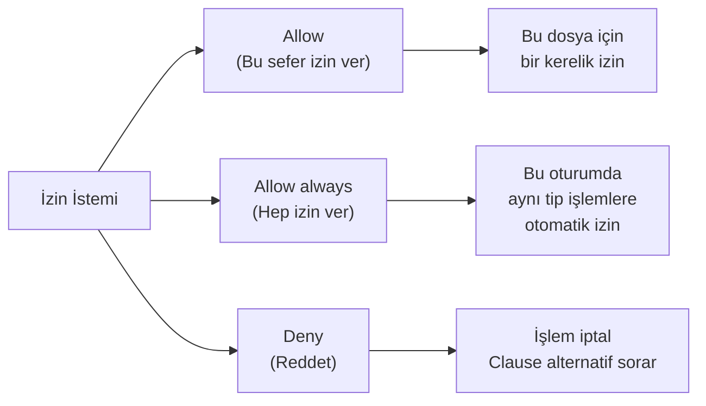
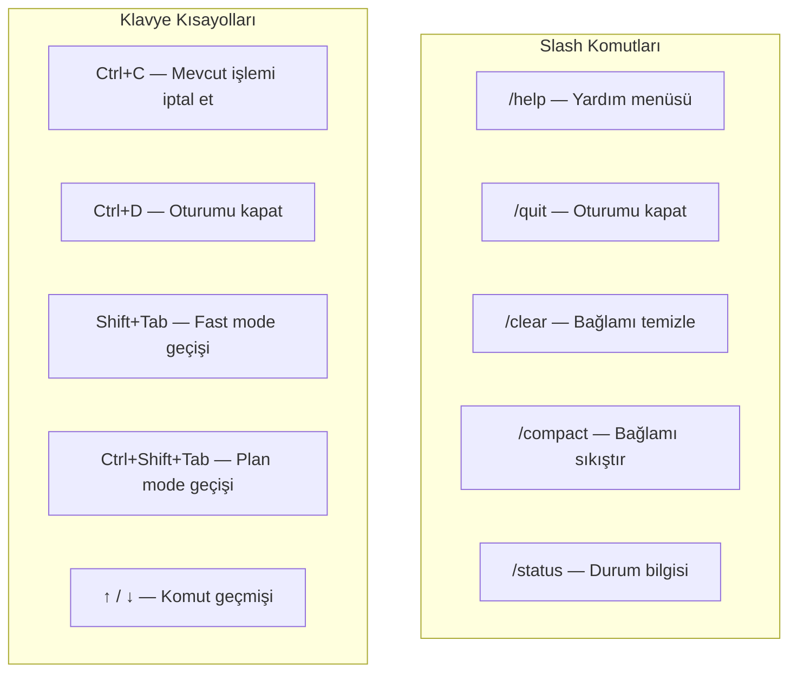
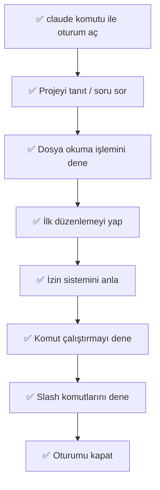

# İlk Oturum

Bu bölümde Claude Code ile ilk oturumunuzu başlatacak, temel etkileşim kalıplarını öğrenecek ve izin sistemini pratikte göreceksiniz. Gerçek terminal çıktılarıyla adım adım ilerleyeceğiz.

## Ön Koşullar

| Konu | Bölüm |
|------|-------|
| Claude Code kurulumu | [Kurulum ve Gereksinimler](./03-kurulum-ve-gereksinimler.md) |
| Kimlik doğrulama | [Kimlik Doğrulama](./04-kimlik-dogrulama.md) |

---

## İlk Oturum Akışı



---

## Adım 1: Claude Code'u Başlatma

Bir proje dizininde Claude Code'u başlatın:

```bash
# Proje dizinine gidin
cd ~/projelerim/my-web-app

# Claude Code'u başlatın
claude
```

Başlatma çıktısı:

```
╭────────────────────────────────────────╮
│                                        │
│   Claude Code v1.0.32                  │
│                                        │
│   Model: Claude Opus 4.6              │
│   Context: 200K tokens                 │
│                                        │
│   /help for commands                   │
│   /quit to exit                        │
│                                        │
╰────────────────────────────────────────╯

  my-web-app on main via ⬡ v20.11.0

>
```

`>` işareti, Claude Code'un komutlarınızı beklediğini gösterir. Artık doğal dilde isteklerinizi yazabilirsiniz.

---

## Adım 2: İlk Sorunuzu Sorun

Basit bir soruyla başlayalım:

```
> Bu proje ne hakkında? Kısa bir özet ver.
```

Claude Code'un yanıtı:

```
⏺ Projeyi inceliyorum...

  📂 Read package.json
  📂 Read README.md
  📂 Read src/App.tsx

⏺ Bu proje, React ve TypeScript ile geliştirilmiş bir e-ticaret web
  uygulamasıdır.

  Temel özellikler:
  • Ürün listeleme ve arama
  • Kullanıcı kaydı ve girişi (JWT authentication)
  • Alışveriş sepeti
  • Sipariş yönetimi

  Teknoloji yığını:
  • Frontend: React 18 + TypeScript + Tailwind CSS
  • Backend: Node.js + Express
  • Veritabanı: PostgreSQL + Prisma ORM
  • Test: Jest + React Testing Library
```

> **Dikkat:** Claude Code ilk olarak projeyi anlamak için dosyaları okudu (`Read` aracını kullandı). Salt okunur işlemlerde izin istemedi.

---

## Adım 3: Dosya Okuma

Belirli bir dosyayı incelettirin:

```
> src/components/Header.tsx dosyasını oku ve ne yaptığını açıkla
```

Yanıt:

```
⏺ Read src/components/Header.tsx

⏺ Header.tsx dosyası, uygulamanın üst navigasyon çubuğunu render eden bir
  React bileşenidir.

  Yapısı:
  • Logo ve site adı (sol taraf)
  • Arama çubuğu (orta)
  • Kullanıcı menüsü ve sepet ikonu (sağ taraf)

  Önemli noktalar:
  • useAuth() hook'u ile giriş durumunu kontrol ediyor
  • Sepetteki ürün sayısını CartContext'ten alıyor
  • Responsive tasarım: mobilde hamburger menü gösteriyor

  Potansiyel iyileştirme: Arama fonksiyonu debounce kullanmıyor,
  her tuş vuruşunda API çağrısı yapıyor.
```

---

## Adım 4: İlk Düzenleme — İzin Sistemi

Şimdi bir dosyada değişiklik yapalım. Bu adımda **permission prompt** (izin istemi) ile karşılaşacaksınız:

```
> Header.tsx'deki arama fonksiyonuna 300ms debounce ekle
```

Claude Code'un çalışma süreci:

```
⏺ Read src/components/Header.tsx
⏺ Read src/hooks/useDebounce.ts (not found)

⏺ Debounce için bir custom hook oluşturacağım ve Header'da kullanacağım.

  ┌─────────────────────────────────────────────────┐
  │ Claude Code wants to create file:                │
  │ src/hooks/useDebounce.ts                        │
  │                                                  │
  │ import { useState, useEffect } from 'react';    │
  │                                                  │
  │ export function useDebounce<T>(                  │
  │   value: T, delay: number                       │
  │ ): T {                                           │
  │   const [debounced, setDebounced] = useState(... │
  │   ...                                            │
  │ }                                                │
  │                                                  │
  │  Allow    Allow always    Deny                  │
  └─────────────────────────────────────────────────┘
```

### İzin Seçenekleri

Bu noktada üç seçeneğiniz vardır:



| Seçenek | Kısayol | Açıklama | Ne zaman kullanılır? |
|---------|---------|----------|---------------------|
| **Allow** | `y` | Bu işlem için bir kerelik izin | Tek seferlik değişiklikler |
| **Allow always** | `a` | Bu tip işlemlere oturumda otomatik izin | Güvendiğiniz tekrarlayan işlemler |
| **Deny** | `n` | İşlemi reddet | Emin olmadığınızda |

`Allow` seçtikten sonra:

```
  ✓ Created src/hooks/useDebounce.ts

  ┌─────────────────────────────────────────────────┐
  │ Claude Code wants to edit file:                  │
  │ src/components/Header.tsx                        │
  │                                                  │
  │ - import { useState } from 'react';              │
  │ + import { useState } from 'react';              │
  │ + import { useDebounce } from                    │
  │ +   '../hooks/useDebounce';                      │
  │                                                  │
  │ - const [query, setQuery] = useState('');        │
  │ + const [query, setQuery] = useState('');        │
  │ + const debouncedQuery = useDebounce(query, 300);│
  │                                                  │
  │ - useEffect(() => { search(query) }, [query]);   │
  │ + useEffect(() => {                              │
  │ +   search(debouncedQuery)                       │
  │ + }, [debouncedQuery]);                          │
  │                                                  │
  │  Allow    Allow always    Deny                  │
  └─────────────────────────────────────────────────┘
```

`Allow` seçtikten sonra:

```
  ✓ Edited src/components/Header.tsx

⏺ Değişiklikler tamamlandı:

  1. ✅ src/hooks/useDebounce.ts — Yeni debounce hook'u oluşturuldu
  2. ✅ src/components/Header.tsx — Debounce hook'u entegre edildi

  Arama fonksiyonu artık her tuş vuruşu yerine, kullanıcı 300ms
  yazmayı bıraktıktan sonra tetikleniyor.
```

---

## Adım 5: Komut Çalıştırma

Claude Code'a bir shell komutu çalıştırmasını istediğinizde de izin istenir:

```
> Testleri çalıştır
```

```
  ┌─────────────────────────────────────────────────┐
  │ Claude Code wants to run:                        │
  │ npm test                                         │
  │                                                  │
  │  Allow    Allow always    Deny                  │
  └─────────────────────────────────────────────────┘
```

`Allow` seçtikten sonra:

```
  ⏺ Running: npm test

  PASS  src/hooks/useDebounce.test.ts
  PASS  src/components/Header.test.tsx

  Test Suites: 2 passed, 2 total
  Tests:       8 passed, 8 total
  Time:        3.247s

⏺ Tüm testler başarıyla geçti. Debounce hook'u da mevcut testlerle
  uyumlu çalışıyor.
```

---

## Temel Komutlar ve Kısayollar

Oturum sırasında kullanabileceğiniz temel komutlar:



| Komut/Kısayol | Açıklama |
|---------------|----------|
| `/help` | Tüm komutları ve kısayolları listeler |
| `/quit` veya `Ctrl+D` | Oturumu kapatır |
| `/clear` | Konuşma geçmişini temizler |
| `/compact` | Bağlamı özetleyerek sıkıştırır |
| `Ctrl+C` | Çalışan bir işlemi iptal eder |
| `Shift+Tab` | Fast mode ile normal mod arasında geçiş |
| `Ctrl+Shift+Tab` | Plan mode ile normal mod arasında geçiş |

---

## Adım 6: Oturumu Kapatma

```
> /quit
```

```
  Session summary:
  • Duration: 12m 34s
  • Files read: 5
  • Files created: 1
  • Files edited: 1
  • Commands run: 1

  Goodbye! 👋
```

---

## Tek Seferlik Komut (Non-Interactive Mode)

Claude Code'u interaktif oturum açmadan, tek seferlik bir komutla da kullanabilirsiniz:

```bash
# Tek seferlik komut
claude "package.json'daki bağımlılıkları listele"

# Bir dosyayı pipe ile gönderme
cat error.log | claude "Bu hata logunu analiz et ve çözüm öner"

# Çıktıyı dosyaya yönlendirme
claude "Bu proje için bir .gitignore oluştur" > .gitignore
```

---

## İlk Oturum Kontrol Listesi



---

## İpuçları

| İpucu | Açıklama |
|-------|----------|
| **Bağlam verin** | "Bu React projesi" yerine "Bu React 18 + TypeScript e-ticaret projesi" deyin |
| **Spesifik olun** | "Kodu düzelt" yerine "login fonksiyonundaki null check hatasını düzelt" deyin |
| **Adım adım ilerleyin** | Büyük görevleri parçalara bölün |
| **İzinleri izleyin** | Diff'leri kontrol edip onaylamadan önce okuyun |
| **Plan mode kullanın** | Büyük değişikliklerden önce `Ctrl+Shift+Tab` ile plan moduna geçin |

---

## Özet

| Kavram | Açıklama |
|--------|----------|
| **`claude`** | İnteraktif oturum başlatma komutu |
| **`claude "..."`** | Tek seferlik komut çalıştırma |
| **İzin sistemi** | Yazma/çalıştırma işlemlerinde kullanıcı onayı |
| **Allow / Allow always / Deny** | İzin seçenekleri |
| **Slash komutları** | `/help`, `/quit`, `/clear`, `/compact` |

---

## Sonraki Adım

İlk oturumunuzu tamamladınız. Şimdi Claude Code ile Claude AI (web arayüzü) arasındaki farkları öğrenelim:

→ [Claude Code vs Claude AI](./06-claude-code-vs-claude-ai.md)
