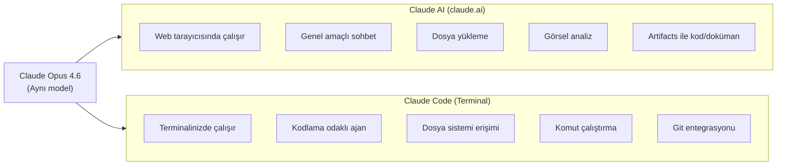
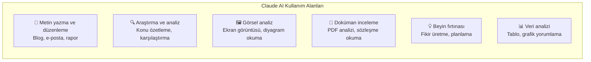
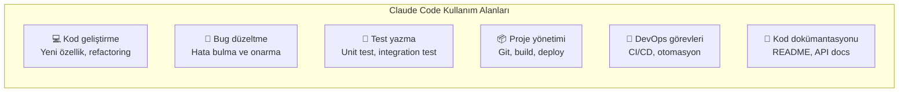
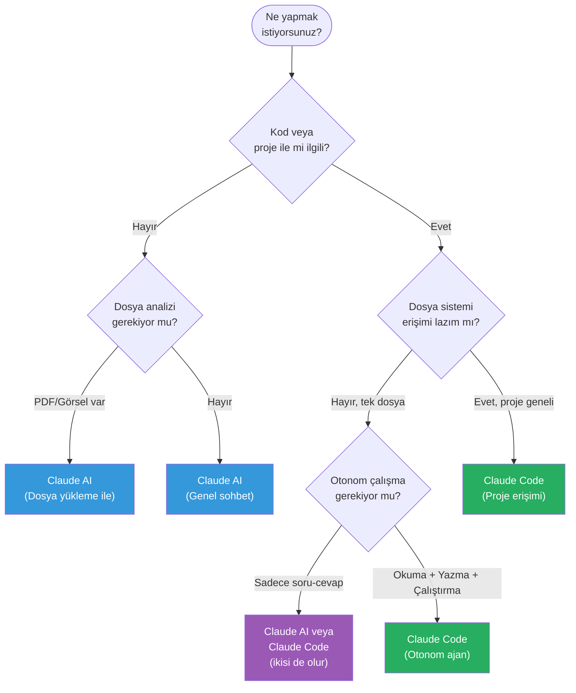
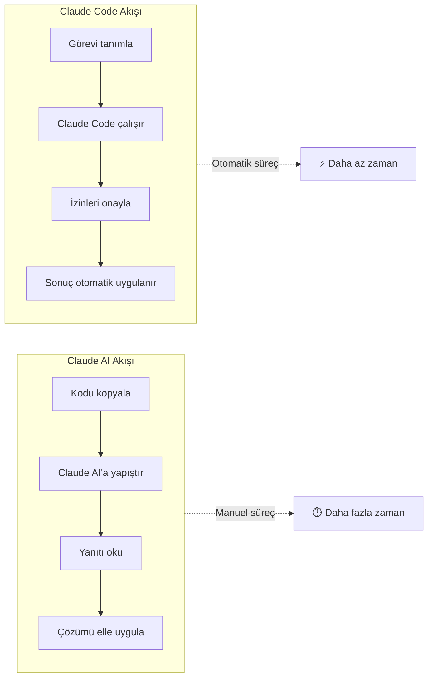
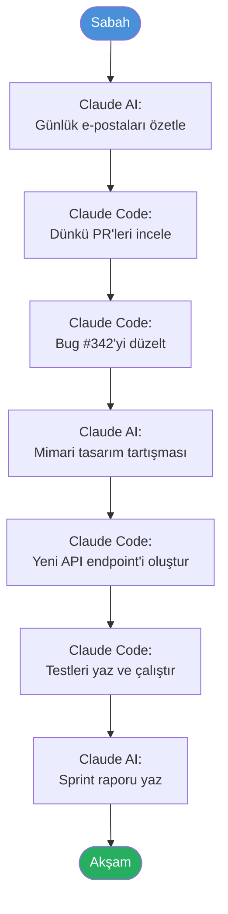

# Claude Code vs Claude AI

Claude ailesi iki farklı kullanım şekli sunar: **Claude AI** (claude.ai web arayüzü) ve **Claude Code** (terminal tabanlı kodlama ajanı). Bu bölümde her ikisinin yeteneklerini, farklarını ve ne zaman hangisini kullanmanız gerektiğini öğreneceksiniz.

## Ön Koşullar

| Konu | Bölüm |
|------|-------|
| Claude Code nedir | [Claude Code Nedir?](./01-claude-code-nedir.md) |
| İlk oturum deneyimi | [İlk Oturum](./05-ilk-oturum.md) |

---

## Genel Bakış



Her iki ürün de **aynı Claude modeli** üzerine inşa edilmiştir. Temel fark, modelin erişebildiği **araçlar** ve **çalışma ortamıdır**.

---

## Detaylı Karşılaştırma Tablosu

| Özellik | Claude AI (claude.ai) | Claude Code (Terminal) |
|---------|----------------------|------------------------|
| **Arayüz** | Web tarayıcısı | Terminal / CLI |
| **Erişim** | claude.ai | `npm install -g @anthropic-ai/claude-code` |
| **Temel kullanım** | Genel sohbet, yazma, analiz | Kod okuma, yazma, çalıştırma |
| **Model** | Claude Opus 4.6 | Claude Opus 4.6 |
| **Context window** | 200K token | 200K token |
| **Dosya sistemi erişimi** | ❌ Hayır (yükleme ile sınırlı) | ✅ Tam erişim |
| **Komut çalıştırma** | ❌ Hayır | ✅ Shell komutları |
| **Git entegrasyonu** | ❌ Hayır | ✅ Commit, PR, log |
| **Web erişimi** | ✅ Sınırlı | ✅ WebFetch, WebSearch |
| **Görsel analiz** | ✅ Evet | ⚠️ Sınırlı |
| **Dosya yükleme** | ✅ PDF, görsel, metin | ❌ Gerek yok (direkt okur) |
| **Artifacts** | ✅ Kod, doküman, diyagram | ❌ Hayır (dosyaya yazar) |
| **Çoklu konuşma** | ✅ Evet | ✅ Evet (oturumlar) |
| **MCP desteği** | ❌ Hayır | ✅ Evet |
| **Subagent'lar** | ❌ Hayır | ✅ Evet |
| **İzin sistemi** | Yok (gerek yok) | ✅ Var (güvenlik için) |
| **Otonom çalışma** | ❌ Hayır | ✅ Evet (agentic loop) |
| **IDE entegrasyonu** | ❌ Hayır | ✅ VS Code, JetBrains |
| **CI/CD entegrasyonu** | ❌ Hayır | ✅ GitHub Actions vb. |
| **Fiyat** | Pro $20/ay | Pro $20/ay (aynı abonelik) |

---

## Kullanım Senaryoları

### Claude AI En İyi Ne İçin?



**Claude AI tercih edin:**
- Genel sohbet ve soru-cevap
- Metin yazma, düzenleme, çeviri
- PDF veya görsel dosya analizi
- Teknik olmayan iş görevleri
- Hızlı bilgi arama
- Beyin fırtınası ve fikir üretme

### Claude Code En İyi Ne İçin?



**Claude Code tercih edin:**
- Proje çapında kod okuma ve anlama
- Yeni özellik geliştirme
- Bug bulma ve düzeltme
- Test yazma ve çalıştırma
- Git işlemleri (commit, branch, PR)
- Büyük ölçekli refactoring
- CI/CD otomasyon görevleri
- Proje genelinde arama ve analiz

---

## Karar Akış Şeması

Hangi aracı kullanmanız gerektiğini belirlemek için bu akış şemasını takip edin:



---

## Pratik Karşılaştırma Örnekleri

### Senaryo 1: "Bu hatayı düzelt"

**Claude AI ile:**
```
Kullanıcı: Bu hata mesajını alıyorum: "TypeError: Cannot read property 
'map' of undefined". Kod şu: [kodu yapıştırır]

Claude AI: Bu hata, data değişkeninin undefined olmasından kaynaklanıyor.
Şu şekilde düzeltebilirsiniz: [düzeltilmiş kodu gösterir]

Kullanıcı: [kodu elle kopyalayıp yapıştırır, dosyayı kaydeder]
```

**Claude Code ile:**
```
> src/UserList.tsx'deki "Cannot read property 'map' of undefined" hatasını düzelt

⏺ Read src/UserList.tsx
⏺ data undefined olabilir. Optional chaining ve varsayılan değer ekliyorum.
⏺ Edit src/UserList.tsx
  ✓ Applied fix
⏺ Running: npm test
  ✓ All tests passed

Düzeltme tamamlandı. data?.users ?? [] ile null safety eklendi.
```

### Senaryo 2: "README yaz"

**Claude AI ile:**
```
Kullanıcı: [package.json ve src dizin yapısını yapıştırır]
Bu proje için README yaz.

Claude AI: [README metnini gösterir]

Kullanıcı: [çıktıyı kopyalar, README.md oluşturur, yapıştırır]
```

**Claude Code ile:**
```
> Bu proje için kapsamlı bir README.md oluştur

⏺ Read package.json
⏺ Glob src/**/*
⏺ Read src/App.tsx
⏺ Read src/routes/index.ts
⏺ Write README.md
  ✓ Created README.md (142 lines)

README.md oluşturuldu. İçerik: proje tanımı, kurulum adımları,
API referansı, katkıda bulunma rehberi.
```

### Fark Özeti



---

## Birlikte Kullanım

Claude AI ve Claude Code birbirinin rakibi değil, **tamamlayıcısıdır**. Tipik bir iş günü:



---

## Özet

| Kriter | Claude AI | Claude Code |
|--------|-----------|-------------|
| **Ne zaman** | Genel görevler, yazı, analiz | Kodlama, proje yönetimi |
| **Nerede** | Web tarayıcısı | Terminal |
| **Nasıl** | Sohbet, dosya yükleme | Doğal dil komutları, otonom |
| **Avantaj** | Kolay erişim, görsel destek | Dosya/komut erişimi, otomasyon |
| **Sınırlama** | Dosya sistemi yok | GUI yok, terminal gerekli |

> **Kural:** Elinizde kod varsa ve üzerinde çalışmanız gerekiyorsa → **Claude Code**. Geri kalan her şey için → **Claude AI**.

---

## Sonraki Adım

Claude Code'un ne olduğunu, nasıl çalıştığını, nasıl kurulacağını ve Claude AI'dan farkını öğrendiniz. Şimdi arayüz detaylarına ve komut referansına geçelim:

→ [Bölüm 07 — Arayüz ve Komutlar](../07-arayuz-ve-komutlar/README.md)
