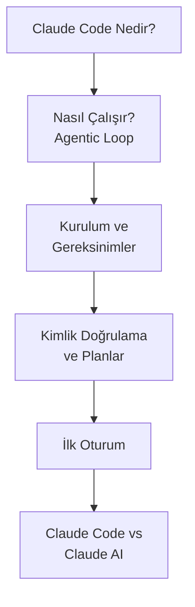

# Bölüm 06: Claude Code — Tanıtım ve Kurulum

Claude Code, Anthropic tarafından geliştirilen terminal tabanlı bir AI coding agent'tır (yapay zeka kodlama ajanı). Bu bölüm, Claude Code'un ne olduğunu, nasıl çalıştığını, kurulumunu ve ilk oturumunuzu kapsar.

## Bu Bölümde Neler Öğreneceksiniz?

## İçerik

| # | Dosya | Konu | Süre |
|---|-------|------|------|
| 01 | [Claude Code Nedir?](./01-claude-code-nedir.md) | Tanım, yetenekler, mimari, kullanım senaryoları | ~10 dk |
| 02 | [Claude Code Nasıl Çalışır?](./02-claude-code-nasil-calisir.md) | Agentic loop, araç sistemi, izin modeli, karar döngüsü | ~15 dk |
| 03 | [Kurulum ve Gereksinimler](./03-kurulum-ve-gereksinimler.md) | Node.js, npm kurulumu, sistem gereksinimleri, sorun giderme | ~12 dk |
| 04 | [Kimlik Doğrulama](./04-kimlik-dogrulama.md) | Login, abonelik planları, API key, OAuth akışı | ~10 dk |
| 05 | [İlk Oturum](./05-ilk-oturum.md) | İlk komut, dosya okuma, ilk düzenleme, izin yönetimi | ~15 dk |
| 06 | [Claude Code vs Claude AI](./06-claude-code-vs-claude-ai.md) | Web arayüzü vs terminal ajanı karşılaştırması | ~10 dk |

## Ön Koşullar

Bu bölümü okumadan önce aşağıdaki konulara aşina olmanız önerilir:

| Konu | Bölüm |
|------|-------|
| Büyük Dil Modelleri (LLM) nedir | [Bölüm 02](../02-buyuk-dil-modelleri/README.md) |
| Claude ekosistemi | [Bölüm 05](../05-claude-ekosistemi/README.md) |
| Terminal / komut satırı temel kullanımı | Harici kaynak |

## Sonraki Adım

Bu bölümü tamamladıktan sonra → [07 - Claude Code: Arayüz ve Komutlar](../07-arayuz-ve-komutlar/README.md)
