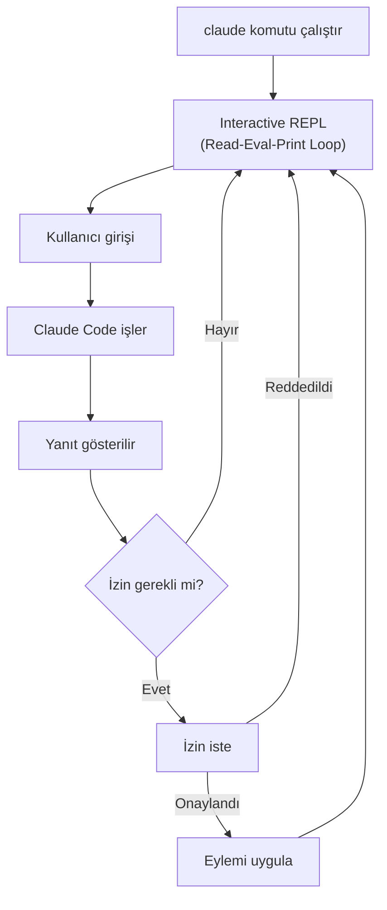
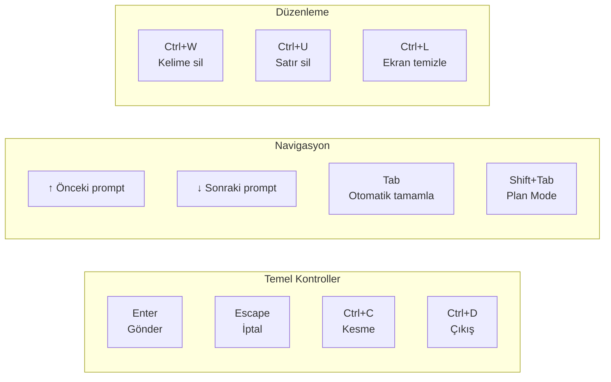
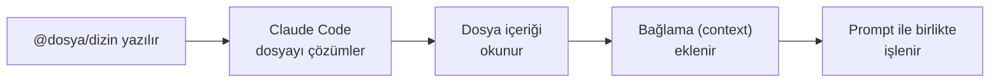
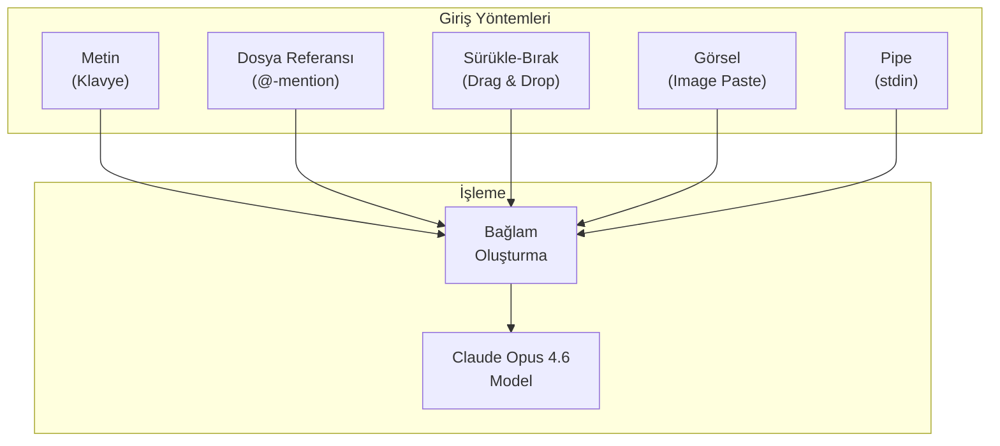
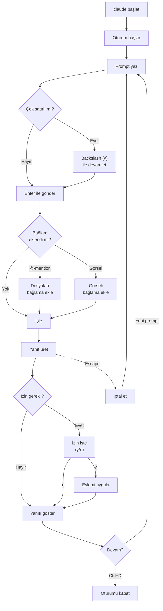

# İnteraktif Mod (Interactive Mode)

Claude Code'u `claude` komutuyla başlattığınızda varsayılan olarak **Interactive Mode** (etkileşimli mod) açılır. Bu modda Claude Code ile sohbet eder gibi konuşur, görevler verir ve sonuçları gerçek zamanlı olarak görürsünüz.

## Ön Koşullar

| Konu | Bölüm |
|------|-------|
| Claude Code kurulumu | [Bölüm 06 - Kurulum](../06-claude-code-tanitim/03-kurulum-ve-gereksinimler.md) |
| Claude Code nedir | [Bölüm 06 - Tanıtım](../06-claude-code-tanitim/01-claude-code-nedir.md) |

---

## İnteraktif Mod Genel Bakış



---

## Başlatma

```bash
# Temel başlatma
$ claude

# Belirli bir dizinde başlatma
$ cd ~/projects/my-app && claude

# İlk prompt ile başlatma
$ claude "Bu projeyi analiz et"
```

Başlatıldığında aşağıdaki gibi bir ekran görürsünüz:

```
╭──────────────────────────────────────────╮
│ ✻ Claude Code                            │
│                                          │
│   /help for help                         │
│                                          │
│   cwd: ~/projects/my-app                 │
╰──────────────────────────────────────────╯

>
```

---

## Klavye Kısayolları

Claude Code'un Interactive Mode'da kullanabileceğiniz tüm klavye kısayolları:

### Temel Kontroller

| Kısayol | İşlev | Açıklama |
|---------|-------|----------|
| `Enter` | Gönder | Yazdığınız mesajı Claude Code'a gönderir |
| `Escape` | İptal | Devam eden bir yanıtı iptal eder (generation cancel) |
| `Ctrl+C` | Kesme | Çalışan bir aracı/komutu keser (interrupt) |
| `Ctrl+D` | Çıkış | Claude Code oturumunu sonlandırır |
| `Ctrl+L` | Ekran temizle | Terminal ekranını temizler |

### Navigasyon ve Düzenleme

| Kısayol | İşlev | Açıklama |
|---------|-------|----------|
| `↑` / `↓` | Geçmiş | Önceki/sonraki prompt geçmişinde gezinir |
| `Tab` | Otomatik tamamlama | Dosya adları ve komutları tamamlar |
| `Shift+Tab` | Plan Mode geçiş | Plan Mode'a geçiş yapar (toggle) |
| `Home` / `End` | Satır başı/sonu | İmleci satır başına veya sonuna taşır |
| `Ctrl+A` / `Ctrl+E` | Satır başı/sonu | Satır başına (A) veya sonuna (E) git |
| `Ctrl+W` | Kelime sil | İmlecin solundaki kelimeyi siler |
| `Ctrl+U` | Satır sil | Tüm satırı siler |

### Özel İşlevler

| Kısayol | İşlev | Açıklama |
|---------|-------|----------|
| `Shift+Tab` | Plan/Normal geçiş | Plan Mode ile Normal Mode arasında geçiş |
| `Ctrl+R` | Geçmiş arama | Prompt geçmişinde arama yapar |



---

## Çok Satırlı Giriş (Multi-line Input)

Uzun veya karmaşık talimatlar vermek istediğinizde tek satır yetmeyebilir. Claude Code birden fazla yöntemle çok satırlı giriş destekler:

### Yöntem 1: Backslash ile Devam (`\`)

Satır sonuna `\` koyarak bir sonraki satıra devam edebilirsiniz:

```bash
> Bu projede şu değişiklikleri yap: \
  1. UserService sınıfına logout metodu ekle \
  2. Login metoduna rate limiting ekle \
  3. Her iki metod için birim testleri yaz
```

### Yöntem 2: Yapıştırma Modu (Paste Mode)

Çok satırlı metni doğrudan terminal'e yapıştırdığınızda, Claude Code bunu otomatik olarak algılar ve tüm metni tek bir giriş olarak işler:

```bash
> Aşağıdaki TypeScript interface'ini implemente et:

interface UserRepository {
  findById(id: string): Promise<User>;
  findByEmail(email: string): Promise<User>;
  create(data: CreateUserDto): Promise<User>;
  update(id: string, data: UpdateUserDto): Promise<User>;
  delete(id: string): Promise<void>;
}
```

### Yöntem 3: Pipe ile Giriş

Başka bir komutun çıktısını Claude Code'a yönlendirebilirsiniz:

```bash
# Hata loglarını analiz ettir
$ cat error.log | claude -p "Bu hataları analiz et ve çözüm öner"

# Bir dosyanın içeriğini bağlam olarak ver
$ cat schema.prisma | claude -p "Bu şema için migration oluştur"
```

---

## Dosya ve Bağlam Referansları

### @-Mention ile Dosya Referansı

Mesajınızda `@` sembolü ile dosya veya dizin referansı verebilirsiniz. Claude Code bu dosyaları otomatik olarak bağlama (context) ekler:

```bash
# Tek dosya referansı
> @src/auth/login.ts dosyasındaki güvenlik açığını düzelt

# Birden fazla dosya
> @src/models/user.ts ve @src/services/userService.ts uyumlu mu kontrol et

# Dizin referansı
> @src/components/ klasöründeki tüm componentlere TypeScript tipleri ekle

# Glob pattern
> @src/**/*.test.ts test dosyalarını analiz et
```



### Dosya Sürükle-Bırak (Drag & Drop)

Desteklenen terminallerde dosyaları sürükleyip Claude Code penceresine bırakabilirsiniz:

1. Dosya gezgininden dosyayı seçin
2. Terminal penceresine sürükleyin
3. Dosya yolu otomatik olarak prompt'a eklenir

```bash
# Sürükle-bırak sonrası prompt şu şekilde görünür:
> /Users/yasin/project/src/config.ts dosyasını incele
```

### Görsel Yapıştırma (Image Paste)

Claude Code, **multimodal** (çok modlu) yeteneklere sahiptir. Terminale görsel yapıştırarak görüntü analizi yaptırabilirsiniz:

```bash
# Ekran görüntüsünü panoya kopyalayın (Ctrl+C / Cmd+C)
# Terminal'de Ctrl+V ile yapıştırın

> [Görsel yapıştırıldı: screenshot.png]
  Bu UI tasarımını React componenti olarak implemente et

# Hata ekran görüntüsü
> [Görsel yapıştırıldı: error-screen.png]
  Bu hatanın sebebi ne olabilir?
```

**Desteklenen formatlar:** PNG, JPEG, GIF, WebP



---

## Tab ile Otomatik Tamamlama

`Tab` tuşuna bastığınızda Claude Code çeşitli öğeleri otomatik tamamlar:

| Öğe | Örnek | Açıklama |
|-----|-------|----------|
| Dosya yolları | `@src/com` → `@src/components/` | Proje dosyalarını tamamlar |
| Slash komutları | `/he` → `/help` | Dahili komutları tamamlar |
| Dizin yolları | `@lib/` → `@lib/utils/` | Alt dizinleri listeler |

```bash
# Tab ile otomatik tamamlama akışı
> @src/co[TAB]
> @src/components/[TAB]
> @src/components/Button.tsx
```

---

## Prompt Geçmişi (History)

Claude Code, oturum içinde yazdığınız tüm prompt'ları hatırlar:

```bash
# ↑ (yukarı ok) tuşu ile önceki prompt'lara gidin
> [↑] Bu projenin yapısını açıkla    # önceki prompt
> [↑] Login fonksiyonunu düzelt       # daha önceki prompt

# ↓ (aşağı ok) tuşu ile sonraki prompt'lara gidin
> [↓] Yeni bir test dosyası oluştur   # sonraki prompt
```

---

## Pratik Örnekler

### Örnek 1: Tipik Bir İnteraktif Oturum

```bash
$ claude
╭──────────────────────────────────────────╮
│ ✻ Claude Code                            │
│   cwd: ~/projects/e-commerce             │
╰──────────────────────────────────────────╯

> Bu projenin yapısını kısaca özetle

● Projeyi analiz ediyorum...

  Bu bir Next.js 14 e-ticaret uygulaması:
  ├── src/
  │   ├── app/          → App Router sayfaları
  │   ├── components/   → React componentleri (47 adet)
  │   ├── lib/          → Yardımcı fonksiyonlar
  │   ├── services/     → API servisleri
  │   └── types/        → TypeScript tipleri
  ├── prisma/           → Veritabanı şeması
  └── tests/            → Test dosyaları

  Teknolojiler: Next.js 14, TypeScript, Prisma, PostgreSQL, Tailwind CSS

> @src/services/cartService.ts sepete ürün ekleme fonksiyonunda bir bug var, \
  stok kontrolü yapılmıyor. Düzeltir misin?

● cartService.ts dosyasını okuyorum...
● addToCart fonksiyonunu analiz ediyorum...
● Stok kontrolü eksik, düzeltiyorum...

  ✎ src/services/cartService.ts dosyasını düzenledim:
  - stok kontrolü eklendi (checkStock fonksiyonu)
  - stok yetersizse InsufficientStockError fırlatılıyor
  - birim testi güncellendi

> Harika! Şimdi testleri çalıştır

● npm test çalıştırılıyor...

  ✓ 23 test geçti
  ✓ cartService.addToCart - stok kontrolü testi başarılı
```

### Örnek 2: Escape ve Ctrl+C Kullanımı

```bash
> Tüm dosyaları analiz et ve kapsamlı bir rapor oluştur

● Dosyaları tarıyorum... (342 dosya bulundu)
● src/components/ analiz ediliyor...

  [Escape tuşuna basıldı - yanıt üretimi iptal edildi]

> Sadece src/services/ klasörünü analiz et

● src/services/ analiz ediliyor... (12 dosya)

  Servis Analiz Raporu:
  ...
```

### Örnek 3: Görsel ile Çalışma

```bash
> [Görsel yapıştırıldı: figma-design.png]
  Bu Figma tasarımını Tailwind CSS kullanan bir React componenti olarak oluştur

● Tasarımı analiz ediyorum...
  - Kart tabanlı layout tespit edildi
  - 3 sütunlu grid yapısı
  - Hover efektleri mevcut

● ProductCard.tsx oluşturuyorum...

  ✎ src/components/ProductCard.tsx oluşturuldu
  ✎ src/components/ProductGrid.tsx oluşturuldu
```

---

## İnteraktif Mod İş Akışı



---

## İpuçları ve En İyi Uygulamalar

| İpucu | Açıklama |
|-------|----------|
| **Spesifik olun** | "Bunu düzelt" yerine "login fonksiyonundaki null check hatasını düzelt" deyin |
| **Bağlam verin** | `@` ile ilgili dosyaları referans gösterin |
| **Kademeli ilerleyin** | Büyük görevleri adımlara bölün |
| **Escape kullanın** | Yanlış yöne giden yanıtları erken iptal edin |
| **Geçmişi kullanın** | `↑` ile önceki prompt'ları geri çağırın |
| **Çok satırlı yazın** | Karmaşık talimatları `\` ile bölün |

---

## Özet

| Kavram | Açıklama |
|--------|----------|
| **Interactive Mode** | Claude Code'un varsayılan çalışma modu; sohbet benzeri arayüz |
| **Escape** | Devam eden yanıt üretimini iptal eder |
| **Ctrl+C** | Çalışan araç/komutu keser |
| **Tab** | Dosya yollarını ve komutları otomatik tamamlar |
| **@-mention** | Dosya ve dizinleri bağlama ekler |
| **Multi-line** | `\` ile çok satırlı giriş veya yapıştırma modu |
| **Image paste** | Görselleri yapıştırarak multimodal analiz |

---

## Sonraki Adım

İnteraktif modun temellerini öğrendik. Şimdi daha kontrollü bir çalışma modu olan Plan Mode'u inceleyelim:

→ [Plan Modu](./02-plan-modu.md)
