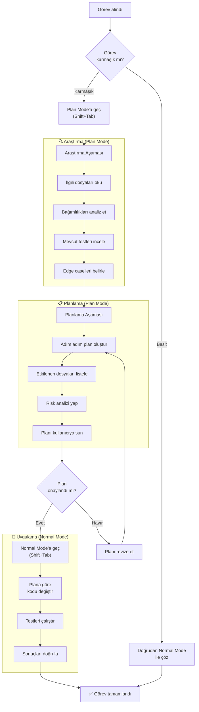
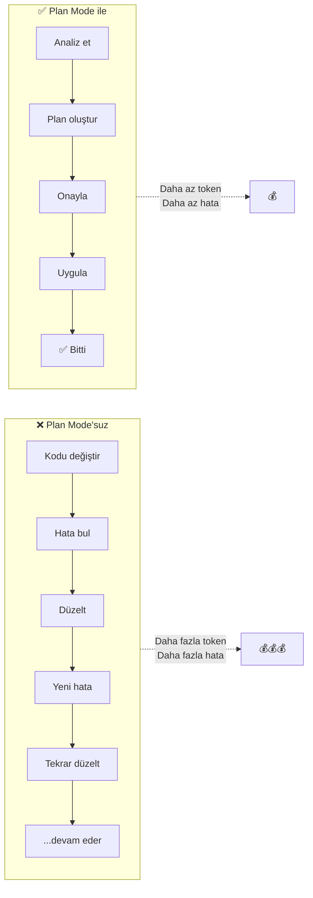
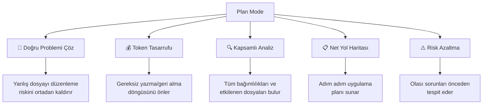

# Plan Modu (Plan Mode)

**Plan Mode** (planlama modu), Claude Code'un kod yazmadan önce araştırma yapıp plan oluşturmasını sağlayan özel bir çalışma modudur. Bu modda Claude Code dosyaları okuyabilir ve analiz yapabilir, ancak hiçbir dosyayı değiştiremez veya komut çalıştıramaz.

## Ön Koşullar

| Konu | Bölüm |
|------|-------|
| İnteraktif Mod | [İnteraktif Mod](./01-interaktif-mod.md) |
| Claude Code nasıl çalışır | [Bölüm 06](../06-claude-code-tanitim/02-claude-code-nasil-calisir.md) |

---

## Plan Mode Nedir?

Plan Mode, Claude Code'u **salt okunur** (read-only) bir araştırma moduna geçirir. Bu modda:

- **Yapabilir:** Dosya okuma, kod analizi, bağlam toplama, plan oluşturma
- **Yapamaz:** Dosya yazma/düzenleme, shell komutu çalıştırma, git işlemleri

```mermaid
flowchart LR
    subgraph plan_mode ["Plan Mode (Salt Okunur)"]
        direction TB
        P1["✅ Dosya okuma"]
        P2["✅ Kod analizi"]
        P3["✅ Plan oluşturma"]
        P4["❌ Dosya düzenleme"]
        P5["❌ Komut çalıştırma"]
    end

    subgraph normal_mode ["Normal Mode (Tam Yetki)"]
        direction TB
        N1["✅ Dosya okuma"]
        N2["✅ Kod analizi"]
        N3["✅ Plan oluşturma"]
        N4["✅ Dosya düzenleme"]
        N5["✅ Komut çalıştırma"]
    end

    plan_mode -->|"Shift+Tab"| normal_mode
    normal_mode -->|"Shift+Tab"| plan_mode
```



---

## Ne Zaman Kullanmalı?

| Senaryo | Neden Plan Mode? |
|---------|-----------------|
| Büyük refactoring öncesi | Önce yapıyı anla, sonra değiştir |
| Unfamiliar codebase (tanımadığınız kod tabanı) | Projeyi keşfet, mimarisini öğren |
| Karmaşık bug araştırması | Kodu okuyarak kök nedeni bul |
| Mimari karar alma | Farklı yaklaşımları değerlendir |
| Tahminleme / Planning | Görev kapsamını ve süresini belirle |
| Token tasarrufu | Gereksiz dosya yazma/geri alma döngüsünü önle |

---

## Nasıl Aktifleştirilir?

### Yöntem 1: Shift+Tab Toggle

Oturum içinde `Shift+Tab` tuşlarına basarak Plan Mode ile Normal Mode arasında geçiş yapabilirsiniz:

```bash
# Normal Mode'daysınız
> [Normal Mode] Bu fonksiyonu düzelt

# Shift+Tab basın → Plan Mode'a geçiş
> [Plan Mode] Bu modülün yapısını analiz et

# Tekrar Shift+Tab basın → Normal Mode'a dönüş
> [Normal Mode] Şimdi değişiklikleri uygula
```

### Yöntem 2: EnterPlanMode / ExitPlanMode Araçları

Claude Code, kendi dahili araçlarını kullanarak otomatik olarak Plan Mode'a geçebilir:

```bash
> Çok kapsamlı bir refactoring yapmam lazım. Önce analiz et.

● Claude Code otomatik olarak Plan Mode'a geçiyor...
  [EnterPlanMode aracı çağrıldı]

● src/ dizinini analiz ediyorum...
● Bağımlılık grafiğini çıkarıyorum...
● Refactoring planı oluşturuyorum...

  📋 Refactoring Planı:
  1. UserService → UserCommandService + UserQueryService (CQRS)
  2. Ortak logic → shared/utils/ altına taşınacak
  3. Interface'ler → contracts/ dizinine çıkarılacak
  4. Toplam 14 dosya etkilenecek

● Normal Mode'a dönüyorum...
  [ExitPlanMode aracı çağrıldı]

● Planı uygulamaya başlıyorum...
```

---

## Plan Mode ile Çalışma Akışı

Aşağıdaki diyagram, Plan Mode kullanarak ideal bir geliştirme akışını gösterir:



---

## Plan Mode ile vs Plan Mode'suz

### Plan Mode'suz (Doğrudan Uygulama)

```bash
> UserService'i CQRS pattern'ine göre yeniden yapılandır

● userService.ts okunuyor...
● Dosya bölünüyor...
  ✎ userCommandService.ts oluşturuldu
  ✎ userQueryService.ts oluşturuldu
● Hata: UserController hâlâ eski UserService'e bağımlı
● UserController düzeltiliyor...
  ✎ userController.ts güncellendi
● Hata: Test dosyaları kırıldı
● Test dosyaları düzeltiliyor...
  ✎ userService.test.ts güncellendi
● Hata: OrderService da UserService kullanıyor, bu atlandı
● OrderService düzeltiliyor...
  ✎ orderService.ts güncellendi
● ...daha fazla bağımlılık bulunuyor...

# Sonuç: Çok fazla token harcandı, çok sayıda geri alma/düzeltme yapıldı
```

### Plan Mode ile (Önce Araştır, Sonra Uygula)

```bash
# Shift+Tab → Plan Mode
> [Plan Mode] UserService'i CQRS pattern'ine göre yeniden yapılandırmak istiyorum.
  Önce analiz et ve plan oluştur.

● userService.ts okunuyor...
● Bağımlılık analizi yapılıyor...
● Tüm kullanım noktaları taranıyor...

  📋 Analiz Sonucu:
  UserService 6 dosyada kullanılıyor:
  - userController.ts (5 metod)
  - orderService.ts (2 metod)
  - authMiddleware.ts (1 metod)
  - adminController.ts (3 metod)
  - userService.test.ts (8 test)
  - orderService.test.ts (2 test)

  📋 Refactoring Planı:
  Adım 1: Interface'leri tanımla (IUserCommandService, IUserQueryService)
  Adım 2: Implementasyonları oluştur
  Adım 3: DI container'ı güncelle
  Adım 4: Tüm 6 consumer dosyayı güncelle
  Adım 5: Test dosyalarını güncelle
  Adım 6: Eski UserService'i kaldır

  ⚠️ Riskler:
  - OrderService circular dependency riski
  - AuthMiddleware'de interface değişikliği gerekecek

# Shift+Tab → Normal Mode
> [Normal Mode] Plan güzel, uygula.

● Planı adım adım uyguluyorum...
  [Tüm dosyalar düzgün sırayla, hatasız güncellenir]
```



---

## Pratik Örnekler

### Örnek 1: Unfamiliar Codebase Keşfi

```bash
# Shift+Tab → Plan Mode
> [Plan Mode] Bu projeyi hiç bilmiyorum. Mimariyi, ana modülleri ve 
  veri akışını açıkla.

● Proje yapısını tarıyorum...
● package.json analiz ediyorum...
● Ana dosyaları okuyorum...

  🏗️ Proje Mimarisi: NestJS Microservices

  ┌─────────────┐     ┌─────────────┐     ┌─────────────┐
  │ API Gateway  │────→│ User Service │────→│ PostgreSQL  │
  │ (Port 3000)  │     │ (Port 3001)  │     │             │
  └──────┬───────┘     └─────────────┘     └─────────────┘
         │
         ├────→ Order Service (Port 3002) ────→ MongoDB
         │
         └────→ Notification Service (Port 3003) ────→ Redis

  Ana Modüller:
  - api-gateway/: İstek yönlendirme, JWT doğrulama
  - user-service/: Kullanıcı CRUD, kimlik doğrulama
  - order-service/: Sipariş yönetimi, ödeme
  - notification-service/: E-posta, SMS, push bildirim
```

### Örnek 2: Bug Araştırması

```bash
# Shift+Tab → Plan Mode
> [Plan Mode] Kullanıcılar "502 Bad Gateway" hatası alıyor. Olası 
  nedenleri araştır.

● nginx.conf okunuyor...
● API gateway logları kontrol ediliyor...
● Health check endpoint'leri inceleniyor...
● Timeout konfigürasyonları kontrol ediliyor...

  🔍 Araştırma Sonucu:
  
  Olası neden: API Gateway → User Service timeout
  - nginx upstream timeout: 30s
  - User Service findByEmail(): ortalama yanıt 45s (!)
  - Kök neden: users tablosunda email sütununda index eksik
  
  Önerilen Çözüm:
  1. users tablosuna email index'i ekle (migration)
  2. findByEmail query'sine cache ekle
  3. nginx timeout'u 60s'ye çıkar (geçici)

# Shift+Tab → Normal Mode  
> [Normal Mode] Tamam, önce migration'ı oluştur ve index'i ekle.
```

---

## Plan Mode'un Faydaları



| Fayda | Açıklama |
|-------|----------|
| **Doğru problemi çöz** | Kodlamaya başlamadan önce problemi tam olarak anla |
| **Token tasarrufu** | Gereksiz dosya yazma ve geri alma işlemlerini önle |
| **Kapsamlı analiz** | Tüm bağımlılıkları ve yan etkileri keşfet |
| **Net yol haritası** | Kullanıcıya adım adım plan sun, onay al |
| **Risk azaltma** | Olası sorunları önceden tespit et |

---

## Özet

| Kavram | Açıklama |
|--------|----------|
| **Plan Mode** | Salt okunur araştırma ve planlama modu |
| **Shift+Tab** | Plan Mode / Normal Mode arasında geçiş kısayolu |
| **EnterPlanMode** | Claude Code'un otomatik Plan Mode geçiş aracı |
| **ExitPlanMode** | Claude Code'un otomatik Normal Mode dönüş aracı |
| **Araştırma → Planlama → Uygulama** | Önerilen iş akışı sırası |
| **Token tasarrufu** | Gereksiz yazma/geri alma döngüsü önlenir |

---

## Sonraki Adım

Plan Mode'un aksine, bazı görevler için hız ön plandadır. Fast Mode bu senaryolar için tasarlanmıştır:

→ [Hızlı Mod (Fast Mode)](./03-hizli-mod.md)
