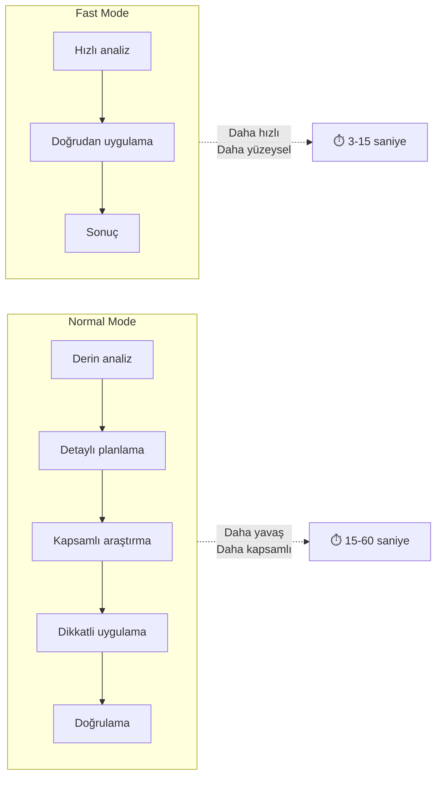
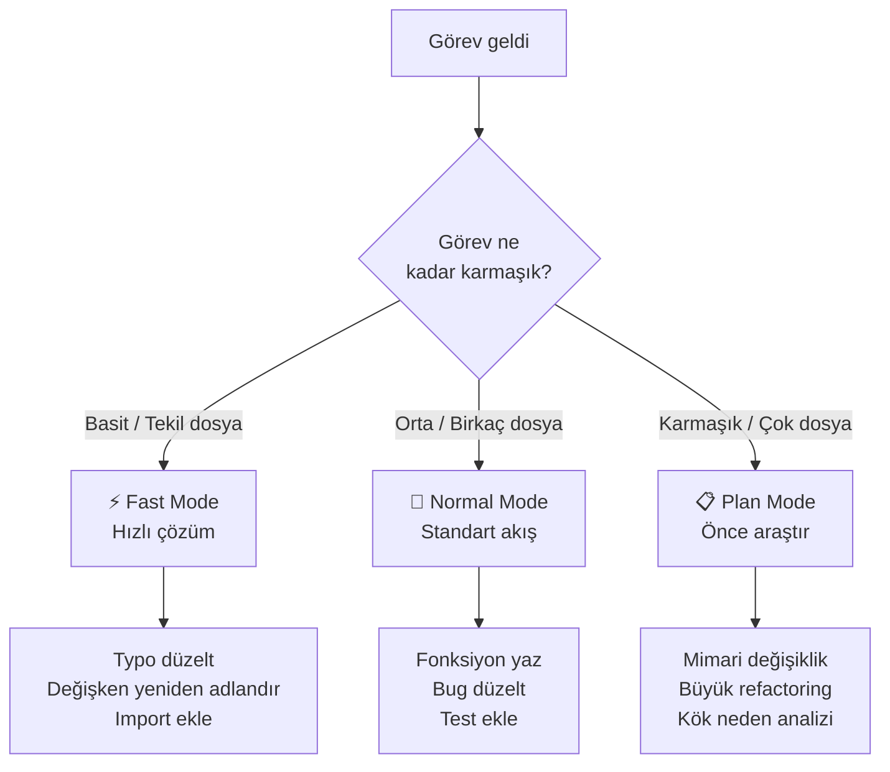
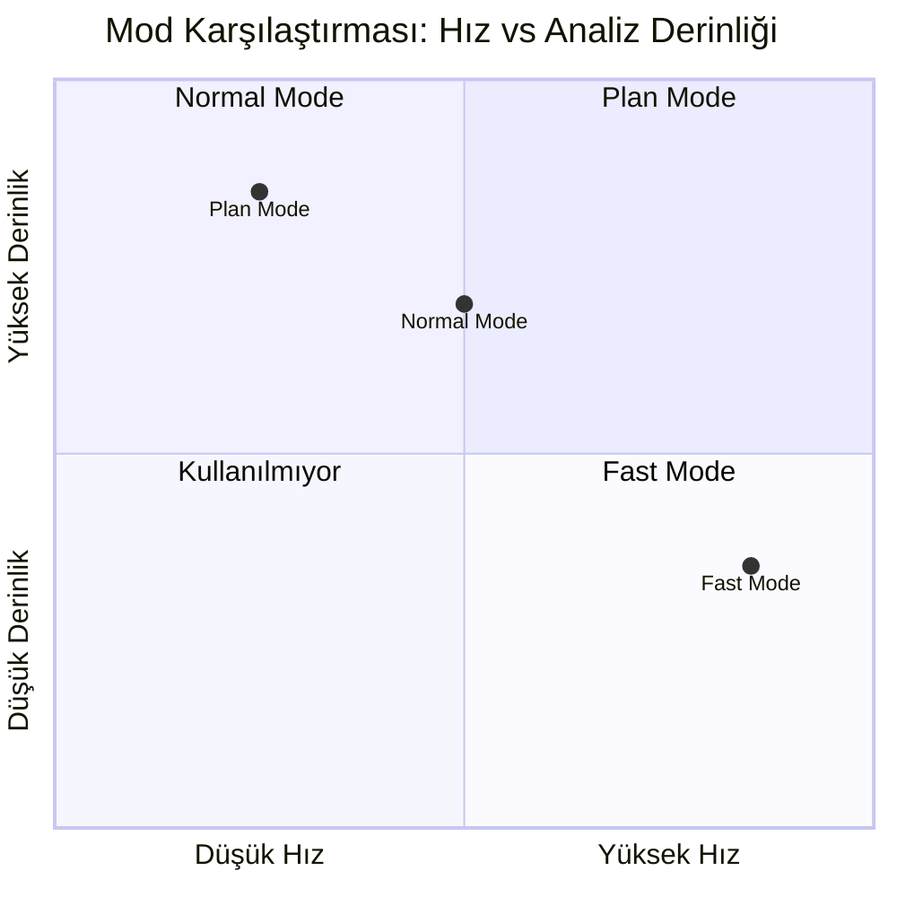
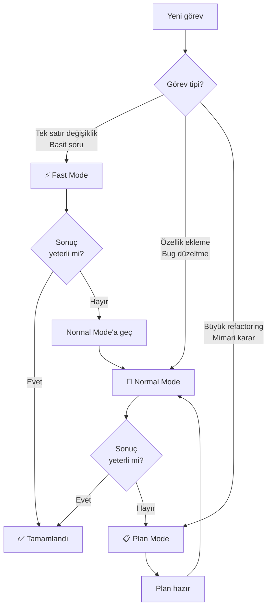

# Hızlı Mod (Fast Mode)

**Fast Mode** (hızlı mod), Claude Code'un daha hızlı yanıt üretmesi için optimize edilmiş bir çalışma modudur. Bu modda Claude Opus 4.6 modeli daha düşük gecikmeyle (lower latency) çalışır; ancak karmaşık görevlerde derinlik ve analiz kalitesi azalabilir.

## Ön Koşullar

| Konu | Bölüm |
|------|-------|
| İnteraktif Mod | [İnteraktif Mod](./01-interaktif-mod.md) |
| Plan Modu | [Plan Modu](./02-plan-modu.md) |

---

## Fast Mode Nedir?

Fast Mode, Claude Code'un yanıt süresini düşürmek için **reasoning effort**'u (akıl yürütme çabası) azaltır. Model, ara adımları kısaltarak veya atlayarak daha hızlı sonuç üretir.



---

## Ne Zaman Kullanmalı?

### Fast Mode İçin Uygun Senaryolar

| Senaryo | Örnek |
|---------|-------|
| Basit kod düzenlemeleri | Bir değişken adını değiştir, typo düzelt |
| Hızlı sorular | "Bu fonksiyon ne döndürüyor?" |
| Küçük refactoring'ler | Bir fonksiyonu extract et |
| Boilerplate üretme | Interface'den implementasyon oluştur |
| Basit dosya oluşturma | Yeni bir component dosyası oluştur |
| Format/stil düzeltmeleri | Import sıralaması, kod formatlama |

### Fast Mode İçin Uygun Olmayan Senaryolar

| Senaryo | Neden? |
|---------|--------|
| Karmaşık mimari kararlar | Derinlemesine analiz gerektirir |
| Çok dosyalı refactoring | Bağımlılık takibi önemlidir |
| Debugging (hata ayıklama) | Kök neden analizi zaman alır |
| Güvenlik incelemeleri | Dikkatli ve kapsamlı tarama gerekir |
| Legacy kod modernizasyonu | Mevcut yapıyı anlamak kritiktir |
| Test yazımı (edge case dahil) | Tüm senaryoların düşünülmesi gerekir |



---

## Nasıl Aktifleştirilir?

### Yöntem 1: Toggle Komutu

```bash
# Oturum içinde Fast Mode'u açma/kapama
> /fast

  ⚡ Fast Mode aktif

> /fast

  🔧 Normal Mode'a dönüldü
```

### Yöntem 2: Başlangıçta Aktifleştirme

```bash
# CLI bayrağı ile
$ claude --fast

# Ortam değişkeni ile
$ CLAUDE_FAST_MODE=1 claude
```

### Yöntem 3: Konfigürasyon Dosyası

```json
// ~/.claude/settings.json
{
  "preferences": {
    "fastMode": true
  }
}
```

---

## Hız vs Derinlik Dengesi



| Özellik | Fast Mode | Normal Mode | Plan Mode |
|---------|-----------|-------------|-----------|
| **Yanıt süresi** | ⚡ En hızlı | 🔧 Orta | 🔍 Değişken |
| **Analiz derinliği** | Düşük | Yüksek | En yüksek |
| **Token kullanımı** | Az | Orta | Az (salt okunur) |
| **Hata olasılığı** | Daha yüksek | Düşük | En düşük (plan) |
| **Uygun görev boyutu** | Küçük | Orta-büyük | Büyük-karmaşık |
| **Dosya yazma** | Evet | Evet | Hayır |
| **Komut çalıştırma** | Evet | Evet | Hayır |

---

## Pratik Örnekler

### Örnek 1: Fast Mode ile Hızlı Düzenleme

```bash
$ claude --fast
⚡ Fast Mode aktif

> @src/utils/format.ts formatDate fonksiyonuna ISO 8601 desteği ekle

● formatDate güncelleniyor...

  ✎ src/utils/format.ts düzenlendi:
  + case 'iso': return date.toISOString();

  Tamamlandı (2.3 saniye)
```

### Örnek 2: Fast Mode ile Hızlı Soru-Cevap

```bash
> Bu projede hangi test framework'ü kullanılıyor?

  Jest v29.7 kullanılıyor.
  Konfigürasyon: jest.config.ts
  Test sayısı: 142 test, 23 suite

  Tamamlandı (1.8 saniye)
```

### Örnek 3: Fast Mode'un Yetersiz Kaldığı Durum

```bash
⚡ Fast Mode aktif

> Authentication sistemini JWT'den session-based'e migre et

● auth/jwt.ts okunuyor...
● Hızlı çözüm uygulanıyor...

  ⚠️ Bu görev için Fast Mode yeterli olmayabilir.
  Birden fazla dosya ve bağımlılık etkileniyor.
  Normal Mode'a geçmeniz önerilir.

# /fast komutu ile Normal Mode'a geç
> /fast
  🔧 Normal Mode'a dönüldü

> Authentication sistemini JWT'den session-based'e migre et

● Tüm auth dosyaları analiz ediliyor...
● Bağımlılıklar haritalanıyor...
● Migration planı oluşturuluyor...
  [Kapsamlı ve doğru bir çözüm üretilir]
```

---

## Mod Geçiş Stratejisi



---

## İpuçları

| İpucu | Açıklama |
|-------|----------|
| **Başlangıçta Fast Mode deneyin** | Basit görevlerde her zaman Fast Mode ile başlayın |
| **Yetersiz kalırsa geçiş yapın** | `/fast` ile Normal Mode'a dönebilirsiniz |
| **Batch işlemler için idealdir** | Çok sayıda küçük düzenleme yaparken hızlıdır |
| **Doğrulama ihmal etmeyin** | Fast Mode sonuçlarını hızlıca kontrol edin |
| **Zincir çalışma** | Plan Mode → Normal Mode → Fast Mode sırası etkilidir |

---

## Özet

| Kavram | Açıklama |
|--------|----------|
| **Fast Mode** | Düşük gecikme, hızlı yanıt odaklı çalışma modu |
| **Reasoning effort** | Modelin akıl yürütmeye harcadığı çaba seviyesi |
| **Trade-off** | Hız artar, analiz derinliği azalır |
| **Uygun görevler** | Basit düzenlemeler, hızlı sorular, boilerplate üretimi |
| **Uygun olmayan görevler** | Karmaşık mimari, debugging, güvenlik incelemesi |
| **Toggle** | `/fast` komutu veya `--fast` CLI bayrağı |

---

## Sonraki Adım

Çalışma modlarını öğrendik. Şimdi Claude Code'u başlatırken kullanabileceğiniz tüm CLI bayraklarını inceleyelim:

→ [CLI Referansı](./04-cli-referansi.md)
