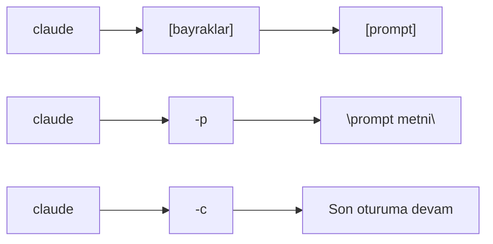
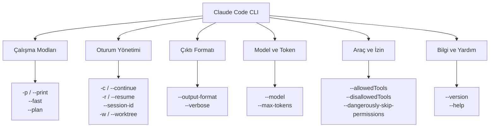
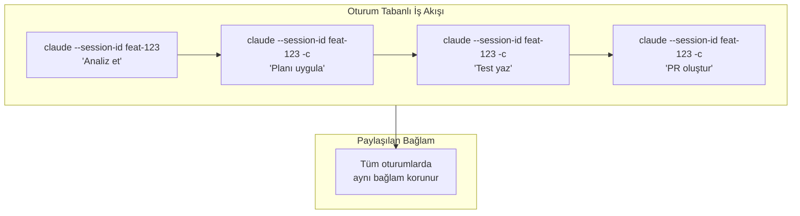

# CLI Referansı (Command Line Interface Reference)

Bu sayfa, Claude Code'un tüm **CLI bayraklarını** (command-line flags) kategorize edilmiş şekilde sunar. Her bayrağın ne yaptığı, sözdizimi ve pratik kullanım örnekleri bulunmaktadır.

## Ön Koşullar

| Konu | Bölüm |
|------|-------|
| Claude Code kurulumu | [Bölüm 06 - Kurulum](../06-claude-code-tanitim/03-kurulum-ve-gereksinimler.md) |
| İnteraktif Mod | [İnteraktif Mod](./01-interaktif-mod.md) |
| Terminal / shell temel bilgisi | Harici kaynak |

---

## CLI Komut Yapısı



Genel sözdizimi:

```bash
claude [bayraklar] [prompt]
```

---

## Bayrak Kategorileri



---

## 1. Çalışma Modları

### `claude` (İnteraktif Mod)

Parametresiz çalıştırıldığında Interactive Mode (etkileşimli mod) başlar.

```bash
# Temel başlatma
$ claude

# İlk prompt ile başlatma
$ claude "Bu projeyi açıkla"
```

### `-p`, `--print` (Non-Interactive Mode)

**Non-Interactive Mode** (etkileşimsiz mod) başlatır. Prompt işlenir, yanıt yazdırılır ve Claude Code kapanır. Script'ler ve otomasyon için idealdir.

```bash
# Tek bir soruyu yanıtla ve çık
$ claude -p "package.json'daki bağımlılıkları listele"

# Pipe ile girdi ver
$ cat error.log | claude -p "Bu hataları özetle"

# Dosya çıktısına yönlendir
$ claude -p "API endpointlerini listele" > endpoints.txt
```

```
$ claude -p "2 + 2 kaç eder?"
4
```

### `--fast`

Fast Mode'u (hızlı mod) etkinleştirir. Daha hızlı ama daha az derinlikli yanıtlar üretir.

```bash
$ claude --fast "formatDate fonksiyonuna ISO desteği ekle"
```

### `--plan`

Plan Mode'u (planlama modu) etkinleştirir. Salt okunur araştırma ve planlama modunda başlar.

```bash
$ claude --plan "Bu projenin mimarisini analiz et"
```

---

## 2. Oturum Yönetimi

### `-c`, `--continue` (Son Oturuma Devam)

En son Claude Code oturumuna devam eder. Önceki bağlam (context) korunur.

```bash
# Son oturuma devam et
$ claude -c

# Son oturuma devam et ve yeni prompt gönder
$ claude -c "Önceki değişikliklere test ekle"

# Non-interactive modda son oturuma devam
$ claude -p -c "Önceki analizi özetle"
```

```
$ claude -c
╭──────────────────────────────────────────╮
│ ✻ Claude Code                            │
│   Resuming previous session...           │
│   cwd: ~/projects/my-app                 │
╰──────────────────────────────────────────╯

  [Önceki oturumun bağlamı yüklendi]

>
```

### `-r`, `--resume` (Belirli Oturuma Devam)

Oturum seçici (session picker) açar veya belirli bir oturum ID'si ile devam eder.

```bash
# Oturum listesini göster ve seç
$ claude -r

# Belirli bir oturum ID'si ile devam
$ claude -r abc123-def456

# Non-interactive modda belirli oturuma devam
$ claude -p -r abc123 "Analizi özetle"
```

```
$ claude -r
? Select a session to resume:
  ❯ [2 saat önce] Auth modülü refactoring (session: abc123)
    [5 saat önce] Bug fix: login hatası (session: def456)
    [1 gün önce] Yeni API endpointleri (session: ghi789)
```

### `--session-id`

Belirli bir **Session ID** (oturum kimliği) ile oturum başlatır veya devam eder. Otomasyon ve CI/CD senaryolarında kullanışlıdır.

```bash
# Belirli ID ile yeni oturum başlat
$ claude --session-id my-feature-session "Feature X'i implemente et"

# Aynı ID ile devam et
$ claude --session-id my-feature-session -c "Test ekle"
```

### `-w`, `--worktree` (Çalışma Dizini)

Git **worktree** (çalışma ağacı) desteği sağlar. Farklı branch'ler için izole çalışma dizinleri kullanır.

```bash
# Belirli bir worktree'de çalış
$ claude -w /path/to/worktree "Bu branch'teki değişiklikleri incele"

# Worktree ile oturum başlat
$ claude --worktree ~/projects/my-app-feature-branch
```

---

## 3. Çıktı Formatı

### `--output-format` (Çıktı Biçimi)

Yanıtın çıktı formatını belirler. Üç seçenek sunar:

| Değer | Açıklama | Kullanım |
|-------|----------|----------|
| `text` | Düz metin (varsayılan) | İnsan tarafından okunacak çıktılar |
| `json` | JSON formatı | Script'ler, otomasyon, parsing |
| `stream-json` | Streaming JSON | Gerçek zamanlı işleme, uzun görevler |

```bash
# Düz metin çıktı (varsayılan)
$ claude -p "Projeyi özetle" --output-format text

# JSON çıktı
$ claude -p "Bağımlılıkları listele" --output-format json

# Streaming JSON
$ claude -p "Tüm dosyaları analiz et" --output-format stream-json
```

#### JSON Çıktı Örneği

```bash
$ claude -p "2 + 2?" --output-format json
```

```json
{
  "type": "result",
  "subtype": "success",
  "cost_usd": 0.003,
  "is_error": false,
  "duration_ms": 1200,
  "duration_api_ms": 800,
  "num_turns": 1,
  "result": "4",
  "session_id": "abc123-def456"
}
```

#### Stream JSON Çıktı Örneği

```bash
$ claude -p "Dosyayı analiz et" --output-format stream-json
```

```json
{"type":"assistant","message":{"type":"text","text":"Dosyayı analiz ediyorum..."}}
{"type":"tool_use","tool":"Read","input":{"path":"src/index.ts"}}
{"type":"tool_result","output":"dosya içeriği..."}
{"type":"assistant","message":{"type":"text","text":"Analiz tamamlandı."}}
{"type":"result","subtype":"success","result":"...","session_id":"abc123"}
```

### `--verbose` (Detaylı Çıktı)

Dahili işlemleri ve debug (hata ayıklama) bilgilerini gösterir.

```bash
$ claude --verbose "Bu fonksiyonu optimize et"

  [DEBUG] Model: claude-opus-4-20250514
  [DEBUG] Context window: 200000 tokens
  [DEBUG] Reading file: src/utils/heavy.ts
  [DEBUG] Tool call: Read { path: "src/utils/heavy.ts" }
  [DEBUG] Tool result: 245 lines read
  ...
```

---

## 4. Model ve Token Ayarları

### `--model` (Model Seçimi)

Kullanılacak Claude modelini belirler.

```bash
# Varsayılan model (Opus 4.6)
$ claude "Kodu analiz et"

# Belirli model belirt
$ claude --model claude-opus-4-20250514 "Kodu analiz et"

# Sonnet modeli ile (daha hızlı, daha ucuz)
$ claude --model claude-sonnet-4-20250514 "Basit bir fonksiyon yaz"
```

### `--max-tokens` (Maksimum Token)

Yanıt için kullanılacak **maksimum token** sayısını sınırlar.

```bash
# Kısa yanıt iste
$ claude --max-tokens 500 -p "Bu dosyayı özetle"

# Uzun yanıt için daha fazla token
$ claude --max-tokens 16000 -p "Kapsamlı bir analiz yap"
```

---

## 5. Araç ve İzin Yönetimi

### `--allowedTools` (İzin Verilen Araçlar)

Yalnızca belirtilen araçların kullanılmasına izin verir.

```bash
# Sadece dosya okuma ve arama izni
$ claude --allowedTools "Read,Grep,Glob" -p "Projeyi analiz et"

# Sadece bash ve dosya yazma
$ claude --allowedTools "Bash,Write" -p "Script oluştur"
```

### `--disallowedTools` (Yasaklanan Araçlar)

Belirtilen araçların kullanılmasını engeller.

```bash
# Bash komutları yasakla (salt okunur analiz)
$ claude --disallowedTools "Bash,Shell" -p "Kodu incele"
```

### `--dangerously-skip-permissions` (İzinleri Atla)

**Tüm izin kontrollerini devre dışı bırakır.** Her araç onay istemeden çalışır. Yalnızca güvenilir ortamlarda (CI/CD, sandbox) kullanılmalıdır.

```bash
# ⚠️ DİKKAT: Tüm izinleri atlar
$ claude --dangerously-skip-permissions -p "Tüm testleri çalıştır ve hataları düzelt"
```

> **⚠️ Uyarı:** Bu bayrak üretim ortamlarında veya hassas projelerde kullanılmamalıdır. Claude Code, dosya silme ve komut çalıştırma dahil tüm eylemleri onay istemeden gerçekleştirir.

---

## 6. Bilgi ve Yardım

### `--version` (Sürüm)

Claude Code sürüm bilgisini gösterir.

```bash
$ claude --version
claude-code v1.0.23
```

### `--help` (Yardım)

Kullanılabilir tüm bayrakları ve açıklamalarını listeler.

```bash
$ claude --help

Usage: claude [options] [prompt]

Options:
  -p, --print              Non-interactive mode
  -c, --continue           Resume last session
  -r, --resume [id]        Resume specific session
  --session-id <id>        Set session ID
  -w, --worktree <path>    Set worktree path
  --output-format <fmt>    Output format (text|json|stream-json)
  --model <model>          Model to use
  --max-tokens <n>         Max response tokens
  --allowedTools <tools>   Allowed tools (comma-separated)
  --disallowedTools <t>    Disallowed tools
  --dangerously-skip-permissions  Skip all permission checks
  --fast                   Enable fast mode
  --verbose                Verbose output
  --version                Show version
  --help                   Show help
```

---

## Bayrak Kombinasyonları

Bayraklar birbirleriyle kombine edilebilir. Aşağıda yaygın kullanım senaryoları:

### CI/CD Otomasyonu

```bash
# Testleri çalıştır, hataları düzelt, JSON çıktı al
$ claude \
  -p "Testleri çalıştır, başarısız olanları düzelt" \
  --output-format json \
  --dangerously-skip-permissions \
  --max-tokens 8000
```

### Güvenli Kod İnceleme

```bash
# Salt okunur analiz, bash yasaklı
$ claude \
  -p "Bu PR'daki değişiklikleri incele ve sorunları listele" \
  --disallowedTools "Bash,Write,Edit" \
  --output-format json
```

### Hızlı Script Çalıştırma

```bash
# Hızlı modda, belirli araçlarla
$ claude \
  --fast \
  -p "package.json'a yeni bir script ekle: test:coverage" \
  --allowedTools "Read,Write"
```

### Oturum Tabanlı Çalışma

```bash
# İlk oturum: analiz
$ claude --session-id feature-123 "Auth modülünü analiz et"

# Devam: uygulama
$ claude --session-id feature-123 -c "Planı uygula"

# Devam: test
$ claude --session-id feature-123 -c "Testleri yaz ve çalıştır"
```



---

## Hızlı Referans Tablosu

| Bayrak | Kısa | Açıklama | Varsayılan |
|--------|------|----------|------------|
| `--print` | `-p` | Non-interactive mod | Kapalı |
| `--continue` | `-c` | Son oturuma devam | - |
| `--resume` | `-r` | Belirli oturuma devam | - |
| `--session-id` | - | Oturum ID belirle | Otomatik |
| `--worktree` | `-w` | Çalışma dizini | Geçerli dizin |
| `--output-format` | - | Çıktı formatı | `text` |
| `--model` | - | Model seçimi | `claude-opus-4-20250514` |
| `--max-tokens` | - | Maks. yanıt token | Model limiti |
| `--allowedTools` | - | İzinli araçlar | Tümü |
| `--disallowedTools` | - | Yasaklı araçlar | Yok |
| `--dangerously-skip-permissions` | - | İzinleri atla | Kapalı |
| `--fast` | - | Hızlı mod | Kapalı |
| `--verbose` | - | Detaylı çıktı | Kapalı |
| `--version` | - | Sürüm bilgisi | - |
| `--help` | - | Yardım | - |

---

## Özet

| Kavram | Açıklama |
|--------|----------|
| **Interactive Mode** | `claude` — varsayılan, sohbet benzeri mod |
| **Non-Interactive Mode** | `claude -p` — tek prompt, tek yanıt, çıkış |
| **Oturum devam** | `-c` (son) veya `-r` (belirli) ile devam |
| **Çıktı formatları** | `text`, `json`, `stream-json` |
| **İzin kontrolü** | `--allowedTools`, `--disallowedTools` |
| **Güvenlik** | `--dangerously-skip-permissions` yalnızca güvenilir ortamlar için |

---

## Sonraki Adım

CLI bayraklarını öğrendik. Şimdi oturum içinde kullanabileceğiniz slash komutlarını (dahili komutlar) inceleyelim:

→ [Dahili Komutlar (Slash Commands)](./05-dahili-komutlar.md)
