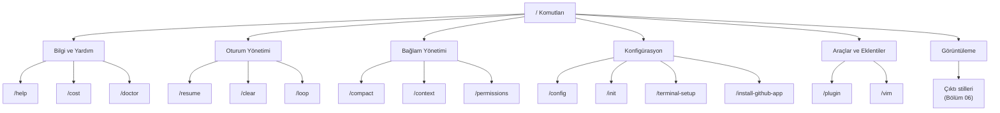
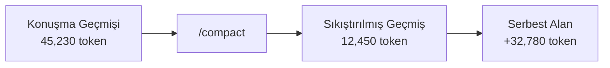
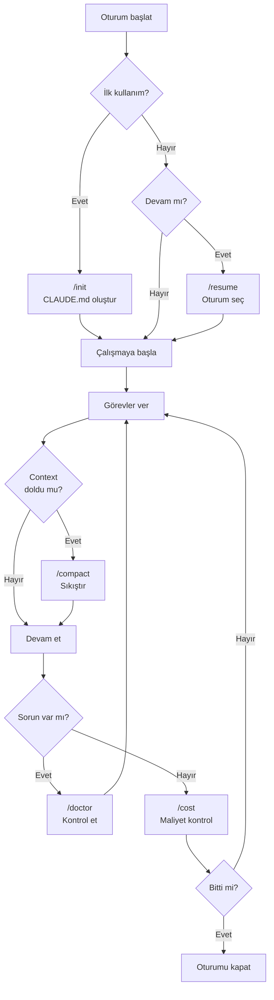

# Dahili Komutlar (Slash Commands)

Claude Code oturumu içinde `/` ile başlayan **slash commands** (eğik çizgi komutları) kullanarak çeşitli işlemleri hızla gerçekleştirebilirsiniz. Bu komutlar prompt olarak gönderilmez; doğrudan Claude Code'un dahili işlevlerini tetikler.

## Ön Koşullar

| Konu | Bölüm |
|------|-------|
| İnteraktif Mod | [İnteraktif Mod](./01-interaktif-mod.md) |
| CLI Referansı | [CLI Referansı](./04-cli-referansi.md) |

---

## Komut Genel Bakışı



---

## Tüm Slash Komutları

### `/help` — Yardım

Kullanılabilir tüm komutları ve kısa açıklamalarını listeler.

```bash
> /help

  Available commands:
    /help              Show this help message
    /compact           Compact conversation history
    /context           Show context window usage
    /permissions       View/manage permissions
    /resume            Resume a previous session
    /init              Initialize project configuration
    /install-github-app  Install GitHub app
    /plugin            Manage plugins
    /loop              Enable loop mode
    /clear             Clear conversation
    /doctor            Check system health
    /config            View/edit configuration
    /cost              Show session cost
    /vim               Toggle vim mode
    /terminal-setup    Configure terminal integration
```

---

### `/compact` — Bağlam Sıkıştırma

Conversation history'yi (konuşma geçmişini) sıkıştırarak **context window** (bağlam penceresi) alanı kazandırır. Uzun oturumlarda token limitine yaklaştığınızda kullanışlıdır.

```bash
# Varsayılan sıkıştırma
> /compact

  ✓ Conversation compacted
  Before: 45,230 tokens
  After:  12,450 tokens
  Saved:  32,780 tokens (72%)

# Özel talimatla sıkıştırma
> /compact auth modülüyle ilgili bağlamı koru

  ✓ Conversation compacted (preserving auth context)
  Before: 45,230 tokens
  After:  18,200 tokens
  Saved:  27,030 tokens (60%)
```



> **İpucu:** `/compact` çalıştırdıktan sonra önceki mesajların detayları kaybolabilir. Önemli bağlamı korumak istiyorsanız `/compact [talimat]` şeklinde hangi bilgilerin korunacağını belirtin.

---

### `/context` — Bağlam Penceresi Durumu

Mevcut **context window** kullanımını gösterir: ne kadar token kullanıldığı, ne kadar kaldığı ve hangi öğelerin yer kapladığı.

```bash
> /context

  Context Window Usage:
  ─────────────────────────────────
  Total capacity:     200,000 tokens
  Used:                67,450 tokens (34%)
  Available:          132,550 tokens (66%)

  Breakdown:
  ├── System prompt:     3,200 tokens
  ├── CLAUDE.md:         1,800 tokens
  ├── Conversation:     42,300 tokens
  ├── Tool results:     18,150 tokens
  └── Pending input:     2,000 tokens

  ─────────────────────────────────
  ██████████░░░░░░░░░░░░░░░░░░░░ 34%
```

---

### `/permissions` — İzin Yönetimi

Mevcut izin ayarlarını görüntüler ve yönetir.

```bash
> /permissions

  Permission Settings:
  ─────────────────────────────────
  Allowed Tools (Always):
  ├── Read
  ├── Grep
  ├── Glob
  └── SemanticSearch

  Allowed Tools (Session):
  ├── Write (approved for src/**)
  └── Bash (approved for npm test)

  Denied Tools:
  └── (none)

  Mode: normal (ask before destructive actions)
```

---

### `/resume` — Oturum Devam

Önceki bir oturumu seçip devam etmenizi sağlar.

```bash
> /resume

  ? Select a session to resume:
  ❯ [30 dk önce] Auth modülü refactoring
    [2 saat önce] Bug düzeltme: login hatası
    [1 gün önce] API endpointleri
    [2 gün önce] Veritabanı migration

  # Ok tuşlarıyla seçim yapın, Enter ile devam edin

  ✓ Session resumed: Auth modülü refactoring
  [Önceki bağlam yüklendi]
```

---

### `/init` — Proje Başlatma

Proje için **CLAUDE.md** dosyası oluşturur. Bu dosya, Claude Code'un projeyi nasıl anlaması ve davranması gerektiğini tanımlayan bir yapılandırma dosyasıdır.

```bash
> /init

  ✓ Created CLAUDE.md in project root

  Generated CLAUDE.md contents:
  ─────────────────────────────────
  # Project: my-app
  
  ## Tech Stack
  - Next.js 14 (TypeScript)
  - Prisma ORM
  - PostgreSQL
  - Tailwind CSS
  
  ## Commands
  - Build: npm run build
  - Test: npm test
  - Lint: npm run lint
  
  ## Code Style
  - Use TypeScript strict mode
  - Follow ESLint configuration
  ─────────────────────────────────

  You can edit CLAUDE.md to customize Claude Code's behavior.
```

---

### `/install-github-app` — GitHub App Kurulumu

Claude Code'un GitHub entegrasyonunu kurar. PR oluşturma, issue yönetimi ve CI/CD entegrasyonu için gereklidir.

```bash
> /install-github-app

  Opening browser to install Claude Code GitHub App...
  
  ✓ GitHub App installed successfully
  Repository: yasin-ates/my-app
  Permissions: read/write (code, PRs, issues)
```

---

### `/plugin` — Eklenti Yönetimi

Claude Code **plugin** (eklenti) sistemini yönetir. Marketplace'ten eklenti arama, listeleme ve kurma işlemleri yapılır.

```bash
# Yüklü eklentileri listele
> /plugin list

  Installed Plugins:
  ├── eslint-integration v1.2.0
  ├── docker-helper v0.8.1
  └── prisma-tools v1.0.3

# Marketplace'te eklenti ara
> /plugin add

  ? Search plugins: docker
  
  Available Plugins:
  ❯ docker-helper (v0.8.1) - Docker Compose yönetimi
    docker-debug (v0.3.0) - Container debugging
    dockerfile-gen (v1.1.0) - Dockerfile üretici

# Belirli bir eklentiyi kur
> /plugin install prisma-tools

  ✓ Plugin installed: prisma-tools v1.0.3
  New tools available: prisma-migrate, prisma-generate, prisma-studio
```

---

### `/loop` — Döngü Modu

**Loop Mode** (döngü modu) etkinleştirir. Bu modda Claude Code bir görevi tamamladıktan sonra otomatik olarak doğrulama yapar ve gerekirse düzeltme döngüsüne girer.

```bash
> /loop

  ✓ Loop Mode enabled
  Claude Code will automatically verify and iterate on results.

> Tüm test dosyalarına coverage threshold ekle

● Test dosyaları taranıyor...
● jest.config.ts güncelleniyor...
● Testler çalıştırılıyor... ✓
● Coverage kontrol ediliyor... 
  ⚠️ 3 dosya threshold altında
● Eksik testler ekleniyor...
● Tekrar çalıştırılıyor... ✓
● Coverage kontrol ediliyor... ✓ Tüm dosyalar threshold üstünde

  ✅ Görev tamamlandı (3 iterasyon)
```

---

### `/clear` — Konuşmayı Temizle

Mevcut konuşma geçmişini tamamen temizler. Yeni bir oturuma başlamak gibidir.

```bash
> /clear

  ✓ Conversation cleared
  Starting fresh context.

>
```

> **Not:** `/clear` ile `/compact` farklıdır. `/clear` tüm geçmişi siler; `/compact` geçmişi özetleyerek sıkıştırır.

---

### `/doctor` — Sistem Sağlık Kontrolü

Claude Code'un doğru çalışıp çalışmadığını kontrol eder. Bağlantı, yapılandırma ve ortam sorunlarını tespit eder.

```bash
> /doctor

  System Health Check:
  ─────────────────────────────────
  ✓ Node.js version:    v20.11.0 (>=18 required)
  ✓ npm version:        10.2.4
  ✓ Claude Code version: 1.0.23
  ✓ API connection:     Connected (latency: 145ms)
  ✓ Authentication:     Valid (Pro plan)
  ✓ Git:                Installed (v2.43.0)
  ✓ Project directory:  Valid git repository
  ✓ CLAUDE.md:          Found (1,200 tokens)
  ✓ Permissions:        Default configuration
  ⚠ MCP servers:        1 of 2 connected
    └── postgres-mcp: Connection timeout

  Overall: Healthy (1 warning)
```

---

### `/config` — Konfigürasyon

Claude Code ayarlarını görüntüler ve düzenler.

```bash
> /config

  Current Configuration:
  ─────────────────────────────────
  Model:          claude-opus-4-20250514
  Fast Mode:      disabled
  Vim Mode:       disabled
  Auto-compact:   enabled (at 80% capacity)
  Theme:          dark
  
  Settings files:
  ├── Global: ~/.claude/settings.json
  ├── Project: .claude/settings.json
  └── CLAUDE.md: ./CLAUDE.md

# Ayar değiştir
> /config set fastMode true

  ✓ fastMode set to true
```

---

### `/cost` — Maliyet Bilgisi

Mevcut oturumun **token kullanımını** ve tahmini maliyetini gösterir.

```bash
> /cost

  Session Cost Summary:
  ─────────────────────────────────
  Duration:        45 minutes
  
  Token Usage:
  ├── Input tokens:    124,500
  ├── Output tokens:    28,300
  └── Total:           152,800
  
  Estimated Cost:      $2.47
  
  API Calls:           23
  Tool Uses:           47
  ├── Read:            18
  ├── Write:            8
  ├── Bash:            12
  ├── Grep:             6
  └── Other:            3
```

---

### `/vim` — Vim Modu

Terminal'de **Vim keybindings** (Vim tuş atamaları) modunu açar/kapar. Vim kullanıcıları için h/j/k/l navigasyonu ve mod geçişlerini etkinleştirir.

```bash
> /vim

  ✓ Vim mode enabled
  Use h/j/k/l for navigation, i for insert mode, Esc for normal mode.

> /vim

  ✓ Vim mode disabled
  Standard keybindings restored.
```

---

### `/terminal-setup` — Terminal Kurulumu

Terminal entegrasyonunu yapılandırır. Shell integration (kabuk entegrasyonu), tema ve font ayarlarını optimize eder.

```bash
> /terminal-setup

  Terminal Setup:
  ─────────────────────────────────
  ? Select your shell:
  ❯ bash
    zsh
    fish
    powershell

  ✓ Shell integration installed for zsh
  ✓ Added to ~/.zshrc:
    - Claude Code shell hooks
    - Terminal title integration
    - Command completion

  Please restart your terminal for changes to take effect.
```

---

## Komut Hızlı Referans Tablosu

| Komut | Kategori | Açıklama | Parametre |
|-------|----------|----------|-----------|
| `/help` | Bilgi | Tüm komutları listele | - |
| `/compact` | Bağlam | Konuşma geçmişini sıkıştır | `[talimat]` (opsiyonel) |
| `/context` | Bağlam | Context window durumunu göster | - |
| `/permissions` | Güvenlik | İzin ayarlarını görüntüle | - |
| `/resume` | Oturum | Önceki oturuma devam et | - |
| `/init` | Konfigürasyon | CLAUDE.md oluştur | - |
| `/install-github-app` | Entegrasyon | GitHub App kur | - |
| `/plugin` | Eklenti | Eklenti yönetimi | `list\|add\|install` |
| `/loop` | Çalışma | Döngü modunu aç/kapa | - |
| `/clear` | Oturum | Konuşmayı temizle | - |
| `/doctor` | Bilgi | Sistem sağlık kontrolü | - |
| `/config` | Konfigürasyon | Ayarları görüntüle/düzenle | `[set key value]` |
| `/cost` | Bilgi | Oturum maliyet bilgisi | - |
| `/vim` | Görüntüleme | Vim modunu aç/kapa | - |
| `/terminal-setup` | Konfigürasyon | Terminal entegrasyonu kur | - |

---

## Pratik İş Akışı



---

## Özet

| Kavram | Açıklama |
|--------|----------|
| **Slash Commands** | `/` ile başlayan dahili Claude Code komutları |
| **/compact** | Context window alanı kazandırmak için geçmişi sıkıştırır |
| **/context** | Bağlam penceresi kullanım durumunu gösterir |
| **/doctor** | Sistem sağlık kontrolü yapar |
| **/init** | Proje için CLAUDE.md konfigürasyon dosyası oluşturur |
| **/cost** | Oturum maliyet ve token kullanım bilgisi |
| **/plugin** | Eklenti arama, listeleme ve kurma |
| **/loop** | Otomatik doğrulama ve düzeltme döngüsü |

---

## Sonraki Adım

Dahili komutları öğrendik. Şimdi Claude Code'un çıktı stillerini ve formatlama seçeneklerini inceleyelim:

→ [Çıktı Stilleri](./06-cikti-stilleri.md)
