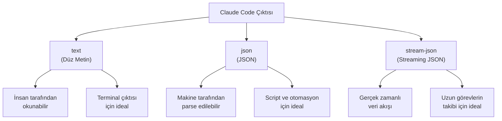
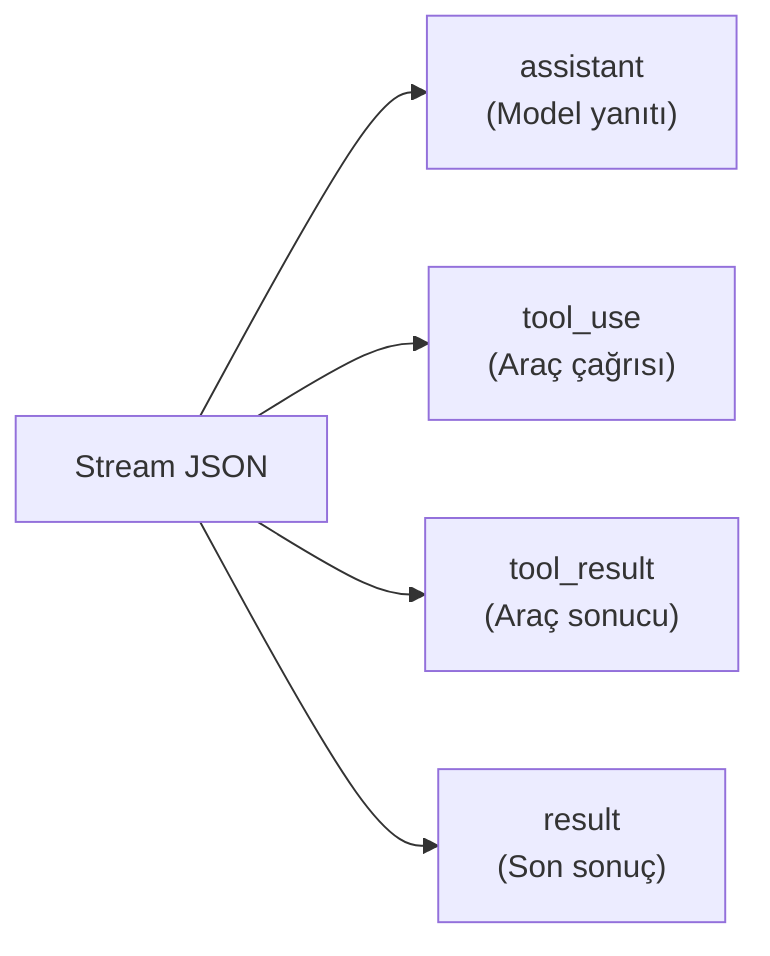
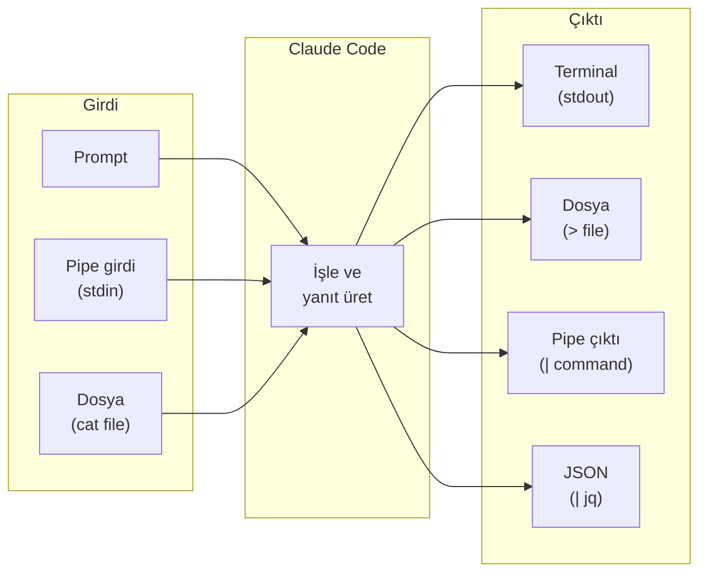
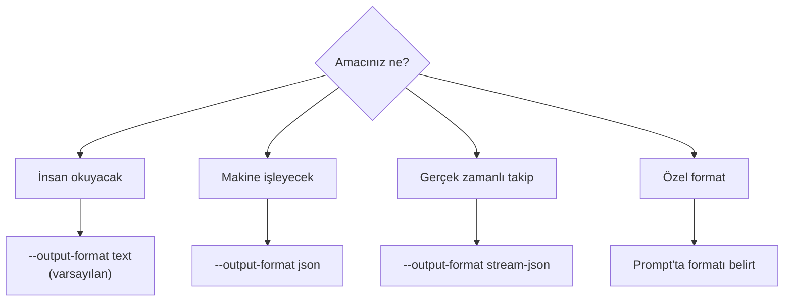

# Çıktı Stilleri (Output Styles)

Claude Code'un ürettiği çıktıları farklı formatlarda, yapılarda ve stillerde özelleştirebilirsiniz. Bu sayfa, mühendislik dışı kullanımlar dahil çıktı formatlarını, yapılandırılmış çıktıyı (structured output) ve JSON modunu kapsar.

## Ön Koşullar

| Konu | Bölüm |
|------|-------|
| CLI Referansı | [CLI Referansı](./04-cli-referansi.md) |
| İnteraktif Mod | [İnteraktif Mod](./01-interaktif-mod.md) |

---

## Çıktı Format Seçenekleri

Claude Code üç temel çıktı formatını destekler:



---

## 1. Düz Metin Çıktı (Text)

Varsayılan çıktı formatıdır. İnsan tarafından okunmaya yöneliktir ve terminal'de renkli, biçimlendirilmiş şekilde görüntülenir.

```bash
$ claude -p "Bu projedeki bağımlılıkları listele"

Bu proje aşağıdaki bağımlılıkları kullanıyor:

Üretim Bağımlılıkları:
├── next@14.1.0 - React framework
├── react@18.2.0 - UI kütüphanesi
├── prisma@5.8.0 - ORM
├── tailwindcss@3.4.1 - CSS framework
└── zod@3.22.4 - Şema doğrulama

Geliştirme Bağımlılıkları:
├── typescript@5.3.3 - Tip sistemi
├── jest@29.7.0 - Test framework
├── eslint@8.56.0 - Linter
└── prettier@3.2.4 - Kod formatlayıcı
```

### Metin Çıktıyı Özelleştirme

Prompt'unuzda çıktı stilini belirleyerek sonucu şekillendirebilirsiniz:

```bash
# Tablo formatında çıktı iste
$ claude -p "Bağımlılıkları tablo formatında listele"

| Paket         | Sürüm  | Tür       | Açıklama           |
|---------------|--------|-----------|---------------------|
| next          | 14.1.0 | Üretim    | React framework     |
| react         | 18.2.0 | Üretim    | UI kütüphanesi      |
| typescript    | 5.3.3  | Geliştirme| Tip sistemi         |
| jest          | 29.7.0 | Geliştirme| Test framework      |

# Madde listesi formatında
$ claude -p "Değişiklikleri madde listesi olarak özetle"

• Auth modülüne rate limiting eklendi
• Login endpoint'ine CAPTCHA doğrulama eklendi
• Session timeout 30 dakikadan 15 dakikaya düşürüldü
• Tüm değişiklikler için birim testleri yazıldı
```

---

## 2. JSON Çıktı Modu

`--output-format json` bayrağı ile Claude Code'un yanıtını yapılandırılmış **JSON** formatında alabilirsiniz.

```bash
$ claude -p "Bu projenin tech stack'ini analiz et" --output-format json
```

```json
{
  "type": "result",
  "subtype": "success",
  "cost_usd": 0.0124,
  "is_error": false,
  "duration_ms": 4523,
  "duration_api_ms": 3200,
  "num_turns": 1,
  "result": "Bu proje Next.js 14 tabanlı bir e-ticaret uygulamasıdır...",
  "session_id": "sess_abc123def456"
}
```

### JSON Yanıt Alanları

| Alan | Tip | Açıklama |
|------|-----|----------|
| `type` | string | Yanıt tipi (`result`) |
| `subtype` | string | Alt tip (`success` veya `error`) |
| `cost_usd` | number | Tahmini maliyet (USD) |
| `is_error` | boolean | Hata durumu |
| `duration_ms` | number | Toplam süre (milisaniye) |
| `duration_api_ms` | number | API çağrı süresi (milisaniye) |
| `num_turns` | number | Etkileşim tur sayısı |
| `result` | string | Claude Code'un yanıtı |
| `session_id` | string | Oturum kimliği |

### JSON Çıktıyı Script'te Kullanma

```bash
# jq ile JSON'dan belirli alanı çıkarma
$ claude -p "Proje adını söyle" --output-format json | jq -r '.result'
my-app

# Maliyet bilgisini çıkarma
$ claude -p "Kodu analiz et" --output-format json | jq '.cost_usd'
0.0089

# Hata kontrolü
$ result=$(claude -p "Testleri çalıştır" --output-format json)
$ echo $result | jq -r 'if .is_error then "HATA: " + .result else "OK" end'
OK
```

---

## 3. Streaming JSON Modu

`--output-format stream-json` ile yanıt gerçek zamanlı olarak satır satır JSON nesneleri (NDJSON) şeklinde akışa alınır.

```bash
$ claude -p "Projeyi analiz et ve düzelt" --output-format stream-json
```

```json
{"type":"assistant","message":{"type":"text","text":"Projeyi analiz ediyorum..."}}
{"type":"tool_use","tool":"Read","input":{"path":"src/index.ts"}}
{"type":"tool_result","output":"import express from 'express';\n..."}
{"type":"assistant","message":{"type":"text","text":"Bir hata buldum, düzeltiyorum..."}}
{"type":"tool_use","tool":"Write","input":{"path":"src/index.ts","content":"..."}}
{"type":"tool_result","output":"File written successfully"}
{"type":"result","subtype":"success","cost_usd":0.023,"result":"Düzeltme tamamlandı.","session_id":"sess_xyz"}
```

### Stream JSON Mesaj Tipleri



| Tip | Açıklama | İçerik |
|-----|----------|--------|
| `assistant` | Model'in metin yanıtı | `message.text` |
| `tool_use` | Araç çağrısı | `tool`, `input` |
| `tool_result` | Araç sonucu | `output` |
| `result` | Nihai sonuç | `result`, `cost_usd`, `session_id` |

### Stream JSON'u Gerçek Zamanlı İşleme

```bash
# Node.js ile satır satır okuma
$ claude -p "Projeyi analiz et" --output-format stream-json | \
  while IFS= read -r line; do
    type=$(echo "$line" | jq -r '.type')
    case $type in
      "assistant")
        echo "[Claude] $(echo $line | jq -r '.message.text')"
        ;;
      "tool_use")
        echo "[Tool] $(echo $line | jq -r '.tool')"
        ;;
      "result")
        echo "[Done] Cost: $(echo $line | jq -r '.cost_usd') USD"
        ;;
    esac
  done
```

---

## 4. Yapılandırılmış Çıktı (Structured Output)

Prompt'unuzda istediğiniz çıktı yapısını tanımlayarak Claude Code'dan yapılandırılmış yanıtlar alabilirsiniz:

### Tablo Formatı

```bash
$ claude -p "src/ klasöründeki dosyaları boyut ve satır sayısına göre tablo olarak listele"

| Dosya                    | Boyut   | Satır | Dil        |
|--------------------------|---------|-------|------------|
| src/index.ts             | 2.4 KB  | 87    | TypeScript |
| src/app.ts               | 5.1 KB  | 195   | TypeScript |
| src/services/auth.ts     | 8.3 KB  | 312   | TypeScript |
| src/utils/format.ts      | 1.2 KB  | 45    | TypeScript |
| src/middleware/cors.ts    | 0.8 KB  | 28    | TypeScript |
```

### Checklist Formatı

```bash
$ claude -p "Bu projenin production readiness kontrolünü checklist olarak yap"

Production Readiness Checklist:
─────────────────────────────────
✅ TypeScript strict mode aktif
✅ ESLint konfigürasyonu mevcut
✅ Birim testleri yazılmış (142 test)
⚠️ Test coverage %67 (önerilen: %80+)
✅ .env.example dosyası mevcut
❌ Rate limiting uygulanmamış
❌ Health check endpoint'i yok
✅ Docker desteği (Dockerfile mevcut)
⚠️ CI/CD pipeline eksik
❌ API dokümantasyonu yok (Swagger/OpenAPI)

Skor: 5/10 — İyileştirme önerileri yukarıda belirtildi.
```

### Markdown Rapor Formatı

```bash
$ claude -p "Kod kalite raporunu markdown formatında oluştur" > report.md
```

```markdown
# Kod Kalite Raporu

## Genel Bakış
- **Proje:** my-app
- **Tarih:** 2026-03-15
- **Dosya sayısı:** 47
- **Toplam satır:** 8,450

## Bulgular

### Kritik
1. SQL injection riski: `src/services/userService.ts:45`
2. Hardcoded secret: `src/config/db.ts:12`

### Uyarı
1. Kullanılmayan import: 23 dosyada
2. Any tipi kullanımı: 8 yerde
...
```

---

## 5. Mühendislik Dışı Kullanımlar

Claude Code sadece kod yazmak için değil, metin tabanlı her türlü görev için kullanılabilir. Çıktı stilini prompt ile belirleyerek farklı formatlarda sonuç alabilirsiniz:

### İş Analizi Raporu

```bash
$ claude -p "Bu projenin README'sini ve kaynak kodunu analiz ederek bir iş analizi özeti oluştur. \
  Hedef kitle: teknik olmayan yöneticiler. \
  Format: Executive Summary, Bullet Points, Riskleri tablo olarak sun."

Executive Summary
═══════════════════════════════════════
Bu uygulama, B2C e-ticaret platformu olarak tasarlanmış
olup müşterilere ürün arama, sipariş verme ve ödeme
işlevleri sunmaktadır.

Öne Çıkan Noktalar:
• 47 modülden oluşan orta ölçekli bir uygulama
• Aylık tahmini altyapı maliyeti: ~$150
• 3 kişilik ekip tarafından geliştirilmiş

| Risk             | Seviye | Etki    | Öneri                    |
|------------------|--------|---------|--------------------------|
| Güvenlik açıkları| Yüksek | Kritik  | Güvenlik taraması yapılmalı|
| Test eksikliği   | Orta   | Yüksek  | Coverage %80'e çıkarılmalı|
| Dokümantasyon    | Düşük  | Orta    | API dokümanı oluşturulmalı|
```

### Eğitim Materyali

```bash
$ claude -p "Bu projedeki auth akışını, junior developer'a anlatır gibi, \
  adım adım ve basit bir dille açıkla. Diyagram kullan."

Kimlik Doğrulama Nasıl Çalışıyor? (Basit Anlatım)
═══════════════════════════════════════════════════

Düşün ki bir binaya giriyorsun:
1. 🚪 Kapıya gelirsin (Login sayfası)
2. 🪪 Kimliğini gösterirsin (E-posta + şifre)
3. 🏷️ Yaka kartı alırsın (JWT token)
4. 🔓 Her odaya yaka kartıyla girersin (API istekleri)
5. ⏰ Yaka kartının süresi dolar (Token expiry)
6. 🔄 Yeni kart alırsın (Refresh token)
...
```

### Changelog Üretimi

```bash
$ claude -p "Son 10 commit'i analiz et ve CHANGELOG.md formatında değişiklik günlüğü oluştur. \
  Semantic versioning kurallarına uy. Kategoriler: Added, Changed, Fixed, Removed."

## [1.3.0] - 2026-03-15

### Added
- Kullanıcı profil sayfasına avatar yükleme özelliği (#142)
- API rate limiting middleware'i (#138)

### Changed
- Login endpoint yanıt formatı güncellendi (#140)
- Veritabanı bağlantı pooling boyutu 10'dan 25'e çıkarıldı (#139)

### Fixed
- Sepet toplam hesaplamasında yuvarlama hatası düzeltildi (#141)
- Session timeout'ta infinite loop düzeltildi (#137)

### Removed
- Kullanılmayan legacy payment gateway entegrasyonu kaldırıldı (#136)
```

---

## 6. Çıktı Yönlendirme ve Birleştirme

### Dosyaya Kaydetme

```bash
# Analiz sonucunu dosyaya kaydet
$ claude -p "Güvenlik taraması yap" > security-report.txt

# JSON çıktıyı dosyaya kaydet
$ claude -p "Bağımlılıkları analiz et" --output-format json > deps.json

# Mevcut dosyaya ekle
$ claude -p "Ek notlar" >> report.txt
```

### Pipe ile Zincirleme

```bash
# Claude Code çıktısını başka bir araçla işle
$ claude -p "API endpointlerini listele" | grep "POST"

# JSON çıktıdan belirli bilgiyi çıkar
$ claude -p "Proje bilgisi" --output-format json | jq '.result' | wc -w

# Birden fazla Claude Code çağrısını zincirle
$ claude -p "Hataları bul" --output-format json | \
  jq -r '.result' | \
  claude -p "Bu hataları düzeltmek için bir plan oluştur"
```

### Otomasyon Script'inde Kullanma

```bash
#!/bin/bash

# Birden fazla dosyayı analiz et
for file in src/services/*.ts; do
  echo "=== Analyzing: $file ==="
  claude -p "Bu dosyayı analiz et ve sorunları listele: $(cat $file)" \
    --output-format json | jq -r '.result'
  echo ""
done
```



---

## 7. Çıktı Stili Karşılaştırması

| Format | Kullanım Alanı | İnsan Okunabilir | Makine İşlenebilir | Gerçek Zamanlı |
|--------|---------------|:-:|:-:|:-:|
| `text` | Terminal, dokümantasyon | ✅ | ❌ | ❌ |
| `json` | Otomasyon, CI/CD | ❌ | ✅ | ❌ |
| `stream-json` | Dashboard, monitoring | ❌ | ✅ | ✅ |
| Prompt-tabanlı | Raporlar, analizler | ✅ | Kısmen | ❌ |



---

## Özet

| Kavram | Açıklama |
|--------|----------|
| **text** | Varsayılan insan-okunabilir düz metin çıktı |
| **json** | Yapılandırılmış JSON çıktı; otomasyon için ideal |
| **stream-json** | Gerçek zamanlı NDJSON akış çıktısı |
| **Prompt-tabanlı stil** | Prompt'ta istenen formatı belirterek çıktıyı şekillendirme |
| **Yapılandırılmış çıktı** | Tablo, checklist, rapor gibi özel formatlar |
| **Pipe/yönlendirme** | Çıktıyı dosyaya kaydetme veya başka araçlarla zincirleme |

---

## Sonraki Adım

Arayüz ve komutlar bölümünü tamamladık. Şimdi Claude Code'un sahip olduğu 30+ dahili aracı detaylı inceleyelim:

→ [Bölüm 08 - Claude Code: Araçlar (Tools)](../08-araclar/README.md)
